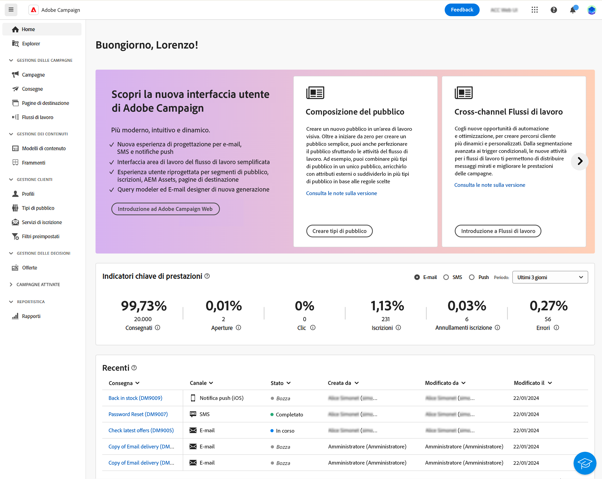

# Introduzione a Campaign Web v8 {#get-started}

>[!CONTEXTUALHELP]
>id="acw_homepage_welcome_learnmore"
>title="Introduzione"
>abstract="La nuova interfaccia di Campaign Web v8 offre un’esperienza utente integrata, intuitiva e coerente."

>[!CONTEXTUALHELP]
>id="acw_homepage_learning_learnmore"
>title="Introduzione"
>abstract="La nuova interfaccia di Campaign Web v8 offre un’esperienza utente integrata, intuitiva e coerente."

>[!CONTEXTUALHELP]
>id="acw_homepage_learnmore"
>title="Introduzione"
>abstract="La nuova interfaccia di Campaign Web v8 offre un’esperienza utente integrata, intuitiva e coerente."

Adobe Campaign fornisce una piattaforma per la progettazione di esperienze cliente cross-channel e un ambiente per l’orchestrazione visiva delle campagne, la gestione delle interazioni in tempo reale e l’esecuzione su più canali.

Adobe Campaign v8 è lo strumento della campagna di nuova generazione creato per vari canali di marketing come e-mail, notifiche push, SMS e direct mail. Fornisce solide funzionalità di ETL e gestione dei dati per aiutare a creare e curare la campagna perfetta. Il motore di orchestrazione fornisce programmi di marketing multi-touch avanzati con un focus principale sui percorsi basati su batch. Viene inoltre fornito con un server di messaggistica scalabile in tempo reale che consente ai team di marketing di inviare messaggi predefiniti basati su un payload completo da qualsiasi sistema IT per comunicazioni quali reimpostazione della password, conferma dell’ordine, ricezione elettronica e molto altro ancora.

Utilizza Campaign per:

* **Stimolare** la personalizzazione e il coinvolgimento attraverso un’unica vista accessibile del cliente
* **Integrare** nel percorso cliente canali e-mail, mobili, online e offline
* **Automatizzare** la consegna di messaggi e offerte significativi e tempestivi

Inizialmente disponibile solo tramite una ricca [Console client](#ac-client), Campaign offre ora una nuova interfaccia utente web con funzionalità migliorate, accessibilità e un nuovo design per migliorare significativamente l’esperienza utente. Questa nuova interfaccia utente moderna semplifica la progettazione e la consegna di campagne di marketing e introduce maggiore coerenza con altre soluzioni Adobe, tra cui Adobe Experience Platform.

Questa nuova interfaccia utente soddisfa innanzitutto le esigenze del **professionista**; in questa prima versione non sono disponibili tutte le tipiche attività di amministrazione, ma verranno affrontate nelle versioni successive. Per il momento, nella nuova interfaccia utente non sono disponibili tutte le funzionalità o opzioni disponibili nella console client. Nelle versioni future saranno disponibili nuovi casi d’uso, opzioni e funzionalità.

In qualità di amministratore o di utente esperto, se hai bisogno di accedere alle funzionalità di Campaign v8 che non sono disponibili nell’interfaccia utente web, puoi connettersi al [console client](#ac-client).

>[!NOTE]
>
>Campaign v8 Web è attualmente nella versione Disponibilità limitata (LA). L‘accesso è limitato a un piccolo gruppo di clienti a Disponibilità limitata (LA) Tieni presente che l’interfaccia, le funzionalità e i flussi di utilizzo dei prodotti possono cambiare senza preavviso.

Scopri come connetterti ad Adobe Campaign Web in [questa pagina](connect-to-campaign.md).

## Informazioni sulla console client di Campaign {#ac-client}

La console client di Campaign è un’applicazione basata su browser installata sul sistema. Utilizza l’API dei servizi web per collegarsi al server dell’applicazione Campaign.

I dati di Campaign vengono memorizzati nel server dell’applicazione. I dati sono disponibili sia dalla console client sia dall’interfaccia web. Ad esempio, se crei un modello di consegna utilizzando la console client, questo sarà disponibile anche nell’interfaccia web. E se crei una consegna e-mail nell’interfaccia web, questa è accessibile anche dalla console client.

Alcuni oggetti possono essere creati e gestiti solo nella console client. Possono essere visibili e utilizzati nell’interfaccia utente di Campaign Web, ma non possono essere creati né modificati da questo ambiente. Tutti gli oggetti e i componenti di Campaign sono disponibili nella vista Explorer, accessibile dal menu di navigazione a sinistra.

Per ulteriori informazioni su come utilizzare Campaign v8 con la relativa console client, consulta [Documentazione di Campaign v8 (console client)](https://experienceleague.adobe.com/docs/campaign/campaign-v8/campaign-home.html?lang=it){target="_blank"}.
