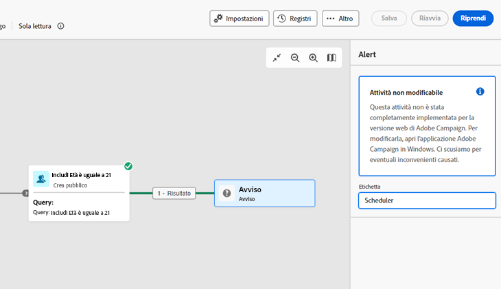
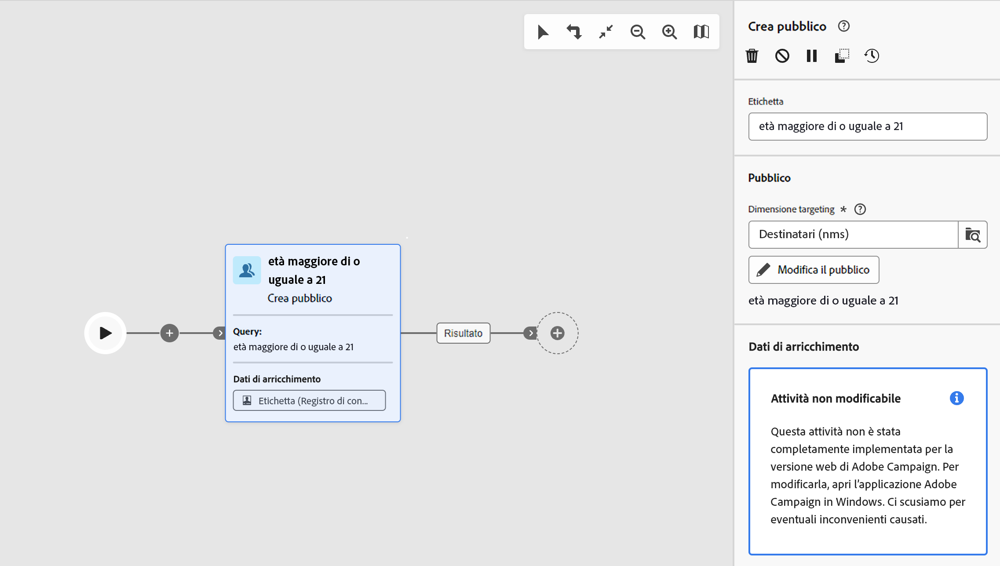
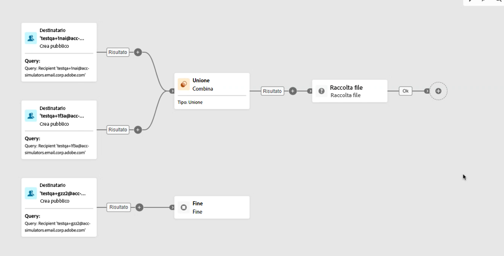
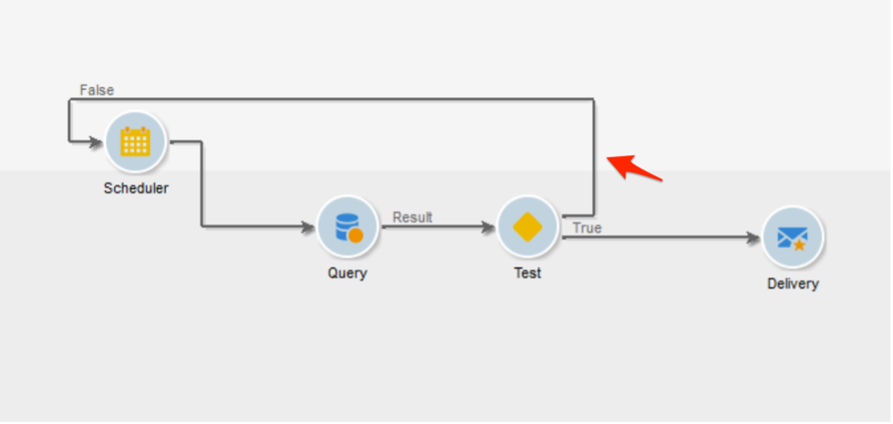
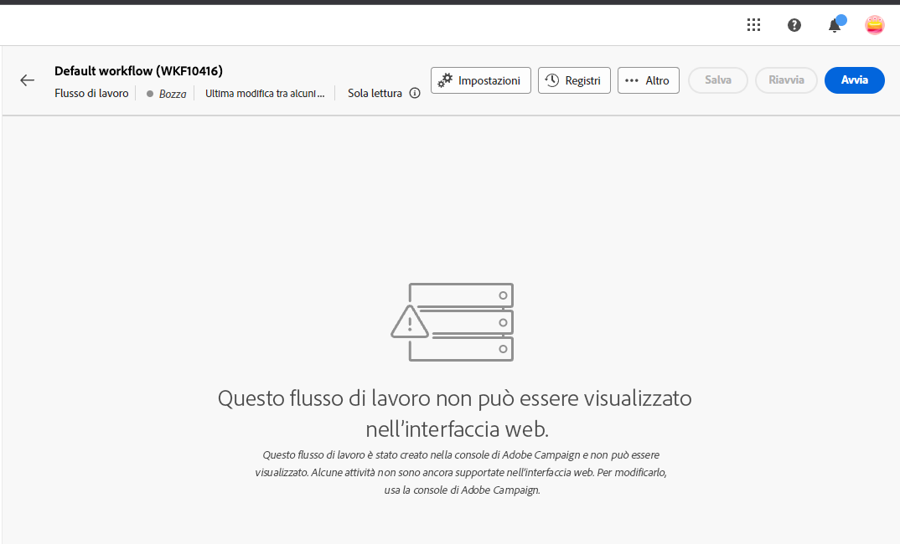
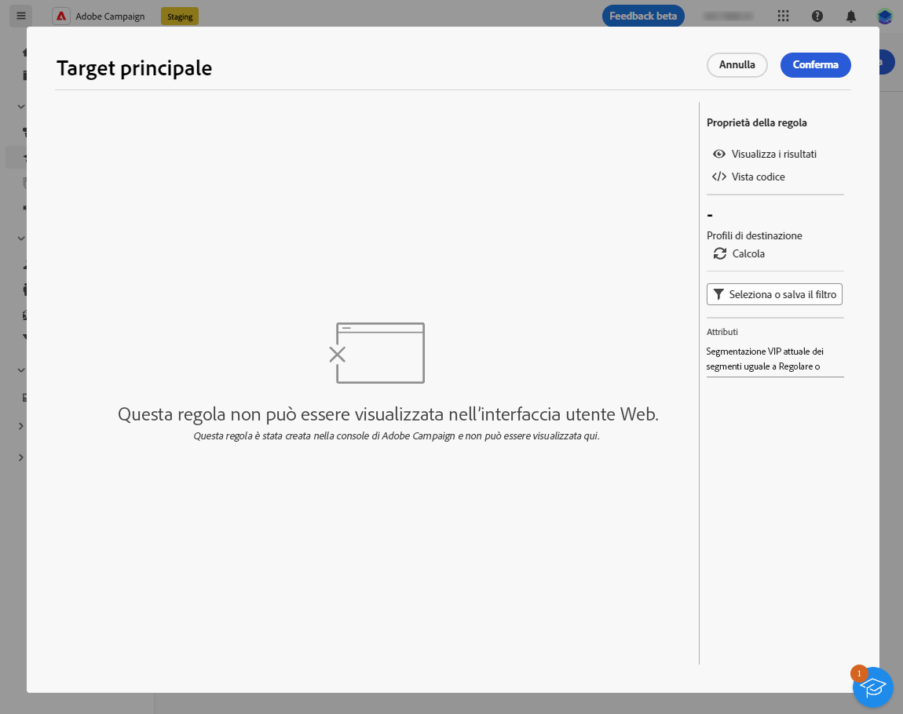
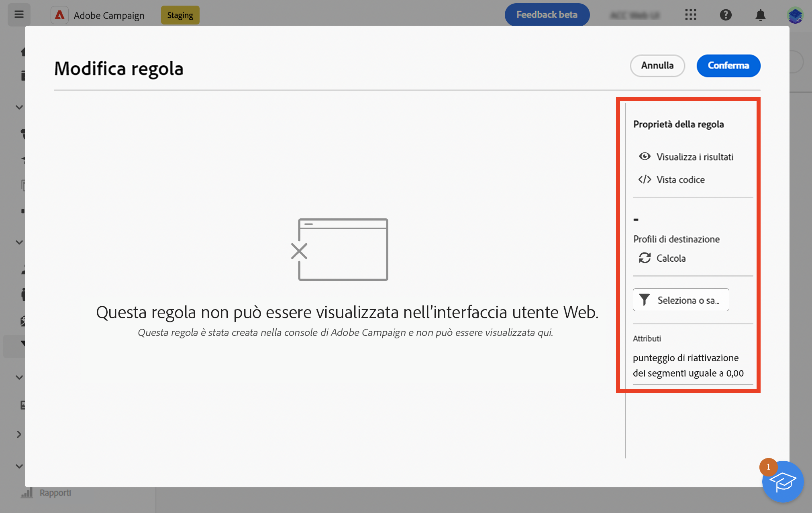
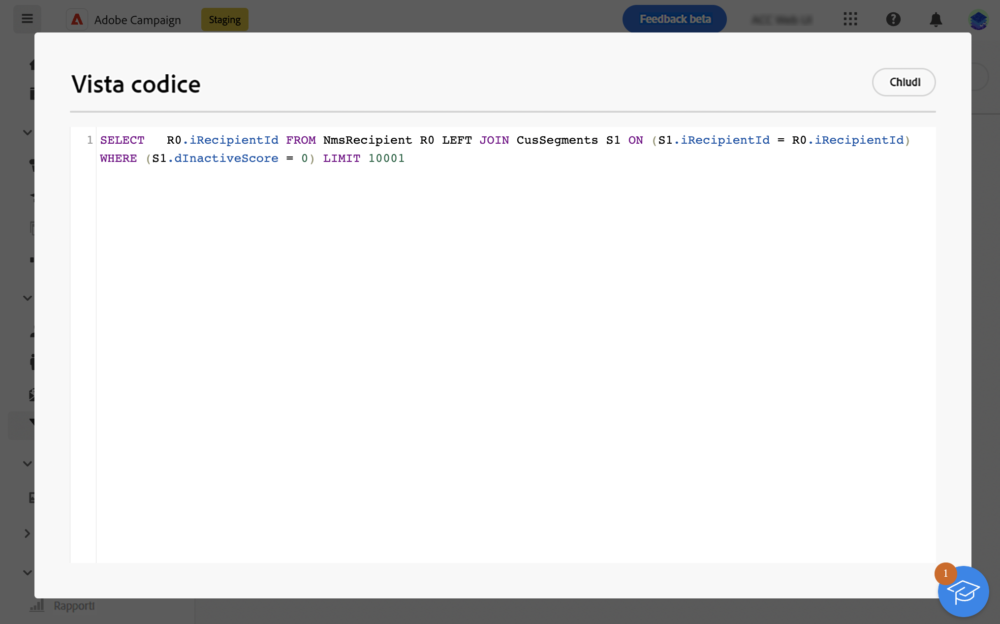
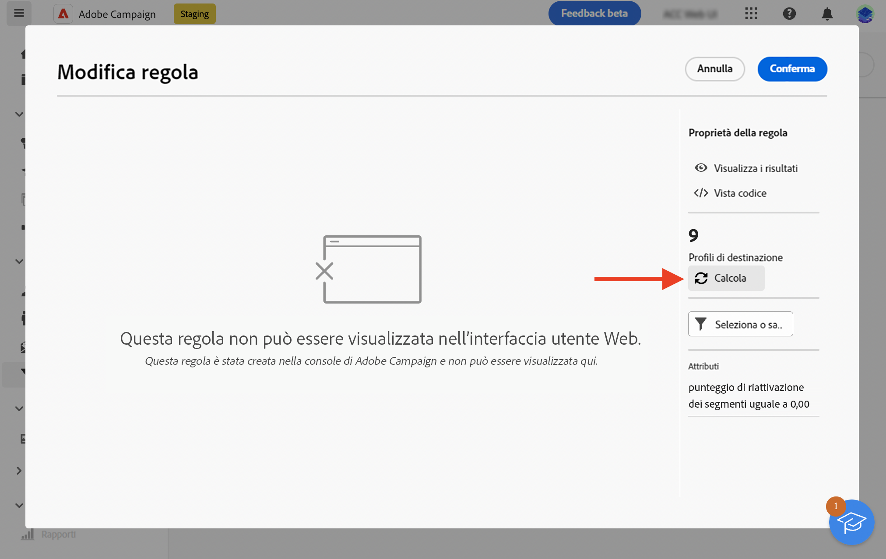

# Guardrail e limitazioni {#guardrails-limitations}

Quando lavori nell’interfaccia utente web di Campaign con componenti creati o modificati nella console client di Campaign, si applicano le protezioni e le limitazioni elencate di seguito.

## Flussi di lavoro {#wf-guardrails-limitations}

### Attività

Le attività del flusso di lavoro non ancora supportate nell’interfaccia utente web sono di sola lettura e vengono visualizzate come attività incompatibili. Puoi comunque eseguire il flusso di lavoro, inviare messaggi, controllare i registri e così via. Le attività del flusso di lavoro disponibili sia nell’interfaccia utente web che nella console client sono modificabili.

| Console | Interfaccia web |
| --- | --- |
| {width="800px" align="left" zoomable="yes"} | {width="800px" align="left" zoomable="yes"} |

Le impostazioni delle attività del flusso di lavoro non ancora supportate nell’interfaccia utente web non vengono visualizzate. Tuttavia, quando il flusso di lavoro viene eseguito, si applicano queste impostazioni.

| Console | Interfaccia web |
| --- | --- |
| {width="800px" align="left" zoomable="yes"} | {width="800px" align="left" zoomable="yes"} |

Nella console, il **Arricchimento** L’attività può eseguire sia la riconciliazione che l’arricchimento. Nell’interfaccia utente web, le funzionalità di riconciliazione non sono ancora disponibili. Se hai definito, nella console, le impostazioni di riconciliazione in **Arricchimento** verrà visualizzata come attività di sola lettura non compatibile nell’interfaccia utente web.

| Console | Interfaccia web |
| --- | --- |
| {width="800px" align="left" zoomable="yes"} | {width="800px" align="left" zoomable="yes"} |

### Area di lavoro

Quando crei un nuovo flusso di lavoro nell’interfaccia utente web, l’area di lavoro supporta un solo punto di ingresso. Tuttavia, se hai creato un flusso di lavoro nella console con più punti di ingresso, puoi aprirlo e modificarlo nell’interfaccia utente web.

| Console | Interfaccia web |
| --- | --- |
| {width="800px" align="left" zoomable="yes"} | {width="800px" align="left" zoomable="yes"} |

I loop non sono ancora disponibili nell’interfaccia utente web. Se hai creato un flusso di lavoro che include un ciclo continuo utilizzando la console, non puoi accedervi dall’interfaccia utente web. Viene visualizzato un messaggio di errore.

| Console | Interfaccia web |
| --- | --- |
| {width="800px" align="left" zoomable="yes"} | {width="800px" align="left" zoomable="yes"} |

Il posizionamento dei nodi viene aggiornato ogni volta che viene aggiunta o rimossa un’attività. Se crei un flusso di lavoro nella console, lo modifichi utilizzando l’interfaccia web e lo riapri nella console, potresti notare alcune lievi imperfezioni di posizionamento. Questo non ha alcun impatto sul

| Flusso di lavoro iniziale | Modifica posizione |
| --- | --- |
| {width="800px" align="left" zoomable="yes"} | {width="800px" align="left" zoomable="yes"} |

## Filtri preimpostati {#filters-guardrails-limitations}

Durante la selezione del pubblico di una consegna o la creazione di un pubblico in un flusso di lavoro, alcuni filtri predefiniti non sono disponibili nell’interfaccia utente, in tale versione del prodotto.

Viene visualizzato un messaggio di errore specifico.

{width="70%" align="left"}

Anche se non è possibile visualizzare la rappresentazione grafica della query nel generatore di regole e modificare il filtro, è comunque possibile utilizzarlo e visualizzare le condizioni di filtro in **Attributi** sezione della schermata.

{width="70%" align="left"}

È inoltre possibile accedere alla query SQL per verificare le impostazioni esatte. A questo scopo, fai clic su **Vista Codice** pulsante.

{width="70%" align="left"}

Fai clic su **Calcola** per verificare quanti elementi soddisfano i criteri del filtro.

{width="70%" align="left"}

Utilizza il **Visualizza risultati** per visualizzare tali elementi.

{width="70%" align="left"}

Nota che se si crea un filtro nell’interfaccia Web e lo si modifica nella console con attributi non supportati, la rappresentazione grafica non può più essere disponibile nell’interfaccia Web. In ogni caso, puoi comunque utilizzare il filtro.

Gli attributi non supportati sono elencati di seguito.

### Tipi di dati non supportati {#unsupported-data-type}

I seguenti tipi di dati disponibili nella console client non sono supportati quando si visualizza un filtro o una regola nell’interfaccia Web:

* datetime
* orario
* intervallo di tempo
* doppio
* galleggiare

### Funzionalità di filtro non supportate {#unsupported-filtering-capabilities}

Quando un filtro viene creato con espressioni e funzioni complesse nella console client, non può essere modificato nell’interfaccia web.

Inoltre, i seguenti operatori non sono supportati:

* Tipo numerico
   * è incluso in
   * no in

* Tipo di stringa
   * maggiore di
   * minore di
   * maggiore o uguale a
   * minore o uguale a
   * mi piace
   * non simile a

* Tipo di data
   * il o dopo il
   * il o prima del
   * diverso da
   * è vuoto
   * non è vuoto
   * è incluso in
   * non in
   * nell’ultimo/a

* Collegamenti 1-N
   * CONTEGGIO, SOMMA, MEDIA, MIN, MAX