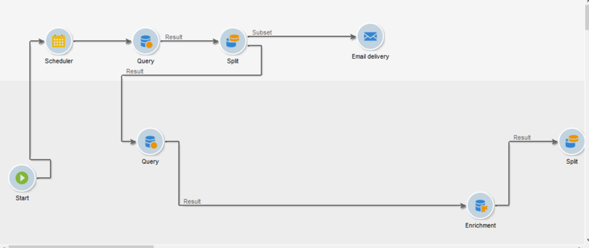

# Guardrail e limitazioni {#guardrails-limitations}

Quando si lavora nell’interfaccia utente di Campaign Web con flussi di lavoro creati o modificati nella console client di Campaign, si applicano le protezioni e le limitazioni elencate di seguito.

Tieni presente che, anche se questa pagina identifica considerazioni chiave quando si lavora con i flussi di lavoro nella console e nell’interfaccia utente web, non include tutte le potenziali incompatibilità tra le due interfacce.

## Attività dei flussi di lavoro {#wkf-activities}

Le attività del flusso di lavoro non ancora supportate nel web di Campaign sono di sola lettura e vengono visualizzate come attività incompatibili. Puoi eseguire comunque il flusso di lavoro, inviare messaggi, verificare i registri e così via. Le attività del flusso di lavoro disponibili sia nel web di Campaign che nella console client sono modificabili.

Le attività del flusso di lavoro non ancora supportate nell’interfaccia utente di Campaign Web sono di sola lettura e vengono visualizzate come attività incompatibili. Puoi eseguire comunque il flusso di lavoro, inviare messaggi, verificare i registri e così via. Le attività del flusso di lavoro disponibili sia nell’interfaccia utente di Campaign Web che nella console client di Campaign sono modificabili.

| Console | Web |
| --- | --- |
| {width="800px" align="left" zoomable="yes"} | {width="800px" align="left" zoomable="yes"} |

Quando un **Query** o un **Arricchimento** L’attività è configurata con dati aggiuntivi nella console; i dati di arricchimento vengono presi in considerazione in Campaign Web e trasmessi nella transizione in uscita, ma non possono essere modificati.

| Console | Web |
| --- | --- |
| {width="800px" align="left" zoomable="yes"} | {width="800px" align="left" zoomable="yes"} |

Nella console, l’attività di **arricchimento** può eseguire sia la riconciliazione che l’arricchimento. Se hai definito, nella console client, le impostazioni di riconciliazione in **Arricchimento** attività, verrà visualizzato come **Reconciliation** attività nell’interfaccia utente di Campaign Web.

| Console | Web |
| --- | --- |
| {width="800px" align="left" zoomable="yes"} | {width="800px" align="left" zoomable="yes"} |

## Area di lavoro del flusso di lavoro {#wkf-canvas}

Quando si crea un nuovo flusso di lavoro nell’interfaccia utente di Campaign Web, l’area di lavoro supporta un solo punto di ingresso. Tuttavia, se hai creato un flusso di lavoro nella console con più punti di ingresso, puoi aprirlo e modificarlo nell’interfaccia utente di Campaign Web.

| Console | Web |
| --- | --- |
| {width="800px" align="left" zoomable="yes"} | {width="800px" align="left" zoomable="yes"} |

Il posizionamento dei nodi viene aggiornato ogni volta che si aggiunge o si rimuove un’attività. Se crei un flusso di lavoro nella console, lo modifichi utilizzando l’interfaccia utente di Campaign Web e lo riapri nella console, potresti notare alcune lievi imperfezioni di posizionamento. Questo non ha alcun impatto sui processi e sulle attività del flusso di lavoro.

| Flusso di lavoro iniziale | Modifica del posizionamento |
| --- | --- |
| {width="800px" align="left" zoomable="yes"} | {width="800px" align="left" zoomable="yes"} |
