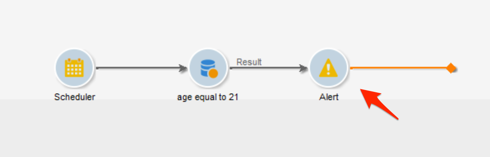

# Guardrail e limitazioni {#guardrails-limitations}

Durante l’utilizzo di componenti creati o modificati nella console client di Campaign nell’interfaccia utente di Campaign Web, si applicano i guardrail e le limitazioni elencate di seguito.

## Flussi di lavoro {#wf-guardrails-limitations}

### Attività

Le attività del flusso di lavoro non ancora supportate nell’interfaccia utente web sono di sola lettura e vengono visualizzate come attività non compatibili. Puoi eseguire comunque il flusso di lavoro, inviare messaggi, verificare i registri e così via. Le attività del flusso di lavoro che sono disponibili sia nell’interfaccia utente web che nella console client sono modificabili.

| Console | Interfaccia utente web |
| --- | --- |
| {width="800px" align="left" zoomable="yes"} | {width="800px" align="left" zoomable="yes"} |

Le impostazioni delle attività del flusso di lavoro non ancora supportate nell’interfaccia utente web non vengono visualizzate. Tuttavia, quando il flusso di lavoro viene eseguito, si applicano queste impostazioni.

| Console | Interfaccia utente web |
| --- | --- |
| {width="800px" align="left" zoomable="yes"} | {width="800px" align="left" zoomable="yes"} |

Nella console, l’attività di **arricchimento** può eseguire sia la riconciliazione che l’arricchimento. Nell’interfaccia utente web, le funzionalità di riconciliazione non sono ancora disponibili. Se hai definito le impostazioni di riconciliazione nell’attività di **Arricchimento** nella console, questa verrà visualizzata come attività di sola lettura non compatibile nell’interfaccia utente web.

| Console | Interfaccia utente web |
| --- | --- |
| {width="800px" align="left" zoomable="yes"} | {width="800px" align="left" zoomable="yes"} |

### Area di lavoro

Quando crei un nuovo flusso di lavoro nell’interfaccia utente web, l’area di lavoro supporta un solo punto di ingresso. Tuttavia, se hai creato un flusso di lavoro nella console con più punti di ingresso, puoi aprirlo e modificarlo nell’interfaccia utente web.

| Console | Interfaccia utente web |
| --- | --- |
| {width="800px" align="left" zoomable="yes"} | {width="800px" align="left" zoomable="yes"} |

I cicli non sono ancora disponibili nell’interfaccia utente web. Se hai creato un flusso di lavoro che include un ciclo utilizzando la console, non puoi accedervi dall’interfaccia utente web. Viene visualizzato un messaggio di errore.

| Console | Interfaccia utente web |
| --- | --- |
| {width="800px" align="left" zoomable="yes"} | {width="800px" align="left" zoomable="yes"} |

Il posizionamento dei nodi viene aggiornato ogni volta che si aggiunge o si rimuove un’attività. Se crei un flusso di lavoro nella console, lo modifichi utilizzando l’interfaccia web e lo riapri nella console, potresti notare alcune lievi imperfezioni di posizionamento. Questo non ha alcun impatto sui processi e sulle attività del flusso di lavoro.

| Flusso di lavoro iniziale | Modifica del posizionamento |
| --- | --- |
| {width="800px" align="left" zoomable="yes"} | {width="800px" align="left" zoomable="yes"} |

## Filtri preimpostati {#filters-guardrails-limitations}

>[!CONTEXTUALHELP]
>id="acw_predefined_filter_read_only"
>title="Questo filtro è di sola lettura"
>abstract="Alcuni filtri preimpostati non sono disponibili nell’interfaccia utente di tale versione del prodotto. Questi filtri sono contrassegnati come di sola lettura. Anche se non è possibile visualizzare la rappresentazione grafica della query nel query modeler e modificare il filtro, è possibile comunque utilizzarlo e visualizzare le condizioni di filtro nella sezione **Attributi** della schermata."

In tale versione del prodotto, durante la selezione del pubblico di una consegna o la creazione di un pubblico in un flusso di lavoro e alcuni filtri predefiniti non sono disponibili nell’interfaccia utente. Questi filtri sono contrassegnati come di sola lettura.

Viene visualizzato un messaggio di errore specifico.

{width="70%" align="left"}

Anche se non è possibile visualizzare la rappresentazione grafica della query nel query modeler e modificare il filtro, è possibile comunque utilizzarlo e visualizzare le condizioni di filtro nella sezione **Attributi** della schermata.

{width="70%" align="left"}

È possibile inoltre accedere alla query SQL per verificare le impostazioni esatte. A questo scopo, fai clic sul pulsante **Vista codice**.

{width="70%" align="left"}

Fai clic sul pulsante **Calcola** per verificare quanti elementi soddisfano i criteri del filtro.

{width="70%" align="left"}

Utilizza il pulsante **Visualizza risultati** per visualizzare tali elementi.

{width="70%" align="left"}

Tieni presente che se crei un filtro nell’interfaccia web e lo modifichi nella console con attributi non supportati, la rappresentazione grafica non può più essere disponibile nell’interfaccia web. In ogni caso, puoi utilizzare comunque il filtro.

Gli attributi non supportati sono elencati di seguito.

### Tipi di dati non supportati {#unsupported-data-type}

Durante la visualizzazione di un filtro o di una regola nell’interfaccia web, i seguenti tipi di dati disponibili nella console client non sono supportati:

* Data e ora
* ora
* intervallo di tempo
* doppio
* mobile

### Funzionalità di filtro non supportate {#unsupported-filtering-capabilities}

Quando un filtro viene creato con espressioni e funzioni complesse nella console client, non può essere modificato nell’interfaccia web.

Inoltre, i seguenti operatori non sono supportati:

* Tipo numerico
   * è incluso in
   * non in

* Tipo di stringa
   * maggiore di
   * minore di
   * maggiore o uguale a
   * minore o uguale a
   * simile a
   * diverso

* Tipo di data
   * a partire dal
   * entro il
   * non uguale a
   * è vuoto
   * non è vuoto
   * è incluso in
   * non in
   * nell’ultimo/a

* Collegamenti 1-N
   * COUNT, SUM, AVG, MIN, MAX
