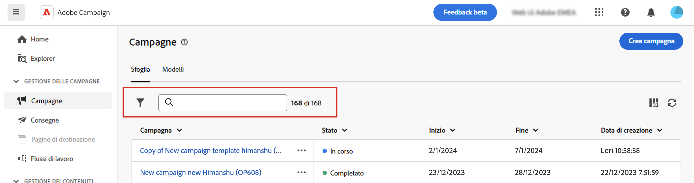

# Sfogliare e filtrare gli elenchi {#list-screens}

La maggior parte dei collegamenti del menu di navigazione a sinistra mostra elenchi di oggetti, ad esempio l’elenco **Consegne** o **Campagne**. Alcune di queste schermate di elenco sono di sola lettura. È possibile personalizzare la visualizzazione degli elenchi e filtrarli, come descritto di seguito.

## Personalizzare le schermate di elenco {#custom-lists}

Gli elenchi vengono visualizzati in colonne. Per visualizzare ulteriori informazioni puoi modificare la configurazione delle colonne. A questo scopo, fai clic su **Configura le colonne per un layout personalizzato** nell’angolo in alto a destra dell’elenco.

{zoomable="yes"}{width="70%" align="left"}

Nella schermata **Configura le colonne**, aggiungi o rimuovi le colonne e modificane l’ordine di visualizzazione.

Puoi cambiare l’ordine dell’elenco **trascinando** oppure utilizzando le icone **freccia su e freccia giù**, come mostrato di seguito:

{zoomable="yes"}{width="70%" align="left"}

Ad esempio, per queste impostazioni:

{zoomable="yes"}{width="70%" align="left" zoomable="yes"}

L’elenco mostra le colonne seguenti:

{zoomable="yes"}{width="70%" align="left"}

## Ordinare i dati {#sort-lists}

Per ordinare gli elementi dell’elenco, fai clic sulla relativa intestazione di colonna. Viene visualizzata una freccia (su o giù) che indica che l’elenco è ordinato in base a quella colonna.

Per le colonne numeriche o di data, la freccia **su** indica che l’elenco è ordinato in ordine crescente, mentre la freccia **giù** indica un ordine decrescente. Per le colonne con valori stringa o alfanumerici, i valori sono elencati in ordine alfabetico.

## Filtri {#list-built-in-filters}

Per trovare gli elementi più rapidamente, puoi utilizzare la barra di ricerca o i filtri incorporati e personalizzati per adattare l’elenco in base a criteri contestuali.

{zoomable="yes"}{width="70%" align="left"}

Per informazioni dettagliate su come utilizzare i filtri e creare filtri personalizzati, consulta [questa sezione](../query/filter.md).

<!--
## Use advanced attributes {#adv-attributes}

>[!CONTEXTUALHELP]
>id="acw_attributepicker_advancedfields"
>title="Display advanced attributes"
>abstract="Only the most common attributes are displayed by default in the attribute list. Activate the **Display advanced attributes** toggle to see all available attributes for the current list in the left palette of the rule builder, such as nodes, groupings, 1-1 links, 1-N links."

>[!CONTEXTUALHELP]
>id="acw_rulebuilder_advancedfields"
>title="Rule builder advanced fields"
>abstract="Only the most common attributes are displayed by default in the attribute list. Activate the **Display advanced attributes** toggle to see all available attributes for the current list in the left palette of the rule builder, such as nodes, groupings, 1-1 links, 1-N links."

>[!CONTEXTUALHELP]
>id="acw_rulebuilder_properties_advanced"
>title="Rule builder advanced attributes"
>abstract="Only the most common attributes are displayed by default in the attribute list. Activate the **Display advanced attributes** toggle to see all available attributes for the current list in the left palette of the rule builder, such as nodes, groupings, 1-1 links, 1-N links."

Only the most common attributes are displayed by default in the attribute list and filter configuration screens. Attributes set as `advanced` attributes in the data schema are hidden from the configuration screens.

Activate the **Display advanced attributes** toggle to see all available attributes for the current list in the left palette of the rule builder, such as nodes, groupings, 1-1 links, 1-N links. The attribute list updates instantly.

[The screenshot shows the Display advanced attributes toggle used to reveal hidden attributes in the rule builder palette.](assets/adv-toggle.png){zoomable="yes"}{width="70%" align="left" zoomable="yes"}
-->