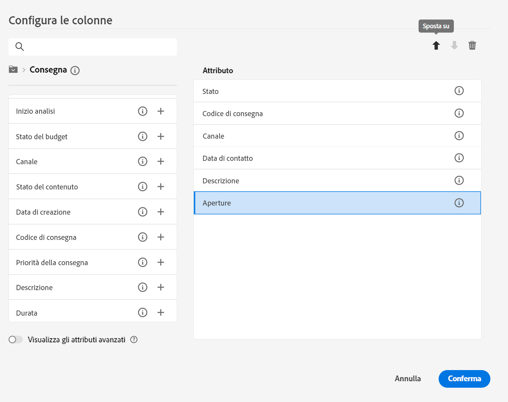

# Sfogliare, cercare e filtrare gli elenchi {#list-screens}

La maggior parte dei collegamenti del menu di navigazione a sinistra mostra elenchi di oggetti, ad esempio l’elenco di **Consegne** o **Campagne**. Alcune di queste schermate di elenco sono di sola lettura. È possibile personalizzare la visualizzazione degli elenchi e filtrarli, nel modo descritto di seguito.

Per rimuovere un filtro, fai clic sul pulsante **Cancella tutto**.

## Personalizzare le schermate di elenco {#custom-lists}

Gli elenchi vengono visualizzati in colonne. Per visualizzare ulteriori informazioni puoi modificare la configurazione delle colonne. A questo scopo, fai clic su **Configura le colonne per un layout personalizzato** nell’angolo in alto a destra dell’elenco.

{width="70%" align="left" zoomable="yes"}

Nella schermata **Configura le colonne**, aggiungi o rimuovi le colonne e modificane l’ordine di visualizzazione.

Ad esempio, per queste impostazioni:

{width="70%" align="left" zoomable="yes"}

L’elenco mostra le colonne seguenti:

{width="70%" align="left" zoomable="yes"}

Utilizza l’interruttore **Visualizza attributi avanzati** per visualizzare tutti gli attributi dell’elenco corrente. [Ulteriori informazioni](#adv-attributes)

## Ordinare i dati {#sort-lists}

Per ordinare gli elementi dell’elenco, fai clic sulla relativa intestazione di colonna. Viene visualizzata una freccia (su o giù) che indica che l’elenco è ordinato per quella colonna.

Per le colonne numeriche o di data, la freccia **su** indica che l’elenco è ordinato in ordine crescente, mentre la freccia **giù** indica un ordine decrescente. Per le colonne con valori stringa o alfanumerici, i valori sono elencati in ordine alfabetico.

## Filtri incorporati {#list-built-in-filters}

Per trovare gli elementi più rapidamente, puoi utilizzare la barra di ricerca o filtrare l’elenco in base a criteri contestuali.

{width="70%" align="left" zoomable="yes"}

Ad esempio, puoi filtrare le consegne in base al loro stato, canale, data di contatto o cartella. È inoltre possibile nascondere i test.

## Filtri personalizzati{#list-custom-filters}

Per creare filtri personalizzati sui dati, passa alla parte inferiore dei filtri e fai clic sul pulsante **Aggiungi regole**.

Trascina gli attributi per creare i criteri di filtro nella schermata **Filtri avanzati**.

{width="70%" align="left" zoomable="yes"}

Utilizza l’interruttore **Visualizza attributi avanzati** per visualizzare tutti gli attributi dell’elenco corrente. [Ulteriori informazioni](#adv-attributes)

## Utilizzare gli attributi avanzati {#adv-attributes}

>[!CONTEXTUALHELP]
>id="acw_attributepicker_advancedfields"
>title="Visualizza gli attributi avanzati"
>abstract="Per impostazione predefinita, nell’elenco degli attributi vengono mostrati solo gli attributi più comuni. Utilizza questo interruttore per creare un filtro con attributi avanzati."

>[!CONTEXTUALHELP]
>id="acw_rulebuilder_advancedfields"
>title="Campi avanzati del generatore di regole"
>abstract="Configura le colonne con campi avanzati."

>[!CONTEXTUALHELP]
>id="acw_rulebuilder_properties_advanced"
>title="Attributi avanzati del generatore di regole"
>abstract="Utilizza gli attributi avanzati per definire la regola."

Per impostazione predefinita, nelle schermate elenco attributi e configurazione filtro vengono mostrati solo gli attributi più comuni. Attributi impostati come `advanced` nello schema dati sono nascosti dalle schermate di configurazione.

Attiva il **Visualizzare attributi avanzati** attiva per visualizzare tutti gli attributi disponibili per l’elenco corrente: l’elenco degli attributi viene aggiornato all’istante.

{width="70%" align="left" zoomable="yes"}
