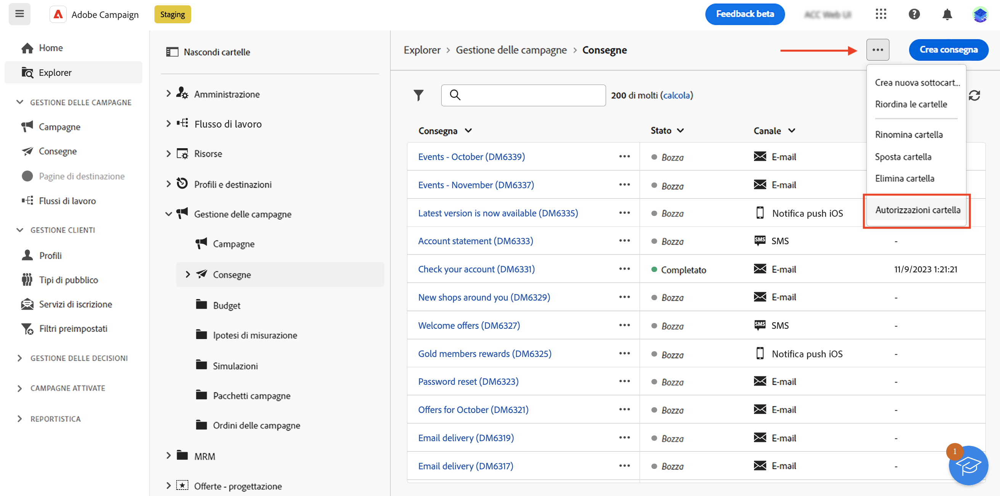
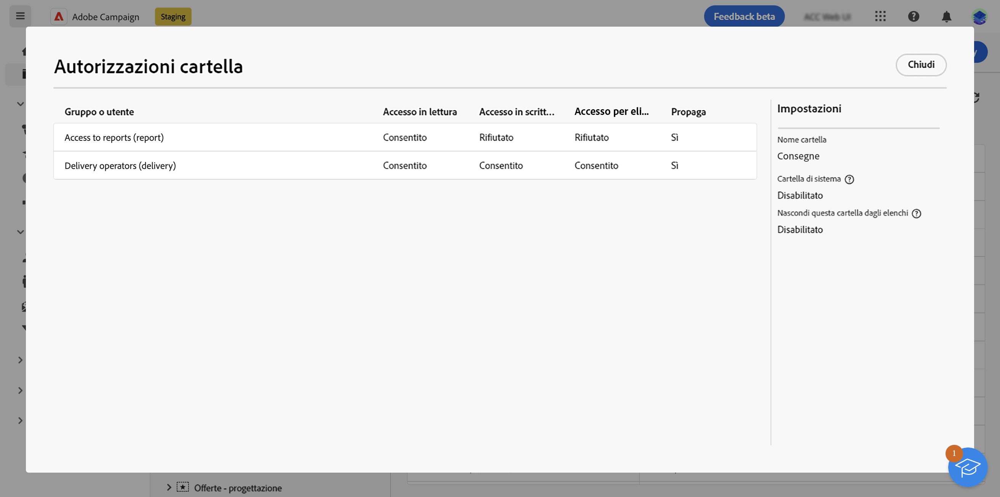
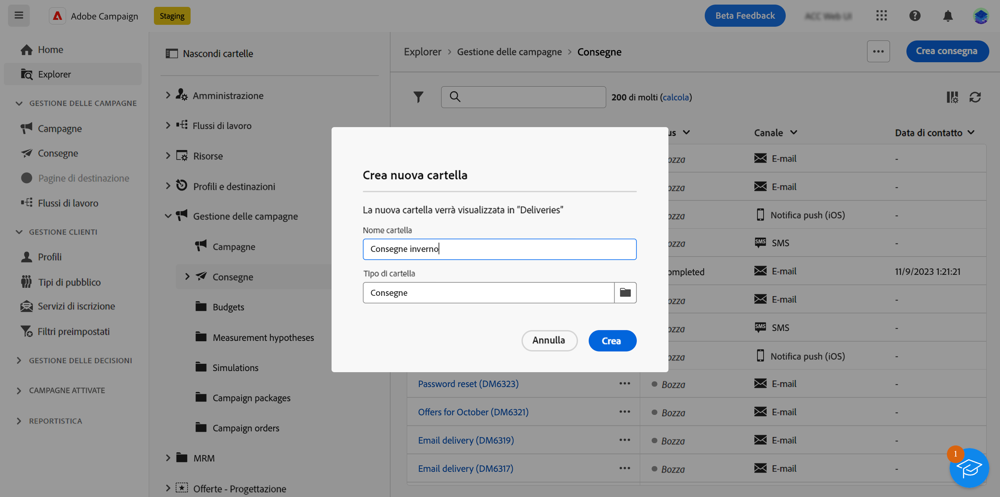
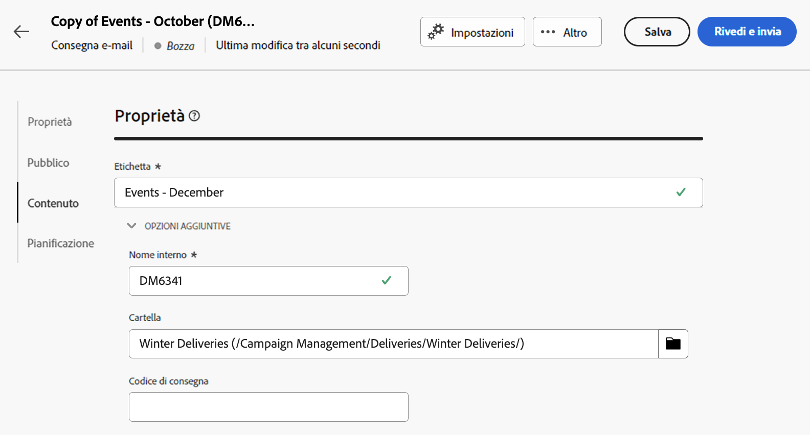

# Accesso e autorizzazioni {#access-and-permissions}

>[!CONTEXTUALHELP]
>id="acw_explorer_permissions_create"
>title="Autorizzazione necessaria"
>abstract="Prima di poter creare questo oggetto, l’amministratore deve concederti l’autorizzazione."

>[!CONTEXTUALHELP]
>id="acw_audiences_read_only"
>title="Il pubblico è di sola lettura"
>abstract="Non disponi delle autorizzazioni necessarie per modificare questo pubblico. Se necessario, contatta l’amministratore per farti autorizzare l’accesso."

>[!CONTEXTUALHELP]
>id="acw_subscription_services_read_only"
>title="Questo servizio è di sola lettura"
>abstract="Non disponi delle autorizzazioni necessarie per modificare questo servizio. Se necessario, contatta l’amministratore per farti autorizzare l’accesso."

>[!CONTEXTUALHELP]
>id="acw_campaign_read_only"
>title="Questa campagna è di sola lettura"
>abstract="Non disponi delle autorizzazioni necessarie per modificare questa campagna. Se necessario, contatta l’amministratore per farti autorizzare l’accesso."

>[!CONTEXTUALHELP]
>id="acw_deliveries_read_only"
>title="Questa consegna è di sola lettura"
>abstract="Non disponi delle autorizzazioni necessarie per modificare questa consegna. Se necessario, contatta l’amministratore per farti autorizzare l’accesso."

>[!CONTEXTUALHELP]
>id="acw_wf_read_only"
>title="Questo flusso di lavoro è di sola lettura"
>abstract="Non disponi delle autorizzazioni necessarie per modificare questo flusso di lavoro. Se necessario, contatta l’amministratore per farti autorizzare l’accesso."

>[!CONTEXTUALHELP]
>id="acw_wf_read_only_canvas"
>title="Questo flusso di lavoro è di sola lettura"
>abstract="Impossibile modificare il flusso di lavoro a causa di area di lavoro non supportata o non compatibile."

Il controllo degli accessi può limitare l’accesso a oggetti e dati da elenchi principali, come consegne, destinatari o flussi di lavoro. Queste restrizioni si applicano anche nella struttura di navigazione di **Explorer**. È inoltre necessario disporre delle autorizzazioni per creare, eliminare, duplicare e modificare oggetti dall’interfaccia utente.

Il controllo degli accessi viene gestito nella console client di Campaign. Tutte le autorizzazioni in Campaign Web vengono sincronizzate con le autorizzazioni della console client di Campaign. Solo gli amministratori di Campaign possono definire e modificare le autorizzazioni utente. Ulteriori informazioni sulle autorizzazioni per gli utenti in [Documentazione di Campaign v8 (console client)](https://experienceleague.adobe.com/docs/campaign/campaign-v8/admin/permissions/gs-permissions.html?lang=it){target="_blank"}.

Durante la navigazione nell’interfaccia utente di Campaign Web, puoi accedere a dati, oggetti e funzionalità in base alle autorizzazioni di cui disponi. Ad esempio, se non disponi delle autorizzazioni di accesso per una cartella, non puoi visualizzarla. Le autorizzazioni influiscono anche sulla gestione di oggetti e dati. Senza le autorizzazioni di scrittura per una cartella specifica, non puoi creare una consegna in tale cartella, anche se è possibile visualizzarla nell’interfaccia utente.

## Visualizzare le autorizzazioni {#view-permissions}

Dalla sezione **Explorer**, è possibile sfogliare le autorizzazioni per ciascuna cartella. Queste autorizzazioni sono impostate nella console client e vengono utilizzate per organizzare e controllare l’accesso ai dati di Campaign.

Per visualizzare le autorizzazioni relative a una cartella, segui questi passaggi:

1. Seleziona una cartella dal menu di navigazione a sinistra **Explorer**.
1. Fai clic sui tre punti nell’angolo in alto a destra e seleziona **Autorizzazioni cartella**.

   {zoomable=&quot;yes&quot;}{width="70%" align="left" zoomable="yes"}

1. Controlla i dettagli nella schermata di seguito:

   {zoomable=&quot;yes&quot;}{width="70%" align="left" zoomable="yes"}

   Un gruppo o un operatore può disporre di autorizzazioni di lettura, scrittura e/o eliminazione per i dati memorizzati nella cartella selezionata.

   Se è attiva l’opzione **Propaga**, tutte le autorizzazioni definite per una cartella vengono applicate a tutte le relative sottocartelle. Queste autorizzazioni possono essere caricate per ogni sottocartella.

   Se è attivata l’opzione **Cartella di sistema**, l’accesso è consentito a tutti gli operatori, indipendentemente dalle autorizzazioni.

Per ulteriori informazioni sulle autorizzazioni per le cartelle consulta la [documentazione di Campaign v8 (console client)](https://experienceleague.adobe.com/docs/campaign/campaign-v8/admin/permissions/folder-permissions.html?lang=it){target="_blank"}.

## Utilizzare le cartelle {#folders}

Puoi creare, rinominare, riordinare e spostare cartelle per organizzare i componenti e i dati. È possibile inoltre eliminare le cartelle dallo stesso menu.

>[!CAUTION]
>
>Durante l’eliminazione di una cartella, vengono eliminati anche tutti i dati memorizzati al suo interno.

Per creare una nuova cartella, segui questi passaggi:

1. Seleziona una cartella dal menu di navigazione a sinistra **Explorer**.
1. Fai clic sui tre punti nell’angolo superiore destro e scegli **Crea nuova sottocartella**.
1. Immetti il nome della cartella e salvala.

   {zoomable=&quot;yes&quot;}{width="70%" align="left" zoomable="yes"}

   La cartella viene aggiunta come sottocartella della cartella corrente. Passa alla nuova cartella per creare i componenti direttamente al suo interno. Puoi anche creare un componente da qualsiasi cartella e salvarlo in quella nuova cartella dall’ **Opzioni aggiuntive** nelle proprietà, come mostrato di seguito per una consegna:

   {zoomable=&quot;yes&quot;}{width="70%" align="left" zoomable="yes"}
