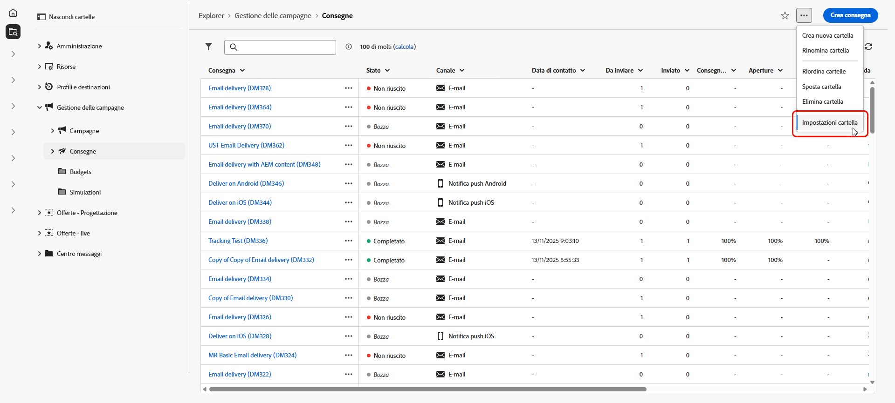
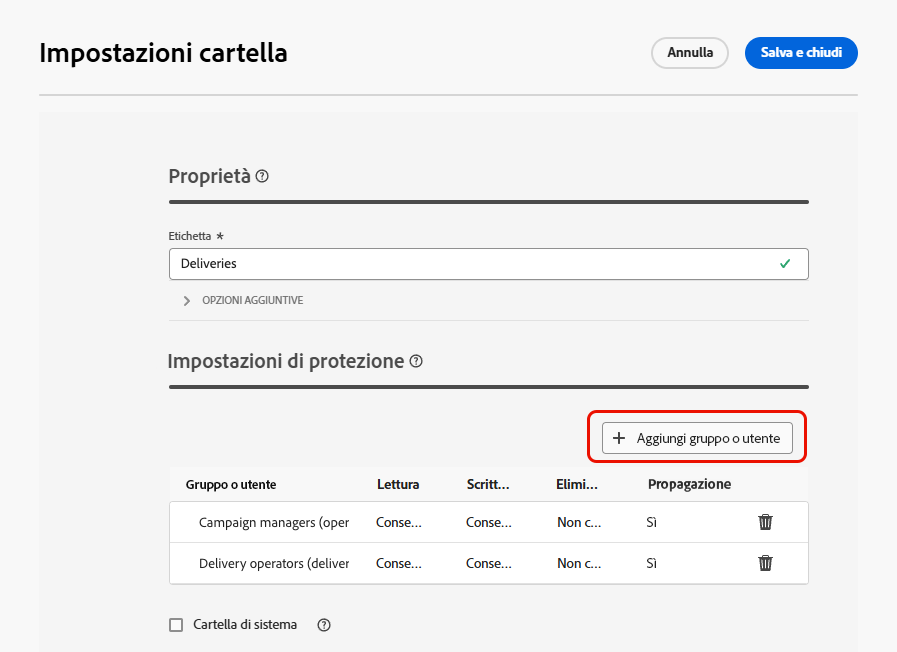
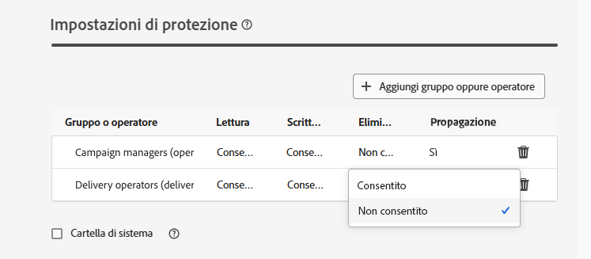

<?xml version="1.0" encoding="UTF-8"?>
<xliff xmlns="urn:oasis:names:tc:xliff:document:1.2" xmlns:okp="okapi-framework:xliff-extensions" xmlns:its="http://www.w3.org/2005/11/its" xmlns:itsxlf="http://www.w3.org/ns/its-xliff/" version="1.2" its:version="2.0">
<file original="help/v8/get-started/permissions.md.mdsc" source-language="en-US" target-language="en-XX" datatype="x-text/markdown">
<body>
<trans-unit id="tu10" xml:space="preserve">
<source xml:lang="en-US">https://experienceleague.adobe.com/it/docs/campaign/campaign-v8/admin/permissions/gs-permissions</source>
<target xml:lang="en-XX">https://experienceleague.adobe.com/it/docs/campaign/campaign-v8/admin/permissions/gs-permissions</target>
</trans-unit>
<trans-unit id="tu26" xml:space="preserve">
<source xml:lang="en-US">https://experienceleague.adobe.com/docs/campaign/campaign-v8/permissions/manage-permissions.html?lang=it#use-named-rights</source>
<target xml:lang="en-XX">https://experienceleague.adobe.com/docs/campaign/campaign-v8/permissions/manage-permissions.html?lang=it#use-named-rights</target>
</trans-unit>
<trans-unit id="tu1" restype="x-YAML_METADATA_HEADER_VALUE" xml:space="preserve">
<source xml:lang="en-US">Permission management in Campaign Web user interface</source>
<target xml:lang="en-XX">Gestione delle autorizzazioni nell’interfaccia utente di Campaign Web</target>
</trans-unit>
<trans-unit id="tu2" restype="x-YAML_METADATA_HEADER_VALUE" xml:space="preserve">
<source xml:lang="en-US">Learn more about permissions in Campaign Web user interface</source>
<target xml:lang="en-XX">Ulteriori informazioni sulle autorizzazioni nell’interfaccia utente di Campaign Web</target>
</trans-unit>
<trans-unit id="tu3" xml:space="preserve">
<source xml:lang="en-US">Permissions</source>
<target xml:lang="en-XX">Autorizzazioni</target>
</trans-unit>
<trans-unit id="tu4" xml:space="preserve">
<source xml:lang="en-US">Each user in Adobe Campaign has specific permissions and restrictions in the application. The user can belong to an operators group and inherit the group's permissions.</source>
<target xml:lang="en-XX">Ogni utente in Adobe Campaign dispone di autorizzazioni e restrizioni specifiche nell’applicazione. L’utente può appartenere a un gruppo di operatori ed ereditare le autorizzazioni del gruppo.</target>
</trans-unit>
<trans-unit id="tu5" xml:space="preserve">
<source xml:lang="en-US">Based on their permissions, an operator can:</source>
<target xml:lang="en-XX">In base alle sue autorizzazioni, un operatore può:</target>
</trans-unit>
<trans-unit id="tu6" xml:space="preserve">
<source xml:lang="en-US">Access certain capabilities</source>
<target xml:lang="en-XX">Accedere a determinate funzionalità</target>
</trans-unit>
<trans-unit id="tu7" xml:space="preserve">
<source xml:lang="en-US">Access certain data</source>
<target xml:lang="en-XX">Accedere a determinati dati</target>
</trans-unit>
<trans-unit id="tu8" xml:space="preserve">
<source xml:lang="en-US">Access certain actions (create, modify, delete)</source>
<target xml:lang="en-XX">Accedere a determinate azioni (creazione, modifica, eliminazione)</target>
</trans-unit>
<trans-unit id="tu9" xml:space="preserve">
<source xml:lang="en-US">A detailed procedure for setting up permissions in Adobe Campaign is available in <ph id="1" ctype="x-LINK">&lbrack;</ph>Adobe Campaign v8 (console) documentation<ph id="2" ctype="x-LINK">[#$tu10]{target="_blank"}</ph>.</source>
<target xml:lang="en-XX">La procedura per impostare le autorizzazioni in Adobe Campaign è descritta nella <ph id="1" ctype="x-LINK">&lbrack;</ph>documentazione di Adobe Campaign v8 (console)<ph id="2" ctype="x-LINK">[#$tu10]{target="_blank"}</ph>.</target>
</trans-unit>
<trans-unit id="tu11" xml:space="preserve">
<source xml:lang="en-US">Permissions on folders</source>
<target xml:lang="en-XX">Autorizzazioni sulle cartelle</target>
</trans-unit>
<trans-unit id="tu12" xml:space="preserve">
<source xml:lang="en-US">Based on your rights, you can view and manage permissions on folders in the <ph id="1" ctype="x-STRONG_EMPHASIS">**[!UICONTROL </ph>Folder settings<ph id="3" ctype="x-LINK_REF">]**</ph>.</source>
<target xml:lang="en-XX">In base ai tuoi diritti, puoi visualizzare e gestire le autorizzazioni per le cartelle nelle <ph id="1" ctype="x-STRONG_EMPHASIS">**[!UICONTROL </ph>Impostazioni cartella<ph id="3" ctype="x-LINK_REF">]**</ph>.</target>
</trans-unit>
<trans-unit id="tu13" xml:space="preserve">
<source xml:lang="en-US">Below is an example of a delivery folder:</source>
<target xml:lang="en-XX">Di seguito è riportato un esempio per una cartella di consegna:</target>
</trans-unit>
<trans-unit id="tu14" xml:space="preserve">
<source xml:lang="en-US"><ph id="1" ctype="x-IMAGE">{zoomable="yes"}</ph></source>
<target xml:lang="en-XX"><ph id="1" ctype="x-IMAGE">{zoomable="yes"}</ph></target>
</trans-unit>
<trans-unit id="tu15" xml:space="preserve">
<source xml:lang="en-US">In the <ph id="1" ctype="x-STRONG_EMPHASIS">**[!UICONTROL </ph>Security<ph id="3" ctype="x-LINK_REF">]**</ph> section of the <ph id="5" ctype="x-STRONG_EMPHASIS">**[!UICONTROL </ph>Folder settings<ph id="7" ctype="x-LINK_REF">]**</ph>, you can view and manage (add or delete) operators or groups who can access the folder.</source>
<target xml:lang="en-XX">Nella sezione <ph id="1" ctype="x-STRONG_EMPHASIS">**[!UICONTROL </ph>Sicurezza<ph id="3" ctype="x-LINK_REF">]**</ph> delle <ph id="5" ctype="x-STRONG_EMPHASIS">**[!UICONTROL </ph>Impostazioni cartella<ph id="7" ctype="x-LINK_REF">]**</ph> è possibile visualizzare e gestire (aggiungere o eliminare) gli operatori o i gruppi che possono accedere alla cartella.</target>
</trans-unit>
<trans-unit id="tu16" xml:space="preserve">
<source xml:lang="en-US"><ph id="1" ctype="x-IMAGE">{zoomable="yes"}</ph></source>
<target xml:lang="en-XX"><ph id="1" ctype="x-IMAGE">{zoomable="yes"}</ph></target>
</trans-unit>
<trans-unit id="tu17" xml:space="preserve">
<source xml:lang="en-US">You can directly click on the permissions and change them to either <ph id="1" ctype="x-STRONG_EMPHASIS">**[!UICONTROL </ph>Allowed<ph id="3" ctype="x-LINK_REF">]**</ph> or <ph id="5" ctype="x-STRONG_EMPHASIS">**[!UICONTROL </ph>Denied<ph id="7" ctype="x-LINK_REF">]**</ph>.</source>
<target xml:lang="en-XX">Puoi fare clic direttamente sulle autorizzazioni e cambiarle in <ph id="1" ctype="x-STRONG_EMPHASIS">**[!UICONTROL </ph>Consentite<ph id="3" ctype="x-LINK_REF">]**</ph> o <ph id="5" ctype="x-STRONG_EMPHASIS">**[!UICONTROL </ph>Negate<ph id="7" ctype="x-LINK_REF">]**</ph>.</target>
</trans-unit>
<trans-unit id="tu18" xml:space="preserve">
<source xml:lang="en-US"><ph id="1" ctype="x-IMAGE">{zoomable="yes"}</ph></source>
<target xml:lang="en-XX"><ph id="1" ctype="x-IMAGE">{zoomable="yes"}</ph></target>
</trans-unit>
<trans-unit id="tu19" xml:space="preserve">
<source xml:lang="en-US"><ph id="1" ctype="x-regxph" equiv-text="&lbrack;!NOTE">[!NOTE]</ph></source>
<target xml:lang="en-XX"><ph id="1" ctype="x-regxph" equiv-text="&lbrack;!NOTE">[!NOTE]</ph></target>
</trans-unit>
<trans-unit id="tu20" xml:space="preserve">
<source xml:lang="en-US">You should not be able to create an object for which you do not have at least one folder with writing rights.</source>
<target xml:lang="en-XX">Non è possibile creare un oggetto per il quale non disponi di almeno una cartella con diritti di scrittura.</target>
</trans-unit>
<trans-unit id="tu21" xml:space="preserve">
<source xml:lang="en-US">You do not need to be an admin to create fragments, but you must have writing rights on at least one "Content visual fragment" folder. Otherwise, you won't be able to create a visual fragment.</source>
<target xml:lang="en-XX">Per creare i frammenti non è necessario essere un amministratore, ma devi disporre dei diritti di scrittura per almeno una cartella per “Frammenti visivi di contenuto”. In caso contrario, non potrai creare un frammento visivo.</target>
</trans-unit>
<trans-unit id="tu22" xml:space="preserve">
<source xml:lang="en-US">If the <ph id="1" ctype="x-STRONG_EMPHASIS">**[!UICONTROL </ph>Propagate<ph id="3" ctype="x-LINK_REF">]**</ph> option is enabled, all permissions defined for a folder apply to all its sub-folders. These permissions can be overridden for each sub-folder.</source>
<target xml:lang="en-XX">Se l’opzione <ph id="1" ctype="x-STRONG_EMPHASIS">**[!UICONTROL </ph>Propaga<ph id="3" ctype="x-LINK_REF">]**</ph> è abilitata, tutte le autorizzazioni definite per una cartella vengono applicate a tutte le relative sottocartelle. Queste autorizzazioni possono essere sovrascritte per ogni sottocartella.</target>
</trans-unit>
<trans-unit id="tu23" xml:space="preserve">
<source xml:lang="en-US">If the <ph id="1" ctype="x-STRONG_EMPHASIS">**[!UICONTROL </ph>System folder<ph id="3" ctype="x-LINK_REF">]**</ph> option is selected, access is allowed to all operators, regardless of their permissions.</source>
<target xml:lang="en-XX">Se l’opzione <ph id="1" ctype="x-STRONG_EMPHASIS">**[!UICONTROL </ph>Cartella di sistema<ph id="3" ctype="x-LINK_REF">]**</ph> è abilitata, l’accesso è consentito a tutti gli operatori, indipendentemente dalle autorizzazioni.</target>
</trans-unit>
<trans-unit id="tu24" xml:space="preserve">
<source xml:lang="en-US">See this <ph id="1" ctype="x-LINK">[</ph>section<ph id="2" ctype="x-LINK">](work-with-folders.md#folder-access-rights)</ph> to learn how these rights affect the actions available to you on a folder.</source>
<target xml:lang="en-XX">Consulta questa <ph id="1" ctype="x-LINK">[</ph>sezione<ph id="2" ctype="x-LINK">](work-with-folders.md#folder-access-rights)</ph> per capire come questi diritti influiscono sulle azioni disponibili per una cartella.</target>
</trans-unit>
<trans-unit id="tu25" xml:space="preserve">
<source xml:lang="en-US">Named rights also determine which folder actions are available to an operator. Refer to the <ph id="1" ctype="x-LINK">&lbrack;</ph>Campaign v8 documentation<ph id="2" ctype="x-LINK">[#$tu26]{target="_blank"}</ph>.</source>
<target xml:lang="en-XX">I diritti denominati determinano anche che le azioni della cartella siano disponibili per un operatore. Consulta la <ph id="1" ctype="x-LINK">&lbrack;</ph>documentazione di Campaign v8<ph id="2" ctype="x-LINK">[#$tu26]{target="_blank"}</ph>.</target>
</trans-unit>
<trans-unit id="tu27" xml:space="preserve">
<source xml:lang="en-US">All permissions in the Campaign Web user interface synchronize with Campaign Client Console permissions.</source>
<target xml:lang="en-XX">Tutte le autorizzazioni nell’interfaccia utente di Campaign Web vengono sincronizzate con le autorizzazioni della console client di Campaign.</target>
</trans-unit>
</body>
</file>
</xliff>