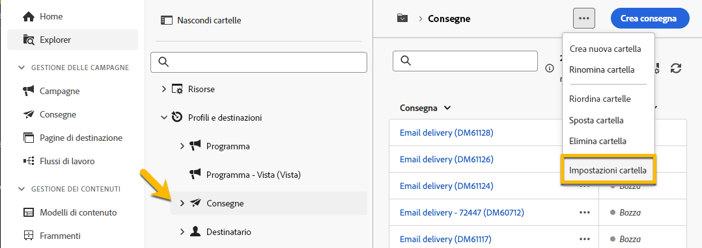

# Autorizzazioni {#permissions}

Ogni utente in Adobe Campaign dispone di autorizzazioni e restrizioni proprie nell’applicazione. L’utente può far parte del gruppo di operatori ed ereditare le autorizzazioni del gruppo.

In base alle relative autorizzazioni, un operatore può:

* Accedere a determinate funzionalità
* Accedere a determinati dati
* Accedere a determinate azioni (creazione, modifica, eliminazione)

La procedura dettagliata per impostare le autorizzazioni in Adobe Campaign è disponibile nella [documentazione di Adobe Campaign v8 (console)](https://experienceleague.adobe.com/it/docs/campaign/campaign-v8/admin/permissions/gs-permissions){target="_blank"}.

## Autorizzazioni sulle cartelle {#folder-permissions}

In base ai tuoi diritti, puoi visualizzare e gestire le autorizzazioni sulle cartelle nelle **[!UICONTROL Impostazioni cartella]**.

Di seguito è riportato un esempio su una cartella di consegna:

{zoomable="yes"}

Nella sezione **[!UICONTROL Sicurezza]** delle **[!UICONTROL Impostazioni cartella]** è possibile visualizzare e gestire (aggiungere o eliminare) gli operatori o i gruppi che possono accedere alla cartella.

{zoomable="yes"}

Puoi fare clic direttamente sulle autorizzazioni e modificarle con **[!UICONTROL Consentite]** o **[!UICONTROL Negate]**.

{zoomable="yes"}

Se è attiva l’opzione **[!UICONTROL Propaga]**, tutte le autorizzazioni definite per una cartella vengono applicate a tutte le relative sottocartelle. Queste autorizzazioni possono essere caricate per ogni sottocartella.

Se è selezionata l’opzione **[!UICONTROL Cartella di sistema]**, l’accesso è consentito a tutti gli operatori, indipendentemente dalle autorizzazioni.

È inoltre possibile [gestire le autorizzazioni per le cartelle nella console di Adobe Campaign](https://experienceleague.adobe.com/it/docs/campaign/campaign-v8/admin/permissions/folder-permissions){target="_blank"}.

Tutte le autorizzazioni nell&#39;interfaccia utente di Campaign Web vengono sincronizzate con le autorizzazioni della console client di Campaign.
