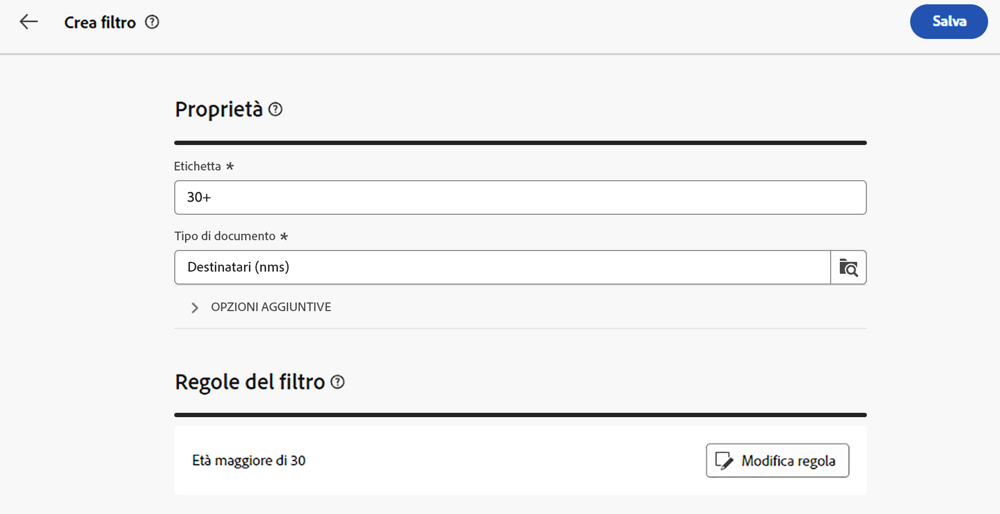
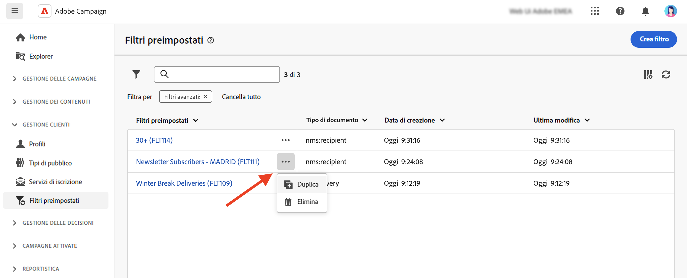

# Utilizzare filtri preimpostati {#predefined-filters}

>[!CONTEXTUALHELP]
>id="acw_homepage_learning_card4"
>title="Gestione dei filtri preimpostati"
>abstract="Campaign interfaccia Web utente offre un&#39;interfaccia intuitiva per utente per gestire e personalizzare facilmente i filtri predefiniti per soddisfare le tue esigenze specifiche. Crea una sola volta e salva per un utilizzo futuro."

>[!CONTEXTUALHELP]
>id="acw_predefined-filters-dashboard"
>title="Filtri preimpostati"
>abstract="Campaign interfaccia Web utente offre un&#39;interfaccia intuitiva per utente per gestire e personalizzare facilmente i filtri predefiniti per soddisfare le tue esigenze specifiche. Crea una sola volta e salva per un utilizzo futuro."

I filtri predefiniti sono filtri personalizzati creati e salvati per un utilizzo futuro. Fungono da collegamenti durante le operazioni di filtraggio con il modellatore di query. Ad esempio, possono essere utilizzati per filtrare un elenco di dati o creare l&#39;audience di una consegna.

È possibile utilizzare i filtri incorporati esistenti per accesso un sottoinsieme specifico di dati o creare filtri predefiniti personalizzati e salvarli.

{zoomable="yes"}

## Creare un filtro preimpostato {#create-predefined-filter}

>[!CONTEXTUALHELP]
>id="acw_predefined-filters-creation"
>title="Creare un filtro preimpostato"
>abstract="Immetti un’etichetta per il filtro preimpostato e seleziona la tabella a cui si applica. Apri le opzioni aggiuntive per aggiungere una descrizione e imposta questo filtro come preferito. Quindi utilizza il pulsante “Crea regola” per definire le condizioni del filtro"

>[!CONTEXTUALHELP]
>id="acw_predefined-filters-rules"
>title="Creare le regole del filtro preimpostato"
>abstract="Per definire le condizioni del filtro personalizzato, fai clic sul pulsante “Crea regola”."

### Creare un filtro dal query modeler {#create-from-rule-builder}

Salva un filtro personalizzato dal [modellatore](../query/query-modeler-overview.md) di query per renderlo disponibile per un utilizzo futuro. Segui questi passaggi:

1. Apri il query modeler e definisci le condizioni del filtro. Nell&#39;esempio riportato di seguito, vengono filtrati i destinatari che vivono a Madrid e si sono iscritti a una newsletter.
1. Fai clic sul pulsante **Seleziona o salva filtro** e seleziona **Salva come filtro**.

   {zoomable="yes"}

1. Seleziona **Crea un nuovo filtro** e immetti un nome e una descrizione per il filtro.

   {zoomable="yes"}

   Se necessario, puoi salvare il filtro come preferito. Per ulteriori informazioni, consulta [questa sezione](#fav-filter).

1. Fai clic su **Conferma** per salvare le modifiche.

Il filtro personalizzato è ora disponibile nell’elenco **Filtri preimpostati** e accessibile a tutti gli utenti di Campaign.

### Creare un filtro dall’elenco filtri {#create-filter-from-list}

Crea un filtro dalla **voce Filtri** predefiniti nel menu a sinistra. Segui questi passaggi:

1. Sfoglia alla voce Filtri **** predefiniti nel menu a sinistra.
1. Fai clic sul pulsante **Crea filtro**.
1. Inserisci il nome del filtro e, dal campo **Tipo di documento**, seleziona lo schema a cui si applica. Lo schema predefinito è `Recipients(nms)`.

1. Definisci la regola per il filtro. Ad esempio, per i profili con più di 30 anni.

   {zoomable="yes"}

1. Salva le modifiche.

   {zoomable="yes"}

Il filtro viene aggiunto all’elenco dei filtri preimpostati. Se necessario, puoi salvare il filtro come preferito. Per ulteriori informazioni, consulta [questa sezione](#fav-filter).

## Salva il filtro come preferito {#fav-filter}

Quando crei un filtro predefinito, abilita l&#39;opzione **Salva come preferito** per visualizzare questo filtro predefinito nei preferiti.

Quando viene salvato un filtro come preferito, è disponibile per tutti gli utenti nella sezione **Filtri preferiti** dell’elenco di filtri creati, come illustrato di seguito:

{zoomable="yes"}{width="30%" align="left"}

## Utilizza un filtro preimpostato {#use-predefined-filter}

I filtri preimpostati sono disponibili quando si definiscono le proprietà delle regole. Per accedere ai filtri predefiniti, scegli l&#39;opzione **Seleziona filtro personalizzato** nell&#39;elenco a discesa del modellatore di query.

Accedi all&#39;elenco completo dei filtri predefiniti disponibili per il contesto corrente e utilizza i **tasti di scelta rapida nella sezione Filtri** preferiti del menu a discesa. Per ulteriori informazioni sui preferiti, consulta [questa sezione](#fav-filter).

Ad esempio, per creare un pubblico da un filtro preimpostato, segui questi passaggi:

1. Accedi a **Tipi di pubblico** nel menu a sinistra e fai clic sul pulsante **Crea pubblico** nell’angolo in alto a sinistra dell’elenco dei tipi di pubblico.
1. Immetti il nome del pubblico e fai clic su **Crea pubblico**.
1. Seleziona l’attività **Query** e, nel riquadro di destra, fai clic sul pulsante **Crea pubblico**.

   {zoomable="yes"}

1. Dal pulsante **Seleziona o salva filtro**, scegli l’opzione **Seleziona filtro personalizzato**.

   {zoomable="yes"}

1. Passa al filtro preimpostato da usare per creare il pubblico, selezionalo e conferma.

   {zoomable="yes"}

1. Controlla le proprietà della regola per questo filtro e conferma.

   Il filtro viene ora utilizzato come query nell’attività **Query**.

   {zoomable="yes"}

1. Salva le modifiche e fai clic sul pulsante **Inizia** per creare il pubblico e renderlo disponibile nell’elenco dei tipi di pubblico.

## Gestire i filtri preimpostati {#manage-predefined-filter}

Tutti i filtri preimpostati sono raggruppati nella voce dedicata del menu di navigazione a sinistra.

{zoomable="yes"}

Da questo elenco, è possibile creare un nuovo filtro come descritto in precedenza ed eseguire le azioni elencate di seguito:

* Modifica un filtro esistente e modificane le regole e le proprietà.
* duplicare un filtro preimpostato;
* eliminare un filtro preimpostato.

Puoi anche aggiungere un filtro predefinito come preferito per accesso rapidi durante la creazione del pubblico. Per ulteriori informazioni, consulta [questa sezione](#fav-filter).

<!--
## Built-in predefined filters {#ootb-predefined-filter}

Campaign comes with a set of predefined filters, built from the client console. These filters can be used to define your audiences, and rules. They must not be modified.
-->