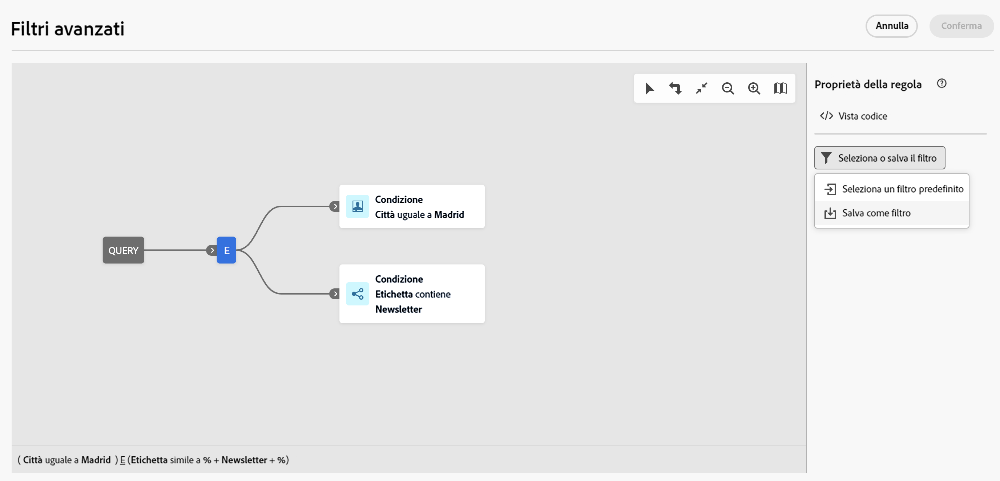

# Utilizzare filtri preimpostati {#predefined-filters}

>[!CONTEXTUALHELP]
>id="acw_homepage_learning_card4"
>title="Gestione dei filtri preimpostati"
>abstract="L’interfaccia utente di Campaign Web offre un’interfaccia semplice e intuitiva per gestire e personalizzare filtri preimpostati, al fine di soddisfare esigenze specifiche. Crea una sola volta e salva per un utilizzo futuro."

<!--TO REMOVE BELOW-->
>[!CONTEXTUALHELP]
>id="acw_homepage_card4"
>title="Gestione dei filtri preimpostati"
>abstract="Campaign Web ora offre un’interfaccia semplice e intuitiva per gestire e personalizzare filtri preimpostati, al fine di soddisfare esigenze specifiche. Crea una sola volta e salva per un utilizzo futuro."

<!--TO REMOVE ABOVE-->

>[!CONTEXTUALHELP]
>id="acw_predefined-filters-dashboard"
>title="Filtri preimpostati"
>abstract="L’interfaccia utente di Campaign Web offre un’interfaccia semplice e intuitiva per gestire e personalizzare filtri preimpostati, al fine di soddisfare esigenze specifiche. Crea una sola volta e salva per un utilizzo futuro."

I filtri preimpostati sono filtri personalizzati che vengono creati e salvati per essere disponibili per un utilizzo futuro. Possono essere utilizzati come scelte rapide durante qualsiasi operazione di filtro insieme al query modeler, ad esempio quando si filtra un elenco di dati o si crea il pubblico di una consegna.

Puoi utilizzare i filtri preimpostati esistenti per accedere a un sottoinsieme specifico dei tuoi dati o creare filtri preimpostati personalizzati e salvarli.

{zoomable=&quot;yes&quot;}{zoomable=&quot;yes&quot;}

## Creare un filtro preimpostato {#create-predefined-filter}

>[!CONTEXTUALHELP]
>id="acw_predefined-filters-creation"
>title="Creare un filtro preimpostato"
>abstract="Immetti un’etichetta per il filtro preimpostato e seleziona la tabella a cui si applica. Apri le opzioni aggiuntive per aggiungere una descrizione e imposta questo filtro come preferito. Quindi utilizza il pulsante “Crea regola” per definire le condizioni del filtro"

>[!CONTEXTUALHELP]
>id="acw_predefined-filters-rules"
>title="Creare le regole del filtro preimpostato"
>abstract="Per definire le condizioni del filtro personalizzato, fai clic sul pulsante “Crea regola”."

### Creare un filtro dal query modeler {#create-from-rule-builder}

Puoi salvare un filtro personalizzato dal [query modeler](../query/query-modeler-overview.md) al fine di renderlo disponibile per un utilizzo futuro. Segui questi passaggi:

1. Apri il query modeler e definisci le condizioni del filtro. Nell’esempio seguente, puoi filtrare i destinatari che vivono a Madrid e che sono iscritti a una newsletter.
1. Fai clic sul pulsante **Seleziona o salva filtro** e seleziona **Salva come filtro**.

   {zoomable=&quot;yes&quot;}

1. Seleziona **Crea un nuovo filtro** e immetti un nome e una descrizione per il filtro.

   {zoomable=&quot;yes&quot;}

   Se necessario, puoi salvare il filtro come preferito. Per ulteriori informazioni, consulta [questa sezione](#fav-filter).

1. Fai clic su **Conferma** per salvare le modifiche.

Il filtro personalizzato è ora disponibile nell’elenco **Filtri preimpostati** e accessibile a tutti gli utenti di Campaign.

### Creare un filtro dall’elenco filtri {#create-filter-from-list}

Puoi creare un filtro dalla voce **Filtri preimpostati** nel menu a sinistra. Per farlo, segui i passaggi indicati di seguito:

1. Passa alla voce **Filtri preimpostati** nel menu a sinistra.
1. Fai clic sul pulsante **Crea filtro**.
1. Inserisci il nome del filtro e, dal campo **Tipo di documento**, seleziona lo schema a cui si applica. Lo schema predefinito è `Recipients(nms)`.

1. Definisci la regola per il filtro. Ad esempio, per i profili con più di 30 anni.

   {zoomable=&quot;yes&quot;}

1. Salva le modifiche.

   {zoomable=&quot;yes&quot;}

Il filtro viene aggiunto all’elenco dei filtri preimpostati. Se necessario, puoi salvare il filtro come preferito. Per ulteriori informazioni, consulta [questa sezione](#fav-filter).

## Salva il filtro come preferito {#fav-filter}

Quando crei un filtro preimpostato, puoi abilitare l’opzione **Salva come preferito** se lo desideri visualizzare tra i preferiti.

Quando viene salvato un filtro come preferito, è disponibile per tutti gli utenti nella sezione **Filtri preferiti** dell’elenco di filtri creati, come illustrato di seguito:

{zoomable=&quot;yes&quot;}{width="30%" align="left"}

## Utilizza un filtro preimpostato {#use-predefined-filter}

I filtri preimpostati sono disponibili quando si definiscono le proprietà delle regole. Per accedere ai filtri preimpostati, scegli l’opzione **Seleziona filtro personalizzato** nel menu a discesa del query modeler.

Puoi quindi accedere all’elenco completo dei filtri predefiniti disponibili per il contesto corrente e utilizzare i collegamenti disponibili nel **Filtri preferiti** del menu a discesa. Per ulteriori informazioni sui preferiti, consulta [questa sezione](#fav-filter).

Ad esempio, per creare un pubblico da un filtro preimpostato, segui questi passaggi:

1. Accedi a **Tipi di pubblico** nel menu a sinistra e fare clic su **Crea pubblico** nell’angolo superiore sinistro dell’elenco dei tipi di pubblico.
1. Immetti il nome del pubblico e fai clic su **Crea pubblico**.
1. Seleziona la **Query** e, nel riquadro di destra, fare clic sul pulsante **Creare un pubblico** pulsante.

   {zoomable=&quot;yes&quot;}

1. Dalla sezione **Seleziona o salva il filtro** , scegliere il pulsante **Seleziona filtro personalizzato** opzione.

   {zoomable=&quot;yes&quot;}

1. Passa al filtro preimpostato da usare per creare il pubblico, selezionalo e conferma.

   {zoomable=&quot;yes&quot;}

1. Controlla le proprietà della regola per questo filtro e conferma.

   Il filtro viene ora utilizzato come query nell’attività **Query**.

   {zoomable=&quot;yes&quot;}

1. Salva le modifiche e fai clic sul pulsante **Inizia** per creare il pubblico e renderlo disponibile nell’elenco dei tipi di pubblico.

## Gestire i filtri preimpostati {#manage-predefined-filter}

Tutti i filtri predefiniti sono raggruppati nella voce dedicata del menu di navigazione a sinistra.

{zoomable=&quot;yes&quot;}

Da questo elenco, puoi creare un nuovo filtro come descritto in precedenza ed eseguire le azioni elencate di seguito:

* Modifica un filtro esistente, modificane regole e proprietà.
* Duplica un filtro predefinito.
* Elimina un filtro predefinito.

Puoi anche aggiungere un filtro predefinito come preferito per un accesso rapido durante la creazione dei tipi di pubblico. Per ulteriori informazioni, consulta [questa sezione](#fav-filter).

<!--
## Built-in predefined filters {#ootb-predefined-filter}

Campaign comes with a set of predefined filters, built from the client console. These filters can be used to define your audiences, and rules. They must not be modified.
-->
