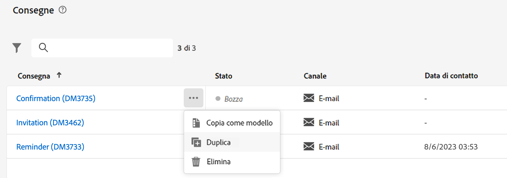
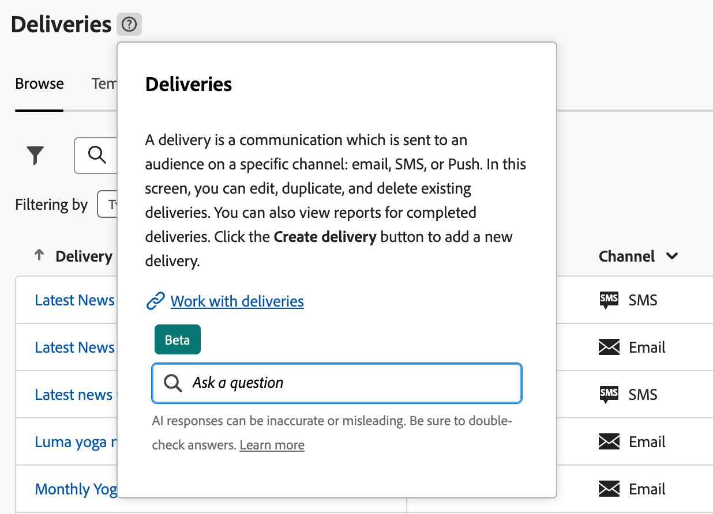

# Scoprire l’interfaccia {#user-interface}

La nuova interfaccia di Adobe Campaign Web offre un’esperienza utente moderna e intuitiva per semplificare la progettazione e la consegna delle campagne di marketing. Questa nuova interfaccia è integrata con le app e le soluzioni di Adobe Experience Cloud.

Scopri come connetterti ad Adobe Campaign e le nozioni di base sulla navigazione in Experience Cloud [in questo articolo](connect-to-campaign.md).

>[!NOTE]
>
>Questa documentazione viene spesso aggiornata per riflettere le recenti modifiche apportate all’interfaccia utente del prodotto. Tuttavia, alcune schermate possono risultare leggermente diverse dall’interfaccia utente che visualizzi.

## Pagina home di Campaign {#user-interface-home}

>[!CONTEXTUALHELP]
>id="acw_homepage_recent"
>title="Recenti"
>abstract="L’elenco **Recenti** fornisce collegamenti alle consegne create e modificate di recente. Questo elenco ne mostra il canale, lo stato, il proprietario, le date di creazione e modifica."

La pagina Home di Campaign ti consente di sfogliare rapidamente e facilmente risorse, indicatori e componenti chiave.

La sezione superiore della pagina Home fornisce dettagli sugli ultimi aggiornamenti e sulle nuove funzionalità disponibili nel prodotto, con collegamenti alle note sulla versione e alla documentazione dettagliata. Utilizza la freccia sinistra per scorrere le schede delle funzioni.

{zoomable=&quot;yes&quot;}

Gli **Indicatori chiave di prestazioni** consentono di verificare l’efficacia della piattaforma tramite i KPI più diffusi. Ulteriori informazioni su questi KPI sono disponibili in [questa pagina](../reporting/kpis.md).

L’elenco **Recenti** fornisce collegamenti alle consegne create e modificate di recente. Questo elenco ne mostra il canale, lo stato, il proprietario, le date di creazione e modifica. Fai clic sul collegamento **Mostra altro** per caricare altre consegne.

Puoi anche accedere alle principali pagine della guida di Adobe Campaign Web dalla sezione **Apprendimento** della pagina.

## Menu di navigazione a sinistra {#user-interface-left-nav}

Sfoglia i collegamenti a sinistra per accedere alle funzionalità di Adobe Campaign Web. Diversi collegamenti presentano elenchi di oggetti che possono essere ordinati e filtrati. Puoi anche configurare le colonne per visualizzare tutte le informazioni che ti servono. Consulta questa [sezione](#list-screens). Alcune schermate di elenco sono di sola lettura. Gli elementi visualizzati nel menu di navigazione a sinistra e negli elenchi dipendono dalle autorizzazioni utente. Ulteriori informazioni sulle autorizzazioni sono disponibili in [questa sezione](permissions.md).

### Explorer {#user-interface-explorer}

>[!CONTEXTUALHELP]
>id="acw_explorer"
>title="Explorer"
>abstract="Il menu **Explorer** mostra tutti i componenti e gli oggetti di Campaign con la stessa gerarchia di cartelle di quella presente nella console client. Sfoglia tutti i componenti, le cartelle e gli schemi di Campaign v8, controlla le autorizzazioni associate e crea cartelle e sottocartelle da questo menu."

Il menu **Explorer** mostra tutte le risorse e gli oggetti di Campaign con la stessa gerarchia di cartelle di quella presenti nella console client. Sfoglia tutti i componenti, le cartelle e gli schemi di Campaign v8 e crea consegne, flussi di lavoro e campagne.

Gli elementi visualizzati in **Explorer** dipendono dalle autorizzazioni utente. Se disponi dei diritti appropriati, è possibile inoltre aggiungere cartelle e sottocartelle. Ulteriori informazioni sulle autorizzazioni sono disponibili in [questa sezione](permissions.md).

Puoi configurare le colonne per personalizzare la visualizzazione e visualizzare tutte le informazioni necessarie. Consulta questa [sezione](#list-screens). Puoi anche aggiungere cartelle e sottocartelle, come descritto in [questa sezione](permissions.md#folders).

Per ulteriori informazioni sulla funzione Explorer di Campaign, la gerarchia di cartelle e risorse, consulta questa [documentazione di Campaign v8 (console)](https://experienceleague.adobe.com/docs/campaign/campaign-v8/new/campaign-ui.html?lang=it#ac-explorer-ui){target="_blank"}.

### Gestione delle campagne {#user-interface-campaign-management}

Nella sezione GESTIONE DELLE CAMPAGNE, puoi accedere a campagne di marketing, consegne e flussi di lavoro.

* **Campagne**: questo è l’elenco delle campagne e dei modelli di campagna. Per impostazione predefinita, per ogni campagna puoi visualizzare le date di inizio/fine/creazione/ultima modifica, lo stato corrente e il nome dell’operatore della campagna che l’ha creata. Puoi filtrare l’elenco per stato, date di inizio/fine, cartella oppure creare un filtro avanzato per definire criteri di filtro personalizzati. Per ulteriori informazioni sulle campagne, consulta [questa sezione](../campaigns/gs-campaigns.md).

* **Consegne**: scorri l’elenco delle consegne. Per impostazione predefinita, puoi visualizzarne lo stato, la data dell’ultima modifica e i KPI chiave. Puoi filtrare l’elenco per stato, data di contatto o canale. Fai clic su una consegna e-mail per aprire la relativa dashboard e ottenere una panoramica dei dettagli della consegna. Le consegne su altri canali sono di sola lettura. Per ulteriori informazioni sulle consegne, consulta [questa sezione](../msg/gs-messages.md).

  Per eliminare o duplicare una consegna, utilizza il pulsante **Altre azioni**.

  {zoomable=&quot;yes&quot;}{width="70%" align="left"}

* **Flussi di lavoro**: in questa schermata, è possibile accedere all’elenco completo dei flussi di lavoro e dei modelli di flusso di lavoro. Puoi controllarne lo stato, le date dell’ultima/successiva esecuzione e creare un nuovo flusso di lavoro o un nuovo modello di flusso di lavoro. È possibile filtrare l’elenco con gli stessi criteri degli altri oggetti. Inoltre, puoi filtrare i flussi di lavoro che appartengono o meno a una campagna. Per ulteriori informazioni sui flussi di lavoro, consulta [questa sezione](../workflows/gs-workflows.md).

### Gestione dei contenuti {#user-interface-content-management}

Nella sezione GESTIONE DEI CONTENUTI puoi visualizzare i modelli e i frammenti dei contenuti.

* **Modelli di contenuto**: per un processo di progettazione più rapido e migliore, puoi creare modelli autonomi che consentono di riutilizzare facilmente contenuti personalizzati in più campagne.[!DNL Adobe Campaign] Disponibile solo per le e-mail, questa funzionalità consente agli utenti orientati ai contenuti di lavorare su modelli autonomi in modo che gli addetti al marketing possano riutilizzarli e adattarli all’interno delle proprie campagne e-mail. Per ulteriori informazioni, consulta [questa sezione](../email/create-email-templates.md).

<!--
* **Fragments** -
-->

### Gestione clienti {#user-interface-customer-management}

Nella sezione GESTIONE CLIENTI, puoi visualizzare i profili, i tipi di pubblico e le iscrizioni. Questi elenchi sono di sola lettura.

* **Profili**: crea e gestisci profili e accedi al database dei destinatari. Per impostazione predefinita, puoi visualizzarne l’indirizzo e-mail, il nome e il cognome. Per ulteriori informazioni sui profili, consulta [questa sezione](../audience/about-recipients.md).
* **Tipi di pubblico**: questo è l’elenco di tipi di pubblico. Per impostazione predefinita, puoi visualizzarne il tipo, l’origine, le date di creazione e ultima modifica e l’etichetta. È possibile filtrare l’elenco in base all’origine. Per ulteriori informazioni sui tipi di pubblico e gli elenchi, consulta [questa sezione](../audience/about-recipients.md).
* **Servizi di iscrizione**: sfoglia gli elenchi delle iscrizioni. Per impostazione predefinita, puoi visualizzarne il tipo, la modalità e l’etichetta. Scopri come gestire le iscrizioni e il relativo annullamento nella [documentazione di Campaign v8 (console)](https://experienceleague.adobe.com/docs/campaign/campaign-v8/campaigns/send/subscriptions.html?lang=it){target="_blank"}.
* **Filtri preimpostati**: i filtri preimpostati sono filtri personalizzati che vengono creati e salvati per essere disponibili per un utilizzo futuro. Possono essere utilizzati come scelte rapide durante qualsiasi operazione di filtro insieme al query modeler, ad esempio quando si filtra un elenco di dati o si crea il pubblico di una consegna. Per ulteriori informazioni, consulta [questa sezione](predefined-filters.md).

### Gestione delle decisioni {#decision-management}

>[!CONTEXTUALHELP]
>id="acw_offers_list"
>title="Offerte"
>abstract="Sfoglia gli elenchi di offerte e modelli di offerta creati nella console utilizzando il modulo **Interazione**. Questi elenchi sono di sola lettura."
>additional-url="https://experienceleague.adobe.com/docs/campaign-web/v8/msg/offers.html?lang=it" text="Aggiungere offerte a una consegna"

Nella sezione GESTIONE DELLE DECISIONI, puoi visualizzare le offerte e i modelli di offerta. Questi elenchi sono di sola lettura.

* **Offerte**: sfoglia l’elenco delle offerte e i modelli di offerta creati nella console utilizzando il modulo **Interazione**. Per impostazione predefinita, puoi visualizzarne lo stato, le date di inizio e fine e l’ambiente. Puoi filtrare l’elenco per stato e per date di inizio e fine. Sono disponibili anche modelli di offerta.

Per scoprire come creare e inviare offerte tramite e-mail e SMS consulta [questa sezione](../msg/offers.md).

### Reportistica {#left-nav-reporting}

* **Rapporti**: la voce **Rapporto** offre un riepilogo complessivo consolidato del traffico e delle metriche di coinvolgimento per ciascun canale all’interno dell’ambiente di Campaign. Questi rapporti sono costituiti da vari widget, ciascuno dei quali offre una prospettiva distinta sulle prestazioni della campagna o della consegna. Per ulteriori informazioni, consulta [questa sezione](../reporting/global-reports.md).

<!--
## Contextual Help {#user-interface-help} 

A contextual help is available in the interface. When available, click on the `?` icon to display help information and related documentation links. 

{zoomable="yes"}{width="40%" align="left"}

Currently released as a Beta version within the new Campaign Web user interface, the **AI-powered Knowledge Assistant** embedded within contextual help revolutionizes documentation searching and answering how-to questions with effortlessly sifting through vast documentation repositories, instantly pinpointing the precise information you need.

Thanks to Campaign Gen AI's capabilities, this assistant transforms your experience, making information retrieval and problem-solving a breeze. Whether you're seeking guidance in a complex task or navigating extensive documents, our AI-powered Knowledge Assistant is your ultimate companion, providing unmatched efficiency and accuracy in every interaction.

Learn more in [this section](using-ai.md).

-->

## Ulteriori informazioni {#learn-more}

Scopri come sfogliare, cercare e filtrare gli elenchi disponibili nell’ambiente Campaign [in questa pagina](list-filters.md).

<!--
######## This part stores the contextualHelp definition for WebUI BETA ###########
######## These blocks should be dispatched in the appropriate pages when available ###########
######## PLEASE DO NOT DELETE ###########
REFER TO 
https://wiki.corp.adobe.com/pages/viewpage.action?spaceKey=neolane&title=v8+WebUI+Contextual+Help+%3CALPHA%3E-+Official+list
-->

>[!CONTEXTUALHELP]
>id="acw_push_permission_for_segment"
>title="Autorizzazione necessaria"
>abstract="Prima di poter creare un segmento, l’amministratore deve concederti l’autorizzazione."

>[!CONTEXTUALHELP]
>id="acw_push_overview_edit"
>title="Autorizzazione necessaria"
>abstract="Prima di poter creare un segmento, l’amministratore deve concederti l’autorizzazione."

<!-- delivery template settings-->

>[!CONTEXTUALHELP]
>id="acw_global_reporting_sending"
>title="Invio di rapporti globali"
>abstract="In questa schermata sono visibili le metriche di tracciamento della generazione di rapporti"

>[!CONTEXTUALHELP]
>id="acw_global_reporting_tracking"
>title="Tracciamento dei rapporti globale"
>abstract="In questa schermata sono visibili le metriche di tracciamento della generazione di rapporti"

<!-- FOR BETA (alignment) -->
<!--https://wiki.corp.adobe.com/display/neolane/v8+WebUI+Contextual+Help+%3CBETA%3E-+Official+list-->

<!-- FOR GA -->
<!-- Aligned with https://wiki.corp.adobe.com/display/neolane/v8+WebUI+Contextual+Help+%3CGA%3E-+Official+list -->

>[!CONTEXTUALHELP]
>id="acw_recipients_creation_cardoverview"
>title="Panoramica sulla scheda Destinatari"
>abstract="Panoramica sulla scheda Destinatari"

>[!CONTEXTUALHELP]
>id="acw_recipients_creation_touchpoints"
>title="Punti di contatto dei destinatari"
>abstract="Punti di contatto dei destinatari"

>[!CONTEXTUALHELP]
>id="acw_recipients_subscription_selection"
>title="Selezione iscrizioni dei destinatari"
>abstract="Selezione iscrizioni dei destinatari"

>[!CONTEXTUALHELP]
>id="acw_recipients_offers_eligible_list"
>title="Elenco destinatari idonei per le offerte"
>abstract="Elenco destinatari idonei per le offerte"

>[!CONTEXTUALHELP]
>id="acw_recipients_offers_preview_proposition"
>title="Anteprima delle offerte dei destinatari"
>abstract="Anteprima delle offerte dei destinatari"

>[!CONTEXTUALHELP]
>id="acw_conditionalcontent_savefilter"
>title="Salvataggio del filtro del contenuto condizionale"
>abstract="Salvataggio del filtro del contenuto condizionale"

>[!CONTEXTUALHELP]
>id="acw_conditionalcontent_selectfilter"
>title="Selezione del filtro del contenuto condizionale"
>abstract="Selezione del filtro del contenuto condizionale"

>[!CONTEXTUALHELP]
>id="acw_conditionalcontent_subjectline"
>title="Contenuto condizionale nella riga dell’oggetto"
>abstract="Contenuto condizionale nella riga dell’oggetto"

>[!CONTEXTUALHELP]
>id="acw_conditionalcontent_subjectlinecondition"
>title="Condizione del contenuto condizionale nella riga dell’oggetto"
>abstract="Condizione del contenuto condizionale nella riga dell’oggetto"

>[!CONTEXTUALHELP]
>id="acw_deliveries_simulate_testprofiles"
>title="Simulazione dei profili di test"
>abstract="Simulazione dei profili di test"

<!--ML: not visible in UI-->

>[!CONTEXTUALHELP]
>id="acw_deliveries_simulate_profiles_selection"
>title="Simulazione della selezione dei profili di test"
>abstract="Simulazione della selezione dei profili di test"

<!-- ML: beta wiki page - not visible in UI-->

>[!CONTEXTUALHELP]
>id="acw_deliveries_simulate_send_testprofiles"
>title="Simulazione dell’invio dei profili di test"
>abstract="Simulazione dell’invio dei profili di test"

<!-- ML: beta wiki page - not visible in UI-->

>[!CONTEXTUALHELP]
>id="acw_deliveries_simulate_email_log"
>title="Simulazione del registro delle e-mail"
>abstract="Simulazione del registro delle e-mail"

<!-- ML: beta wiki page - not visible in UI-->

<!-- FOR POST-GA -->

<!--Update file-->

>[!CONTEXTUALHELP]
>id="acw_orchestration_updatedata"
>title="Aggiornare i dati"
>abstract="L’attività **Aggiorna dati** esegue un aggiornamento di massa dei campi nel database."

>[!CONTEXTUALHELP]
>id="acw_orchestration_updatedata_operationtype"
>title="Seleziona come aggiornare i dati"
>abstract="Il campo **Tipo di operazione** ti consente di scegliere il processo da eseguire sui dati del database. Seleziona la prima opzione per aggiungere dati o aggiornarli (se sono già stati aggiunti). È inoltre possibile solo aggiungere, aggiornare o eliminare dati. Scegli **Aggiorna e unisci le raccolte** per selezionare un record principale a cui collegare i duplicati e quindi eliminarli in modo sicuro."

>[!CONTEXTUALHELP]
>id="acw_orchestration_updatedata_recordid"
>title="Identificazione record"
>abstract="Specifica come identificare i record nel database: se i dati si riferiscono a una dimensione di targeting esistente, seleziona l’opzione **Utilizzo della dimensione di targeting** e quindi la dimensione di targeting e i campi da aggiornare. In caso contrario, specifica uno o più collegamenti personalizzati per identificare i dati nel database o l’uso diretto delle chiavi di riconciliazione."

>[!CONTEXTUALHELP]
>id="acw_orchestration_updatedata_fieldsupdate"
>title="Seleziona i campi da aggiornare"
>abstract="Seleziona i campi da aggiornare e le impostazioni di riconciliazione. È possibile utilizzare l’opzione **Mappatura automatica** per identificare automaticamente i campi da aggiornare."

>[!CONTEXTUALHELP]
>id="acw_orchestration_updatedata_advancedoptions"
>title="Opzioni avanzate per aggiornare i dati"
>abstract="La sezione **Opzioni avanzate** ti consente di specificare impostazioni aggiuntive per gestire dati e duplicati."

>[!CONTEXTUALHELP]
>id="acw_orchestration_updatedata_outboundtransition"
>title="Genera una transizione in uscita"
>abstract="Attiva/disattiva l’opzione **Genera una transizione in uscita** per aggiungere una transizione in uscita che verrà attivata alla fine dell’esecuzione dell’attività **Aggiorna dati**. L’aggiornamento in genere segna la fine di un flusso di lavoro di targeting e pertanto l’opzione non è attivata per impostazione predefinita."

>[!CONTEXTUALHELP]
>id="acw_orchestration_updatedata_outboundtransition_rejects"
>title="Genera una transizione in uscita per i valori rifiutati"
>abstract="Attiva/disattiva l’opzione **Genera una transizione in uscita per i valori rifiutati** per aggiungere una transizione in uscita contenente record che non sono stati elaborati correttamente dopo l’aggiornamento (ad esempio se è presente un duplicato). L’aggiornamento in genere segna la fine di un flusso di lavoro di targeting e pertanto l’opzione non è attivata per impostazione predefinita."

<!-- Workflow settings -->

>[!CONTEXTUALHELP]
>id="acw_workflow_settings_initscript"
>title="Script di inizializzazione"
>abstract="Script di inizializzazione"

>[!CONTEXTUALHELP]
>id="acw_workflow_settings_execution_properties"
>title="Proprietà di esecuzione"
>abstract="Proprietà di esecuzione"

>[!CONTEXTUALHELP]
>id="acw_workflow_settings_execution_error"
>title="Errore di esecuzione"
>abstract="Errore di esecuzione"

>[!CONTEXTUALHELP]
>id="acw_workflow_settings_execution_initscript"
>title="Script di inizializzazione dell’esecuzione"
>abstract="Script di inizializzazione dell’esecuzione"

<!-- Delivery alerting -->

>[!CONTEXTUALHELP]
>id="acw_delivery_alerting_criteria"
>title="Dashboard dei criteri per gli avvisi di consegna"
>abstract="Dashboard dei criteri per gli avvisi di consegna"

>[!CONTEXTUALHELP]
>id="acw_delivery_alerting_dashboards"
>title="Dashboard degli avvisi di consegna"
>abstract="Dashboard degli avvisi di consegna"

>[!CONTEXTUALHELP]
>id="acw_delivery_alerting_criteria_create"
>title="Crea criteri per gli avvisi di consegna"
>abstract="Crea criteri per gli avvisi di consegna"

>[!CONTEXTUALHELP]
>id="acw_delivery_alerting_criteria_create_indicators"
>title="Indicatori da aggiungere negli avvisi"
>abstract="Indicatori da aggiungere negli avvisi"

>[!CONTEXTUALHELP]
>id="acw_delivery_alerting_criteria_create_alert"
>title="Tipo di avviso"
>abstract="Tipo di avviso"

>[!CONTEXTUALHELP]
>id="acw_delivery_alerting_criteria_create_frequency"
>title="Frequenza criterio"
>abstract="Frequenza criterio"

>[!CONTEXTUALHELP]
>id="acw_delivery_alerting_create_criteria_add"
>title="Criteri per gli avvisi di consegna"
>abstract="Criteri per gli avvisi di consegna"

>[!CONTEXTUALHELP]
>id="acw_delivery_alerting_create_general"
>title="Parametri generali degli avvisi di consegna"
>abstract="Avvisi di consegna"

>[!CONTEXTUALHELP]
>id="acw_subscriptions_defaultlp"
>title="Pagina di destinazione predefinita"
>abstract="Seleziona la pagina di destinazione predefinita associata a questo servizio in abbonamento."
>id="acw_delivery_alerting_create_criteria_parameters"
>title="Parametri dei criteri degli avvisi di consegna"
>abstract="Avvisi di consegna"

>[!CONTEXTUALHELP]
>id="acw_delivery_alerting_dashboard_alerts"
>title="Avvisi di consegna inviati"
>abstract="Avvisi di consegna inviati"

>[!CONTEXTUALHELP]
>id="acw_delivery_alerting_dashboard_history"
>title="Cronologia degli avvisi di consegna"
>abstract="Cronologia degli avvisi di consegna"

>[!CONTEXTUALHELP]
>id="acw_delivery_alerting_dashboard_create"
>title="Creare un dashboard di avvisi sulla consegna"
>abstract="Creare un dashboard di avvisi sulla consegna"
