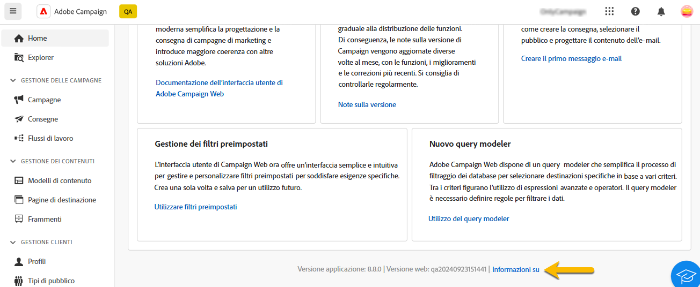
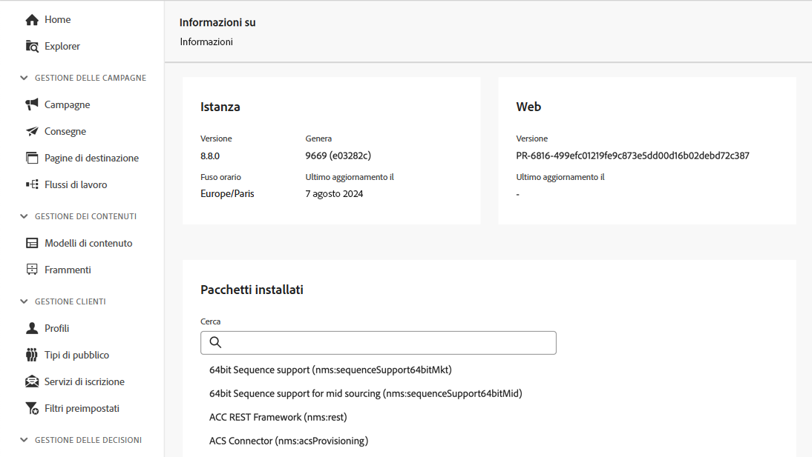

# Scoprire l’interfaccia {#user-interface}

La nuova interfaccia di Adobe Campaign Web offre un’esperienza utente moderna e intuitiva per semplificare la progettazione e la consegna delle campagne di marketing. Questa nuova interfaccia è integrata con le app e le soluzioni di Adobe Experience Cloud.

Consulta [questo articolo](connect-to-campaign.md) per informazioni su come connetterti ad Adobe Campaign e le nozioni di base della navigazione in Experience Cloud.

>[!NOTE]
>
>Questa documentazione viene spesso aggiornata con le recenti modifiche apportate all’interfaccia utente del prodotto. Tuttavia, alcune schermate possono risultare leggermente diverse dalla tua interfaccia utente.

## Pagina home di Campaign {#user-interface-home}

>[!CONTEXTUALHELP]
>id="acw_homepage_recent"
>title="Recenti"
>abstract="L’elenco **Recenti** fornisce collegamenti alle consegne create e modificate di recente. Questo elenco ne mostra il canale, lo stato, il proprietario, le date di creazione e modifica."

Dalla pagina Home di Campaign puoi sfogliare in modo facile e veloce risorse, indicatori e componenti chiave.

La sezione superiore della pagina Home mostra i dettagli sui più recenti aggiornamenti e sulle nuove funzionalità disponibili nel prodotto, con collegamenti alle note sulla versione e alla documentazione dettagliata. Utilizza la freccia sinistra per scorrere le schede delle funzioni.

{zoomable="yes"}

La sezione **Indicatori chiave di prestazioni** consente di verificare l’efficacia della piattaforma tramite i KPI più diffusi. Per ulteriori informazioni su questi KPI, consulta [questa pagina](../reporting/kpis.md).

L’elenco **Recenti** fornisce collegamenti alle consegne create e modificate di recente. Questo elenco ne mostra il canale, lo stato, il proprietario, e le date di creazione e modifica. Fai clic sul collegamento **Mostra altro** per caricare altre consegne.

Puoi anche accedere alle principali pagine della guida di Adobe Campaign Web dalla sezione **Apprendimento** della pagina.

### Collegamento Informazioni {#user-interface-about}

>[!CONTEXTUALHELP]
>id="acw_about"
>title="Pagina Informazioni"
>abstract="La pagina Informazioni fornisce dettagli sull’istanza di Adobe Campaign"

>[!CONTEXTUALHELP]
>id="acw_about_instance"
>title="Informazioni sull’istanza"
>abstract="La sezione Istanza fornisce informazioni chiave sul client della console, inclusi i relativi numeri di versione e di build"

>[!CONTEXTUALHELP]
>id="acw_about_web"
>title="Informazioni su Web"
>abstract="La sezione Web mostra la versione dell’interfaccia utente di Campaign Web, con l’eventuale data dell’ultimo aggiornamento."

>[!CONTEXTUALHELP]
>id="acw_about_packages"
>title="Informazioni su Pacchetti installati"
>abstract="Nella sezione Pacchetti installati sono elencati tutti i moduli, le funzioni e le integrazioni presenti nell’istanza."

Nella parte inferiore della pagina, il collegamento **[!UICONTROL Informazioni]** fornisce dettagli sull’istanza di Adobe Campaign. Tali dettagli sono in modalità di sola lettura.

{zoomable="yes"}

La sezione **Istanza** fornisce informazioni chiave sul client della console, inclusi i relativi numeri di **versione** e di **build**.

* La **versione** fa riferimento alla versione ufficiale in uso.
* La **build** fa riferimento a una specifica iterazione di tale versione.

I numeri di versione e di build sono fondamentali per la risoluzione dei problemi, in quanto aiutano a determinare quali funzioni e correzioni sono presenti nell’ambiente in uso.

Nella sezione **Web** viene visualizzata la versione dell’interfaccia utente di Campaign Web e, se applicabile, la data dell’ultimo aggiornamento. Questi dati consentono di tenere traccia delle modifiche o dei miglioramenti apportati all’interfaccia utente di Campaign Web.

Nella sezione **Pacchetti installati** sono elencati tutti i moduli, le funzioni e le integrazioni presenti nell’istanza. Questi pacchetti estendono le funzionalità di Adobe Campaign, abilitando attività specializzate come l’integrazione con altre soluzioni Adobe o il supporto di flussi di lavoro specifici. Dato il numero elevato di pacchetti, in questa sezione puoi eseguire una ricerca per verificare rapidamente se un particolare modulo è installato nella tua istanza.

{zoomable="yes"}

## Menu di navigazione a sinistra {#user-interface-left-nav}

Sfoglia i collegamenti a sinistra per accedere alle funzionalità di Adobe Campaign Web. Diversi collegamenti consentono di visualizzare elenchi di oggetti che possono essere ordinati e filtrati. Puoi anche configurare le colonne per visualizzare tutte le informazioni che ti servono. Consulta questa [sezione](#list-screens). Alcune schermate di elenco sono di sola lettura. Gli elementi visualizzati nel menu di navigazione a sinistra e negli elenchi dipendono dalle autorizzazioni utente. Ulteriori informazioni sulle autorizzazioni sono disponibili in [questa sezione](permissions.md).

### Explorer {#user-interface-explorer}

>[!CONTEXTUALHELP]
>id="acw_explorer"
>title="Explorer"
>abstract="Il menu **Explorer** mostra tutti i componenti e gli oggetti di Campaign con la stessa gerarchia di cartelle di quella presente nella console client. Sfoglia tutti i componenti, le cartelle e gli schemi di Campaign v8, controlla le autorizzazioni associate e crea cartelle e sottocartelle da questo menu."

Il menu **Explorer** mostra tutte le risorse e gli oggetti di Campaign con la stessa gerarchia di cartelle di quella presente nella console client. Sfoglia tutti i componenti, le cartelle e gli schemi di Campaign v8 e crea consegne, flussi di lavoro e campagne.

Gli elementi visualizzati in **Explorer** dipendono dalle autorizzazioni utente. Se disponi dei diritti appropriati, è possibile inoltre aggiungere cartelle e sottocartelle. Ulteriori informazioni sulle autorizzazioni sono disponibili in [questa sezione](permissions.md).

Puoi configurare le colonne per personalizzare la visualizzazione e visualizzare tutte le informazioni necessarie. Consulta questa [sezione](#list-screens). Puoi anche aggiungere cartelle e sottocartelle, come descritto in [questa sezione](permissions.md#folders).

Per ulteriori informazioni sulla funzione Explorer di Campaign, la gerarchia di cartelle e risorse, consulta questa [documentazione di Campaign v8 (console)](https://experienceleague.adobe.com/docs/campaign/campaign-v8/new/campaign-ui.html?lang=it#ac-explorer-ui){target="_blank"}.

### Gestione delle campagne {#user-interface-campaign-management}

Nella sezione **Gestione delle campagne**, puoi accedere a campagne di marketing, consegne e flussi di lavoro.

* **Campagne**: questo è l’elenco delle campagne e dei modelli di campagne. Per impostazione predefinita, per ogni campagna puoi visualizzare le date di inizio, fine, creazione, ultima modifica, lo stato corrente e il nome dell’operatore della campagna che l’ha creata. Puoi filtrare l’elenco per stato, date di inizio e di fine, cartella oppure creare un filtro avanzato per definire criteri di filtro personalizzati. Per ulteriori informazioni sulle campagne, consulta [questa sezione](../campaigns/gs-campaigns.md).

* **Consegne**: scorri l’elenco delle consegne. Per impostazione predefinita, puoi visualizzarne lo stato, la data dell’ultima modifica e i KPI chiave. Puoi filtrare l’elenco per stato, data di contatto o canale. Fai clic su una consegna e-mail per aprire la relativa dashboard e ottenere una panoramica dei dettagli della consegna. Le consegne su altri canali sono di sola lettura. Per ulteriori informazioni sulle consegne, consulta [questa sezione](../msg/gs-messages.md).

  Per eliminare o duplicare una consegna, utilizza il pulsante **Altre azioni**.

  {zoomable="yes"}{width="70%" align="left"} [Schermata che mostra il pulsante Altre azioni con opzioni per eliminare o duplicare una consegna.]

* **Flussi di lavoro**: in questa schermata, è possibile accedere all’elenco completo dei flussi di lavoro e dei modelli di flusso di lavoro. Puoi controllarne lo stato, le date dell’ultima/successiva esecuzione e creare un nuovo flusso di lavoro o un nuovo modello di flusso di lavoro. È possibile filtrare l’elenco con gli stessi criteri degli altri oggetti. Inoltre, puoi filtrare i flussi di lavoro che appartengono o meno a una campagna. Per ulteriori informazioni sui flussi di lavoro, consulta [questa sezione](../workflows/gs-workflows.md).

### Gestione dei contenuti {#user-interface-content-management}

Nella sezione **Gestione dei contenuti** puoi visualizzare i modelli e i frammenti di contenuto.

* **Modelli di contenuto**: per un processo di progettazione più rapido e migliore, puoi creare modelli autonomi che consentono di riutilizzare facilmente contenuti personalizzati in più campagne.[!DNL Adobe Campaign] Disponibile solo per le e-mail, questa funzionalità consente agli utenti orientati ai contenuti di lavorare su modelli autonomi in modo che gli addetti al marketing possano riutilizzarli e adattarli all’interno delle proprie campagne e-mail. Per ulteriori informazioni, consulta [questa sezione](../content/create-email-templates.md).

* **Frammenti**: un frammento è un componente riutilizzabile a cui è possibile fare riferimento in una o più consegne nelle campagne. Quando si modifica un frammento, viene aggiornato ogni contenuto che lo utilizza. [Scopri come utilizzare i frammenti](../content/fragments.md)

Questa funzionalità consente di precreare più blocchi di contenuto personalizzati che possono essere utilizzati dagli utenti di marketing per assemblare rapidamente i contenuti delle e-mail in un processo di progettazione migliorato.

### Gestione clienti {#user-interface-customer-management}

Nella sezione **Gestioine clienti**, puoi visualizzare i profili, i tipi di pubblico e le iscrizioni. Questi sono elenchi di sola lettura.

* **Profili**: crea e gestisci profili e accedi al database dei destinatari. Per impostazione predefinita, puoi visualizzarne l’indirizzo e-mail, il nome e il cognome. Per ulteriori informazioni sui profili, consulta [questa sezione](../audience/about-recipients.md).
* **Tipi di pubblico**: questo è l’elenco di tipi di pubblico. Per impostazione predefinita, puoi visualizzarne il tipo, l’origine, le date di creazione e ultima modifica e l’etichetta. È possibile filtrare l’elenco in base all’origine. Per ulteriori informazioni sui tipi di pubblico e gli elenchi, consulta [questa sezione](../audience/about-recipients.md).
* **Servizi di iscrizione**: sfoglia gli elenchi delle iscrizioni. Per impostazione predefinita, puoi visualizzarne il tipo, la modalità e l’etichetta. Scopri come gestire le iscrizioni e il relativo annullamento nella [documentazione di Campaign v8 (console)](https://experienceleague.adobe.com/docs/campaign/campaign-v8/campaigns/send/subscriptions.html?lang=it){target="_blank"}.
* **Filtri preimpostati**: i filtri preimpostati sono filtri personalizzati che vengono creati e salvati per essere disponibili per un utilizzo futuro. Possono essere utilizzati come scelte rapide durante qualsiasi operazione di filtro insieme al query modeler, ad esempio quando viene filtrato un elenco di dati o quando viene creato il pubblico di una consegna. Per ulteriori informazioni, consulta [questa sezione](predefined-filters.md).

### Gestione delle decisioni {#decision-management}

>[!CONTEXTUALHELP]
>id="acw_offers_list"
>title="Offerte"
>abstract="Sfoglia gli elenchi di offerte e modelli di offerta creati nella console utilizzando il modulo **Interazione**. Questi sono elenchi di sola lettura."
>additional-url="https://experienceleague.adobe.com/docs/campaign-web/v8/msg/offers.html?lang=it" text="Aggiungere offerte a una consegna"

Nella sezione **Gestione delle decisioni** puoi visualizzare le offerte e i modelli di offerta. Questi sono elenchi di sola lettura.

* **Offerte**: sfoglia l’elenco delle offerte e i modelli di offerta creati nella console utilizzando il modulo **Interazione**. Per impostazione predefinita, puoi visualizzarne lo stato, le date di inizio e di fine e l’ambiente. Puoi filtrare l’elenco per stato e per date di inizio e di fine. Sono disponibili anche modelli di offerta.

Per scoprire come creare e inviare offerte tramite e-mail e SMS consulta [questa sezione](../msg/offers.md).

### Reporting {#left-nav-reporting}

* **Rapporti**: la voce **Rapporto** offre un riepilogo complessivo consolidato del traffico e delle metriche di coinvolgimento per ciascun canale all’interno dell’ambiente di Campaign. Questi rapporti sono costituiti da vari widget, ciascuno dei quali offre una prospettiva distinta sulle prestazioni della campagna o della consegna. Per ulteriori informazioni, consulta [questa sezione](../reporting/global-reports.md).

### Amministrazione {#left-nav-admin}

* **Audit trail**: la voce **Audit trail** fornisce agli utenti piena visibilità di tutte le modifiche apportate a entità importanti all’interno dell’istanza; in genere si tratta delle modifiche che influiscono in modo significativo sul corretto funzionamento dell’istanza. [Ulteriori informazioni](../reporting/audit-trail.md).

* **Account esterni**: crea nuovi account esterni utilizzando l’interfaccia utente web per soddisfare esigenze specifiche e garantire trasferimenti di dati senza problemi. [Ulteriori informazioni](../administration/external-account.md).

* **Schemi**: i campi personalizzati sono ulteriori attributi aggiunti agli schemi preconfigurati tramite la console Adobe Campaign. [Ulteriori informazioni](../administration/custom-fields.md).

<!--* **Delivery Alerting** - Delivery Alerting is an alert management system that enables groups of users to automatically receive email notifications with information on their delivery executions. [Learn more](../msg/delivery-alerting.md).-->

## Ulteriori informazioni {#learn-more}

Scopri come sfogliare, cercare e filtrare gli elenchi disponibili nell’ambiente Campaign [in questa pagina](list-filters.md).