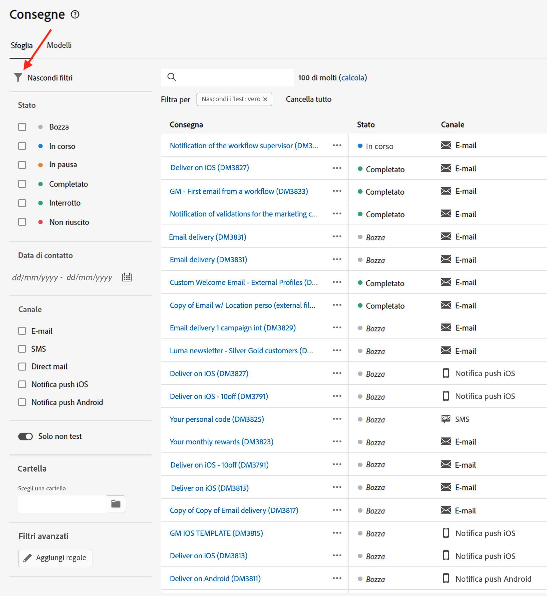
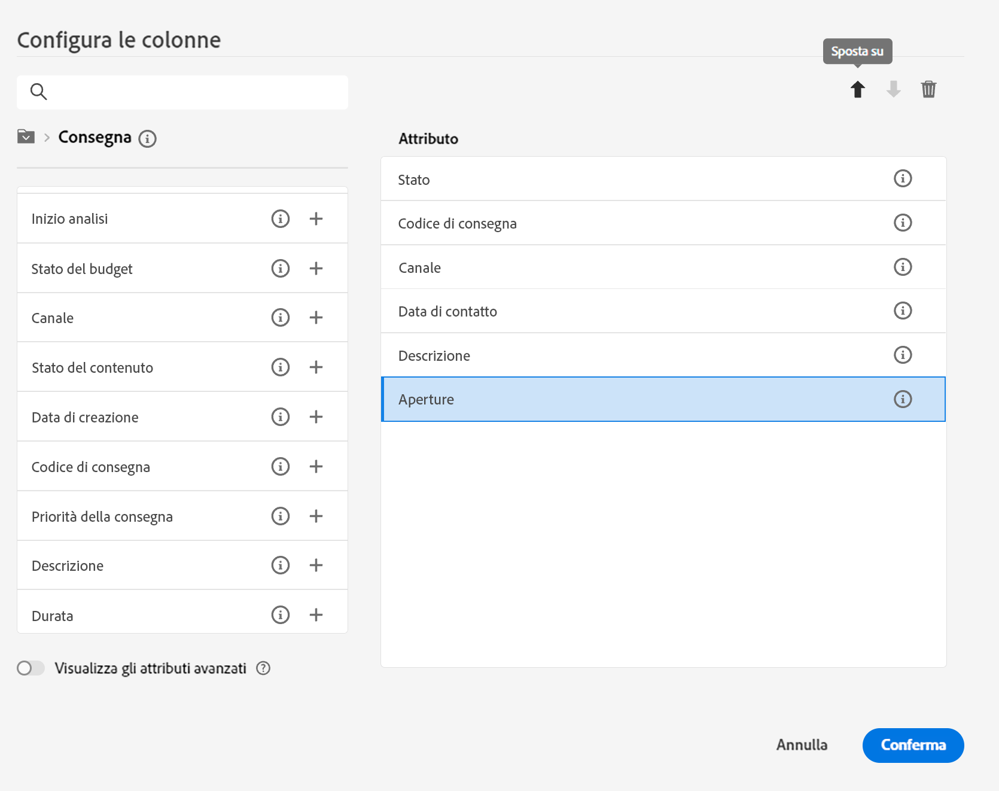
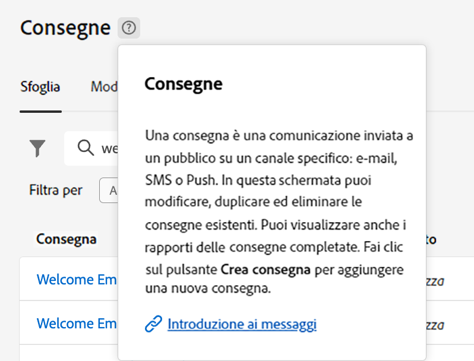
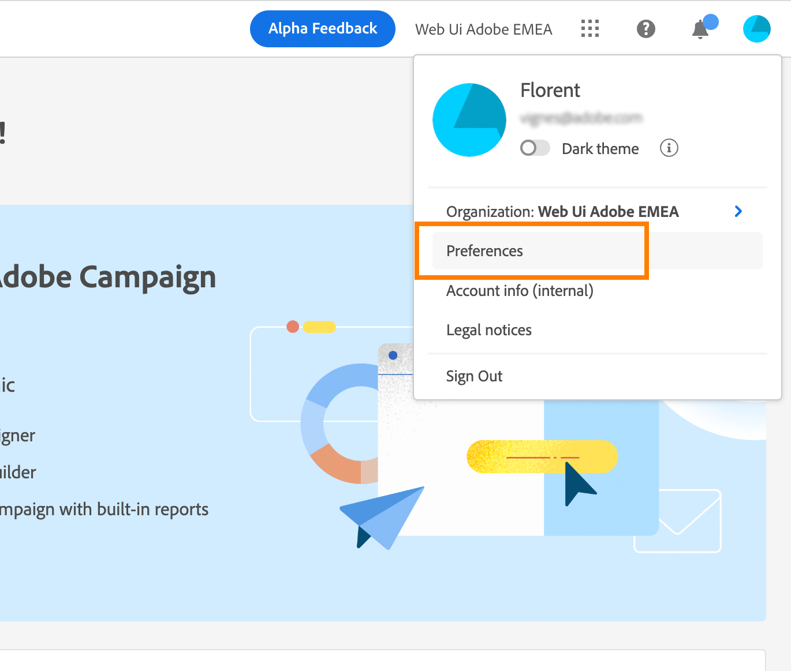

# Scopri l’interfaccia {#user-interface}

>[!CONTEXTUALHELP]
>id="acw_homepage_learnmore"
>title="Scopri l’interfaccia"
>abstract="La nuova interfaccia di Campaign Web v8 offre un’esperienza utente integrata, intuitiva e coerente."

La nuova interfaccia di Campaign Web v8 offre un’esperienza utente moderna e intuitiva per semplificare la progettazione e la consegna delle campagne di marketing. Questa nuova interfaccia è integrata con Adobe Experience Platform.

<!--
Key concepts when browsing the user interface are common with Adobe Experience Platform. Refer to [Adobe Experience Platform documentation](https://experienceleague.adobe.com/docs/experience-platform/landing/platform-ui/ui-guide.html#adobe-experience-platform-ui-guide) for more details.
-->

>[!NOTE]
>
>Questa documentazione viene spesso aggiornata per riflettere le recenti modifiche apportate all’interfaccia utente del prodotto. Tuttavia, alcune schermate possono risultare leggermente diverse dall’interfaccia utente che visualizzi.

<!--
* console + web interface (overview, why use each of them)
* web UI made up of read-only lists that can be configured, show how to add columns
-->

## Menu di navigazione a sinistra

Sfoglia i collegamenti a sinistra per accedere alle funzionalità di Campaign Web v8. Diversi collegamenti presentano elenchi di oggetti che possono essere ordinati e filtrati. Puoi anche configurare le colonne per visualizzare tutte le informazioni che ti servono. Consulta questa [sezione](#list-screens). Tutte le schermate di elenchi sono di sola lettura, ad eccezione dell’elenco delle consegne e-mail. Nella versione alfa, non è possibile fare clic su una voce dell’elenco per modificarla o visualizzarla. Tutti gli elenchi saranno modificabili in versioni future. Gli elementi visualizzati nel menu di navigazione a sinistra dipendono dalle autorizzazioni utente.

### Home

Questa schermata include collegamenti chiave e risorse che permettono di accedere rapidamente alle funzionalità principali di Campaign Web v8. L’elenco **Recenti** fornisce collegamenti alle consegne create e modificate di recente. Questo elenco ne mostra lo stato e le date di creazione e modifica.

<!--
* Banner
* KPIs on email channel (cross-deliveries): open rate, delivery rate, etc
* Recent items
* Learning cards
-->

Puoi accedere alle pagine della guida di Campaign Web v8 dalla sezione inferiore della pagina home.

<!--
show global KPIs, recent items + left menu to access features)
CONTROL PANEL not alpha
Global report not alpha
-->

### Explorer

>[!CONTEXTUALHELP]
>id="acw_explorer"
>title="Explorer"
>abstract="Il menu **Explorer** visualizza la stessa gerarchia di cartelle di quella presente nella console client. Sfoglia tutti i componenti, le cartelle e gli schemi di Campaign v8. Tutte le schermate di elenchi sono di sola lettura, ad eccezione dell’elenco delle consegne e-mail."

Il menu **Explorer** visualizza la stessa gerarchia di cartelle di quella presente nella console client. Sfoglia tutti i componenti, le cartelle e gli schemi di Campaign v8. Tutte le schermate di elenchi sono di sola lettura, ad eccezione dell’elenco delle consegne e-mail.

Gli elementi visualizzati in Explorer dipendono dalle autorizzazioni dell’utente.

Come in tutte le schermate di elenchi, puoi configurare le colonne per visualizzare le informazioni che ti servono. Consulta questa [sezione](#list-screens).

Per ulteriori informazioni sulla funzione Explorer di Campaign, consulta questa [documentazione](https://experienceleague.adobe.com/docs/campaign/campaign-v8/new/ac-ui/campaign-ui.html?lang=it#ac-explorer-ui){target="_blank"}.
<!--
Explorer' menu in web UI to navigate through console content: console navtree second view in addition to the left menu lists with filters. The Explorer gives the real folder hierarchy from the console. Make sure you find your deliveries in sub-folders. All lists can be accessed in read-only. No Create/Edit. You can configure lists (colums). All schema fields, linked tables are available. 

If you need to view your lists of recipients (age, gender), transactions or live transactional messages. To view each/edit -> console.

Navtree view depends on permissions (same as console).
-->

### Gestione delle campagne

>[!CONTEXTUALHELP]
>id="acw_campaigns_list"
>title="Campagne"
>abstract="Questo è l’elenco delle campagne. Puoi visualizzare informazioni utili, ad esempio le date di inizio, fine e ultima modifica e il relativo stato. È possibile filtrare l’elenco in base allo stato o alle date di inizio e fine. Sono disponibili anche i modelli delle campagne. Questi elenchi sono di sola lettura."

>[!CONTEXTUALHELP]
>id="acw_deliveries_list"
>title="Consegne"
>abstract="Scorri l’elenco delle consegne. Puoi visualizzarne lo stato, la data dell’ultima modifica e i KPI chiave. Puoi filtrare l’elenco per stato, data di contatto o canale. Fai clic su una consegna e-mail per aprire la relativa dashboard. Gli altri elementi sono di sola lettura. Sono disponibili anche i modelli di consegna."

* **Campagne**: questo è l’elenco delle campagne. Per impostazione predefinita, puoi visualizzarne le date di inizio, fine e ultima modifica e il relativo stato. È possibile filtrare l’elenco in base allo stato o alle date di inizio e fine. Sono disponibili anche i modelli delle campagne. Questi elenchi sono di sola lettura.

* **Consegne**: scorri l’elenco delle consegne. Per impostazione predefinita, puoi visualizzarne lo stato, la data dell’ultima modifica e i KPI chiave. Puoi filtrare l’elenco per stato, data di contatto o canale. Fai clic su una consegna e-mail per aprire la relativa dashboard e ottenere una panoramica dei dettagli della consegna. Le consegne su altri canali sono di sola lettura. I modelli di consegna sono disponibili anche in modalità di sola lettura. Puoi utilizzare la console Client per modificarli. Consulta questa [documentazione](https://experienceleague.adobe.com/docs/campaign/campaign-v8/campaigns/send/create-templates.html?lang=it){target="_blank"}.

   Per eliminare o duplicare una consegna, utilizza il pulsante **Altre azioni**.

   {width="70%" align="left"}

### Gestione clienti

>[!CONTEXTUALHELP]
>id="acw_recipients_list"
>title="Destinatari"
>abstract="Accedi al database dei destinatari. Puoi visualizzare informazioni utili quali indirizzo e-mail, nome e cognome. Questo elenco è di sola lettura."

>[!CONTEXTUALHELP]
>id="acw_audiences_list"
>title="Tipi di pubblico"
>abstract="Questo è l’elenco di tipi di pubblico. Puoi visualizzarne il tipo, l’origine, le date di creazione e ultima modifica e l’etichetta. È possibile filtrare l’elenco in base all’origine. Questo elenco è di sola lettura."

>[!CONTEXTUALHELP]
>id="acw_subscriptions_list"
>title="Elenchi di iscrizioni"
>abstract="Sfoglia gli elenchi di iscrizioni. Puoi visualizzarne il tipo, la modalità e l’etichetta. Questo elenco è di sola lettura."

* **Destinatari**: accedi al database dei destinatari. Per impostazione predefinita, puoi visualizzarne l’indirizzo e-mail, il nome e il cognome. Questo elenco è di sola lettura.
* **Tipi di pubblico**: questo è l’elenco di tipi di pubblico. Per impostazione predefinita, puoi visualizzarne il tipo, l’origine, le date di creazione e ultima modifica e l’etichetta. È possibile filtrare l’elenco in base all’origine. Questo elenco è di sola lettura.
* **Elenchi di iscrizioni**: sfoglia gli elenchi delle iscrizioni. Per impostazione predefinita, puoi visualizzarne il tipo, la modalità e l’etichetta. Questo elenco è di sola lettura.
* **Flussi di lavoro di targeting**: accedi all’elenco dei flussi di lavoro di Campaign. Per impostazione predefinita, è possibile visualizzarne lo stato, le date dell’ultima e della prossima elaborazione e l’ambiente. Puoi filtrare l’elenco per stato, data dell’ultima elaborazione e tipo di flusso di lavoro. Sono disponibili anche i modelli di flusso di lavoro. Questi elenchi sono di sola lettura.

### Gestione delle decisioni

>[!CONTEXTUALHELP]
>id="acw_offers_list"
>title="Offerte"
>abstract="Scorri l’elenco delle offerte di interazione. Per impostazione predefinita, puoi visualizzarne lo stato, le date di inizio e fine e l’ambiente. Puoi filtrare l’elenco per stato e per date di inizio e fine. Sono disponibili anche modelli di offerta. Questi elenchi sono di sola lettura."

* **Offerte**: scorri l’elenco delle offerte di interazione. Per impostazione predefinita, puoi visualizzarne lo stato, le date di inizio e fine e l’ambiente. Puoi filtrare l’elenco per stato e per date di inizio e fine. Sono disponibili anche modelli di offerta. Questi elenchi sono di sola lettura.

## Barra superiore

La barra superiore dell’interfaccia consente di eseguire le seguenti operazioni:

* Condividere un feedback come tester della versione alfa
* Passare a un’altra organizzazione e ad altre istanze
* Passare a un’altra applicazione Adobe Experience Cloud
* Accedere alle pagine della guida, contattare il supporto e inviare feedback. Puoi usare il campo di ricerca per cercare un argomento negli articoli e video della guida.

{width="70%" align="left"}
<!--
Org / Sub-org switcher to switch between instances. Only one for Alpha. Later: intermerdiate screen with Control Panel (beta). if v8 + ACS with one card per ACS instance. Maybe quickly explain the menu for Alpha?
-->

## Configurare le schermate degli elenchi {#list-screens}

Diversi collegamenti disponibili nel menu di navigazione a sinistra, ad esempio **Consegne** o **Campagne**, visualizzano elenchi di oggetti. Queste schermate di elenchi sono di sola lettura, ad eccezione dell’elenco delle consegne e-mail.

Per trovare gli elementi più rapidamente, puoi utilizzare la barra di ricerca o filtrare l’elenco in base a criteri contestuali.

{width="70%" align="left"}

Gli elenchi vengono visualizzati in colonne. Per visualizzare ulteriori informazioni puoi modificare la configurazione delle colonne. A questo scopo, fai clic sull’icona in alto a destra dell’elenco. È possibile aggiungere o rimuovere colonne e modificare l’ordine in cui vengono visualizzate.

{width="70%" align="left"}

Per ordinare gli elementi dell’elenco, fai clic sulla relativa intestazione di colonna. Viene visualizzata una freccia (su o giù) che indica che l’elenco è ordinato per quella colonna. Per le colonne numeriche o di data, la freccia su indica che l’elenco è ordinato in ordine crescente, mentre la freccia giù indica un ordine decrescente. Per le colonne con valori stringa o alfanumerici, i valori sono elencati in ordine alfabetico.

## Aiuto contestuale e guida all’onboarding

Nell’interfaccia è disponibile una guida contestuale. Se è disponibile, fai clic sull’icona **?** per visualizzare informazioni tratte dalla guida e relativi collegamenti.

{width="70%" align="left"}

È inoltre disponibile una guida all’onboarding per aiutarti a iniziare a utilizzare con Campaign Web v8. Fai clic sull’icona in basso a destra, scegli uno degli scenari dettagliati disponibili e segui semplicemente le istruzioni.

{width="70%" align="left"}

## Browser supportati {#browsers}

Campaign Web v8 è progettato per funzionare in modo ottimale nell’ultima versione di Google Chrome, Safari e Microsoft Edge. È possibile che si verifichino problemi durante l’utilizzo di alcune funzioni nelle versioni precedenti o in altri browser.

## Preferenze della lingua {#language-pref}

Al momento, Campaign v8 Web è disponibile nelle seguenti lingue:

<table>
<tr>
<td>

Inglese (US) - EN-US

Francese - FR

Tedesco - DE

Italiano - IT

</td>
<td>

Spagnolo - ES

Portoghese (brasiliano) - PTBR

Giapponese - JP

</td>
<td>

Coreano - KR

Cinese semplificato - CHS

Cinese tradizionale - CHT

</td>
</tr>
</table>

La lingua predefinita dell’interfaccia è determinata dalla lingua preferita specificata nel profilo utente.

Per cambiare la lingua:

1. Fai clic sull’icona del tuo profilo, in alto a destra, quindi seleziona **Preferenze**.

   {width="70%" align="left"}

1. Quindi fai clic sulla lingua visualizzata sotto il tuo indirizzo e-mail.

   

1. Seleziona la lingua preferita e fai clic su **Salva**. È possibile selezionare una seconda lingua nel caso in cui il componente utilizzato non sia localizzato nella prima lingua.

   

<!--
## Supported browsers {#browsers}

Adobe Campaign interface is designed to work optimally in the latest version of Google Chrome. You might have trouble using certain features on older versions or other browsers.
-->

<!--
######## This part stores the contextualHelp definition for WebUI BETA ###########
######## These blocks should be dispatched in the appropriate pages when available ###########
######## PLEASE DO NOT DELETE ###########
REFER TO 
https://wiki.corp.adobe.com/display/neolane/v8+WebUI+Contextual+Help+%3CALPHA%3E-+Official+list
-->

>[!CONTEXTUALHELP]
>id="acw_sms_report_overview"
>title="Riepilogo del rapporto SMS"
>abstract="TBD"

>[!CONTEXTUALHELP]
>id="acw_push_report_overview"
>title="Riepilogo del rapporto push"
>abstract="TBD"

>[!CONTEXTUALHELP]
>id="acw_push_notification_template"
>title="Modello di notifica push"
>abstract="TBD"

>[!CONTEXTUALHELP]
>id="acw_campaign_creation_properties"
>title="Proprietà di creazione della campagna"
>abstract="TBD"

>[!CONTEXTUALHELP]
>id="acw_campaign_creation_schedule"
>title="Pianificazione della creazione della campagna"
>abstract="TBD"

>[!CONTEXTUALHELP]
>id="acw_rulebuilder_properties_advanced"
>title="Attributi avanzati del generatore di regole"
>abstract="TBD"

>[!CONTEXTUALHELP]
>id="acw_deliveries_email_metrics_sent"
>title="Metriche inviate"
>abstract="TBD"

>[!CONTEXTUALHELP]
>id="acw_deliveries_email_metrics_errors"
>title="Errori metriche"
>abstract="TBD"

>[!CONTEXTUALHELP]
>id="acw_deliveries_push_android_content"
>title="Contenuto push per Android"
>abstract="TBD"

>[!CONTEXTUALHELP]
>id="acw_deliveries_push_ios_content"
>title="Contenuto push per iOS"
>abstract="TBD"

>[!CONTEXTUALHELP]
>id="acw_deliveries_sms_content"
>title="Contenuto SMS"
>abstract="TBD"

>[!CONTEXTUALHELP]
>id="acw_sms_preview_option_app_target"
>title="Abbonati all’app"
>abstract="TBD"

>[!CONTEXTUALHELP]
>id="acw_email_preview_option_test_target"
>title="Popolazione di test"
>abstract="TBD"

>[!CONTEXTUALHELP]
>id="acw_email_preview_mode"
>title="Modalità anteprima"
>abstract="TBD"

>[!CONTEXTUALHELP]
>id="acw_targetdata_personalization_enrichmentdata"
>title="Dati di arricchimento"
>abstract="TBD"

>[!CONTEXTUALHELP]
>id="acw_targetdata_personalization_dashboard"
>title="Personalizzazione"
>abstract="TBD"

>[!CONTEXTUALHELP]
>id="acw_audience_fromfile_select"
>title="Selezione file"
>abstract="TBD"

>[!CONTEXTUALHELP]
>id="acw_audience_fromfile_columns"
>title="Definizione colonne"
>abstract="TBD"

>[!CONTEXTUALHELP]
>id="acw_audience_fromfile_formatting"
>title="Formattazione dei parametri"
>abstract="TBD"

>[!CONTEXTUALHELP]
>id="acw_campaign_reporting_sending"
>title="Invio reportistica"
>abstract="TBD"

>[!CONTEXTUALHELP]
>id="acw_campaign_reporting_tracking"
>title="Tracciamento reportistica"
>abstract="TBD"

>[!CONTEXTUALHELP]
>id="acw_campaign_reporting_deliveries_overview"
>title="Panoramica sulla reportistica"
>abstract="TBD"

>[!CONTEXTUALHELP]
>id="acw_campaign_reporting_deliveries_target"
>title="Reportistica statistiche di destinazione"
>abstract="TBD"

>[!CONTEXTUALHELP]
>id="acw_campaign_reporting_deliveries_selection"
>title="Reportistica della selezione aggregata di una consegna"
>abstract="TBD"

>[!CONTEXTUALHELP]
>id="acw_campaign_properties"
>title="Proprietà campagna"
>abstract="TBD"

>[!CONTEXTUALHELP]
>id="acw_campaign_creation_workflow"
>title="Elenco flussi di lavoro"
>abstract="TBD"

>[!CONTEXTUALHELP]
>id="acw_orchestration_deduplication_fields"
>title="Campi di deduplicazione"
>abstract="TBD"

>[!CONTEXTUALHELP]
>id="acw_orchestration_deduplication_settings"
>title="Impostazioni di deduplicazione"
>abstract="TBD"

>[!CONTEXTUALHELP]
>id="acw_orchestration_deduplication_complement"
>title="Complemento di deduplicazione"
>abstract="TBD"

>[!CONTEXTUALHELP]
>id="acw_orchestration_dimension_complement"
>title="Complemento di dimensione"
>abstract="TBD"

>[!CONTEXTUALHELP]
>id="acw_push_permission_for_segment"
>title="Autorizzazione necessaria"
>abstract="TBD"

>[!CONTEXTUALHELP]
>id="acw_push_overview_edit"
>title="Autorizzazione necessaria"
>abstract="TBD"

>[!CONTEXTUALHELP]
>id="acw_attributepicker_advancedfields"
>title="Campi avanzati del selettore attributi"
>abstract="TBD"

>[!CONTEXTUALHELP]
>id="acw_rulebuilder_advancedfields"
>title="Campi avanzati del generatore di regole"
>abstract="TBD"

>[!CONTEXTUALHELP]
>id="acw_deliveries_sms_properties"
>title="Proprietà di consegna SMS"
>abstract="TBD"

>[!CONTEXTUALHELP]
>id="acw_deliveries_push_properties"
>title="Proprietà di consegna push"
>abstract="TBD"

>[!CONTEXTUALHELP]
>id="acw_deliveries_metrics_newquarantines"
>title="Nuova metrica di quarantena"
>abstract="TBD"

