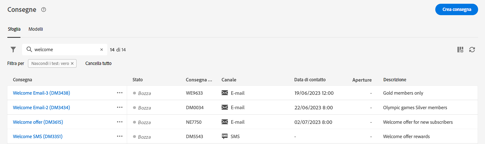

# Scopri l’interfaccia {#user-interface}

>[!CONTEXTUALHELP]
>id="acw_homepage_learnmore"
>title="Scopri l’interfaccia"
>abstract="La nuova interfaccia web di Campaign v8 offre un’esperienza utente integrata, intuitiva e coerente."

La nuova interfaccia di Campaign Web v8 offre un’esperienza utente moderna e intuitiva per semplificare la progettazione e la consegna delle campagne di marketing. Questa nuova interfaccia è integrata con Adobe Experience Platform.

>[!NOTE]
>
>Questa documentazione viene spesso aggiornata per riflettere le recenti modifiche apportate all’interfaccia utente del prodotto. Tuttavia, alcune schermate possono risultare leggermente diverse dall’interfaccia utente che visualizzi.

## Menu di navigazione a sinistra {#user-interface-left-nav}

Sfoglia i collegamenti a sinistra per accedere alle funzionalità di Campaign Web v8. Diversi collegamenti presentano elenchi di oggetti che possono essere ordinati e filtrati. Puoi anche configurare le colonne per visualizzare tutte le informazioni che ti servono. Consulta questa [sezione](#list-screens). Tutte le schermate di elenchi sono di sola lettura, ad eccezione dell’elenco delle consegne e-mail. Nella versione alfa, non è possibile fare clic su una voce dell’elenco per modificarla o visualizzarla. Tutti gli elenchi saranno modificabili in versioni future. Gli elementi visualizzati nel menu di navigazione a sinistra dipendono dalle autorizzazioni utente.

### Home {#user-interface-home}

Questa schermata include collegamenti chiave e risorse che permettono di accedere rapidamente alle funzionalità principali di Campaign Web v8.

L’elenco **Recenti** fornisce collegamenti alle consegne create e modificate di recente. Questo elenco mostra il canale, lo stato, il proprietario, le date di creazione e modifica.

Accedi alle pagine della guida della chiave web di Campaign v8 da **Apprendimento** sezione della home page.

### Explorer {#user-interface-explorer}

>[!CONTEXTUALHELP]
>id="acw_explorer"
>title="Explorer"
>abstract="Il **Esplora** Il menu mostra tutti i componenti e gli oggetti di Campaign con la stessa gerarchia di cartelle di quella nella console client. Sfoglia tutti i componenti, le cartelle e gli schemi di Campaign v8 e crea consegne, flussi di lavoro e campagne. Tutti gli altri elenchi sono di sola lettura."

Il **Esplora** Il menu visualizza tutte le risorse e gli oggetti di Campaign con la stessa gerarchia di cartelle di quella nella console client. Sfoglia tutti i componenti, le cartelle e gli schemi di Campaign v8 e crea consegne, flussi di lavoro e campagne. Tutti gli altri elenchi sono di sola lettura.

Gli elementi visualizzati in Explorer dipendono dalle autorizzazioni dell’utente.

Come in tutte le schermate di elenchi, puoi configurare le colonne per visualizzare le informazioni che ti servono. Consulta questa [sezione](#list-screens).

Per ulteriori informazioni su Esplora campagne, Gerarchia di cartelle e risorse, consulta questa [Documentazione di Campaign v8 (console)](https://experienceleague.adobe.com/docs/campaign/campaign-v8/new/campaign-ui.html?lang=it#ac-explorer-ui){target="_blank"}.

### Gestione delle campagne {#user-interface-campaign-management}

>[!CONTEXTUALHELP]
>id="acw_campaigns_list"
>title="Campagne"
>abstract="Questo è l’elenco delle campagne. Puoi visualizzare informazioni utili, ad esempio le date di inizio, fine e ultima modifica e il relativo stato. È possibile filtrare l’elenco in base allo stato o alle date di inizio e fine. Fai clic sul pulsante “Crea campagna” per aggiungere una nuova campagna. Seleziona una campagna per visualizzarne il contenuto, le consegne e i dettagli. Passa alla scheda “Modelli” per visualizzare e creare i modelli."

>[!CONTEXTUALHELP]
>id="acw_deliveries_list"
>title="Consegne"
>abstract="Scorri l’elenco delle consegne. Puoi visualizzarne lo stato, le date di contatto e di modifica e i KPI chiave. Puoi filtrare l’elenco per stato, data di contatto o canale. Fai clic sul pulsante “Crea consegna” per aggiungere una nuova consegna. Seleziona una consegna per visualizzarne il contenuto, il pubblico e i dettagli."

Nella sezione CAMPAIGN MANAGEMENT puoi accedere a campagne di marketing, consegne e flussi di lavoro.

* **Campagne**: questo è l’elenco delle campagne e dei modelli di campagna. Per impostazione predefinita, per ogni campagna puoi visualizzare le date di inizio/fine/creazione/ultima modifica, lo stato corrente e il nome dell’operatore della campagna che l’ha creata. Puoi filtrare l’elenco per stato, date di inizio/fine, cartella oppure creare un filtro avanzato per definire criteri di filtro personalizzati. Per ulteriori informazioni sulle campagne, consulta [questa sezione](../campaigns/gs-campaigns.md).

* **Consegne**: scorri l’elenco delle consegne. Per impostazione predefinita, puoi visualizzarne lo stato, la data dell’ultima modifica e i KPI chiave. Puoi filtrare l’elenco per stato, data di contatto o canale. Fai clic su una consegna e-mail per aprire la relativa dashboard e ottenere una panoramica dei dettagli della consegna. Le consegne su altri canali sono di sola lettura. Per ulteriori informazioni sulle consegne, consulta [questa sezione](../msg/gs-messages.md).

  Per eliminare o duplicare una consegna, utilizza il pulsante **Altre azioni**.

  {width="70%" align="left"}

* **Flussi di lavoro**: in questa schermata, è possibile accedere all’elenco completo dei flussi di lavoro e dei modelli di flusso di lavoro. Puoi controllarne lo stato, le date dell’ultima/successiva esecuzione e creare un nuovo flusso di lavoro o un nuovo modello di flusso di lavoro. È possibile filtrare l’elenco con gli stessi criteri degli altri oggetti. Inoltre, puoi filtrare i flussi di lavoro che appartengono o meno a una campagna. Per ulteriori informazioni sui flussi di lavoro, consulta [questa sezione](../workflows/gs-workflows.md).

### Gestione clienti {#user-interface-customer-management}

>[!CONTEXTUALHELP]
>id="acw_recipients_list"
>title="Destinatari"
>abstract="Accedi al database dei destinatari. Puoi visualizzare informazioni utili quali indirizzo e-mail, nome e cognome. Questo elenco è di sola lettura."

>[!CONTEXTUALHELP]
>id="acw_audiences_list"
>title="Tipi di pubblico"
>abstract="Questo è l’elenco di tipi di pubblico. Puoi visualizzarne il tipo, l’origine, le date di creazione e ultima modifica e l’etichetta. È possibile filtrare l’elenco in base all’origine. Questo elenco è di sola lettura."

>[!CONTEXTUALHELP]
>id="acw_subscriptions_list"
>title="Elenchi di iscrizioni"
>abstract="Sfoglia gli elenchi di iscrizioni. Puoi visualizzarne il tipo, la modalità e l’etichetta. Questo elenco è di sola lettura."

Nella sezione GESTIONE CLIENTI puoi visualizzare destinatari, tipi di pubblico e abbonamenti. Questi elenchi sono di sola lettura.

* **Destinatari**: accedi al database dei destinatari. Per impostazione predefinita, puoi visualizzarne l’indirizzo e-mail, il nome e il cognome. Ulteriori informazioni sui destinatari in [Documentazione di Adobe Campaign v8 (console)](https://experienceleague.adobe.com/docs/campaign/campaign-v8/audience/gs-audiences.html){target="_blank"}.
* **Tipi di pubblico**: questo è l’elenco di tipi di pubblico. Per impostazione predefinita, puoi visualizzarne il tipo, l’origine, le date di creazione e ultima modifica e l’etichetta. È possibile filtrare l’elenco in base all’origine. Ulteriori informazioni su tipi di pubblico ed elenchi in [Documentazione di Adobe Campaign v8 (console)](https://experienceleague.adobe.com/docs/campaign/campaign-v8/audience/create-audiences/create-audiences.html){target="_blank"}.
* **Iscrizioni** - Sfogliare gli elenchi degli abbonamenti. Per impostazione predefinita, puoi visualizzarne il tipo, la modalità e l’etichetta. Scopri come gestire gli abbonamenti e il loro annullamento in [Documentazione di Adobe Campaign v8 (console)](https://experienceleague.adobe.com/docs/campaign/campaign-v8/campaigns/send/subscriptions.html){target="_blank"}.

### Gestione delle decisioni

>[!CONTEXTUALHELP]
>id="acw_offers_list"
>title="Offerte"
>abstract="Scorri l’elenco delle offerte di interazione. Per impostazione predefinita, puoi visualizzarne lo stato, le date di inizio e fine e l’ambiente. Puoi filtrare l’elenco per stato e per date di inizio e fine. Sono disponibili anche modelli di offerta. Questi elenchi sono di sola lettura."

* **Offerte**: scorri l’elenco delle offerte di interazione. Per impostazione predefinita, puoi visualizzarne lo stato, le date di inizio e fine e l’ambiente. Puoi filtrare l’elenco per stato e per date di inizio e fine. Sono disponibili anche modelli di offerta. Questi elenchi sono di sola lettura.

Scopri come creare e gestire le offerte in [Documentazione di Adobe Campaign v8 (console)](https://experienceleague.adobe.com/docs/campaign/campaign-v8/offers/interaction.html?lang=it){target="_blank"}.

## Barra superiore

Utilizza la barra superiore dell’interfaccia per:

* Condividere un feedback come tester della versione alfa
* Passare a un’altra organizzazione e ad altre istanze
* Passare a un’altra applicazione Adobe Experience Cloud
* Accedere alle pagine della guida, contattare il supporto e inviare feedback. Puoi usare il campo di ricerca per cercare un argomento negli articoli e video della guida.

{width="70%" align="left"}
<!--
Org / Sub-org switcher to switch between instances. Only one for Alpha. Later: intermerdiate screen with Control Panel (beta). if v8 + ACS with one card per ACS instance. Maybe quickly explain the menu for Alpha?
-->

## Sfoglia e filtra gli elenchi {#list-screens}

La maggior parte dei collegamenti del menu di navigazione a sinistra visualizza elenchi di oggetti, ad esempio l&#39;elenco di **Consegne** o **Campagne**. Alcune di queste schermate di elenco sono di sola lettura. È possibile personalizzare la visualizzazione degli elenchi e filtrarli, come descritto di seguito.

Per rimuovere un filtro, fare clic su **Cancella tutto** pulsante.

### Personalizzare le schermate dell’elenco {#custom-lists}

Gli elenchi vengono visualizzati in colonne. Per visualizzare ulteriori informazioni puoi modificare la configurazione delle colonne. A questo scopo, fai clic su **Configurare una colonna per un layout personalizzato** nell’angolo in alto a destra dell’elenco.

{width="70%" align="left"}

In **Configurare le colonne** , aggiungere o rimuovere colonne e modificare l&#39;ordine di visualizzazione.

Ad esempio, per queste impostazioni:

{width="70%" align="left"}

L’elenco mostra le colonne seguenti:

{width="70%" align="left"}

Utilizza il **Visualizzare attributi avanzati** per visualizzare tutti gli attributi dell&#39;elenco corrente. [Ulteriori informazioni](#adv-attributes)

### Ordinare i dati {#sort-lists}

Puoi anche ordinare gli elementi nell’elenco facendo clic su un’intestazione di colonna qualsiasi. Viene visualizzata una freccia (su o giù) che indica che l’elenco è ordinato per quella colonna.

Per le colonne numeriche o di data, **Su** freccia indica che l&#39;elenco è ordinato in ordine crescente mentre **Giù** freccia indica un ordine decrescente. Per le colonne con valori stringa o alfanumerici, i valori sono elencati in ordine alfabetico.

### Filtri integrati {#list-built-in-filters}

Per trovare gli elementi più rapidamente, puoi utilizzare la barra di ricerca o filtrare l’elenco in base a criteri contestuali.

{width="70%" align="left"}

Ad esempio, puoi filtrare le consegne in base al loro stato, canale, data di contatto o cartella. È inoltre possibile nascondere i test.

### Filtri personalizzati{#list-custom-filters}

Per creare filtri personalizzati sui dati, passa alla parte inferiore dei filtri e fai clic sul pulsante **Aggiungi regole** pulsante.

Trascina e rilascia gli attributi per creare i criteri di filtro nel **Filtri avanzati** schermo.

{width="70%" align="left"}

Utilizza il **Visualizzare attributi avanzati** per visualizzare tutti gli attributi dell&#39;elenco corrente. [Ulteriori informazioni](#adv-attributes)

### Usa attributi avanzati {#adv-attributes}

>[!CONTEXTUALHELP]
>id="acw_attributepicker_advancedfields"
>title="Visualizza gli attributi avanzati"
>abstract="Per impostazione predefinita, nell&#39;elenco degli attributi vengono visualizzati solo gli attributi più comuni. Utilizza questo interruttore per creare un filtro con attributi avanzati."

Solo gli attributi più comuni vengono visualizzati per impostazione predefinita nelle schermate elenco attributi e configurazione filtro.

Utilizza il **Visualizzare attributi avanzati** attiva per visualizzare tutti gli attributi disponibili per l&#39;elenco corrente.

## Aiuto contestuale {#contextual-help}

Nell’interfaccia è disponibile una guida contestuale. Quando disponibile, fai clic su `?` per visualizzare le informazioni della guida e i relativi collegamenti alla documentazione.

{width="70%" align="left"}

<!--An on-boarding guide is also available to help you get started with Campaign v8 Web. Click the icon in the bottom right corner, choose one of the available step-by-step scenarios, and simply follow the instructions.

{width="70%" align="left"}-->

## Browser supportati {#browsers}

Campaign Web v8 è progettato per funzionare in modo ottimale nell’ultima versione di Google Chrome, Safari e Microsoft Edge. È possibile che si verifichino problemi durante l’utilizzo di alcune funzioni nelle versioni precedenti o in altri browser.

## Preferenze della lingua {#language-pref}

Al momento, Campaign v8 Web è disponibile nelle seguenti lingue:

<table>
<tr>
<td>

Inglese (US) - EN-US

Francese - FR

Tedesco - DE

Italiano - IT

</td>
<td>

Spagnolo - ES

Portoghese (brasiliano) - PTBR

Giapponese - JP

</td>
<td>

Coreano - KR

Cinese semplificato - CHS

Cinese tradizionale - CHT

</td>
</tr>
</table>

La lingua predefinita dell’interfaccia è determinata dalla lingua preferita specificata nel profilo utente.

Per cambiare la lingua:

1. Fai clic sull’icona del tuo profilo, in alto a destra, quindi seleziona **Preferenze**.
1. Fai clic sul collegamento della lingua visualizzato sotto il tuo indirizzo e-mail.
1. Seleziona la lingua preferita e fai clic su **Salva**. È possibile selezionare una seconda lingua nel caso in cui il componente utilizzato non sia localizzato nella prima lingua.

<!--
######## This part stores the contextualHelp definition for WebUI BETA ###########
######## These blocks should be dispatched in the appropriate pages when available ###########
######## PLEASE DO NOT DELETE ###########
REFER TO 
https://wiki.corp.adobe.com/pages/viewpage.action?spaceKey=neolane&title=v8+WebUI+Contextual+Help+%3CALPHA%3E-+Official+list
-->

>[!CONTEXTUALHELP]
>id="acw_rulebuilder_advancedfields"
>title="Campi avanzati del generatore di regole"
>abstract="Configura le colonne con campi avanzati."

>[!CONTEXTUALHELP]
>id="acw_rulebuilder_properties_advanced"
>title="Attributi avanzati del generatore di regole"
>abstract="Utilizza gli attributi avanzati per definire la regola."

>[!CONTEXTUALHELP]
>id="acw_deliveries_email_metrics_sent"
>title="Metriche di invio"
>abstract="Numero di e-mail consegnate."

>[!CONTEXTUALHELP]
>id="acw_deliveries_email_metrics_errors"
>title="Metriche di errori"
>abstract="Numero di e-mail con lo stato di errore."

>[!CONTEXTUALHELP]
>id="acw_email_preview_option_test_target"
>title="Popolazione di test"
>abstract="Seleziona una modalità per la popolazione di test."

>[!CONTEXTUALHELP]
>id="acw_email_preview_mode"
>title="Modalità anteprima"
>abstract="Visualizza l’anteprima e verifica il messaggio includendo la popolazione di test nel target principale."

>[!CONTEXTUALHELP]
>id="acw_targetdata_personalization_enrichmentdata"
>title="Dati di arricchimento"
>abstract="TBD"

>[!CONTEXTUALHELP]
>id="acw_targetdata_personalization_dashboard"
>title="Personalizzazione"
>abstract="TBD"

>[!CONTEXTUALHELP]
>id="acw_campaign_reporting_sending"
>title="Invio reportistica"
>abstract="Consulta gli indicatori di invio per la reportistica della campagna."

>[!CONTEXTUALHELP]
>id="acw_campaign_reporting_tracking"
>title="Tracciamento reportistica"
>abstract="Consulta gli indicatori di tracciamento per la reportistica della campagna."

>[!CONTEXTUALHELP]
>id="acw_campaign_reporting_deliveries_overview"
>title="Panoramica sulla reportistica"
>abstract="Metriche chiave per la consegna."

>[!CONTEXTUALHELP]
>id="acw_campaign_reporting_deliveries_target"
>title="Reportistica statistiche di destinazione"
>abstract="Questa sezione mostra metriche specifiche in base ai tipi di pubblico."

>[!CONTEXTUALHELP]
>id="acw_campaign_reporting_deliveries_selection"
>title="Reportistica aggregata per le consegne"
>abstract="Seleziona almeno due consegne per visualizzare un rapporto di dati aggregati."

>[!CONTEXTUALHELP]
>id="acw_orchestration_deduplication_fields"
>title="Campi di deduplicazione"
>abstract="TBD"

>[!CONTEXTUALHELP]
>id="acw_orchestration_deduplication_settings"
>title="Impostazioni di deduplicazione"
>abstract="TBD"

>[!CONTEXTUALHELP]
>id="acw_orchestration_deduplication_complement"
>title="Complemento di deduplicazione"
>abstract="TBD"

>[!CONTEXTUALHELP]
>id="acw_orchestration_dimension_complement"
>title="Complemento di dimensione"
>abstract="TBD"

>[!CONTEXTUALHELP]
>id="acw_push_permission_for_segment"
>title="Autorizzazione necessaria"
>abstract="Prima di poter creare un segmento, l’amministratore deve concederti l’autorizzazione."

>[!CONTEXTUALHELP]
>id="acw_push_overview_edit"
>title="Autorizzazione necessaria"
>abstract="Prima di poter creare un segmento, l’amministratore deve concederti l’autorizzazione."

>[!CONTEXTUALHELP]
>id="acw_deliveries_metrics_newquarantines"
>title="Nuova metrica di quarantena"
>abstract="Nuova metrica di quarantena."

>[!CONTEXTUALHELP]
>id="acw_keyindicators_delivered"
>title="Consegnati"
>abstract="KPI consegnato"

>[!CONTEXTUALHELP]
>id="acw_keyindicators_opens"
>title="Aperture"
>abstract="Apre KPI"

>[!CONTEXTUALHELP]
>id="acw_keyindicators_clicks"
>title="Clic"
>abstract="KPI clic"

>[!CONTEXTUALHELP]
>id="acw_keyindicators_unsubscriptions"
>title="Abbonamenti annullati"
>abstract="Indicatore prestazioni chiave per annullamento sottoscrizioni"

>[!CONTEXTUALHELP]
>id="acw_keyindicators_spam"
>title="Spam"
>abstract="KPI spam"

>[!CONTEXTUALHELP]
>id="acw_keyindicators_errors"
>title="Errori"
>abstract="Indicatore prestazioni chiave errori"
