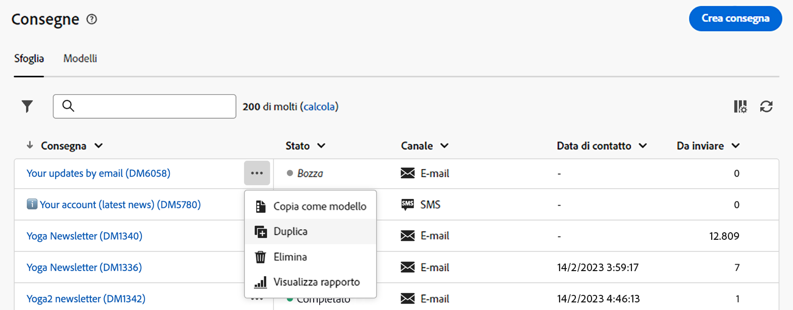

# Scopri l’interfaccia {#user-interface}

>[!CONTEXTUALHELP]
>id="acw_homepage_learnmore"
>title="Scopri l’interfaccia"
>abstract="La nuova interfaccia di Campaign Web v8 offre un’esperienza utente integrata, intuitiva e coerente."

La nuova interfaccia di Campaign Web v8 offre un’esperienza utente moderna e intuitiva per semplificare la progettazione e la consegna delle campagne di marketing. Questa nuova interfaccia è integrata con Adobe Experience Platform.

>[!NOTE]
>
>Questa documentazione viene spesso aggiornata per riflettere le recenti modifiche apportate all’interfaccia utente del prodotto. Tuttavia, alcune schermate possono risultare leggermente diverse dall’interfaccia utente che visualizzi.

## Menu di navigazione a sinistra {#user-interface-left-nav}

Sfoglia i collegamenti a sinistra per accedere alle funzionalità di Campaign Web v8. Diversi collegamenti presentano elenchi di oggetti che possono essere ordinati e filtrati. Puoi anche configurare le colonne per visualizzare tutte le informazioni che ti servono. Consulta questa [sezione](#list-screens). Tutte le schermate di elenchi sono di sola lettura, ad eccezione dell’elenco delle consegne e-mail. Nella versione alfa, non è possibile fare clic su una voce dell’elenco per modificarla o visualizzarla. Tutti gli elenchi saranno modificabili in versioni future. Gli elementi visualizzati nel menu di navigazione a sinistra dipendono dalle autorizzazioni utente.

### Home {#user-interface-home}

Questa schermata include collegamenti chiave e risorse che permettono di accedere rapidamente alle funzionalità principali di Campaign Web v8.

L’elenco **Recenti** fornisce collegamenti alle consegne create e modificate di recente. Questo elenco ne mostra il canale, lo stato, il proprietario, le date di creazione e modifica.

Il **Indicatori chiave di prestazione** consente di controllare l’efficacia della piattaforma tramite KPI comuni.

Puoi accedere alle principali pagine della guida di Campaign Web v8 dalla sezione **Apprendimento** della pagina home.

### Indicatori chiave di performance {#user-interface-key-indicators}

>[!CONTEXTUALHELP]
>id="acw_keyindicators_spam"
>title="Spam"
>abstract="KPI spam"

Passa alla home page per controllare gli indicatori di prestazioni chiave per la piattaforma. Questi indicatori mostrano il numero e la percentuale di messaggi consegnati, aperti, su cui è stato fatto clic, di messaggi che hanno annullato l’abbonamento e la percentuale di errori.

Per impostazione predefinita, le metriche sono calcolate per le consegne inviate nei 7 giorni precedenti. Puoi modificare il periodo dall’elenco a discesa nella sezione in alto a destra della scheda. I messaggi inviati ai profili di test sono esclusi.

Puoi selezionare il canale da visualizzare. Per impostazione predefinita, questi indicatori riflettono le metriche per il canale e-mail.

#### Messaggio consegnato {#ui-delivered-kpi}

>[!CONTEXTUALHELP]
>id="acw_keyindicators_delivered"
>title="Consegnati"
>abstract="Questa metrica mostra, per il canale selezionato, la somma di tutti i messaggi elaborati con successo e la percentuale di messaggi consegnati con successo rispetto al numero totale di messaggi inviati."

Il **Consegnato** indicatore mostra i KPI seguenti, per ogni canale:

* Percentuale del numero di messaggi consegnati correttamente rispetto al numero totale di messaggi da inviare.

* Somma di tutti i messaggi elaborati con successo.

In Adobe Campaign, la regola per contrassegnare un messaggio come &quot;Consegnato&quot; è:

Numero di messaggi per i quali il campo &quot;Indirizzo seed&quot; è uguale a &quot;No&quot; e con uno stato uguale a &quot;Preso in considerazione dal provider di servizi&quot; (per SMS) o &quot;Inviato&quot; (per e-mail) o &quot;Ricevuto su dispositivi mobili&quot; (per notifiche push).

#### Aperture totali {#ui-open-kpi}

>[!CONTEXTUALHELP]
>id="acw_keyindicators_opens"
>title="Aperture"
>abstract="Questa metrica mostra, per il canale selezionato, la somma di tutti i messaggi aperti e la percentuale di messaggi aperti rispetto al numero totale di messaggi consegnati con successo."

Il **Aperture** indicatore mostra i KPI seguenti, per ogni canale:

* Percentuale del numero di messaggi aperti rispetto al numero totale di messaggi consegnati con successo.

* Somma di tutti i messaggi aperti, per canale.

Adobe Campaign rileva che il messaggio si apre quando il destinatario scarica le immagini nell’e-mail. Le e-mail HTML e Multipart/Alternative includono un’immagine da 0 pixel, che consente di rilevare i messaggi aperti. Poiché i messaggi in formato testo non includono immagini, è impossibile rilevare se sono stati aperti o meno. I valori calcolati in base all’apertura dei messaggi sono sempre delle stime, a causa del margine di errore legato alla visualizzazione delle immagini.

#### Percentuali di clic {#ui-click-kpi}

>[!CONTEXTUALHELP]
>id="acw_keyindicators_clicks"
>title="Clic"
>abstract="Questa metrica mostra, per il canale selezionato, la somma di tutti gli URL su cui è stato fatto clic nei messaggi e la percentuale di clic rispetto al numero totale di messaggi consegnati con successo."

Il **Clic** indicatore mostra i KPI seguenti, per ogni canale:

* Percentuale del numero di clic rispetto al numero totale di messaggi consegnati con successo.

* Numero di persone distinte che hanno fatto clic almeno una volta in una consegna. I collegamenti di annullamento dell’abbonamento e i collegamenti verso la pagina speculare sono esclusi.

Queste metriche si basano sulla tabella di tracciamento consolidata (`nms:trackingStats`). Questa tabella aggregata viene utilizzata per motivi di prestazioni quando si visualizzano i report al posto della tabella dei registri di tracciamento dei destinatari (`nms:trackingLogRcp`) e non viene calcolata in tempo reale. La tabella viene generata pochi minuti dopo il recupero dei registri di tracciamento.

#### Percentuali di annullamento abbonamento {#ui-unsub-kpi}

>[!CONTEXTUALHELP]
>id="acw_keyindicators_unsubscriptions"
>title="Iscrizioni annullate"
>abstract="Questa metrica mostra, per il canale selezionato, la somma di tutti gli annullamenti di abbonamenti a un servizio e la percentuale di annullamenti di abbonamenti rispetto al numero totale di messaggi consegnati con successo."

Il **Annullamenti iscrizione** indicatore mostra i KPI seguenti, per ogni canale:

* Percentuale del numero di annullamenti di abbonamenti rispetto al numero totale di messaggi consegnati con successo.

* La somma di tutti i clic su un collegamento di annullamento dell’abbonamento, ovvero con una categoria URL equivale a &quot;Opt-out&quot;.

#### Tassi di errore {#ui-error-kpi}

>[!CONTEXTUALHELP]
>id="acw_keyindicators_errors"
>title="Errori"
>abstract="Numero totale di errori accumulati durante le consegne ed elaborazione automatica dei mancati recapiti. La frequenza associata è il rapporto con il numero di messaggi da consegnare."

Il **Errori** indicatore mostra i KPI seguenti, per ogni canale:

* Percentuale del numero di errori rispetto al numero totale di messaggi da consegnare.

* Numero totale di errori accumulati durante le consegne e l’elaborazione automatica del rimbalzo.

### Explorer {#user-interface-explorer}

>[!CONTEXTUALHELP]
>id="acw_explorer"
>title="Explorer"
>abstract="Il menu **Explorer** mostra tutti i componenti e gli oggetti di Campaign con la stessa gerarchia di cartelle di quella presente nella console client. Sfoglia tutti i componenti, le cartelle e gli schemi di Campaign v8 e crea consegne, flussi di lavoro e campagne. Tutti gli altri elenchi sono di sola lettura."

Il menu **Explorer** mostra tutte le risorse e gli oggetti di Campaign con la stessa gerarchia di cartelle di quella presenti nella console client. Sfoglia tutti i componenti, le cartelle e gli schemi di Campaign v8 e crea consegne, flussi di lavoro e campagne. Tutti gli altri elenchi sono di sola lettura.

Gli elementi visualizzati in Explorer dipendono dalle autorizzazioni dell’utente.

Come in tutte le schermate di elenchi, puoi configurare le colonne per visualizzare le informazioni che ti servono. Consulta questa [sezione](#list-screens).

Per ulteriori informazioni sulla funzione Explorer di Campaign, la gerarchia di cartelle e risorse, consulta questa [documentazione di Campaign v8 (console)](https://experienceleague.adobe.com/docs/campaign/campaign-v8/new/campaign-ui.html?lang=it#ac-explorer-ui){target="_blank"}.

### Gestione delle campagne {#user-interface-campaign-management}

>[!CONTEXTUALHELP]
>id="acw_campaigns_list"
>title="Campagne"
>abstract="Questo è l’elenco delle campagne. Puoi visualizzare informazioni utili, ad esempio le date di inizio, fine e ultima modifica e il relativo stato. È possibile filtrare l’elenco in base allo stato o alle date di inizio e fine. Fai clic sul pulsante “Crea campagna” per aggiungere una nuova campagna. Seleziona una campagna per visualizzarne il contenuto, le consegne e i dettagli. Passa alla scheda “Modelli” per visualizzare e creare i modelli."

Nella sezione GESTIONE DELLE CAMPAGNE, puoi accedere a campagne di marketing, consegne e flussi di lavoro.

* **Campagne**: questo è l’elenco delle campagne e dei modelli di campagna. Per impostazione predefinita, per ogni campagna puoi visualizzare le date di inizio/fine/creazione/ultima modifica, lo stato corrente e il nome dell’operatore della campagna che l’ha creata. Puoi filtrare l’elenco per stato, date di inizio/fine, cartella oppure creare un filtro avanzato per definire criteri di filtro personalizzati. Per ulteriori informazioni sulle campagne, consulta [questa sezione](../campaigns/gs-campaigns.md).

* **Consegne**: scorri l’elenco delle consegne. Per impostazione predefinita, puoi visualizzarne lo stato, la data dell’ultima modifica e i KPI chiave. Puoi filtrare l’elenco per stato, data di contatto o canale. Fai clic su una consegna e-mail per aprire la relativa dashboard e ottenere una panoramica dei dettagli della consegna. Le consegne su altri canali sono di sola lettura. Per ulteriori informazioni sulle consegne, consulta [questa sezione](../msg/gs-messages.md).

  Per eliminare o duplicare una consegna, utilizza il pulsante **Altre azioni**.

  {width="70%" align="left"}

* **Flussi di lavoro**: in questa schermata, è possibile accedere all’elenco completo dei flussi di lavoro e dei modelli di flusso di lavoro. Puoi controllarne lo stato, le date dell’ultima/successiva esecuzione e creare un nuovo flusso di lavoro o un nuovo modello di flusso di lavoro. È possibile filtrare l’elenco con gli stessi criteri degli altri oggetti. Inoltre, puoi filtrare i flussi di lavoro che appartengono o meno a una campagna. Per ulteriori informazioni sui flussi di lavoro, consulta [questa sezione](../workflows/gs-workflows.md).

### Gestione clienti {#user-interface-customer-management}

>[!CONTEXTUALHELP]
>id="acw_recipients_list"
>title="Destinatari"
>abstract="Accedi al database dei destinatari. Puoi visualizzare informazioni utili quali indirizzo e-mail, nome e cognome. Questo elenco è di sola lettura."

>[!CONTEXTUALHELP]
>id="acw_audiences_list"
>title="Tipi di pubblico"
>abstract="Questo è l’elenco di tipi di pubblico. Puoi visualizzarne il tipo, l’origine, le date di creazione e ultima modifica e l’etichetta. È possibile filtrare l’elenco in base all’origine. Questo elenco è di sola lettura."

>[!CONTEXTUALHELP]
>id="acw_subscriptions_list"
>title="Elenchi di iscrizioni"
>abstract="Sfoglia gli elenchi di iscrizioni. Puoi visualizzarne il tipo, la modalità e l’etichetta. Questo elenco è di sola lettura."

Nella sezione GESTIONE CLIENTI puoi visualizzare destinatari, tipi di pubblico e iscrizioni Questi elenchi sono di sola lettura.

* **Destinatari**: accedi al database dei destinatari. Per impostazione predefinita, puoi visualizzarne l’indirizzo e-mail, il nome e il cognome. Scopri di più sui destinatari nella [documentazione di Adobe Campaign v8 (console)](https://experienceleague.adobe.com/docs/campaign/campaign-v8/audience/gs-audiences.html?lang=it){target="_blank"}.
* **Tipi di pubblico**: questo è l’elenco di tipi di pubblico. Per impostazione predefinita, puoi visualizzarne il tipo, l’origine, le date di creazione e ultima modifica e l’etichetta. È possibile filtrare l’elenco in base all’origine. Scopri di più sui tipi di pubblico ed elenchi nella [documentazione di Adobe Campaign v8 (console)](https://experienceleague.adobe.com/docs/campaign/campaign-v8/audience/create-audiences/create-audiences.html?lang=it){target="_blank"}.
* **Iscrizioni**: sfoglia gli elenchi delle iscrizioni. Per impostazione predefinita, puoi visualizzarne il tipo, la modalità e l’etichetta. Scopri come gestire le iscrizioni e il relativo annullamento nella [documentazione di Campaign v8 (console)](https://experienceleague.adobe.com/docs/campaign/campaign-v8/campaigns/send/subscriptions.html?lang=it){target="_blank"}.

### Gestione delle decisioni

>[!CONTEXTUALHELP]
>id="acw_offers_list"
>title="Offerte"
>abstract="Scorri l’elenco delle offerte di interazione. Per impostazione predefinita, puoi visualizzarne lo stato, le date di inizio e fine e l’ambiente. Puoi filtrare l’elenco per stato e per date di inizio e fine. Sono disponibili anche modelli di offerta. Questi elenchi sono di sola lettura."

* **Offerte**: scorri l’elenco delle offerte di interazione. Per impostazione predefinita, puoi visualizzarne lo stato, le date di inizio e fine e l’ambiente. Puoi filtrare l’elenco per stato e per date di inizio e fine. Sono disponibili anche modelli di offerta. Questi elenchi sono di sola lettura.

Scopri come creare e gestire le offerte nella [documentazione di Adobe Campaign v8 (console)](https://experienceleague.adobe.com/docs/campaign/campaign-v8/offers/interaction.html?lang=it){target="_blank"}.

## Barra superiore

Utilizza la barra superiore dell’interfaccia per:

* Condividere un feedback come tester della versione alfa
* Passare a un’altra organizzazione e ad altre istanze
* Passare a un’altra applicazione Adobe Experience Cloud
* Accedere alle pagine della guida, contattare il supporto e inviare feedback. Puoi usare il campo di ricerca per cercare un argomento negli articoli e video della guida.

{width="50%" align="left"}
<!--
Org / Sub-org switcher to switch between instances. Only one for Alpha. Later: intermerdiate screen with Control Panel (beta). if v8 + ACS with one card per ACS instance. Maybe quickly explain the menu for Alpha?
-->

## Guida contestuale {#contextual-help}

Nell’interfaccia è disponibile una guida contestuale. Quando è disponibile, fai clic sull’icona `?` per visualizzare le informazioni della guida e i relativi collegamenti alla documentazione.

{width="40%" align="left"}

<!--An on-boarding guide is also available to help you get started with Campaign v8 Web. Click the icon in the bottom right corner, choose one of the available step-by-step scenarios, and simply follow the instructions.

{width="70%" align="left"}-->

## Browser supportati {#browsers}

Campaign Web v8 è progettato per funzionare in modo ottimale nell’ultima versione di Google Chrome, Safari e Microsoft Edge. È possibile che si verifichino problemi durante l’utilizzo di alcune funzioni nelle versioni precedenti o in altri browser.

## Preferenze della lingua {#language-pref}

Al momento, Campaign v8 Web è disponibile nelle seguenti lingue:

<table>
<tr>
<td>

Inglese (US) - EN-US

Francese - FR

Tedesco - DE

Italiano - IT

</td>
<td>

Spagnolo - ES

Portoghese (brasiliano) - PTBR

Giapponese - JP

</td>
<td>

Coreano - KR

Cinese semplificato - CHS

Cinese tradizionale - CHT

</td>
</tr>
</table>

La lingua predefinita dell’interfaccia è determinata dalla lingua preferita specificata nel profilo utente.

Per cambiare la lingua:

1. Fai clic sull’icona del tuo profilo, in alto a destra, quindi seleziona **Preferenze**.
1. Quindi fai clic sul collegamento alla lingua visualizzato sotto il tuo indirizzo e-mail.
1. Seleziona la lingua preferita e fai clic su **Salva**. È possibile selezionare una seconda lingua nel caso in cui il componente utilizzato non sia localizzato nella prima lingua.

## Ulteriori informazioni {#learn-more}

Scopri come sfogliare, cercare e filtrare gli elenchi disponibili nell’ambiente Campaign [in questa pagina](list-filters.md).

<!--
######## This part stores the contextualHelp definition for WebUI BETA ###########
######## These blocks should be dispatched in the appropriate pages when available ###########
######## PLEASE DO NOT DELETE ###########
REFER TO 
https://wiki.corp.adobe.com/pages/viewpage.action?spaceKey=neolane&title=v8+WebUI+Contextual+Help+%3CALPHA%3E-+Official+list
-->

>[!CONTEXTUALHELP]
>id="acw_targetdata_personalization_enrichmentdata"
>title="Dati di arricchimento"
>abstract="TBD"

>[!CONTEXTUALHELP]
>id="acw_campaign_reporting_sending"
>title="Reportistica sull’invio"
>abstract="Consulta gli indicatori di invio per la reportistica della campagna."

>[!CONTEXTUALHELP]
>id="acw_campaign_reporting_tracking"
>title="Tracciamento reportistica"
>abstract="Consulta gli indicatori di tracciamento per la reportistica della campagna."

>[!CONTEXTUALHELP]
>id="acw_campaign_reporting_deliveries_overview"
>title="Panoramica sulla reportistica"
>abstract="Metriche chiave per la consegna."

>[!CONTEXTUALHELP]
>id="acw_campaign_reporting_deliveries_target"
>title=" Reportistica sulle statistiche target"
>abstract="Questa sezione mostra metriche specifiche in base ai tipi di pubblico."

>[!CONTEXTUALHELP]
>id="acw_campaign_reporting_deliveries_selection"
>title="Reportistica aggregata per le consegne"
>abstract="Seleziona almeno due consegne per visualizzare un rapporto di dati aggregati."

>[!CONTEXTUALHELP]
>id="acw_orchestration_deduplication_fields"
>title="Campi di deduplicazione"
>abstract="TBD"

>[!CONTEXTUALHELP]
>id="acw_orchestration_deduplication_settings"
>title="Impostazioni di deduplicazione"
>abstract="TBD"

>[!CONTEXTUALHELP]
>id="acw_orchestration_deduplication_complement"
>title="Complemento di deduplicazione"
>abstract="TBD"

>[!CONTEXTUALHELP]
>id="acw_orchestration_dimension_complement"
>title="Complemento di dimensione"
>abstract="TBD"

>[!CONTEXTUALHELP]
>id="acw_push_permission_for_segment"
>title="Autorizzazione necessaria"
>abstract="Prima di poter creare un segmento, l’amministratore deve concederti l’autorizzazione."

>[!CONTEXTUALHELP]
>id="acw_push_overview_edit"
>title="Autorizzazione necessaria"
>abstract="Prima di poter creare un segmento, l’amministratore deve concederti l’autorizzazione."

>[!CONTEXTUALHELP]
>id="acw_campaign_read_only"
>title="Questa campagna è di sola lettura"
>abstract="Non disponi delle autorizzazioni necessarie per modificare questa campagna. Se necessario, contatta l’amministratore per farti autorizzare l’accesso."

>[!CONTEXTUALHELP]
>id="acw_deliveries_read_only"
>title="Questa consegna è di sola lettura"
>abstract="Non disponi delle autorizzazioni necessarie per modificare questa consegna. Se necessario, contatta l’amministratore per farti autorizzare l’accesso."

>[!CONTEXTUALHELP]
>id="acw_subscription_services_read_only"
>title="Questo servizio è di sola lettura"
>abstract="Non disponi delle autorizzazioni necessarie per modificare questo servizio. Se necessario, contatta l’amministratore per farti autorizzare l’accesso."

<!-- Workflows-->

>[!CONTEXTUALHELP]
>id="acw_campaign_creation_workflow"
>title="Elenco flussi di lavoro"
>abstract="Elenco dei flussi di lavoro disponibili per la campagna. Utilizza il pulsante “Crea flusso di lavoro” per aggiungere un flusso di lavoro alla campagna."

>[!CONTEXTUALHELP]
>id="acw_orchestration_saveaudience_outbound"
>title="Transizione in uscita per salvare il pubblico"
>abstract="tbc"

>[!CONTEXTUALHELP]
>id="acw_orchestration_saveaudience_activity"
>title="Salva un pubblico"
>abstract="Utilizza questa attività per salvare il pubblico del flusso di lavoro."

>[!CONTEXTUALHELP]
>id="acw_wf_read_only"
>title="Questo flusso di lavoro è di sola lettura"
>abstract="Non disponi delle autorizzazioni necessarie per modificare questo flusso di lavoro. Se necessario, contatta l’amministratore per farti autorizzare l’accesso."

>[!CONTEXTUALHELP]
>id="acw_wf_read_only_canvas"
>title="Questo flusso di lavoro è di sola lettura"
>abstract="Impossibile modificare il flusso di lavoro a causa di aree di lavoro non supportate o non compatibili."

<!-- delivery template settings-->

>[!CONTEXTUALHELP]
>id="acw_delivery_template_settings_tracking_validity"
>title="Periodo di validità"
>abstract="Questa opzione definisce la durata per la quale viene attivato il tracciamento degli URL."

>[!CONTEXTUALHELP]
>id="acw_delivery_template_settings_delivery_duration"
>title="Durata consegna"
>abstract="Il campo Durata consegna consente di specificare il limite per i nuovi tentativi di consegna globali. Questo significa che Adobe Campaign invia i messaggi a partire dalla data di inizio e quindi, per i messaggi che restituiscono un errore, vengono eseguiti nuovi tentativi regolari e configurabili fino al raggiungimento del limite di validità."

>[!CONTEXTUALHELP]
>id="acw_delivery_template_settings_resources_validity"
>title="Limite di validità delle risorse"
>abstract="Il campo Limite di validità viene utilizzato per le risorse caricate, come la pagina mirror o le immagini. Queste risorse sono valide per un periodo di tempo limitato: una volta raggiunto il limite, non sono più disponibili."

>[!CONTEXTUALHELP]
>id="acw_delivery_template_settings_approval"
>title="Modalità di approvazione"
>abstract="Ogni fase di una consegna può essere soggetta ad approvazione per garantire il pieno monitoraggio e controllo dei vari processi."

>[!CONTEXTUALHELP]
>id="acw_delivery_template_settings_retries"
>title="Numero massimo di nuovi tentativi"
>abstract="Se un messaggio non riesce a causa di un errore temporaneo, vengono eseguiti nuovi tentativi fino alla fine della durata della consegna."

>[!CONTEXTUALHELP]
>id="acw_delivery_template_settings_recipient_importance"
>title="Importanza del destinatario"
>abstract="L’importanza del destinatario è una formula utilizzata per determinare quali destinatari mantenere se vengono superate le regole di tipologia della capacità."

>[!CONTEXTUALHELP]
>id="acw_delivery_template_settings_delivery_weight"
>title="Peso consegna"
>abstract="Il “peso” delle consegne consente di individuare le consegne prioritarie nel quadro della gestione della pressione. I messaggi con il peso maggiore hanno priorità."

>[!CONTEXTUALHELP]
>id="acw_delivery_template_settings_typology"
>title="Tipologia"
>abstract="Tiplogia consente di controllare, filtrare e monitorare l’invio delle consegne."

>[!CONTEXTUALHELP]
>id="acw_reporting_email_exportation"
>title="Esportazione"
>abstract="Puoi esportare solo la pagina selezionata."

