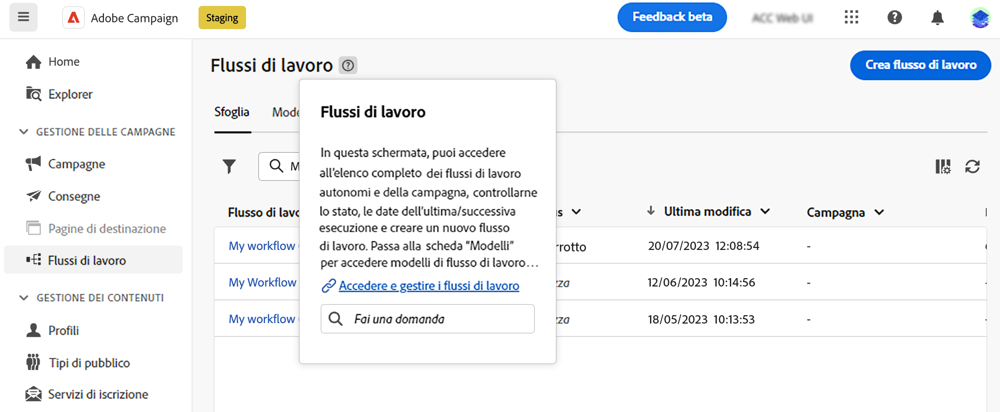

# Utilizzo dell’assistente alla conoscenza basato sull’intelligenza artificiale {#using-ai}

Ottieni risposte veloci e generate da intelligenza artificiale in base alla documentazione del prodotto e al contesto di prodotto corrente, con l’assistente alla conoscenza basato sull’intelligenza artificiale disponibile nelle caselle di aiuto contestuali del prodotto.

>[!AVAILABILITY]
>
>Questa funzionalità sarà disponibile all’inizio di ottobre.

Il **Knowledge Assistant con Gen AI** l’aiuto contestuale incorporato rivoluziona la ricerca della documentazione e le risposte alle domande semplificando il setacciamento di ampi archivi di documentazione, con l’individuazione immediata e precisa delle informazioni necessarie.

Grazie alle funzionalità di Campaign Gen AI, questo assistente trasforma la tua esperienza, rendendo estremamente semplice il recupero delle informazioni e la risoluzione dei problemi. Sia che tu cerchi assistenza in un&#39;attività complessa o che navighi in documenti estesi, il nostro Knowledge Assistant con Gen AI è il tuo compagno ideale, fornendo efficienza e precisione senza pari in ogni interazione.

{width="70%" align="left"}

<!--
## Consent {#consent-ai}

Campaign knowledge assistant embeeded in the contextual help boxes uses AI. Your use of this capability constitutes consent that the information you provide in your session will be collected, used, disclosed, and retained by Adobe in accordance with the terms of Adobe's Customer Feedback Program. Please do not provide any personal information about yourself or other parties (including your name or contact information) in the knowledge assistant.

## Privacy {#privacy-ai}

Your data is encrypted and private following our standard data protection practices. Learn more about [Adobe Privacy Policies](https://www.adobe.com/privacy/policy.html){target="_blank"}.

The knowledge assistant AI capability does not use your data to train our models. We do not allow any partners or 3rd parties to use your data for training their models or any other purpose.

For information specific to Adobe AI policies in Experience Cloud apps and solutions, refer to [this page](https://business.adobe.com/products/sensei/adobe-sensei.html){target="_blank"}.
-->

## Risposte {#answers-ai}

Le risposte possono essere imprecise o fuorvianti. Di conseguenza, l’assistente alla conoscenza Adobe può produrre informazioni errate. Controlla la documentazione del prodotto collegata in ogni casella della guida.

L’intelligenza artificiale e i modelli di apprendimento automatico migliorano nel tempo per affrontare meglio casi d’uso specifici. L’assistente alla conoscenza basato sull’intelligenza artificiale di Campaign continuerà a migliorare nei prossimi mesi. Si consiglia vivamente di utilizzare il ?? ?? pulsanti ogni volta che leggi una risposta, per segnalare eventuali risposte inappropriate ai nostri ingegneri.

## Raccomandazioni  {#recommendations-ai}

Quando si pone una domanda nell’aiuto contestuale, viene preso in considerazione il contesto di prodotto corrente.

Per ottenere il meglio dell&#39;assistente, quando si pone una domanda, vi consigliamo di:

* Sii il più preciso e specifico possibile ed evita ambiguità. La risposta sarà più accurata e utile.
* Per aiutare l&#39;assistente alla conoscenza a trovare le informazioni corrette, aggiungere il maggior numero possibile di dettagli su ciò che si sta cercando di apprendere.
* Riformula e perfeziona le tue domande per ottenere risposte migliori. Se la risposta non è accurata o utile, prova diversi approcci e aggiungi contesto per ottenere risultati migliori.
* Utilizza termini e parole appropriati, con un tono neutro.
* Valuta le risposte e fornisci feedback in modo che i nostri ingegneri possano imparare dalla tua esperienza e migliorare i risultati.

