<?xml version="1.0" encoding="UTF-8"?>
<xliff xmlns="urn:oasis:names:tc:xliff:document:1.2" xmlns:okp="okapi-framework:xliff-extensions" xmlns:its="http://www.w3.org/2005/11/its" xmlns:itsxlf="http://www.w3.org/ns/its-xliff/" version="1.2" its:version="2.0">
<file original="help/v8/get-started/work-with-folders.md.mdsc" source-language="en-US" target-language="en-XX" datatype="x-text/markdown">
<body>
<trans-unit id="tu22" xml:space="preserve">
<source xml:lang="en-US">https://experienceleague.adobe.com/docs/campaign/campaign-v8/permissions/manage-permissions.html?lang=it#use-named-rights</source>
<target xml:lang="en-XX">https://experienceleague.adobe.com/docs/campaign/campaign-v8/permissions/manage-permissions.html?lang=it#use-named-rights</target>
</trans-unit>
<trans-unit id="tu34" xml:space="preserve">
<source xml:lang="en-US">https://experienceleague.adobe.com/en/docs/campaign/campaign-v8/config/configuration/folders-and-views</source>
<target xml:lang="en-XX">https://experienceleague.adobe.com/it/docs/campaign/campaign-v8/config/configuration/folders-and-views</target>
</trans-unit>
<trans-unit id="tu1" restype="x-YAML_METADATA_HEADER_VALUE" xml:space="preserve">
<source xml:lang="en-US">Work with Folders</source>
<target xml:lang="en-XX">Utilizzare le cartelle</target>
</trans-unit>
<trans-unit id="tu2" restype="x-YAML_METADATA_HEADER_VALUE" xml:space="preserve">
<source xml:lang="en-US">Learn how to manage a folder in Adobe Campaign</source>
<target xml:lang="en-XX">Scopri come gestire una cartella in Adobe Campaign</target>
</trans-unit>
<trans-unit id="tu3" xml:space="preserve">
<source xml:lang="en-US">Work with folders</source>
<target xml:lang="en-XX">Utilizzare le cartelle</target>
</trans-unit>
<trans-unit id="tu4" xml:space="preserve">
<source xml:lang="en-US">Folder properties</source>
<target xml:lang="en-XX">Proprietà cartella</target>
</trans-unit>
<trans-unit id="tu5" xml:space="preserve">
<source xml:lang="en-US">Folder properties</source>
<target xml:lang="en-XX">Proprietà cartella</target>
</trans-unit>
<trans-unit id="tu6" xml:space="preserve">
<source xml:lang="en-US">Folder security</source>
<target xml:lang="en-XX">Sicurezza cartella</target>
</trans-unit>
<trans-unit id="tu7" xml:space="preserve">
<source xml:lang="en-US">Folder security</source>
<target xml:lang="en-XX">Sicurezza cartella</target>
</trans-unit>
<trans-unit id="tu8" xml:space="preserve">
<source xml:lang="en-US">Folder schedule</source>
<target xml:lang="en-XX">Pianificazione cartella</target>
</trans-unit>
<trans-unit id="tu9" xml:space="preserve">
<source xml:lang="en-US">Folder schedule</source>
<target xml:lang="en-XX">Pianificazione cartella</target>
</trans-unit>
<trans-unit id="tu10" xml:space="preserve">
<source xml:lang="en-US">About folders</source>
<target xml:lang="en-XX">Informazioni sulle cartelle</target>
</trans-unit>
<trans-unit id="tu11" xml:space="preserve">
<source xml:lang="en-US">Folders are objects in Adobe Campaign that allow you to organize your components and data.</source>
<target xml:lang="en-XX">In Adobe Campaign le cartelle sono oggetti che consentono di organizzare i componenti e i dati.</target>
</trans-unit>
<trans-unit id="tu12" xml:space="preserve">
<source xml:lang="en-US">You can create, rename, reorder, and move folders in the navigation tree. You can also delete them based on your rights.</source>
<target xml:lang="en-XX">È possibile creare, rinominare, riordinare e spostare cartelle nella struttura di navigazione. Puoi anche eliminarli in base ai tuoi diritti.</target>
</trans-unit>
<trans-unit id="tu13" xml:space="preserve">
<source xml:lang="en-US"><ph id="1" ctype="x-IMAGE">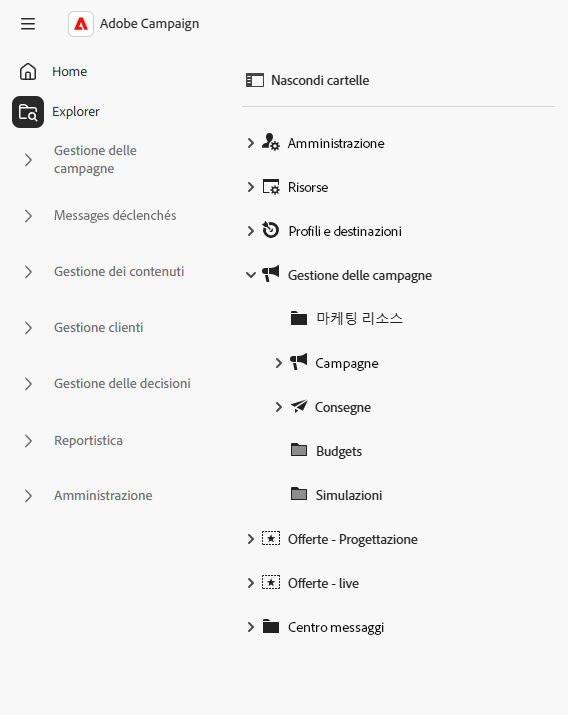{zoomable="yes"}</ph></source>
<target xml:lang="en-XX"><ph id="1" ctype="x-IMAGE">{zoomable="yes"}</ph></target>
</trans-unit>
<trans-unit id="tu14" xml:space="preserve">
<source xml:lang="en-US">You can set up a folder type. For example, a folder of deliveries. The folder icon changes according to its type.</source>
<target xml:lang="en-XX">Puoi impostare un tipo di cartella. Ad esempio, una cartella di consegne. L’icona della cartella cambia in base al tipo.</target>
</trans-unit>
<trans-unit id="tu15" xml:space="preserve">
<source xml:lang="en-US">Folder restrictions</source>
<target xml:lang="en-XX">Restrizioni cartella</target>
</trans-unit>
<trans-unit id="tu16" xml:space="preserve">
<source xml:lang="en-US">The folders Objects created automatically and Technical workflows are restricted, and cannot be viewed on the left side panel.</source>
<target xml:lang="en-XX">Le cartelle Oggetti creati automaticamente e Flussi di lavoro tecnici sono soggette a restrizioni e non possono essere visualizzate nel pannello laterale a sinistra.</target>
</trans-unit>
<trans-unit id="tu17" xml:space="preserve">
<source xml:lang="en-US"><ph id="1" ctype="x-regxph" equiv-text="&lbrack;!IMPORTANT">[!IMPORTANT]</ph></source>
<target xml:lang="en-XX"><ph id="1" ctype="x-regxph" equiv-text="&lbrack;!IMPORTANT">[!IMPORTANT]</ph></target>
</trans-unit>
<trans-unit id="tu18" xml:space="preserve">
<source xml:lang="en-US">The folders <ph id="1" ctype="x-STRONG_EMPHASIS">**[!UICONTROL </ph>Objects created automatically<ph id="3" ctype="x-LINK_REF">]**</ph> and <ph id="5" ctype="x-STRONG_EMPHASIS">**[!UICONTROL </ph>Technical workflows<ph id="7" ctype="x-LINK_REF">]**</ph> are restricted, and cannot be viewed on the left side panel.</source>
<target xml:lang="en-XX">Le cartelle <ph id="1" ctype="x-STRONG_EMPHASIS">**[!UICONTROL </ph>Oggetti creati automaticamente<ph id="3" ctype="x-LINK_REF">]**</ph> e <ph id="5" ctype="x-STRONG_EMPHASIS">**[!UICONTROL </ph>Flussi di lavoro tecnici<ph id="7" ctype="x-LINK_REF">]**</ph> sono soggette a restrizioni e non possono essere visualizzate nel pannello laterale a sinistra.</target>
</trans-unit>
<trans-unit id="tu19" xml:space="preserve">
<source xml:lang="en-US">The actions available to you on a folder depend on the rights you have been granted on it. The <ph id="1" ctype="x-STRONG_EMPHASIS">**[!UICONTROL </ph>Folder settings<ph id="3" ctype="x-LINK_REF">]**</ph> dialog may open in <ph id="5" ctype="x-STRONG_EMPHASIS">**</ph>read-only mode<ph id="6" ctype="x-STRONG_EMPHASIS">**</ph>, and some actions or sections may not be available, depending on your rights.</source>
<target xml:lang="en-XX">Le azioni disponibili per una cartella dipendono dai diritti che ti sono stati concessi. La finestra di dialogo <ph id="1" ctype="x-STRONG_EMPHASIS">**[!UICONTROL </ph>Impostazioni cartella<ph id="3" ctype="x-LINK_REF">]**</ph> potrebbe aprirsi in <ph id="5" ctype="x-STRONG_EMPHASIS">**</ph>modalità di sola lettura<ph id="6" ctype="x-STRONG_EMPHASIS">**</ph> e alcune azioni o sezioni potrebbero non essere disponibili, a seconda dei diritti.</target>
</trans-unit>
<trans-unit id="tu20" xml:space="preserve">
<source xml:lang="en-US">Contact your administrator if you are missing rights on a folder. Refer to this <ph id="1" ctype="x-LINK">[</ph>section<ph id="2" ctype="x-LINK">](permissions.md#folder-permissions)</ph> to learn how folder permissions are managed.</source>
<target xml:lang="en-XX">Se necessiti di ulteriori diritti per una cartella, contatta il tuo amministratore. Consulta questa <ph id="1" ctype="x-LINK">[</ph>sezione<ph id="2" ctype="x-LINK">](permissions.md#folder-permissions)</ph> per capire come vengono gestite le autorizzazioni di una cartella.</target>
</trans-unit>
<trans-unit id="tu21" xml:space="preserve">
<source xml:lang="en-US">Named rights such as <ph id="1" ctype="x-STRONG_EMPHASIS">**[!UICONTROL </ph>Insert Folders<ph id="3" ctype="x-LINK_REF">]**</ph>, <ph id="5" ctype="x-STRONG_EMPHASIS">**[!UICONTROL </ph>Edit Folders<ph id="7" ctype="x-LINK_REF">]**</ph>, and <ph id="9" ctype="x-STRONG_EMPHASIS">**[!UICONTROL </ph>Delete Folder<ph id="11" ctype="x-LINK_REF">]**</ph> also determine which folder actions are available to an operator. Refer to the <ph id="13" ctype="x-LINK">&lbrack;</ph>Campaign v8 documentation<ph id="14" ctype="x-LINK">[#$tu22]{target="_blank"}</ph>.</source>
<target xml:lang="en-XX">I diritti denominati, ad esempio <ph id="1" ctype="x-STRONG_EMPHASIS">**[!UICONTROL </ph>Inserisci cartelle<ph id="3" ctype="x-LINK_REF">]**</ph>, <ph id="5" ctype="x-STRONG_EMPHASIS">**[!UICONTROL </ph>Modifica cartelle<ph id="7" ctype="x-LINK_REF">]**</ph> ed <ph id="9" ctype="x-STRONG_EMPHASIS">**[!UICONTROL </ph>Elimina cartella<ph id="11" ctype="x-LINK_REF">]**</ph>, determinano anche quali azioni per cartelle sono disponibili per un operatore. Consulta la <ph id="13" ctype="x-LINK">&lbrack;</ph>documentazione di Campaign v8<ph id="14" ctype="x-LINK">[#$tu22]{target="_blank"}</ph>.</target>
</trans-unit>
<trans-unit id="tu23" xml:space="preserve">
<source xml:lang="en-US">Create a new folder</source>
<target xml:lang="en-XX">Creare una nuova cartella</target>
</trans-unit>
<trans-unit id="tu24" xml:space="preserve">
<source xml:lang="en-US">To create a new folder in Adobe Campaign Web UI, follow these steps:</source>
<target xml:lang="en-XX">Per creare una nuova cartella nell’interfaccia utente di Adobe Campaign Web, segui questi passaggi:</target>
</trans-unit>
<trans-unit id="tu25" xml:space="preserve">
<source xml:lang="en-US">In <ph id="1" ctype="x-STRONG_EMPHASIS">**[!UICONTROL </ph>Explorer<ph id="3" ctype="x-LINK_REF">]**</ph>, go to the folder where you want to create your new folder. Under the <ph id="5" ctype="x-STRONG_EMPHASIS">**[!UICONTROL </ph>...<ph id="7" ctype="x-LINK_REF">]**</ph> menu, select <ph id="9" ctype="x-STRONG_EMPHASIS">**[!UICONTROL </ph>Create new folder<ph id="11" ctype="x-LINK_REF">]**</ph>.</source>
<target xml:lang="en-XX">In <ph id="1" ctype="x-STRONG_EMPHASIS">**[!UICONTROL </ph>Explorer<ph id="3" ctype="x-LINK_REF">]**</ph>, passa alla cartella in cui desideri creare la nuova cartella. Nel menu <ph id="5" ctype="x-STRONG_EMPHASIS">**[!UICONTROL </ph>...<ph id="7" ctype="x-LINK_REF">]**</ph>, seleziona <ph id="9" ctype="x-STRONG_EMPHASIS">**[!UICONTROL </ph>Crea nuova cartella<ph id="11" ctype="x-LINK_REF">]**</ph>.</target>
</trans-unit>
<trans-unit id="tu26" xml:space="preserve">
<source xml:lang="en-US"><ph id="1" ctype="x-IMAGE">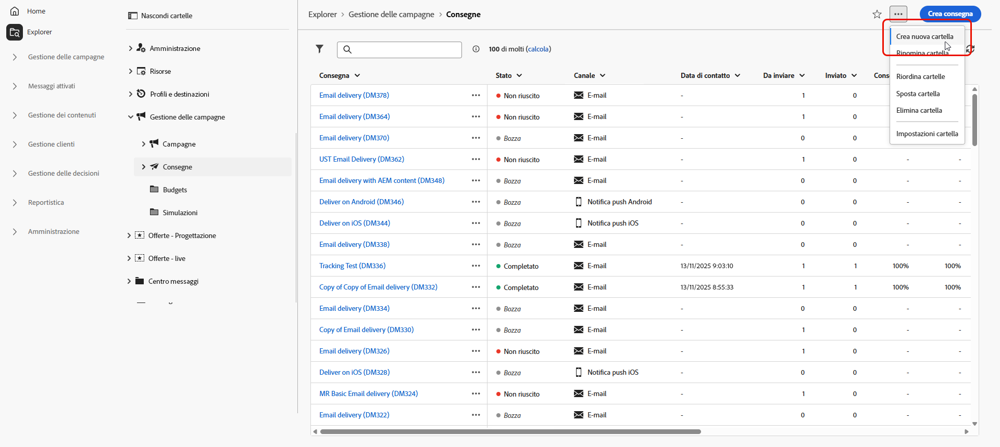{zoomable="yes"}</ph></source>
<target xml:lang="en-XX"><ph id="1" ctype="x-IMAGE">{zoomable="yes"}</ph></target>
</trans-unit>
<trans-unit id="tu27" xml:space="preserve">
<source xml:lang="en-US">When you create a new folder, the folder type defaults to the type of the parent folder. In this example, a folder is created in the <ph id="1" ctype="x-STRONG_EMPHASIS">**[!UICONTROL </ph>Deliveries<ph id="3" ctype="x-LINK_REF">]**</ph> folder.</source>
<target xml:lang="en-XX">Per impostazione predefinita, quando viene creata una nuova cartella, il tipo di cartella corrisponde a quello della cartella principale. In questo esempio viene creata una cartella nella cartella <ph id="1" ctype="x-STRONG_EMPHASIS">**[!UICONTROL </ph>Consegne<ph id="3" ctype="x-LINK_REF">]**</ph>.</target>
</trans-unit>
<trans-unit id="tu28" xml:space="preserve">
<source xml:lang="en-US"><ph id="1" ctype="x-IMAGE">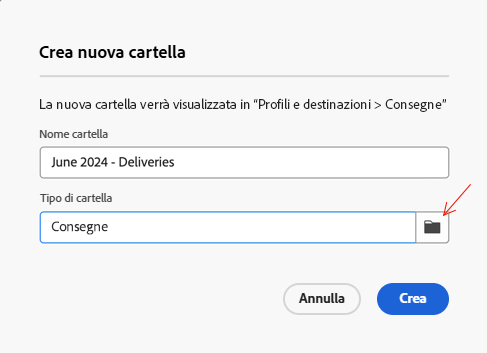{zoomable="yes"}</ph></source>
<target xml:lang="en-XX"><ph id="1" ctype="x-IMAGE">{zoomable="yes"}</ph></target>
</trans-unit>
<trans-unit id="tu29" xml:space="preserve">
<source xml:lang="en-US">Change the folder type by clicking on the folder type icon if needed, and select the desired type from the list presented, as shown below:</source>
<target xml:lang="en-XX">Modifica il tipo di cartella facendo clic sull’icona del tipo di cartella, se necessario, e seleziona il tipo desiderato dall’elenco presentato, come mostrato di seguito:</target>
</trans-unit>
<trans-unit id="tu30" xml:space="preserve">
<source xml:lang="en-US"><ph id="1" ctype="x-IMAGE">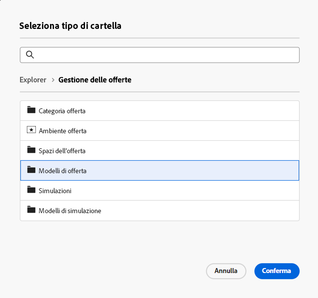{zoomable="yes"}</ph></source>
<target xml:lang="en-XX"><ph id="1" ctype="x-IMAGE">{zoomable="yes"}</ph></target>
</trans-unit>
<trans-unit id="tu31" xml:space="preserve">
<source xml:lang="en-US">Set up the folder type by clicking the <ph id="1" ctype="x-STRONG_EMPHASIS">**[!UICONTROL </ph>Confirm<ph id="3" ctype="x-LINK_REF">]**</ph> button.</source>
<target xml:lang="en-XX">Imposta il tipo di cartella facendo clic sul pulsante <ph id="1" ctype="x-STRONG_EMPHASIS">**[!UICONTROL </ph>Conferma<ph id="3" ctype="x-LINK_REF">]**</ph>.</target>
</trans-unit>
<trans-unit id="tu32" xml:space="preserve">
<source xml:lang="en-US">If you want to create a folder with no specific type, select the <ph id="1" ctype="x-STRONG_EMPHASIS">**[!UICONTROL </ph>Generic Folder<ph id="3" ctype="x-LINK_REF">]**</ph> type.</source>
<target xml:lang="en-XX">Se desideri creare una cartella senza un tipo specifico, seleziona il tipo <ph id="1" ctype="x-STRONG_EMPHASIS">**[!UICONTROL </ph>Cartella generica<ph id="3" ctype="x-LINK_REF">]**</ph>.</target>
</trans-unit>
<trans-unit id="tu33" xml:space="preserve">
<source xml:lang="en-US">You can also <ph id="1" ctype="x-LINK">&lbrack;</ph>create and manage folders in Adobe Campaign console<ph id="2" ctype="x-LINK">[#$tu34]</ph>.</source>
<target xml:lang="en-XX">È, inoltre, possibile <ph id="1" ctype="x-LINK">&lbrack;</ph>creare e gestire cartelle nella console di Adobe Campaign<ph id="2" ctype="x-LINK">[#$tu34]</ph>.</target>
</trans-unit>
<trans-unit id="tu35" xml:space="preserve">
<source xml:lang="en-US">Reorder folders</source>
<target xml:lang="en-XX">Riordinare le cartelle</target>
</trans-unit>
<trans-unit id="tu36" xml:space="preserve">
<source xml:lang="en-US">You can reorder folders based on your needs. To do so, click on <ph id="1" ctype="x-STRONG_EMPHASIS">**[!UICONTROL </ph>Reorder folders<ph id="3" ctype="x-LINK_REF">]**</ph>, as shown below.</source>
<target xml:lang="en-XX">Puoi riordinare le cartelle in base alle esigenze. A tale scopo, fai clic su <ph id="1" ctype="x-STRONG_EMPHASIS">**[!UICONTROL </ph>Riordina cartelle<ph id="3" ctype="x-LINK_REF">]**</ph>, come mostrato di seguito.</target>
</trans-unit>
<trans-unit id="tu37" xml:space="preserve">
<source xml:lang="en-US">In this example, the <ph id="1" ctype="x-STRONG_EMPHASIS">**</ph>Deliveries<ph id="2" ctype="x-STRONG_EMPHASIS">**</ph> folder contains four subfolders.</source>
<target xml:lang="en-XX">In questo esempio, la cartella <ph id="1" ctype="x-STRONG_EMPHASIS">**</ph>Consegne<ph id="2" ctype="x-STRONG_EMPHASIS">**</ph> contiene quattro sottocartelle.</target>
</trans-unit>
<trans-unit id="tu38" xml:space="preserve">
<source xml:lang="en-US"><ph id="1" ctype="x-IMAGE">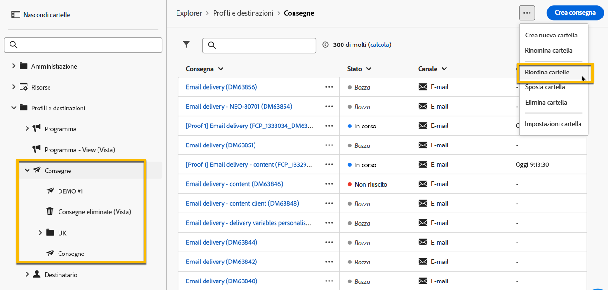{zoomable="yes"}</ph></source>
<target xml:lang="en-XX"><ph id="1" ctype="x-IMAGE">{zoomable="yes"}</ph></target>
</trans-unit>
<trans-unit id="tu39" xml:space="preserve">
<source xml:lang="en-US">You can change the order of folders either by <ph id="1" ctype="x-STRONG_EMPHASIS">**</ph>drag and drop<ph id="2" ctype="x-STRONG_EMPHASIS">**</ph> or by using <ph id="3" ctype="x-STRONG_EMPHASIS">**</ph>up and down arrows<ph id="4" ctype="x-STRONG_EMPHASIS">**</ph>.</source>
<target xml:lang="en-XX">Puoi cambiare l’ordine delle cartelle <ph id="1" ctype="x-STRONG_EMPHASIS">**</ph>trascinandole<ph id="2" ctype="x-STRONG_EMPHASIS">**</ph> oppure utilizzando le icone <ph id="3" ctype="x-STRONG_EMPHASIS">**</ph>freccia su e freccia giù<ph id="4" ctype="x-STRONG_EMPHASIS">**</ph>.</target>
</trans-unit>
<trans-unit id="tu40" xml:space="preserve">
<source xml:lang="en-US"><ph id="1" ctype="x-IMAGE">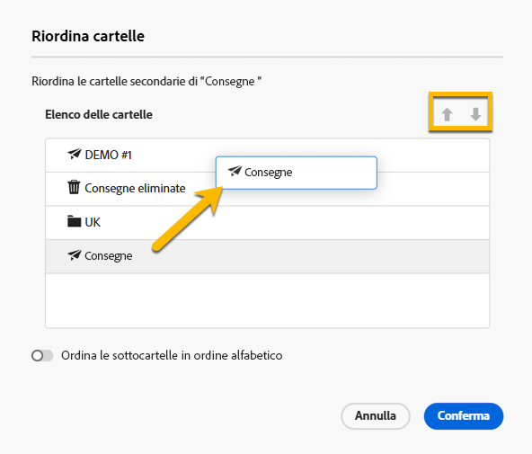{zoomable="yes"}</ph></source>
<target xml:lang="en-XX"><ph id="1" ctype="x-IMAGE">{zoomable="yes"}</ph></target>
</trans-unit>
<trans-unit id="tu41" xml:space="preserve">
<source xml:lang="en-US">Favorite folders</source>
<target xml:lang="en-XX">Cartelle preferite</target>
</trans-unit>
<trans-unit id="tu42" xml:space="preserve">
<source xml:lang="en-US">Favorites</source>
<target xml:lang="en-XX">Preferite</target>
</trans-unit>
<trans-unit id="tu43" xml:space="preserve">
<source xml:lang="en-US">Your favorite folders will be displayed at the top of the left tab.</source>
<target xml:lang="en-XX">Le cartelle preferite verranno visualizzate nella parte superiore della scheda a sinistra.</target>
</trans-unit>
<trans-unit id="tu44" xml:space="preserve">
<source xml:lang="en-US">The folders that have been marked as "Favorite" will always be shown at the top of the left tab.</source>
<target xml:lang="en-XX">Le cartelle contrassegnate come “Preferite” verranno visualizzate sempre nella parte superiore della scheda a sinistra.</target>
</trans-unit>
<trans-unit id="tu45" xml:space="preserve">
<source xml:lang="en-US">You can add folders as favorite by clicking on the star button at the top-right corner when viewing a folder.</source>
<target xml:lang="en-XX">Puoi aggiungere cartelle come preferite facendo clic sul pulsante a forma di stella in alto a destra quando visualizzi una cartella.</target>
</trans-unit>
<trans-unit id="tu46" xml:space="preserve">
<source xml:lang="en-US"><ph id="1" ctype="x-IMAGE">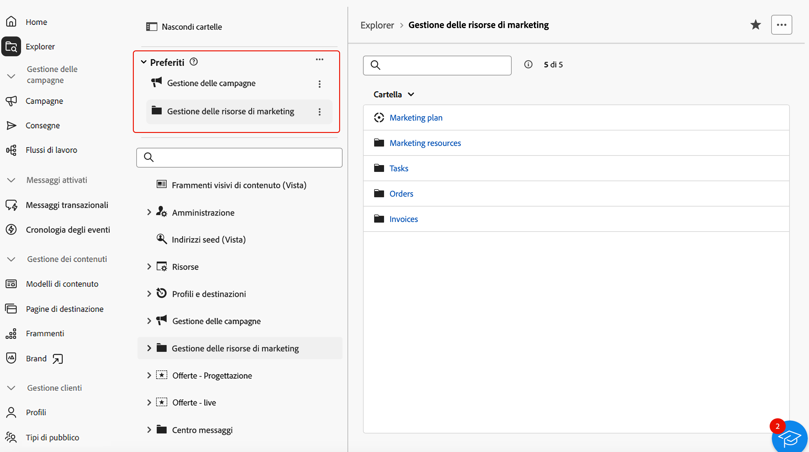{zoomable="yes"}</ph></source>
<target xml:lang="en-XX"><ph id="1" ctype="x-IMAGE">{zoomable="yes"}</ph></target>
</trans-unit>
<trans-unit id="tu47" xml:space="preserve">
<source xml:lang="en-US">Delete a folder</source>
<target xml:lang="en-XX">Eliminare una cartella</target>
</trans-unit>
<trans-unit id="tu48" xml:space="preserve">
<source xml:lang="en-US"><ph id="1" ctype="x-regxph" equiv-text="&lbrack;!CAUTION">[!CAUTION]</ph></source>
<target xml:lang="en-XX"><ph id="1" ctype="x-regxph" equiv-text="&lbrack;!CAUTION">[!CAUTION]</ph></target>
</trans-unit>
<trans-unit id="tu49" xml:space="preserve">
<source xml:lang="en-US">When deleting a folder, all data stored in the folder is also deleted.</source>
<target xml:lang="en-XX">Durante l’eliminazione di una cartella, vengono eliminati anche tutti i dati memorizzati al suo interno.</target>
</trans-unit>
<trans-unit id="tu50" xml:space="preserve">
<source xml:lang="en-US">To delete a folder, select it in your <ph id="1" ctype="x-STRONG_EMPHASIS">**[!UICONTROL </ph>Explorer<ph id="3" ctype="x-LINK_REF">]**</ph> tree, and click on the <ph id="5" ctype="x-STRONG_EMPHASIS">**[!UICONTROL </ph>...<ph id="7" ctype="x-LINK_REF">]**</ph> menu. Choose <ph id="9" ctype="x-STRONG_EMPHASIS">**[!UICONTROL </ph>Delete folder<ph id="11" ctype="x-LINK_REF">]**</ph>.</source>
<target xml:lang="en-XX">Per eliminare una cartella, selezionala nella struttura <ph id="1" ctype="x-STRONG_EMPHASIS">**[!UICONTROL </ph>Explorer<ph id="3" ctype="x-LINK_REF">]**</ph> e fai clic sul menu <ph id="5" ctype="x-STRONG_EMPHASIS">**[!UICONTROL </ph>...<ph id="7" ctype="x-LINK_REF">]**</ph>. Scegli <ph id="9" ctype="x-STRONG_EMPHASIS">**[!UICONTROL </ph>Elimina cartella<ph id="11" ctype="x-LINK_REF">]**</ph>.</target>
</trans-unit>
<trans-unit id="tu51" xml:space="preserve">
<source xml:lang="en-US"><ph id="1" ctype="x-IMAGE">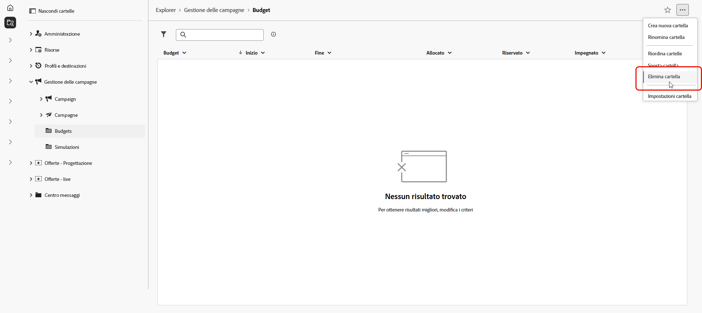{zoomable="yes"}</ph></source>
<target xml:lang="en-XX"><ph id="1" ctype="x-IMAGE">{zoomable="yes"}</ph></target>
</trans-unit>
<trans-unit id="tu52" xml:space="preserve">
<source xml:lang="en-US">Distribution of values in a folder</source>
<target xml:lang="en-XX">Distribuzione dei valori in una cartella</target>
</trans-unit>
<trans-unit id="tu53" xml:space="preserve">
<source xml:lang="en-US">The distribution of values helps you understand the percentage of a value in a column within a table.</source>
<target xml:lang="en-XX">La distribuzione dei valori consente di comprendere la percentuale di un valore in una colonna all’interno di una tabella.</target>
</trans-unit>
<trans-unit id="tu54" xml:space="preserve">
<source xml:lang="en-US">To view the distribution of values in a folder, proceed as explained below.</source>
<target xml:lang="en-XX">Per visualizzare la distribuzione dei valori in una cartella, procedi come spiegato di seguito.</target>
</trans-unit>
<trans-unit id="tu55" xml:space="preserve">
<source xml:lang="en-US">For example, among the deliveries, you may want to know the distribution of values in the <ph id="1" ctype="x-STRONG_EMPHASIS">**</ph>Channel<ph id="2" ctype="x-STRONG_EMPHASIS">**</ph> column.</source>
<target xml:lang="en-XX">Ad esempio, tra le consegne, desideri conoscere la distribuzione dei valori della colonna <ph id="1" ctype="x-STRONG_EMPHASIS">**</ph>Canale<ph id="2" ctype="x-STRONG_EMPHASIS">**</ph>.</target>
</trans-unit>
<trans-unit id="tu56" xml:space="preserve">
<source xml:lang="en-US">To get this information, go to the <ph id="1" ctype="x-STRONG_EMPHASIS">**[!UICONTROL </ph>Deliveries<ph id="3" ctype="x-LINK_REF">]**</ph> folder and click the <ph id="5" ctype="x-STRONG_EMPHASIS">**[!UICONTROL </ph>Configure columns<ph id="7" ctype="x-LINK_REF">]**</ph> icon.</source>
<target xml:lang="en-XX">Per ottenere queste informazioni, passa alla cartella <ph id="1" ctype="x-STRONG_EMPHASIS">**[!UICONTROL </ph>Consegne<ph id="3" ctype="x-LINK_REF">]**</ph> e fai clic sull’icona <ph id="5" ctype="x-STRONG_EMPHASIS">**[!UICONTROL </ph>Configura colonne<ph id="7" ctype="x-LINK_REF">]**</ph>.</target>
</trans-unit>
<trans-unit id="tu57" xml:space="preserve">
<source xml:lang="en-US">In the <ph id="1" ctype="x-STRONG_EMPHASIS">**[!UICONTROL </ph>Configure columns<ph id="3" ctype="x-LINK_REF">]**</ph> window, click the <ph id="5" ctype="x-STRONG_EMPHASIS">**[!UICONTROL </ph>Information<ph id="7" ctype="x-LINK_REF">]**</ph> icon related to the column you want to analyze. Then, click on the <ph id="9" ctype="x-STRONG_EMPHASIS">**[!UICONTROL </ph>Distribution of values<ph id="11" ctype="x-LINK_REF">]**</ph> button.</source>
<target xml:lang="en-XX">Nella finestra <ph id="1" ctype="x-STRONG_EMPHASIS">**[!UICONTROL </ph>Configura colonne<ph id="3" ctype="x-LINK_REF">]**</ph>, fai clic sull’icona <ph id="5" ctype="x-STRONG_EMPHASIS">**[!UICONTROL </ph>Informazioni<ph id="7" ctype="x-LINK_REF">]**</ph> della colonna che desideri analizzare. Quindi, fai clic sul pulsante <ph id="9" ctype="x-STRONG_EMPHASIS">**[!UICONTROL </ph>Distribuzione dei valori<ph id="11" ctype="x-LINK_REF">]**</ph>.</target>
</trans-unit>
<trans-unit id="tu58" xml:space="preserve">
<source xml:lang="en-US"><ph id="1" ctype="x-IMAGE">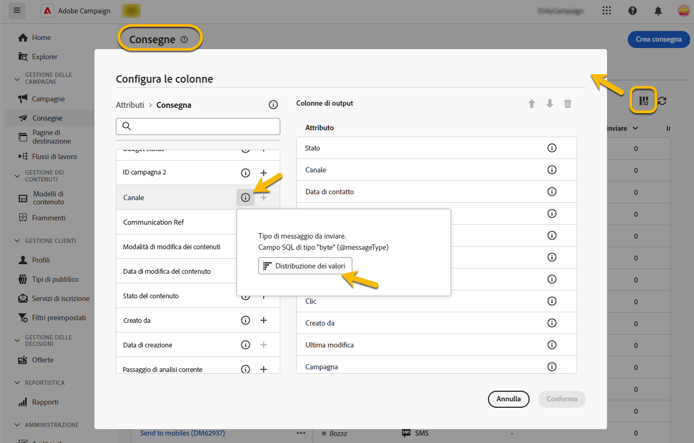{zoomable="yes"}</ph></source>
<target xml:lang="en-XX"><ph id="1" ctype="x-IMAGE">{zoomable="yes"}</ph></target>
</trans-unit>
<trans-unit id="tu59" xml:space="preserve">
<source xml:lang="en-US">You will see the percentage of values in the <ph id="1" ctype="x-STRONG_EMPHASIS">**[!UICONTROL </ph>Channel<ph id="3" ctype="x-LINK_REF">]**</ph> column.</source>
<target xml:lang="en-XX">Nella colonna <ph id="1" ctype="x-STRONG_EMPHASIS">**[!UICONTROL </ph>Canale<ph id="3" ctype="x-LINK_REF">]**</ph> viene visualizzata la percentuale dei valori.</target>
</trans-unit>
<trans-unit id="tu60" xml:space="preserve">
<source xml:lang="en-US"><ph id="1" ctype="x-IMAGE">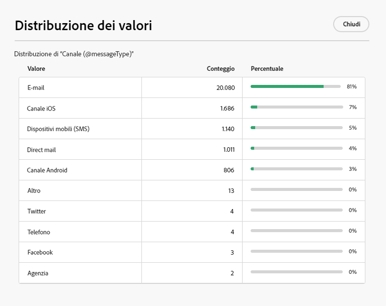{zoomable="yes"}</ph></source>
<target xml:lang="en-XX"><ph id="1" ctype="x-IMAGE">{zoomable="yes"}</ph></target>
</trans-unit>
<trans-unit id="tu61" xml:space="preserve">
<source xml:lang="en-US"><ph id="1" ctype="x-regxph" equiv-text="&lbrack;!NOTE">[!NOTE]</ph></source>
<target xml:lang="en-XX"><ph id="1" ctype="x-regxph" equiv-text="&lbrack;!NOTE">[!NOTE]</ph></target>
</trans-unit>
<trans-unit id="tu62" xml:space="preserve">
<source xml:lang="en-US">For columns with many values, only the first twenty values are displayed. A notification <ph id="1" ctype="x-STRONG_EMPHASIS">**[!UICONTROL </ph>Partial load<ph id="3" ctype="x-LINK_REF">]**</ph> warns you.</source>
<target xml:lang="en-XX">Per le colonne con molti valori, vengono visualizzati solo i primi venti. In caso di <ph id="1" ctype="x-STRONG_EMPHASIS">**[!UICONTROL </ph>Caricamento parziale<ph id="3" ctype="x-LINK_REF">]**</ph>, questo viene segnalato da una notifica.</target>
</trans-unit>
<trans-unit id="tu63" xml:space="preserve">
<source xml:lang="en-US">You can also view the distribution of values for a link.</source>
<target xml:lang="en-XX">È anche possibile visualizzare la distribuzione dei valori per un collegamento.</target>
</trans-unit>
<trans-unit id="tu64" xml:space="preserve">
<source xml:lang="en-US">In the attributes list, click the <ph id="1" ctype="x-STRONG_EMPHASIS">**</ph>+<ph id="2" ctype="x-STRONG_EMPHASIS">**</ph> button next to the desired link, as shown below. This adds the link to the <ph id="3" ctype="x-STRONG_EMPHASIS">**[!UICONTROL </ph>Output columns<ph id="5" ctype="x-LINK_REF">]**</ph>. You can now access the <ph id="7" ctype="x-STRONG_EMPHASIS">**[!UICONTROL </ph>Information<ph id="9" ctype="x-LINK_REF">]**</ph> icon, allowing you to view the distribution of its values. If you do not want to keep the link in the <ph id="11" ctype="x-STRONG_EMPHASIS">**[!UICONTROL </ph>Output columns<ph id="13" ctype="x-LINK_REF">]**</ph>, click the <ph id="15" ctype="x-STRONG_EMPHASIS">**[!UICONTROL </ph>Cancel<ph id="17" ctype="x-LINK_REF">]**</ph> button.</source>
<target xml:lang="en-XX">Nell’elenco degli attributi, fare clic sul pulsante <ph id="1" ctype="x-STRONG_EMPHASIS">**</ph>+<ph id="2" ctype="x-STRONG_EMPHASIS">**</ph> accanto al collegamento desiderato, come illustrato di seguito. Questo aggiunge il collegamento alle <ph id="3" ctype="x-STRONG_EMPHASIS">**[!UICONTROL </ph>colonne di output<ph id="5" ctype="x-LINK_REF">]**</ph>. È ora possibile accedere all’icona <ph id="7" ctype="x-STRONG_EMPHASIS">**[!UICONTROL </ph>Informazioni<ph id="9" ctype="x-LINK_REF">]**</ph>, che consente di visualizzare la distribuzione dei relativi valori. Se non desideri mantenere il collegamento nelle <ph id="11" ctype="x-STRONG_EMPHASIS">**[!UICONTROL </ph>Colonne di output<ph id="13" ctype="x-LINK_REF">]**</ph>, fai clic sul pulsante <ph id="15" ctype="x-STRONG_EMPHASIS">**[!UICONTROL </ph>Annulla<ph id="17" ctype="x-LINK_REF">]**</ph>.</target>
</trans-unit>
<trans-unit id="tu65" xml:space="preserve">
<source xml:lang="en-US"><ph id="1" ctype="x-IMAGE">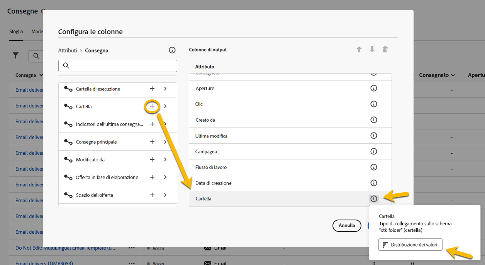{zoomable="yes"}</ph></source>
<target xml:lang="en-XX"><ph id="1" ctype="x-IMAGE">{zoomable="yes"}</ph></target>
</trans-unit>
<trans-unit id="tu66" xml:space="preserve">
<source xml:lang="en-US">It is also possible to view the distribution of values in a query modeler. <ph id="1" ctype="x-LINK">[</ph>Learn more here<ph id="2" ctype="x-LINK">](../query/build-query.md#distribution-of-values-in-a-query)</ph>.</source>
<target xml:lang="en-XX">È inoltre possibile visualizzare la distribuzione dei valori in un query modeler. <ph id="1" ctype="x-LINK">[</ph>Ulteriori informazioni<ph id="2" ctype="x-LINK">](../query/build-query.md#distribution-of-values-in-a-query)</ph>.</target>
</trans-unit>
<trans-unit id="tu67" xml:space="preserve">
<source xml:lang="en-US">Filter the values</source>
<target xml:lang="en-XX">Filtrare i valori</target>
</trans-unit>
<trans-unit id="tu68" xml:space="preserve">
<source xml:lang="en-US">By using the <ph id="1" ctype="x-STRONG_EMPHASIS">**[!UICONTROL </ph>Advanced filters<ph id="3" ctype="x-LINK_REF">]**</ph> in the distribution of values window, you can filter results based on specified conditions.</source>
<target xml:lang="en-XX">Utilizzando i <ph id="1" ctype="x-STRONG_EMPHASIS">**[!UICONTROL </ph>Filtri avanzati<ph id="3" ctype="x-LINK_REF">]**</ph> nella finestra di distribuzione dei valori, puoi filtrare i risultati in base a condizioni specificate.</target>
</trans-unit>
<trans-unit id="tu69" xml:space="preserve">
<source xml:lang="en-US">In the example of the delivery list above, which shows the distribution per channel, you can filter it to display only deliveries with a status of <ph id="1" ctype="x-STRONG_EMPHASIS">**</ph>Finished<ph id="2" ctype="x-STRONG_EMPHASIS">**</ph>.</source>
<target xml:lang="en-XX">Nell’esempio riportato sopra, che mostra l’elenco delle consegne distribuite per canale, è possibile utilizzare un filtro per visualizzare solo le consegne il cui stato è <ph id="1" ctype="x-STRONG_EMPHASIS">**</ph>Completato<ph id="2" ctype="x-STRONG_EMPHASIS">**</ph>.</target>
</trans-unit>
<trans-unit id="tu70" xml:space="preserve">
<source xml:lang="en-US"><ph id="1" ctype="x-IMAGE">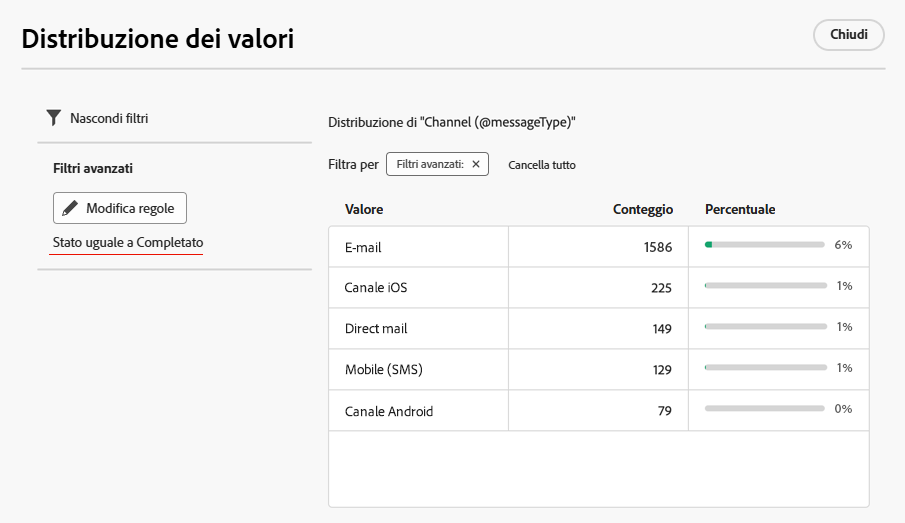{zoomable="yes"}</ph></source>
<target xml:lang="en-XX"><ph id="1" ctype="x-IMAGE">{zoomable="yes"}</ph></target>
</trans-unit>
</body>
</file>
</xliff>