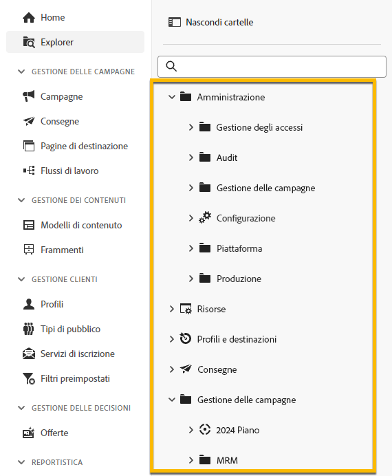
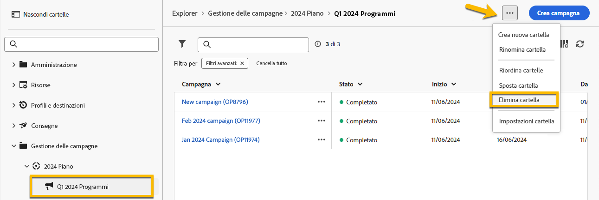

# Utilizzare le cartelle {#folders}

>[!CONTEXTUALHELP]
>id="acw_folder_properties"
>title="Proprietà cartella"
>abstract="Proprietà cartella"

>[!CONTEXTUALHELP]
>id="acw_folder_security"
>title="Sicurezza cartella"
>abstract="Sicurezza cartella"

>[!CONTEXTUALHELP]
>id="acw_folder_restrictions"
>title="Restrizioni cartella"
>abstract="Restrizioni cartella"

>[!CONTEXTUALHELP]
>id="acw_folder_schedule"
>title="Pianificazione cartella"
>abstract="Pianificazione cartella"

## Informazioni sulle cartelle

In Adobe Campaign le cartelle sono oggetti che consentono di organizzare i componenti e i dati.

È possibile creare, rinominare, riordinare e spostare cartelle nella struttura di navigazione. Puoi anche eliminarle in base ai tuoi diritti.

{zoomable="yes"}

Puoi impostare un tipo di cartella. Ad esempio: una cartella di consegne.
L’icona della cartella cambia in base a questo tipo.

## Creare una nuova cartella

Per creare una nuova cartella nell’interfaccia utente di Adobe Campaign Web, segui questi passaggi:

1. In **[!UICONTROL Explorer]**, passa alla cartella in cui desideri creare la nuova cartella.
Nel menu **[!UICONTROL ...]**, è disponibile **[!UICONTROL Crea nuova cartella]**

{zoomable="yes"}

Per impostazione predefinita, quando si crea una nuova cartella, il tipo di cartella è quello della cartella principale.
Nel nostro esempio, creiamo una cartella nella cartella **[!UICONTROL Consegne]**.

{zoomable="yes"}

1. Modifica il tipo di cartella facendo clic sull’icona Tipo cartella, se necessario, e selezionala nell’elenco presentato, come segue:

{zoomable="yes"}

Imposta il tipo di cartella facendo clic sul pulsante **[!UICONTROL Conferma]**.

Per creare una cartella senza un tipo specifico, scegli il tipo **[!UICONTROL Cartella generica]**.

È, inoltre, possibile [creare e gestire cartelle nella console di Adobe Campaign](https://experienceleague.adobe.com/it/docs/campaign/campaign-v8/config/configuration/folders-and-views).

## Eliminare una cartella

>[!CAUTION]
>
>Durante l’eliminazione di una cartella, vengono eliminati anche tutti i dati memorizzati al suo interno.

Per eliminare una cartella, selezionala nella struttura **[!UICONTROL Explorer]** e fai clic sul menu **[!UICONTROL ...]**.
Scegli **[!UICONTROL Elimina cartella]**.

{zoomable="yes"}

## Distribuzione dei valori in una cartella {#distribution-values-folder}

La distribuzione dei valori consente di conoscere la percentuale di un valore in una colonna di una tabella.

Per conoscere la distribuzione dei valori in una cartella, procedere come segue:

Ad esempio, tra le consegne, desideriamo conoscere la distribuzione dei valori della colonna **Canale**.

Per ottenere queste informazioni, passare alla cartella **[!UICONTROL Consegne]** e fare clic sull’icona **[!UICONTROL Configura colonne]**.

Nella finestra **[!UICONTROL Configura colonne]**, fare clic sull’icona **[!UICONTROL Informazioni]** della colonna che desideri conoscere. Quindi, fare clic sul pulsante **[!UICONTROL Distribuzione dei valori]**.

{zoomable="yes"}

Nella colonna **[!UICONTROL Canale]** si otterrà la percentuale dei valori.

{zoomable="yes"}

>[!NOTE]
>
> Per le colonne con molti valori, verranno visualizzati solo i primi venti valori. Verrà visualizzato un avviso con la notifica **[!UICONTROL Caricamento parziale]**.

È anche possibile avere la distribuzione dei valori di un collegamento.

Nell’elenco degli attributi, fare clic sul pulsante **+** accanto al collegamento desiderato, come illustrato di seguito. Questo aggiunge il collegamento alle **[!UICONTROL colonne di output]**. È ora possibile disporre dell&#39;icona **[!UICONTROL Informazioni]**, che consente di visualizzare la distribuzione dei relativi valori. Se non si desidera mantenere il collegamento nelle **[!UICONTROL Colonne di output]**, assicurarsi di fare clic sul pulsante **[!UICONTROL Annulla]**.

{zoomable="yes"}

È inoltre possibile disporre della distribuzione dei valori in un query modeler. [Ulteriori informazioni](../query/build-query.md#distribution-of-values-in-a-query).
