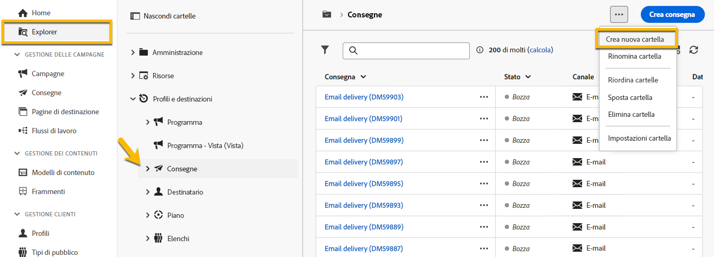
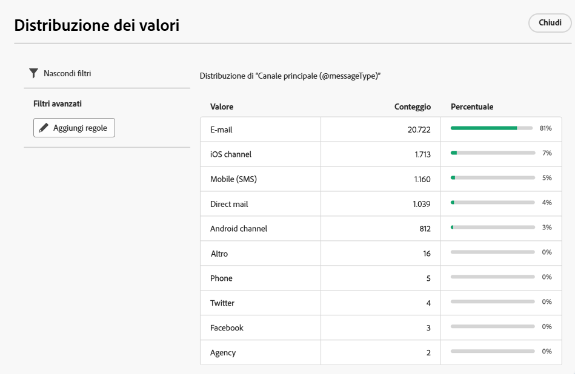
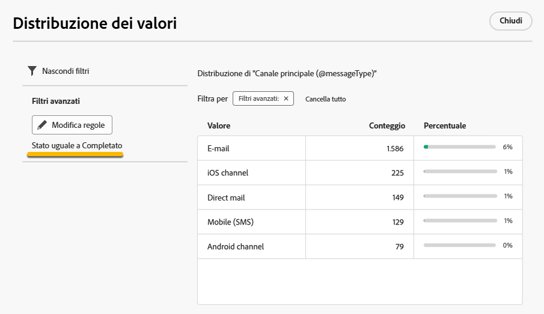

# Utilizzare le cartelle {#folders}

>[!CONTEXTUALHELP]
>id="acw_folder_properties"
>title="Proprietà cartella"
>abstract="Proprietà cartella"

>[!CONTEXTUALHELP]
>id="acw_folder_security"
>title="Sicurezza cartella"
>abstract="Sicurezza cartella"

>[!CONTEXTUALHELP]
>id="acw_folder_schedule"
>title="Pianificazione cartella"
>abstract="Pianificazione cartella"

## Informazioni sulle cartelle {#about-folders}

In Adobe Campaign le cartelle sono oggetti che consentono di organizzare i componenti e i dati.

È possibile creare, rinominare, riordinare e spostare cartelle nella struttura di navigazione. Puoi anche eliminarli in base ai tuoi diritti.

{zoomable="yes"}

Puoi impostare un tipo di cartella. Ad esempio, una cartella di consegne. L’icona della cartella cambia in base al tipo.

>[!CONTEXTUALHELP]
>id="acw_folder_restrictions"
>title="Restrizioni cartella"
>abstract="Le cartelle Oggetti creati automaticamente e Flussi di lavoro tecnici sono soggette a restrizioni e non possono essere visualizzate nel pannello laterale a sinistra."

>[!IMPORTANT]
>
>Le cartelle **[!UICONTROL Oggetti creati automaticamente]** e **[!UICONTROL Flussi di lavoro tecnici]** sono soggette a restrizioni e non possono essere visualizzate nel pannello laterale a sinistra.

## Creare una nuova cartella {#create-a-folder}

Per creare una nuova cartella nell’interfaccia utente di Adobe Campaign Web, segui questi passaggi:

1. In **[!UICONTROL Explorer]**, passa alla cartella in cui desideri creare la nuova cartella. Nel menu **[!UICONTROL ...]**, seleziona **[!UICONTROL Crea nuova cartella]**.

{zoomable="yes"}

Per impostazione predefinita, quando viene creata una nuova cartella, il tipo di cartella corrisponde a quello della cartella principale. In questo esempio viene creata una cartella nella cartella **[!UICONTROL Consegne]**.

{zoomable="yes"}

1. Modifica il tipo di cartella facendo clic sull’icona del tipo di cartella, se necessario, e seleziona il tipo desiderato dall’elenco presentato, come mostrato di seguito:

{zoomable="yes"}

Imposta il tipo di cartella facendo clic sul pulsante **[!UICONTROL Conferma]**.

Se desideri creare una cartella senza un tipo specifico, seleziona il tipo **[!UICONTROL Cartella generica]**.

È, inoltre, possibile [creare e gestire cartelle nella console di Adobe Campaign](https://experienceleague.adobe.com/it/docs/campaign/campaign-v8/config/configuration/folders-and-views).

## Riordinare le cartelle {#reorder-folders}

Puoi riordinare le cartelle in base alle esigenze. A tale scopo, fai clic su **[!UICONTROL Riordina cartelle]**, come mostrato di seguito.

In questo esempio, la cartella **Consegne** contiene quattro sottocartelle.

{zoomable="yes"}

Puoi cambiare l’ordine delle cartelle **trascinandole** oppure utilizzando le icone **freccia su e freccia giù**.

{zoomable="yes"}

### Cartelle preferite {#favorite-folders}

>[!CONTEXTUALHELP]
>id="acw_folder_favorites"
>title="Preferite"
>abstract="Le cartelle preferite verranno visualizzate nella parte superiore della scheda a sinistra."

Le cartelle contrassegnate come “Preferite” verranno visualizzate sempre nella parte superiore della scheda a sinistra.

Puoi aggiungere cartelle come preferite facendo clic sul pulsante a forma di stella in alto a destra quando visualizzi una cartella.

{zoomable="yes"}

## Eliminare una cartella {#delete-a-folder}

>[!CAUTION]
>
>Durante l’eliminazione di una cartella, vengono eliminati anche tutti i dati memorizzati al suo interno.

Per eliminare una cartella, selezionala nella struttura **[!UICONTROL Explorer]** e fai clic sul menu **[!UICONTROL ...]**. Scegli **[!UICONTROL Elimina cartella]**.

{zoomable="yes"}

## Distribuzione dei valori in una cartella {#distribution-values-folder}

La distribuzione dei valori consente di comprendere la percentuale di un valore in una colonna all’interno di una tabella.

Per visualizzare la distribuzione dei valori in una cartella, procedi come spiegato di seguito.

Ad esempio, tra le consegne, desideri conoscere la distribuzione dei valori della colonna **Canale**.

Per ottenere queste informazioni, passa alla cartella **[!UICONTROL Consegne]** e fai clic sull’icona **[!UICONTROL Configura colonne]**.

Nella finestra **[!UICONTROL Configura colonne]**, fai clic sull’icona **[!UICONTROL Informazioni]** della colonna che desideri analizzare. Quindi, fai clic sul pulsante **[!UICONTROL Distribuzione dei valori]**.

{zoomable="yes"}

Nella colonna **[!UICONTROL Canale]** viene visualizzata la percentuale dei valori.

{zoomable="yes"}

>[!NOTE]
>
>Per le colonne con molti valori, vengono visualizzati solo i primi venti. In caso di **[!UICONTROL Caricamento parziale]**, questo viene segnalato da una notifica.

È anche possibile visualizzare la distribuzione dei valori per un collegamento.

Nell’elenco degli attributi, fare clic sul pulsante **+** accanto al collegamento desiderato, come illustrato di seguito. Questo aggiunge il collegamento alle **[!UICONTROL colonne di output]**. È ora possibile accedere all’icona **[!UICONTROL Informazioni]**, che consente di visualizzare la distribuzione dei relativi valori. Se non desideri mantenere il collegamento nelle **[!UICONTROL Colonne di output]**, fai clic sul pulsante **[!UICONTROL Annulla]**.

{zoomable="yes"}

È inoltre possibile visualizzare la distribuzione dei valori in un query modeler. [Ulteriori informazioni](../query/build-query.md#distribution-of-values-in-a-query).

### Filtrare i valori {#filter-values}

Utilizzando i **[!UICONTROL Filtri avanzati]** nella finestra di distribuzione dei valori, puoi filtrare i risultati in base a condizioni specificate.

Nell’esempio riportato sopra, che mostra l’elenco delle consegne distribuite per canale, è possibile utilizzare un filtro per visualizzare solo le consegne il cui stato è **Completato**.

{zoomable="yes"}