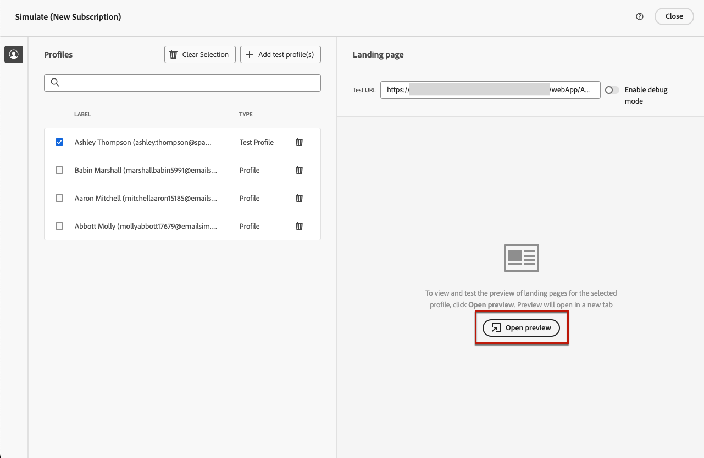

# Creare e pubblicare pagine di destinazione {#create-lp}

>[!CONTEXTUALHELP]
>id="acw_landingpages_menu"
>title="Creare e gestire pagine di destinazione"
>abstract="Adobe Campaign consente di creare, progettare e condividere pagine di destinazione per indirizzare gli utenti a pagine web online in cui gestire l’acquisizione, l’iscrizione/annullamento dell’iscrizione e inserire nell’elenco Bloccati casi d’uso, in base ai modelli incorporati."

L’interfaccia utente di Campaign Web consente di creare, progettare e pubblicare pagine di destinazione. Dopo la pubblicazione, puoi inserire un collegamento al modulo in una consegna. Dopo che i destinatari hanno fatto clic su tale collegamento, vengono indirizzati alla pagina di destinazione corrispondente.

[!DNL Adobe Campaign] viene fornito con quattro modelli per gestire i seguenti casi d’uso: **acquisizione**, **abbonamento**, **annullamento iscrizione**, e **inserisco nell&#39;elenco Bloccati**. [Ulteriori informazioni](lp-use-cases.md)

## Accedere alle pagine di destinazione {#access-landing-pages}

Per accedere all’elenco delle pagine di destinazione, seleziona **[!UICONTROL Gestione delle campagne]** > **[!UICONTROL Pagine di destinazione]** dal menu a sinistra.

{zoomable=&quot;yes&quot;}

Il **[!UICONTROL Pagine di destinazione]** inventory visualizza tutti gli articoli creati. Puoi filtrarli utilizzando **[!UICONTROL Mostra filtri]** pulsante. È possibile limitare i risultati a uno specifico [cartella](../get-started/permissions.md#folders) utilizzando l’elenco a discesa, oppure aggiungi regole utilizzando [query modeler](../query/query-modeler-overview.md).

{zoomable=&quot;yes&quot;}

<!--From this list, you can access the [landing page Live report](../reports/lp-report-live.md) or [landing page Global report](../reports/lp-report-global.md) for published items.-->

>[!CAUTION]
>
>Non è possibile visualizzare o modificare le pagine di destinazione create dalla console client (moduli web) nell’interfaccia utente di Campaign Web. Per ulteriori informazioni, consulta [Documentazione della console di Campaign](https://experienceleague.adobe.com/docs/campaign/campaign-v8/content/webapps.html?lang=it){target="_blank"}.

<!--If you unpublish a landing page which is referenced in a message, the link to the landing page will be broken and an error page will be displayed. You cannot delete a published landing page. To delete it, you must first unpublish it.-->

Puoi duplicare o eliminare una pagina di destinazione. Fai clic sui puntini di sospensione accanto a una pagina di destinazione per selezionare l’azione desiderata.

## Creare una pagina di destinazione {#create-landing-page}

>[!CONTEXTUALHELP]
>id="acw_landingpages_properties"
>title="Definire le proprietà della pagina di destinazione"
>abstract="Compila i campi delle proprietà, ad esempio l’etichetta, e, se necessario, modifica lo schema. Inoltre, puoi modificare il nome interno, cambiare la cartella in cui è memorizzata la pagina di destinazione e fornire una descrizione."

>[!CONTEXTUALHELP]
>id="acw_landingpages_pages_list"
>title="Definire il contenuto di ciascuna pagina"
>abstract="Adatta il contenuto di ogni pagina appartenente a questa pagina di destinazione, ad esempio il modulo stesso, la pagina di conferma visualizzata al momento dell’invio del modulo oppure la pagina a cui gli utenti vengono indirizzati nel caso in cui si verifichi un errore."

>[!CONTEXTUALHELP]
>id="acw_landingpages_schedule"
>title="Pianificare la pagina di destinazione"
>abstract="Puoi definire una data di inizio e una data di fine per la pagina di destinazione. Al termine del periodo di validità della pagina, il modulo non è più disponibile. Viene invece visualizzata la pagina la pagina **Scadenza**."

>[!CONTEXTUALHELP]
>id="acw_landingpages_preload"
>title="Definire le opzioni di precaricamento"
>abstract="Quando l’opzione **Precompila con i dati a cui si fa riferimento nel modulo** è selezionata, se il visitatore della pagina di destinazione corrisponde a un profilo del database, le informazioni del profilo vengono precaricate automaticamente nel modulo. Con l’opzione **Autorizza l’assenza di ID** selezionata, tutti i visitatori, inclusi gli utenti anonimi, possono accedere alla pagina di destinazione."

<!--With the **Skip preloading if no ID** option selected, each profile entered will be added to the database after approval of the form."-->

>[!CONTEXTUALHELP]
>id="acw_landingpages_storage"
>title="Definire le opzioni di archiviazione"
>abstract="La sezione di precaricamento consente di indicare come trovare il record da aggiornare nel database."

<!--The main steps to create landing pages are as follows:

{zoomable="yes"}-->

Per creare una pagina di destinazione, effettua le seguenti operazioni:

1. Dalla sezione **[!UICONTROL Pagine di destinazione]** inventory, fai clic su **[!UICONTROL Crea pagina di destinazione]**.

   {zoomable=&quot;yes&quot;}

1. Seleziona un modello:
   * **[!UICONTROL Acquisizione]**: questo è il modello predefinito per le pagine di destinazione, che ti consente di acquisire e aggiornare i dati del profilo.
   * **[!UICONTROL Abbonamento]**: utilizza questo modello per consentire agli utenti di abbonarsi a uno specifico [servizio](../audience/manage-services.md).
   * **[!UICONTROL Annullamento iscrizione]**: questo modello può essere utilizzato in una consegna inviata agli abbonati di un servizio, per consentire loro di annullare l’abbonamento [servizio](../audience/manage-services.md).
   * **[!UICONTROL Inserisco nell&#39;elenco Bloccati]**: questo modello deve essere utilizzato quando un profilo fa clic su un collegamento di rinuncia in una consegna e non desidera più essere contattato.

   {zoomable=&quot;yes&quot;}

   >[!NOTE]
   >
   >Scopri come implementare i diversi casi d’uso corrispondenti a ciascun modello in [questa pagina](lp-use-cases.md).

1. Fai clic su **[!UICONTROL Crea]**.

1. Compila il **[!UICONTROL Proprietà]** campi come l’etichetta.

   Per impostazione predefinita, le pagine di destinazione sono memorizzate in **[!UICONTROL Applicazioni web]** cartella. È possibile modificarlo individuando la posizione desiderata nella **[!UICONTROL Opzioni aggiuntive]**. [Scopri come utilizzare le cartelle](../get-started/permissions.md#folders)

   {zoomable=&quot;yes&quot;}

1. In **[!UICONTROL Precaricamento dati]** , sono disponibili le due opzioni seguenti:

   * Quando l’opzione **[!UICONTROL Precompila con i dati a cui si fa riferimento nel modulo]** è selezionata, se il visitatore della pagina di destinazione corrisponde a un profilo del database, le informazioni del profilo vengono precaricate automaticamente nel modulo. L’utente deve solo compilare i campi mancanti e, se necessario, aggiornare i valori esistenti. Questo consente di unire i dati per i profili esistenti invece di creare duplicati.

     >[!NOTE]
     >
     >Questa opzione è selezionata per impostazione predefinita per tutti i modelli di pagina di destinazione.

   <!--* The **[!UICONTROL Skip preloading if no ID]** option must be selected if you do not wish to update profiles. In this case, each profile entered will be added to the database after approval of the form. This option is used, for example, when the form is posted on a website.-->

   * Il **[!UICONTROL Autorizza assenza di ID]** consente a qualsiasi visitatore di accedere alla pagina di destinazione. Deselezionando questa opzione si impedisce ai visitatori anonimi di utilizzarla, il che significa che solo gli utenti identificati possono accedere al modulo e inviarlo.

     >[!AVAILABILITY]
     >
     >Questa funzionalità è a disponibilità limitata (LA). È limitata ai clienti che eseguono la migrazione **da Adobe Campaign Standard ad Adobe Campaign v8** e non possono essere distribuiti in nessun altro ambiente.

     Per **[!UICONTROL Acquisizione]** e **[!UICONTROL Abbonamento]** modelli, questa opzione è selezionata per impostazione predefinita. Per **[!UICONTROL Annullamento iscrizione]** e **[!UICONTROL Inserisco nell&#39;elenco Bloccati]** modelli, questa opzione è deselezionata per impostazione predefinita e non può essere modificata<!--as per ticket - TBC? in that case, is it greyed out or doesn't display?-->.

1. Una pagina di destinazione può avere pagine successive. Per aggiungere pagine, sfoglia il **[!UICONTROL Pagine]** e fare clic sul pulsante **[!UICONTROL Modifica contenuto]** per ogni pagina che desideri progettare per questa pagina di destinazione. Il contenuto di ogni pagina è già precompilato. Modificali in base alle esigenze. [Ulteriori informazioni](lp-content.md)

   {zoomable=&quot;yes&quot;}

1. In **[!UICONTROL Storage]** sezione, il **[!UICONTROL Aggiornare il record precaricato]** è selezionata per impostazione predefinita. Consente di aggiornare i profili memorizzati nel database tramite la pagina di destinazione. La casella di precaricamento consente di indicare come trovare il record da aggiornare nel database.

   Puoi anche scegliere tra i campi nel contesto corrente della pagina di destinazione, quelli che verranno utilizzati per trovare il profilo corrispondente nel database. Per farlo, deseleziona la **[!UICONTROL Aggiornare il record precaricato]** e seleziona i campi desiderati in **[!UICONTROL Opzioni di riconciliazione]**.

   {zoomable=&quot;yes&quot;}

1. Crea **[!UICONTROL Dati aggiuntivi]** per memorizzare i dati interni durante l’invio della pagina di destinazione. Questi dati non sono visibili agli utenti che visitano la pagina. Vengono presi in considerazione solo i valori costanti.

   >[!AVAILABILITY]
   >
   >Questa funzionalità è a disponibilità limitata (LA). È limitata ai clienti che eseguono la migrazione **da Adobe Campaign Standard ad Adobe Campaign v8** e non possono essere distribuiti in nessun altro ambiente.

   {zoomable=&quot;yes&quot;}

1. Puoi definire una data di inizio e una data di fine per la pagina di destinazione. Seleziona **[!UICONTROL Abilita pianificazione]** e impostare le date.

   {zoomable=&quot;yes&quot;}

   * La pagina di destinazione viene pubblicata automaticamente nella data/ora di inizio specificata.

     >[!NOTE]
     >
     >Se non è definita alcuna data di inizio, la pagina di destinazione diventa attiva non appena viene pubblicata.

   * Quando la pagina raggiunge la data di fine, <!--the landing page is automatically unpublished and -->modulo non più disponibile. Viene invece visualizzata la pagina la pagina **[!UICONTROL Scadenza]**.

     >[!NOTE]
     >
     >Per motivi di sicurezza e prestazioni della piattaforma, l’Adobe consiglia di impostare una data di fine.

1. Clic **[!UICONTROL Revisione e pubblicazione]**.

Una volta definite tutte le impostazioni e [progettato](lp-content.md) tutte le pagine, puoi [test](#test-landing-page) e [pubblicare](#publish-landing-page) la pagina di destinazione come descritto di seguito.

## Verificare la pagina di destinazione {#test-landing-page}

>[!CONTEXTUALHELP]
>id="acw_landingpages_simulate"
>title="Simulare una pagina di destinazione"
>abstract="Puoi visualizzare un’anteprima della pagina di destinazione nell’interfaccia utente di Campaign Web oppure aprirla in una nuova scheda del browser web."

>[!CONTEXTUALHELP]
>id="ac_preview_lp_profiles"
>title="Visualizzare l’anteprima e testare la pagina di destinazione"
>abstract="Una volta definite le impostazioni e il contenuto della pagina di destinazione, puoi utilizzare i profili di test per visualizzarli in anteprima."

Una volta definiti le impostazioni e il contenuto della pagina di destinazione, puoi utilizzare i profili di test per visualizzarne l’anteprima. Se è stato inserito [contenuti personalizzati](../personalization/gs-personalization.md), potrai controllare come vengono visualizzati questi contenuti nella pagina di destinazione utilizzando i dati del profilo di test.

>[!CAUTION]
>
>Per poter visualizzare in anteprima i messaggi e inviare le bozze, è necessario disporre di profili di test. [Ulteriori informazioni sui profili di test](../audience/test-profiles.md)

Per verificare la pagina di destinazione, effettua le seguenti operazioni:

1. Dopo aver fatto clic su **[!UICONTROL Revisione e pubblicazione]**, seleziona la **[!UICONTROL Simula contenuto]** dal dashboard della pagina di destinazione per accedere alla selezione del profilo di test.

   {zoomable=&quot;yes&quot;}

1. Dalla sezione **[!UICONTROL Simula]** , seleziona uno o più profili di test.

   I passaggi per selezionare i profili di test sono gli stessi utilizzati per testare un messaggio. Sono descritte in dettaglio nella [Anteprima e test](../preview-test/preview-test.md) sezione.

1. Durante il test di una pagina di destinazione dinamica (con **[!UICONTROL Servizio da URL]** opzione selezionata - [ulteriori informazioni](../landing-pages/create-lp.md#define-actions-on-form-submission)

1. Seleziona **[!UICONTROL Apri anteprima]** per verificare la pagina di destinazione.

   {zoomable=&quot;yes&quot;}

1. L’anteprima della pagina di destinazione viene visualizzata in una nuova scheda. Gli elementi personalizzati vengono sostituiti dai dati del profilo di test selezionati.

   Se hai selezionato **[!UICONTROL Precompilare con i dati a cui si fa riferimento nel modulo]** nelle impostazioni della pagina di destinazione, i campi del modulo vengono precompilati automaticamente con i dati del profilo di test corrispondenti.<!--TBC-->

   {zoomable=&quot;yes&quot;}

1. Seleziona altri profili di test per visualizzare in anteprima il rendering per ogni variante della pagina di destinazione.

<!--Can you preview Confirmation/Error/Expiration pages?-->

## Pubblicare la pagina di destinazione {#publish-landing-page}

Una volta che la pagina di destinazione è pronta e convalidata, pubblicala per renderla disponibile per l’utilizzo in una consegna utilizzando il pulsante corrispondente.

Dopo la pubblicazione:

* La pagina di destinazione viene aggiunta all’elenco delle pagine di destinazione con **[!UICONTROL Pubblicato]** stato. Ora è attivo e pronto per essere utilizzato come riferimento nei contenuti.

* È possibile copiare e incollare **[!UICONTROL URL della pagina di destinazione]** che viene visualizzata nella parte superiore della pagina in un browser web per visualizzare l’anteprima della pagina di destinazione.

>[!CAUTION]
>
>Per testare o sfruttare appieno la pagina di destinazione, non puoi copiare e incollare questo collegamento direttamente in un browser web o nelle consegne. Invece, utilizza [Simula contenuto](#test-landing-page) per testarlo e seguire i passaggi descritti in [questa sezione](lp-use-cases.md) per utilizzare correttamente la pagina di destinazione.

{zoomable=&quot;yes&quot;}

Puoi monitorare l’impatto della pagina di destinazione tramite i registri<!--and specific reports-->. Fai clic su **[!UICONTROL Registri]** pulsante.
