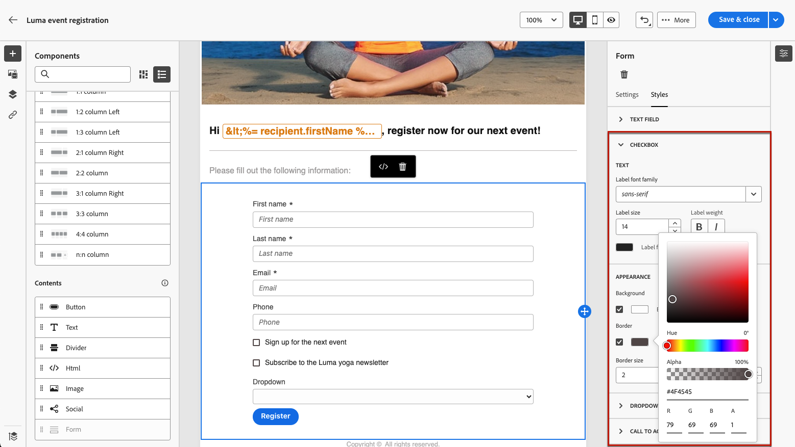

# Definire il contenuto specifico della pagina di destinazione {#lp-content}

>[!CONTEXTUALHELP]
>id="ac_lp_components"
>title="Utilizzare i componenti per contenuti"
>abstract="I componenti per contenuti sono dei segnaposto di contenuto vuoti che possono essere utilizzati per creare il layout di una pagina di destinazione. Per definire un contenuto specifico che consenta agli utenti di selezionare e inviare le scelte effettuate, utilizza il componente Modulo."

>[!CONTEXTUALHELP]
>id="acw_landingpages_primarypage"
>title="Definire le impostazioni della pagina principale"
>abstract="La pagina principale viene visualizzata immediatamente dopo che gli utenti hanno fatto clic sul collegamento alla pagina di destinazione, ad esempio da un’e-mail o da un sito web."

Puoi modificare il contenuto di qualsiasi pagina della pagina di destinazione.

La prima pagina, che viene visualizzata immediatamente dopo aver fatto clic sul collegamento alla pagina di destinazione, è già precompilata con il [componente modulo specifico per la pagina di destinazione](#use-form-component) per il modello selezionato<!-- to enable users to select and submit their choices-->.

Anche il contenuto delle pagine **[!UICONTROL Conferma]**, **[!UICONTROL Errore]** e **[!UICONTROL Scadenza]** è precompilato. Modificali in base alle esigenze.

Puoi anche definire [gli stili per la pagina di destinazione](#lp-form-styles).

Per progettare ulteriormente il contenuto della pagina di destinazione:

* Utilizza gli stessi componenti utilizzati per progettare un’e-mail. [Ulteriori informazioni](../email/content-components.md#add-content-components)

* Aggiungi contenuto condizionale alle pagine di destinazione nello stesso modo di un’e-mail. [Ulteriori informazioni](../personalization/conditions.md#condition-condition-builder)

  >[!AVAILABILITY]
  >
  >Questa funzionalità è a disponibilità limitata (LA). È limitata ai clienti che eseguono la migrazione **da Adobe Campaign Standard ad Adobe Campaign v8** e non possono essere distribuiti in nessun altro ambiente.

## Utilizzare il componente modulo {#use-form-component}

>[!CONTEXTUALHELP]
>id="ac_lp_formfield"
>title="Impostare i campi del componente modulo"
>abstract="Definisci in che modo i destinatari visualizzeranno e invieranno le loro scelte dalla pagina di destinazione."

>[!CONTEXTUALHELP]
>id="acw_landingpages_calltoaction"
>title="Eventi successivi al clic sul pulsante"
>abstract="Definisci gli eventi che si verificheranno dopo l’invio del modulo della pagina di destinazione."

Per definire un contenuto specifico che consenta agli utenti di selezionare e inviare le proprie scelte dalla pagina di destinazione, modifica il componente **[!UICONTROL Modulo]**. Segui i passaggi seguenti.

1. Il componente **[!UICONTROL Modulo]** specifico per la pagina di destinazione è già visualizzato nell&#39;area di lavoro per il modello selezionato.

   >[!NOTE]
   >
   >Il componente **[!UICONTROL Modulo]** può essere utilizzato una sola volta sulla stessa pagina.

1. Selezionala. La scheda **[!UICONTROL Contenuto modulo]** viene visualizzata nella tavolozza di destra per consentire la modifica dei diversi campi del modulo.

   {zoomable="yes"}

   >[!NOTE]
   >
   >Passa alla scheda **[!UICONTROL Stili]** in qualsiasi momento per modificare gli stili del contenuto del componente modulo. [Ulteriori informazioni](#lp-form-styles)

1. Espandere il primo campo di testo, se presente, oppure aggiungerne uno utilizzando il pulsante **[!UICONTROL Aggiungi]**. Dalla sezione **[!UICONTROL Campo di testo 1]**, modificare il tipo di campo, il campo del database da aggiornare, l&#39;etichetta e il testo visualizzato nel campo prima che gli utenti immettano un valore.

   {zoomable="yes"}

1. Se necessario, seleziona l&#39;opzione **[!UICONTROL Rendi obbligatorio il campo modulo]**. In tal caso, la pagina di destinazione può essere inviata solo se l’utente ha compilato questo campo.

   >[!NOTE]
   >
   >Se non viene compilato un campo obbligatorio, viene visualizzato un messaggio di errore quando l’utente invia la pagina.

1. Espandere l&#39;eventuale casella di controllo o aggiungerne una utilizzando il pulsante **[!UICONTROL Aggiungi]**. Seleziona questa opzione se la casella di controllo deve aggiornare un servizio o un campo dal database.

   {zoomable="yes"}

   Se si seleziona **[!UICONTROL Abbonamento e servizi]**, selezionare un [servizio](../audience/manage-services.md) dall&#39;elenco e scegliere tra le due opzioni seguenti:

   * **[!UICONTROL Effettua l&#39;abbonamento se selezionato]**: gli utenti devono selezionare la casella per il consenso (consenso).
   * **[!UICONTROL Annulla iscrizione se selezionato]**: gli utenti devono selezionare la casella per rimuovere il consenso (rinuncia).

   Se si seleziona **[!UICONTROL Campo]**, selezionare un campo dall&#39;[elenco attributi](../get-started/attributes.md) e scegliere tra le due opzioni seguenti:

   * **[!UICONTROL Sì se selezionato]**.
   * **[!UICONTROL No se selezionato]**.

1. Elimina e aggiungi tutti i campi (ad esempio campi di testo, pulsanti di scelta, caselle di controllo, elenchi a discesa e così via) necessari.

1. Una volta aggiunti o aggiornati tutti i campi, fai clic su **[!UICONTROL Invito all&#39;azione]** per espandere la sezione corrispondente. Consente di definire il comportamento del pulsante nel componente **[!UICONTROL Modulo]**. [Scopri come](#define-actions-on-form-submission)

   {zoomable="yes"}

1. Salva il contenuto per tornare alle [proprietà della pagina di destinazione](create-lp.md#create-landing-page).

### Definire le azioni per l’invio dei moduli {#define-actions-on-form-submission}

1. Definisci cosa accade quando fai clic sul pulsante:

   * **[!UICONTROL Pagina di conferma]**: per impostazione predefinita, l&#39;utente viene reindirizzato alla pagina **[!UICONTROL Conferma]** impostata per la pagina di destinazione corrente.

   * **[!UICONTROL URL di reindirizzamento]**: immettere l&#39;URL della pagina a cui gli utenti vengono reindirizzati.

   * **[!UICONTROL Pagina di destinazione]**: seleziona un&#39;altra pagina di destinazione a cui reindirizzare gli utenti. Assicurati di configurare di conseguenza la pagina di destinazione selezionata.

1. Per apportare ulteriori aggiornamenti all&#39;invio del modulo, selezionare **[!UICONTROL Ulteriori aggiornamenti]** e selezionare l&#39;elemento che si desidera aggiornare:
   * Sottoscrizione [servizio](../audience/manage-services.md): definire se si desidera concedere il consenso o rinunciare agli utenti al momento dell&#39;invio del modulo. Durante la progettazione di un&#39;e-mail, se definisci un collegamento di tipo **[!UICONTROL Pagina di destinazione]** a questa pagina di destinazione, il servizio selezionato viene utilizzato automaticamente. [Ulteriori informazioni sull&#39;inserimento di collegamenti](../email/message-tracking.md)

     >[!NOTE]
     >
     >Se desideri utilizzare diversi servizi con questa pagina di destinazione, utilizza l&#39;opzione **[!UICONTROL Servizio dall&#39;URL]** descritta di seguito.

   * Canale: l’indirizzo e-mail utilizzato durante la compilazione del modulo.
   * Tutti i canali: all’invio del modulo, gli utenti hanno acconsentito o rinunciato (a seconda del modello selezionato) a/da tutte le comunicazioni del tuo marchio su tutti i canali.
   * Campo del database: selezionare un campo dall&#39;elenco degli attributi e definire se deve essere impostato su True o False al momento dell&#39;invio del modulo.

   {zoomable="yes"}

1. Selezionare l&#39;opzione **[!UICONTROL Servizio dall&#39;URL]** per consentire l&#39;utilizzo della pagina di destinazione per diversi servizi, rendendola dinamica. Definisci se desideri dare il consenso o rinunciare agli utenti durante l’invio del modulo.

   >[!AVAILABILITY]
   >
   >Questa funzionalità è a disponibilità limitata (LA). È limitata ai clienti che eseguono la migrazione **da Adobe Campaign Standard ad Adobe Campaign v8** e non possono essere distribuiti in nessun altro ambiente.

   {zoomable="yes"}

   Durante la progettazione di un&#39;e-mail, se definisci un collegamento di tipo **[!UICONTROL Pagina di destinazione]** a questa pagina di destinazione, puoi selezionare qualsiasi servizio dall&#39;elenco. Puoi quindi selezionare altri servizi durante la definizione degli altri collegamenti a questa pagina di destinazione. [Ulteriori informazioni sull&#39;inserimento di collegamenti](../email/message-tracking.md)

   {zoomable="yes"}

1. Invia un messaggio all’invio della pagina di destinazione. [Ulteriori informazioni](#lp-message)

### Invia un messaggio dopo l’invio {#lp-message}

>[!AVAILABILITY]
>
>Questa funzionalità è a disponibilità limitata (LA). È limitata ai clienti che eseguono la migrazione **da Adobe Campaign Standard ad Adobe Campaign v8** e non possono essere distribuiti in nessun altro ambiente.

Per inviare automaticamente un messaggio di conferma dopo l’invio di una pagina di destinazione, effettua le seguenti operazioni:

1. Nella sezione **[!UICONTROL INVITO ALL&#39;AZIONE]**, seleziona l&#39;opzione **[!UICONTROL Invia messaggio di conferma]**.

1. Nell’elenco a discesa associato, scegli il modello di messaggio transazionale da inviare.

{zoomable="yes"}

## Definire gli stili del modulo della pagina di destinazione {#lp-form-styles}

1. Per modificare gli stili del contenuto del componente modulo, passa in qualsiasi momento alla scheda **[!UICONTROL Stili]**.

1. La sezione **[!UICONTROL Campo di testo]** è espansa per impostazione predefinita. Consente di modificare l&#39;aspetto dei campi di testo, ad esempio il carattere dell&#39;etichetta, la posizione dell&#39;etichetta, il colore di sfondo del campo o il bordo del campo.

   {zoomable="yes"}

1. Espandere la sezione **[!UICONTROL Casella di controllo]** per definire l&#39;aspetto delle caselle di controllo e del testo corrispondente. Ad esempio, è possibile regolare la famiglia e la dimensione del carattere o il colore del bordo della casella di controllo.

   {zoomable="yes"}

1. Espandere e modificare qualsiasi altra sezione corrispondente ad altri campi aggiunti (pulsante di opzione, elenco a discesa, data e ora, ecc.) al modulo.

1. Espandi la sezione **[!UICONTROL Invito all&#39;azione]** per modificare l&#39;aspetto del pulsante nel modulo del componente. Ad esempio, modificare il tipo di carattere, aggiungere un bordo, modificare il colore dell&#39;etichetta al passaggio del mouse o regolare l&#39;allineamento del pulsante.

   {zoomable="yes"}

   Visualizzare in anteprima alcune impostazioni, ad esempio il colore dell&#39;etichetta del pulsante al passaggio del mouse, utilizzando il pulsante **[!UICONTROL Simula contenuto]**. [Ulteriori informazioni](create-lp.md#test-landing-page)

1. Salva le modifiche.