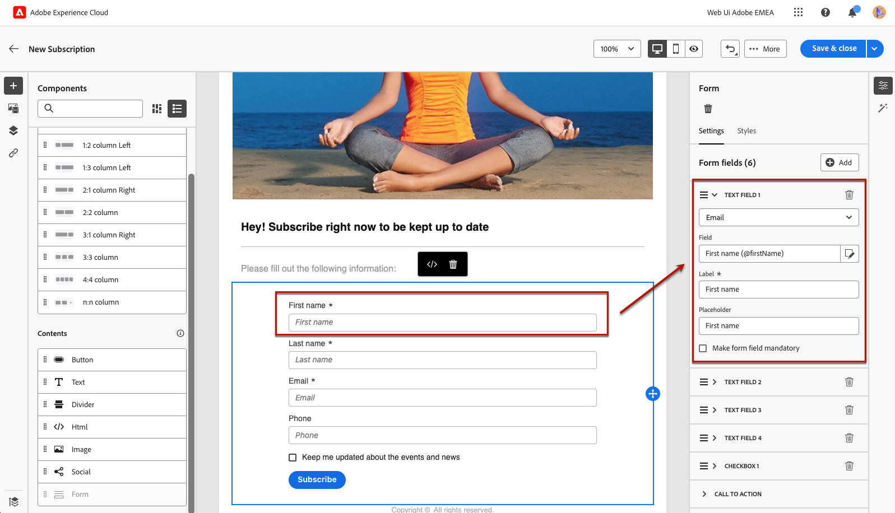
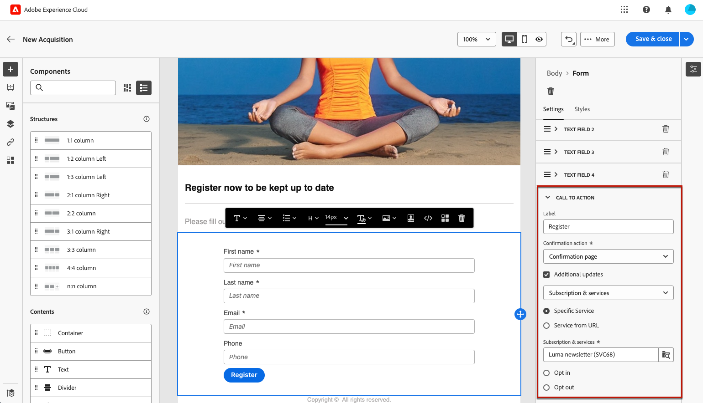
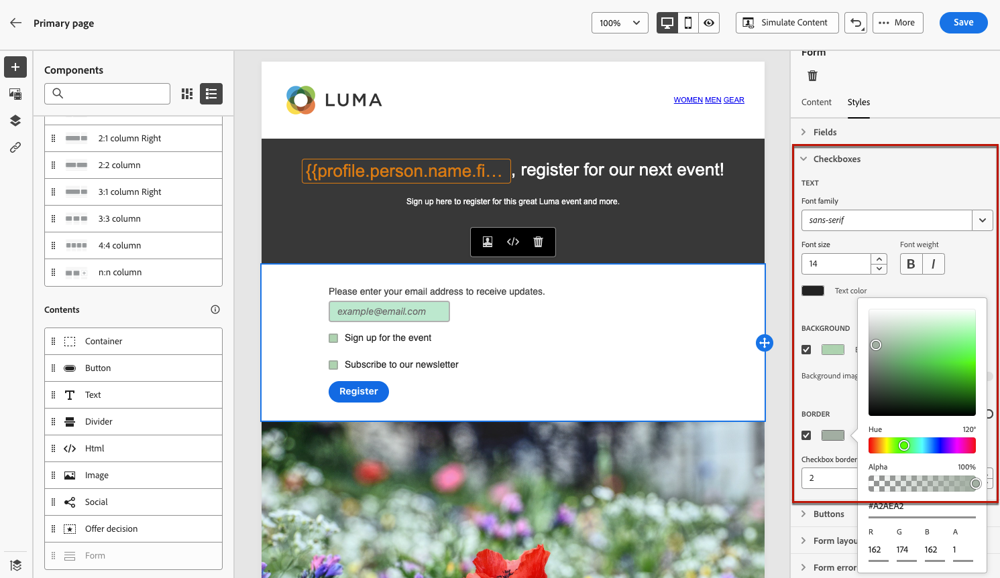

# Definire il contenuto specifico della pagina di destinazione {#lp-content}

>[!CONTEXTUALHELP]
>id="ac_lp_components"
>title="Utilizzare i componenti per contenuti"
>abstract="I componenti per contenuti sono dei segnaposto di contenuto vuoti che possono essere utilizzati per creare il layout di una pagina di destinazione. Per definire contenuti specifici che consentano agli utenti di selezionare e inviare le proprie scelte, utilizza il componente modulo."

Quando modifichi il contenuto di una pagina della pagina di destinazione, questa è già precompilata.

La pagina principale è quella che viene visualizzata immediatamente dagli utenti dopo che hanno fatto clic sul collegamento alla pagina di destinazione, ad esempio da un’e-mail o da un sito web. La pagina principale è già precompilata con [componente modulo specifico per la pagina di destinazione](#use-form-component) per consentire agli utenti di selezionare e inviare le proprie scelte. Puoi anche definire [stili specifici della pagina di destinazione](#lp-form-styles).

Per progettare ulteriormente il contenuto della pagina di destinazione, puoi utilizzare gli stessi componenti utilizzati per un’e-mail. [Ulteriori informazioni](../email/content-components.md#add-content-components)

<!--
The content of the **[!UICONTROL Confirmation]**, **[!UICONTROL Error]** and **[!UICONTROL Expiration]** pages is also pre-filled. Edit them as needed.

Set the subscription form to the appropriate fields from the database to make sure it will work correctly.

The landing page default fields are already there for the selected template.

>[!NOTE]
>
>You can also create a click-through landing page without a **[!UICONTROL Form]** component. In that case, the landing page will be displayed to users, but they will not be required to submit any form. This can be useful if you only want to showcase a landing page without requiring any action from your recipients such as opt-in or opt out, or want to provide information that doesn't require user input.

Using the landing page content designer, you can also leverage contextual data coming from the primary page in a subpage. [Learn more](#use-primary-page-context)-->

## Utilizzare il componente modulo {#use-form-component}

>[!CONTEXTUALHELP]
>id="ac_lp_formfield"
>title="Impostare i campi del componente modulo"
>abstract="Definisci in che modo i destinatari visualizzeranno e invieranno le loro scelte dalla pagina di destinazione."

>[!CONTEXTUALHELP]
>id="acw_landingpages_calltoaction"
>title="Eventi successivi al clic sul pulsante"
>abstract="Definisci gli eventi che si verificheranno dopo l’invio del modulo della pagina di destinazione."

Per definire contenuti specifici che consentano agli utenti di selezionare e inviare le scelte effettuate dalla pagina di destinazione, utilizza **[!UICONTROL Modulo]** componente. A questo scopo, segui questi passaggi.

1. Le specifiche della pagina di destinazione **[!UICONTROL Modulo]** il componente è già visualizzato nell’area di lavoro del modello selezionato.

   >[!NOTE]
   >
   >Il **[!UICONTROL Modulo]** il componente può essere utilizzato una sola volta sulla stessa pagina.

1. Selezionala. Il **[!UICONTROL Contenuto modulo]** La scheda viene visualizzata nella palette a destra per consentire la modifica dei diversi campi del modulo.

   

   >[!NOTE]
   >
   >Passa a **[!UICONTROL Stili]** per modificare gli stili del contenuto del componente modulo. [Ulteriori informazioni](#lp-form-styles)

1. Espandere il primo campo di testo. Dalla sezione **[!UICONTROL Campo testo 1]** , è possibile modificare il tipo di campo, il campo del database, l&#39;etichetta e il testo che verrà visualizzato all&#39;interno del campo prima che l&#39;utente compili il campo.

   

1. Controlla la **[!UICONTROL Rendi obbligatorio il campo modulo]** se necessario. In tal caso, la pagina di destinazione può essere inviata solo se l’utente ha compilato questo campo.

   >[!NOTE]
   >
   >Se non viene compilato un campo obbligatorio, quando l’utente invia la pagina viene visualizzato un messaggio di errore.

1. Aggiungi una casella di controllo. Seleziona questa opzione se la casella di controllo deve aggiornare un servizio o un campo dal database.

   

   Definisci se questa casella di controllo deve consentire agli utenti di partecipare o uscire. Seleziona tra le due opzioni seguenti:

   * **[!UICONTROL Sottoscrivi se selezionato]**: gli utenti devono selezionare la casella per il consenso (opt-in).
   * **[!UICONTROL Annulla iscrizione se selezionato]**: gli utenti devono selezionare la casella per rimuovere il consenso (rinuncia).

1. È possibile eliminare e aggiungere tutti i campi di testo e/o le caselle di controllo necessari.

1. Dopo aver aggiunto tutte le caselle di controllo e/o i campi di testo desiderati, fai clic su **[!UICONTROL Invito all’azione]** per espandere la sezione corrispondente. Consente di definire il comportamento del pulsante nella **[!UICONTROL Modulo]** componente.

   

1. Definisci cosa accade quando fai clic sul pulsante:

   * **[!UICONTROL Pagina di conferma]**: l’utente verrà reindirizzato al **[!UICONTROL Conferma]** set di pagine per la pagina di destinazione corrente.

   * **[!UICONTROL URL di reindirizzamento]**: immetti l’URL della pagina a cui verranno reindirizzati gli utenti.

1. Per apportare ulteriori aggiornamenti all&#39;invio del modulo, selezionare **[!UICONTROL Aggiornamenti aggiuntivi]**, scegli **[!UICONTROL Consenso accordato]** o **[!UICONTROL Rinuncia]**, e definisci se desideri aggiornare un elenco di abbonamenti, il canale o solo l’indirizzo e-mail utilizzato.

   

1. Salva il contenuto per tornare a [proprietà pagina di destinazione](create-lp.md).

## Definire gli stili del modulo della pagina di destinazione {#lp-form-styles}

1. Per modificare gli stili del contenuto del componente modulo, passa in qualsiasi momento a **[!UICONTROL Stile]** scheda.

   

1. Il **[!UICONTROL Campi]** La sezione viene espansa per impostazione predefinita e consente di modificare l&#39;aspetto del campo di testo, ad esempio il carattere dell&#39;etichetta e del segnaposto, la posizione dell&#39;etichetta, il colore di sfondo del campo o il bordo del campo.

   

1. Espandi **[!UICONTROL Caselle di controllo]** per definire l&#39;aspetto delle caselle di controllo e del testo corrispondente. Ad esempio, è possibile regolare la famiglia o la dimensione del carattere o il colore del bordo della casella di controllo.

   

1. Espandi **[!UICONTROL Pulsanti]** per modificare l&#39;aspetto del pulsante nel modulo del componente. È ad esempio possibile modificare il tipo di carattere, aggiungere un bordo, modificare il colore dell&#39;etichetta al passaggio del mouse o regolare l&#39;allineamento del pulsante.

   

   Puoi visualizzare in anteprima alcune impostazioni, ad esempio il colore delle etichette dei pulsanti al passaggio del mouse, utilizzando **[!UICONTROL Simula contenuto]** pulsante. Ulteriori informazioni sulla verifica delle pagine di destinazione [qui](create-lp.md#test-landing-page).

1. Espandi **[!UICONTROL Layout modulo]** per modificare le impostazioni di layout, ad esempio il colore di sfondo, la spaziatura interna o il margine.

   

<!--
1. Expand the **[!UICONTROL Form error]** section to adjust the display of the error message that displays in case a problem occurs. Check the corresponding option to preview the error text on the form.

    -->

