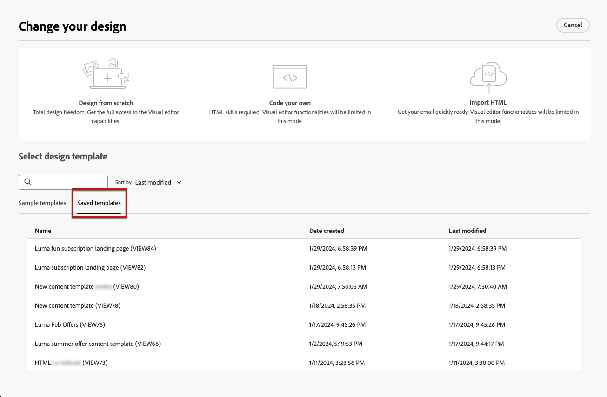

# Utilizzare i modelli di contenuto delle pagine di destinazione {#work-with-templates}

## Salvare una pagina come modello {#save-as-template}

Dopo aver progettato il contenuto della [pagina di destinazione](lp-content.md), puoi salvarlo per un riutilizzo futuro. A tale scopo, segui la procedura indicata di seguito.

1. Fai clic sul pulsante **[!UICONTROL Altro]** in alto a destra dello schermo.

1. Seleziona **[!UICONTROL Salva come modello di contenuto]** dal menu a discesa.

   {zoomable="yes"}

1. Aggiungi il nome da assegnare al modello.

1. Fai clic su **[!UICONTROL Salva]**.

La prossima volta che crei una pagina di destinazione, puoi utilizzare questo modello per creare i contenuti. Scopri come nella [sezione](#use-saved-template) di seguito.

{zoomable="yes"}

## Utilizzare un modello salvato {#use-saved-template}

<!--Not for GA?-->

1. Durante la modifica del contenuto di una pagina di destinazione, fai clic sul pulsante **[!UICONTROL Altro]** e seleziona **[!UICONTROL Modifica la progettazione]**.

   {zoomable="yes"}

1. Conferma la tua scelta.

   >[!NOTE]
   >
   >Questa azione elimina e sostituisce il contenuto corrente con quello del nuovo modello.

1. L&#39;elenco dei modelli salvati in precedenza viene visualizzato nella scheda **[!UICONTROL Modelli salvati]**. Puoi ordinarli **[!UICONTROL Per nome]**, **[!UICONTROL Ultima modifica]** e **[!UICONTROL Ultima creazione]**.

   {zoomable="yes"}

1. Seleziona dall’elenco il modello desiderato. Una volta selezionato, è possibile spostarsi tra tutti i modelli salvati utilizzando le frecce destra e sinistra.

   {zoomable="yes"}

1. Fare clic su **[!UICONTROL Usa questo modello]**.

1. Modifica il contenuto nel modo desiderato utilizzando il designer della pagina di destinazione.

<!--Primary page templates and subpage templates are managed separately, meaning that you cannot use a primary page template to create a subpage, and vice versa. TBC in Web user interface-->
