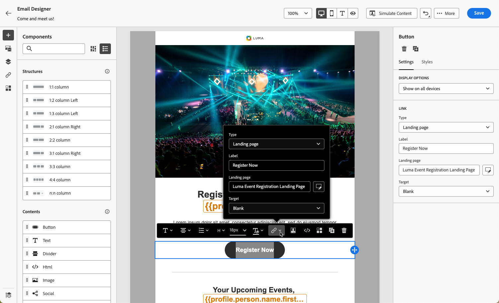

# Come utilizzare una pagina di destinazione {#lp-use-cases}

>[!CONTEXTUALHELP]
>id="acw_landingpages_url"
>title="Copia URL con cautela"
>abstract="Per testare o sfruttare appieno la pagina di destinazione, non puoi copiare e incollare questo collegamento direttamente in un browser web o nelle consegne. Invece, utilizza **Simula contenuto** per testarlo e seguire i passaggi descritti nella documentazione per utilizzare correttamente la pagina di destinazione."

Per utilizzare correttamente la pagina di destinazione, utilizza l’opzione dedicata per farvi riferimento come collegamento all’interno di una consegna.

>[!CAUTION]
>
>Per sfruttare appieno la pagina di destinazione, non puoi copiare e incollare il collegamento visualizzato nel dashboard di consegna pubblicato direttamente nelle consegne o in una pagina web.

In [!DNL Adobe Campaign Web] quattro modelli predefiniti consentono di implementare diversi casi d’uso. Tuttavia, le fasi principali rimangono le stesse e sono descritte di seguito.

1. [Creare una pagina di destinazione](create-lp.md#create-landing-page) e seleziona il modello desiderato, in base al caso d’uso:

   * [Acquisizione](#lp-acquisition)
   * [Iscrizione](#lp-subscription)
   * [Annullamento iscrizione](#lp-unsubscription)
   * [Elenco Bloccati](#lp-denylist)

1. Definisci le proprietà e le impostazioni della pagina di destinazione.

   

1. In base al tuo caso, seleziona la **[!UICONTROL Acquisizione]**, **[!UICONTROL Abbonamento]**, **[!UICONTROL Annullamento iscrizione]** o **[!UICONTROL Inserisco nell&#39;elenco Bloccati]** pagina.

1. Viene visualizzato il contenuto della pagina. Seleziona la parte corrispondente al modulo della pagina di destinazione.

   

1. Effettua tutti gli altri aggiornamenti necessari alle etichette e ai campi della pagina di destinazione. Modifica il resto del contenuto nel modo desiderato, salva le modifiche e chiudi.

1. Segui i passaggi descritti di seguito per ogni caso d’uso.

1. Modifica il **[!UICONTROL Conferma]** , come necessario, nonché **[!UICONTROL Errore]** e **[!UICONTROL Scade]** pagine. Verrà visualizzata ai destinatari dopo l&#39;invio del modulo di registrazione.

   

1. Test e [pubblicare](create-lp.md#publish-landing-page) la pagina di destinazione.

1. Creare un [email](../email/create-email.md) consegna per indirizzare il traffico alla pagina di destinazione.

1. [Inserire un collegamento](../email/message-tracking.md#insert-links) nel contenuto del messaggio. Seleziona **[!UICONTROL Pagina di destinazione]** come **[!UICONTROL Tipo di collegamento]** e scegli la [pagina di destinazione](create-lp.md#configure-primary-page) che hai creato.

   

   >[!NOTE]
   >
   >Per poter inviare il messaggio, assicurati che la pagina di destinazione selezionata non sia ancora scaduta. Scopri come aggiornare la data di scadenza [in questa sezione](create-lp.md#create-landing-page).

Una volta ricevuta l’e-mail, se i destinatari fanno clic sul collegamento alla pagina di destinazione e inviano il modulo della pagina di destinazione, verranno indirizzati alla pagina di conferma e verrà applicata qualsiasi altra azione definita nella pagina di destinazione (ad esempio, gli utenti saranno abbonati al servizio o non riceveranno ulteriori comunicazioni da parte tua).

Di seguito sono riportati alcuni esempi di come utilizzare [!DNL Adobe Campaign] pagine di destinazione per consentire ai clienti di accettare o rinunciare alla ricezione di alcune o di tutte le comunicazioni.

## Acquisizione profilo {#lp-acquisition}

1. [Creare una pagina di destinazione](create-lp.md#create-landing-page). Seleziona la **[!UICONTROL Acquisizione]** modello.

1. Definisci le proprietà e le impostazioni della pagina di destinazione.

   

1. Seleziona la **[!UICONTROL Acquisizione]** per modificarne il contenuto.

1. Viene visualizzato il contenuto della pagina. Seleziona la parte corrispondente al modulo della pagina di destinazione.

## Abbonamento a un servizio {#lp-subscription}

Uno dei casi d’uso più comuni consiste nell’invitare i clienti a [abbonarsi a un servizio](../audience/manage-services.md) (ad esempio una newsletter o un evento) tramite una pagina di destinazione. Segui i passaggi seguenti.

<!--For example, let's say you organize an event next month and you want to launch an event registration campaign. To do this, you're going to send an email including a link to a landing page that will enable your recipients to register for this event. The users who register will be added to the subscription list that you created for this purpose.-->

1. Inizia creando un modello di conferma per gli utenti che si abbonano all’evento, in modo da poterlo selezionare facilmente durante la creazione del servizio. [Ulteriori informazioni](../audience/manage-services.md#create-confirmation-message)

   

1. Crea un servizio di abbonamento, che memorizzerà gli utenti registrati nell’evento. [Scopri come creare un servizio](../audience/manage-services.md)

1. Seleziona il modello creato come e-mail di conferma che gli utenti riceveranno al momento dell’abbonamento.

   

1. [Creare una pagina di destinazione](create-lp.md#create-landing-page) per consentire ai destinatari di registrarsi all’evento. Seleziona la **[!UICONTROL Abbonamento]** modello.

   <!---->

1. Definisci le proprietà e le impostazioni della pagina di destinazione.

   <!---->

1. Seleziona la **[!UICONTROL Abbonamento]** per modificarne il contenuto.

   

1. Viene visualizzato il contenuto della pagina. Seleziona la parte corrispondente al modulo della pagina di destinazione ed espandi la **[!UICONTROL Casella di controllo 1]** sezione.

   In **[!UICONTROL Abbonamenti e servizi]** , seleziona il servizio creato per l’evento. Lascia **[!UICONTROL Sottoscrivi se selezionato]** opzione abilitata.

   

1. Ad esempio, puoi aggiungere una casella di controllo aggiuntiva per offrire l’abbonamento alla newsletter.

<!--

1. You can also update the profiles who register for your event for the email channel. Expand the **[!UICONTROL Call to action]** section and select Additional updates.

    -->

1. Effettua tutti gli altri aggiornamenti necessari alle etichette e ai campi della pagina di destinazione. Modifica il resto del contenuto nel modo desiderato, salva le modifiche e chiudi.

1. Modifica il **[!UICONTROL Conferma]** , come necessario, nonché **[!UICONTROL Errore]** e **[!UICONTROL Scade]** pagine. Verrà visualizzata ai destinatari dopo l&#39;invio del modulo di registrazione.

   

1. Test e [pubblicare](create-lp.md#publish-landing-page) la pagina di destinazione.

1. Creare un **E-mail** consegna per indirizzare il traffico alla pagina di destinazione della registrazione. Progetta l’e-mail per annunciare che la registrazione è ora aperta per il tuo evento.

1. [Inserire un collegamento](../email/message-tracking.md#insert-links) nel contenuto del messaggio. Seleziona **[!UICONTROL Pagina di destinazione]** come **[!UICONTROL Tipo di collegamento]** e scegli la [pagina di destinazione](create-lp.md#configure-primary-page) creato per la registrazione.

   

   >[!NOTE]
   >
   >Per poter inviare il messaggio, assicurati che la pagina di destinazione selezionata non sia ancora scaduta. Scopri come aggiornare la data di scadenza [in questa sezione](create-lp.md#create-landing-page).

Una volta ricevuta l’e-mail, se i destinatari fanno clic sul collegamento alla pagina di destinazione e inviano il modulo della pagina di destinazione, verranno indirizzati alla pagina di conferma e aggiunti all’elenco degli abbonamenti.

## Annullamento iscrizione {#lp-unsubscription}

1. [Creare una pagina di destinazione](create-lp.md#create-landing-page). Seleziona la **[!UICONTROL Annullamento iscrizione]** modello.

1. Definisci le proprietà e le impostazioni della pagina di destinazione.

1. Seleziona la **[!UICONTROL Annullamento iscrizione]** per modificarne il contenuto.

1. Viene visualizzato il contenuto della pagina. Seleziona la parte corrispondente al modulo della pagina di destinazione.

## Impostazione delle pagine di destinazione di rinuncia {#lp-denylist}

Come requisito legale, è necessario dare ai destinatari la possibilità di annullare l’abbonamento alla ricezione di comunicazioni da un marchio. Per ulteriori informazioni sulle normative applicabili, consulta [Documentazione di Experienci Platform](https://experienceleague.adobe.com/docs/experience-platform/privacy/regulations/overview.html#regulations){target="_blank"}.

Pertanto, devi sempre includere un **collegamento per annullare l’abbonamento** in ogni e-mail inviata ai destinatari:

* Facendo clic su questo collegamento, i destinatari verranno indirizzati a una pagina di destinazione contenente un pulsante per confermare la rinuncia.
* Facendo clic sul pulsante di opt-out, i dati del profilo verranno aggiornati con queste informazioni.

È possibile impostare un **[!UICONTROL Inserisco nell&#39;elenco Bloccati]** pagina di destinazione che consentirà agli utenti di rinunciare a tutte le consegne.

Per consentire agli utenti di rinunciare a tutte le consegne, devi creare e pubblicare un’ **[!UICONTROL Inserisco nell&#39;elenco Bloccati]** pagina di destinazione.

Quando un utente fa clic sul collegamento della pagina di destinazione, **[!UICONTROL Non contattare più (tramite alcun canale)]** nel profilo viene selezionata automaticamente.

definisci un **[!UICONTROL Rinuncia]** e scegli di aggiornare **[!UICONTROL Canale (e-mail)]**: il profilo che controlla la casella di rinuncia nella pagina di destinazione verrà escluso da tutte le comunicazioni.

Una volta ricevuto il messaggio, se un destinatario fa clic sul collegamento per annullare l’abbonamento nell’e-mail, viene visualizzata la pagina di destinazione.

Se il destinatario seleziona la casella e invia il modulo:

* Il destinatario che ha rinunciato viene reindirizzato alla schermata del messaggio di conferma.

* I dati del profilo vengono aggiornati e non riceveranno comunicazioni dal brand a meno che non si rinnovi l’abbonamento.

Per verificare che la scelta del profilo corrispondente sia stata aggiornata, passa a Profili e seleziona il profilo.

