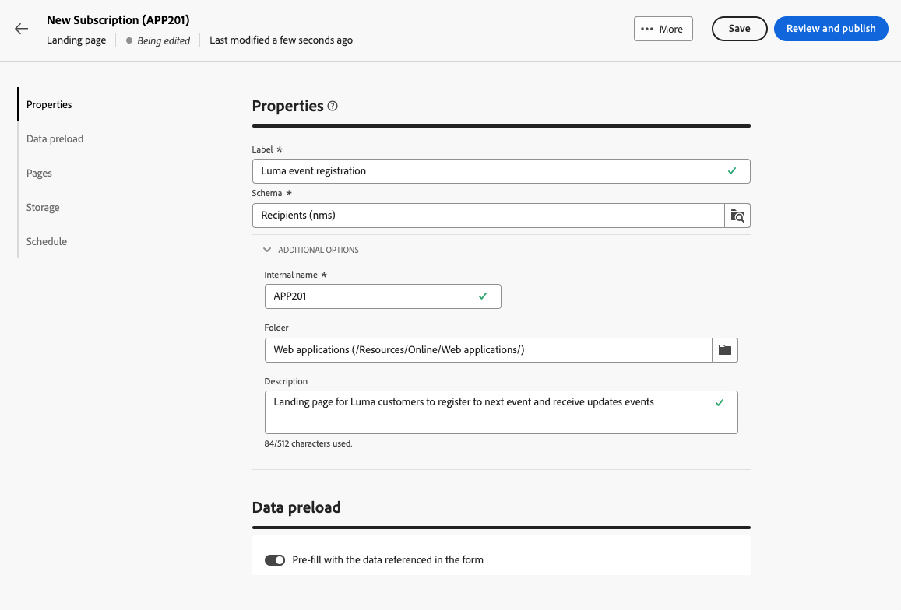
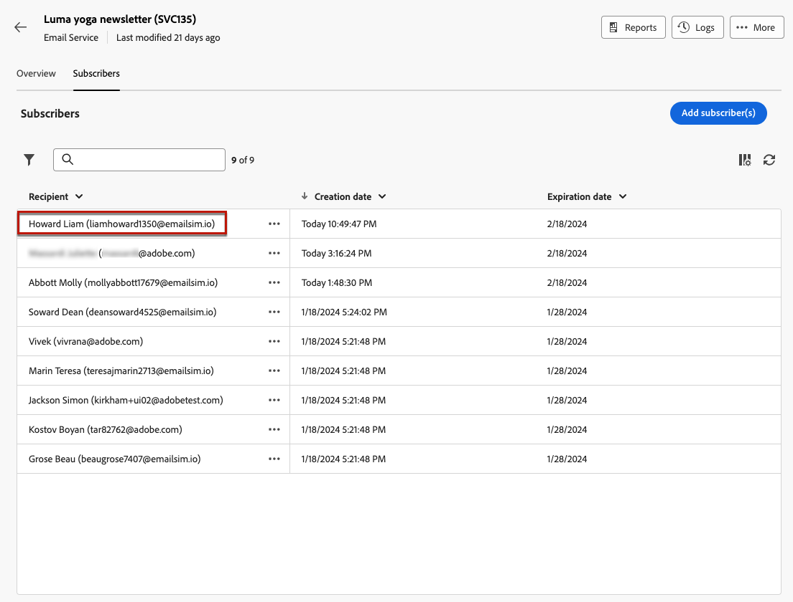

# Come utilizzare una pagina di destinazione {#lp-use-cases}

>[!CONTEXTUALHELP]
>id="acw_landingpages_url"
>title="Copia URL con cautela"
>abstract="Per testare o sfruttare appieno la pagina di destinazione, non puoi copiare e incollare questo collegamento direttamente in un browser web o nelle consegne. Invece, utilizza **Simula contenuto** per testarlo e seguire i passaggi descritti nella documentazione per utilizzare correttamente la pagina di destinazione."

Per utilizzare correttamente la pagina di destinazione, utilizza l’opzione dedicata per farvi riferimento come collegamento all’interno di una consegna.

>[!CAUTION]
>
>Per sfruttare appieno la pagina di destinazione, non puoi copiare e incollare il collegamento visualizzato nel dashboard di consegna pubblicato direttamente nelle consegne o in una pagina web.

In [!DNL Adobe Campaign Web] quattro modelli predefiniti consentono di implementare diversi casi d’uso. Tuttavia, le fasi principali rimangono le stesse e sono descritte di seguito.

1. [Creare una pagina di destinazione](create-lp.md#create-landing-page) e seleziona il modello desiderato, in base al caso d’uso.

1. Definisci le proprietà e le impostazioni della pagina di destinazione.

   {zoomable=&quot;yes&quot;}

1. In base al tuo caso, seleziona la **[!UICONTROL Acquisizione]**, **[!UICONTROL Abbonamento]**, **[!UICONTROL Annullamento iscrizione]** o **[!UICONTROL Inserisco nell&#39;elenco Bloccati]** pagina.

1. Viene visualizzato il contenuto della pagina. Seleziona la parte corrispondente al modulo della pagina di destinazione.

   {zoomable=&quot;yes&quot;}

1. Modifica il contenuto in base al modello selezionato:

   * [Acquisizione](#lp-acquisition)
   * [Iscrizione](#lp-subscription)
   * [Annullamento iscrizione](#lp-unsubscription)
   * [Elenco Bloccati](#lp-denylist)

1. Modifica il resto del contenuto in base alle esigenze, salva le modifiche e chiudi.

1. Modifica il **[!UICONTROL Conferma]** , come necessario, nonché **[!UICONTROL Errore]** e **[!UICONTROL Scade]** pagine. Il **[!UICONTROL Conferma]** La pagina verrà visualizzata ai destinatari dopo l’invio del modulo.

   {zoomable=&quot;yes&quot;}

1. [Test](create-lp.md#test-landing-page) e [pubblicare](create-lp.md#publish-landing-page) la pagina di destinazione.

1. Creare un [email](../email/create-email.md) consegna per indirizzare il traffico alla pagina di destinazione.

1. [Inserire un collegamento](../email/message-tracking.md#insert-links) nel contenuto del messaggio. Seleziona **[!UICONTROL Pagina di destinazione]** come **[!UICONTROL Tipo di collegamento]** e scegli la pagina di destinazione creata.

   {zoomable=&quot;yes&quot;}

   >[!NOTE]
   >
   >Per poter inviare il messaggio, assicurati che la pagina di destinazione selezionata non sia ancora scaduta. [Ulteriori informazioni](create-lp.md#create-landing-page)

Una volta ricevuta l’e-mail, se i destinatari fanno clic sul collegamento alla pagina di destinazione e inviano il modulo:

* Verranno indirizzati alla pagina di conferma.

* Verrà applicata qualsiasi altra azione definita nella pagina di destinazione. Ad esempio, gli utenti verranno abbonati al servizio o non riceveranno più comunicazioni da te.

Di seguito sono riportati alcuni esempi di come utilizzare [!DNL Adobe Campaign] pagine di destinazione nei diversi casi d’uso possibili.

## Acquisizione profilo {#lp-acquisition}

Il primo modello consente di aggiungere o aggiornare un profilo al database di Campaign.

1. Quando [creazione della pagina di destinazione](create-lp.md#create-landing-page), seleziona la **[!UICONTROL Acquisizione]** modello.

1. Nelle proprietà della pagina di destinazione, assicurati di selezionare **[!UICONTROL Precompilare con i dati a cui si fa riferimento nel modulo]** per precaricare le informazioni esistenti dal profilo ed evitare la creazione di duplicati.

1. Seleziona la **[!UICONTROL Acquisizione]** per modificarne il contenuto.

1. Modifica i campi di testo in base alle esigenze, in base alle informazioni che desideri raccogliere sui profili.

1. Inoltre, puoi aggiungere una casella di controllo che invita i clienti ad abbonarsi al servizio newsletter. [Scopri come creare un servizio](../audience/manage-services.md)

   {zoomable=&quot;yes&quot;}

1. Modifica il contenuto in base alle esigenze e salva le modifiche.

1. Revisione e [pubblicare](create-lp.md#publish-landing-page) la pagina di destinazione.

1. Creare un [email](../email/create-email.md) e [aggiungi un collegamento](../email/message-tracking.md#insert-links) alla pagina di destinazione.

Una volta ricevuta l’e-mail, se i destinatari fanno clic sul collegamento alla pagina di destinazione e inviano il modulo, il loro profilo verrà aggiunto al database di Campaign o aggiornato in base alle informazioni fornite.

{zoomable=&quot;yes&quot;}

Se hanno acconsentito alla ricezione della newsletter, saranno abbonati al servizio corrispondente.

{zoomable=&quot;yes&quot;}

## Abbonamento a un servizio {#lp-subscription}

Uno dei casi d’uso più comuni consiste nell’invitare i clienti a [abbonarsi a un servizio](../audience/manage-services.md) (ad esempio una newsletter o un evento) tramite una pagina di destinazione. Segui i passaggi seguenti.

<!--For example, let's say you organize an event next month and you want to launch an event registration campaign. To do this, you're going to send an email including a link to a landing page that will enable your recipients to register for this event. The users who register will be added to the subscription list that you created for this purpose.-->

1. Inizia creando un modello di conferma per gli utenti che si abbonano all’evento, in modo da poterlo selezionare facilmente durante la creazione del servizio. [Ulteriori informazioni](../audience/manage-services.md#create-confirmation-message)

   {zoomable=&quot;yes&quot;}

1. Crea un servizio di abbonamento, che memorizzerà gli utenti registrati nell’evento. [Scopri come creare un servizio](../audience/manage-services.md)

1. Seleziona il modello creato come e-mail di conferma che gli utenti riceveranno al momento dell’abbonamento.

   {zoomable=&quot;yes&quot;}

1. [Creare una pagina di destinazione](create-lp.md#create-landing-page) per consentire ai destinatari di registrarsi all’evento. Seleziona la **[!UICONTROL Abbonamento]** modello.

1. Seleziona la **[!UICONTROL Abbonamento]** per modificarne il contenuto.

1. Viene visualizzato il contenuto della pagina. Seleziona la parte corrispondente al modulo della pagina di destinazione ed espandi la **[!UICONTROL Casella di controllo 1]** sezione.

1. In **[!UICONTROL Abbonamenti e servizi]** , seleziona il servizio creato per l’evento. Lascia **[!UICONTROL Iscriviti se selezionato]** opzione abilitata.

   {zoomable=&quot;yes&quot;}
<!--
1. You can add an additional checkbox to offer subscription to your newsletter for example.-->

1. Modifica il contenuto in base alle esigenze e salva le modifiche.

1. Revisione e [pubblicare](create-lp.md#publish-landing-page) la pagina di destinazione.

1. Creare un [email](../email/create-email.md) e [aggiungi un collegamento](../email/message-tracking.md#insert-links) per indirizzare il traffico alla pagina di destinazione della registrazione.

1. Progetta l’e-mail per annunciare che la registrazione è ora aperta per il tuo evento.

Una volta ricevuta l’e-mail, se i destinatari fanno clic sul collegamento alla pagina di destinazione e inviano il modulo, verranno indirizzati alla pagina di conferma e aggiunti all’elenco degli abbonamenti.

## Annullamento iscrizione {#lp-unsubscription}

Puoi consentire ai clienti di annullare l’abbonamento a un servizio utilizzando una pagina di destinazione.

1. Assicurati di aver creato un modello di conferma per l’annullamento dell’abbonamento al servizio da parte degli utenti, in modo da poterlo selezionare facilmente al momento della creazione del servizio. [Ulteriori informazioni](../audience/manage-services.md#create-confirmation-message)

1. Nel tuo [servizio di abbonamento](../audience/manage-services.md), seleziona il modello creato come e-mail di conferma che gli utenti riceveranno al momento dell’annullamento dell’abbonamento.

1. [Creare una pagina di destinazione](create-lp.md#create-landing-page). Seleziona la **[!UICONTROL Annullamento iscrizione]** modello.

1. Seleziona la **[!UICONTROL Annullamento iscrizione]** per modificarne il contenuto.

1. Viene visualizzato il contenuto della pagina. Seleziona la parte corrispondente al modulo della pagina di destinazione.

1. Puoi aggiungere una **[!UICONTROL Casella di controllo]** , selezionare il servizio e selezionare **[!UICONTROL Annulla iscrizione se selezionato]** opzione.

   {zoomable=&quot;yes&quot;}

1. È inoltre possibile espandere **[!UICONTROL Invito all’azione]** e seleziona la **[!UICONTROL Aggiornamenti aggiuntivi]** opzione. Seleziona il servizio e seleziona la **[!UICONTROL Rinuncia]** opzione.

   {zoomable=&quot;yes&quot;}

1. Modifica il contenuto in base alle esigenze e salva le modifiche.

1. Revisione e [pubblicare](create-lp.md#publish-landing-page) la pagina di destinazione.

1. Creare un [email](../email/create-email.md) e [aggiungi un collegamento](../email/message-tracking.md#insert-links) alla pagina di destinazione.

Una volta ricevuta l’e-mail, se i destinatari fanno clic sul collegamento alla pagina di destinazione e inviano il modulo, verranno indirizzati alla pagina di conferma dell’annullamento dell’abbonamento e verranno rimossi dal servizio di abbonamento corrispondente.

## Elenco Bloccati {#lp-denylist}

Come requisito legale, è necessario dare ai destinatari la possibilità di annullare l’abbonamento alla ricezione di comunicazioni da un marchio. Pertanto, devi sempre includere un **collegamento per annullare l’abbonamento** in ogni e-mail inviata ai destinatari. Facendo clic su questo collegamento, i destinatari verranno indirizzati a una pagina di destinazione contenente un pulsante per confermare la rinuncia.

È possibile impostare un **[!UICONTROL Inserisco nell&#39;elenco Bloccati]** pagina di destinazione che consentirà agli utenti di rinunciare a tutte le consegne.

1. Quando [creazione della pagina di destinazione](create-lp.md#create-landing-page), seleziona la **[!UICONTROL Inserisco nell&#39;elenco Bloccati]** modello.

1. Seleziona la **[!UICONTROL Inserisco nell&#39;elenco Bloccati]** per modificarne il contenuto.

1. Espandi **[!UICONTROL Invito all’azione]** e seleziona la **[!UICONTROL Aggiornamenti aggiuntivi]** opzione.

1. Dall’elenco a discesa corrispondente, seleziona **[!UICONTROL Canale (e-mail)]** per consentire ai destinatari di rinunciare solo alle comunicazioni e-mail. Puoi anche selezionare **[!UICONTROL Per tutti i canali]** per scegliere tutti i canali da tutte le comunicazioni.

   {zoomable=&quot;yes&quot;}

1. Modifica il contenuto in base alle esigenze e salva le modifiche.

1. Revisione e [pubblicare](create-lp.md#publish-landing-page) la pagina di destinazione.

1. Creare un [email](../email/create-email.md) e [aggiungi un collegamento](../email/message-tracking.md#insert-links) nella pagina di destinazione per consentire agli utenti di rinunciare alla ricezione di comunicazioni.

Una volta ricevuta l’e-mail, se i destinatari fanno clic sul collegamento alla pagina di destinazione e inviano il modulo, verranno indirizzati alla pagina di conferma del inserisco nell&#39;elenco Bloccati di e il loro profilo verrà aggiornato con le informazioni fornite.

Per verificare che la scelta del profilo corrispondente sia stata aggiornata, passa alla **[!UICONTROL Profili]** e selezionare tale profilo.

Ad esempio, se hai scelto di aggiornare **[!UICONTROL Canale (e-mail)]** nella pagina di destinazione, il **[!UICONTROL Non contattare più tramite e-mail]** verrà selezionata.

{zoomable=&quot;yes&quot;}

Questo profilo non riceverà comunicazioni e-mail dal tuo marchio, a meno che non si sia nuovamente iscritti.

