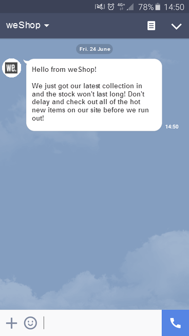

# Introduzione ai messaggi LINE {#get-started-line}

LINE è un’applicazione per la messaggistica istantanea gratuita, chiamate vocali e video, disponibile su tutti i dispositivi mobili e su PC. Puoi utilizzare Adobe Campaign per inviare messaggi LINE. Utilizza LINE nelle consegne autonome o nei flussi di lavoro, insieme agli altri canali.

* **[!UICONTROL Consegne]**: crea una consegna LINE autonoma dal menu **[!UICONTROL Consegne]** nella barra a sinistra, in modo simile a SMS o push. [Ulteriori informazioni](send-line.md).

* **[!UICONTROL Flussi di lavoro]**: nell&#39;area di lavoro del flusso di lavoro, aggiungi un&#39;attività del canale **[!UICONTROL LINE]**, scegli un modello di consegna, quindi definisci il contenuto e le impostazioni nel dashboard di consegna. Ulteriori informazioni sulle attività dei canali in [questa sezione](../workflows/activities/channels.md).

  >[!NOTE]
  >
  >Nell&#39;attività **[!UICONTROL Genera pubblico]** che alimenta l&#39;attività del canale **[!UICONTROL LINE]**, modifica la dimensione di targeting in **[!UICONTROL Iscrizioni visitatore]**. Assicurati di abilitare **[!UICONTROL Mostra tutti gli schemi]** nel pannello laterale. Il selettore del modello di consegna diventa disponibile solo una volta impostata questa dimensione di targeting.
