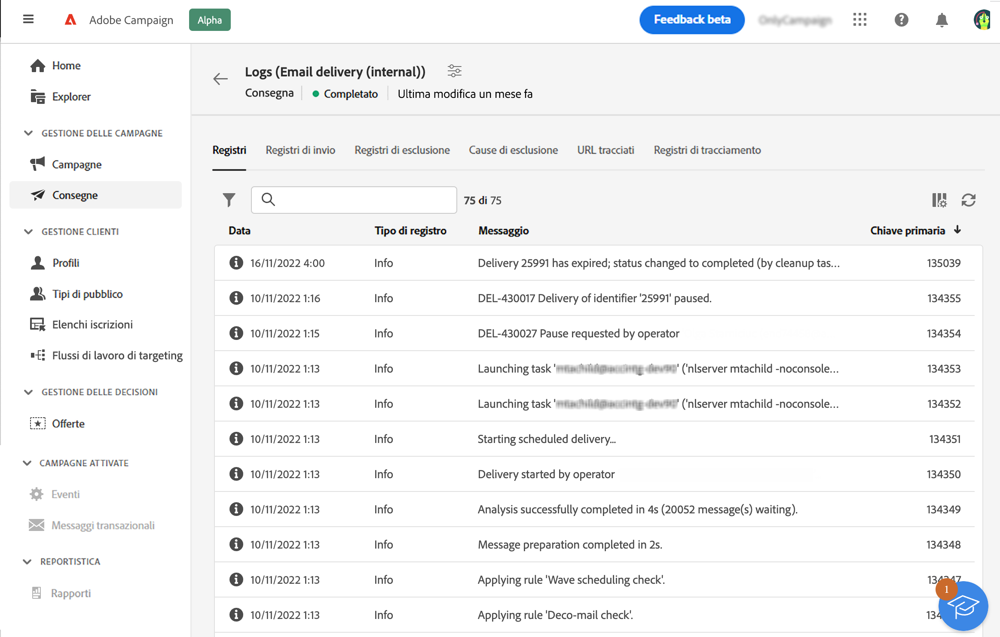
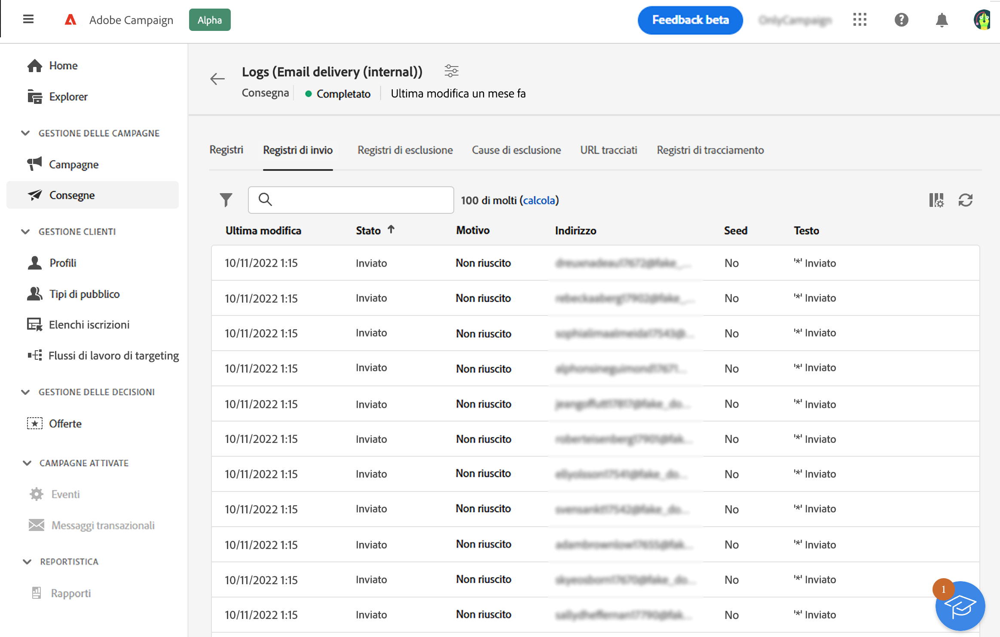
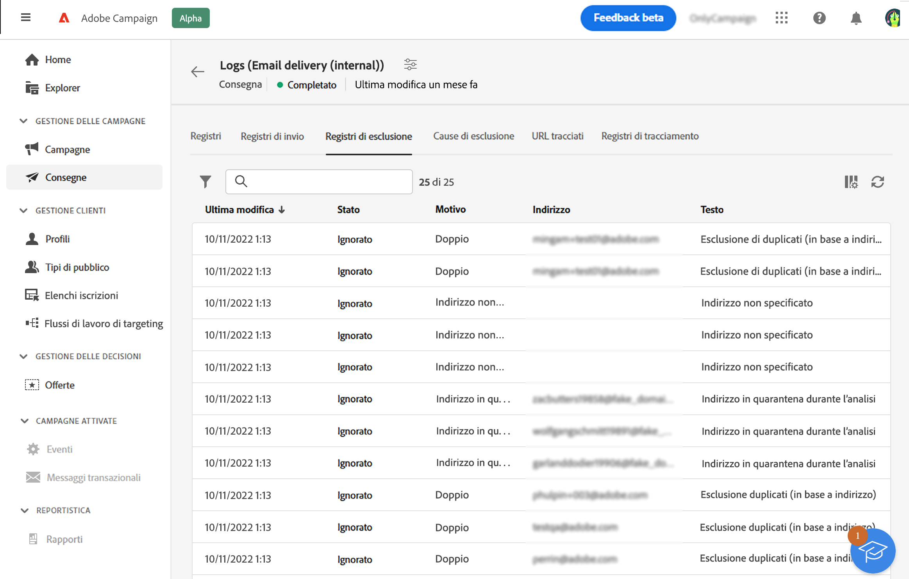
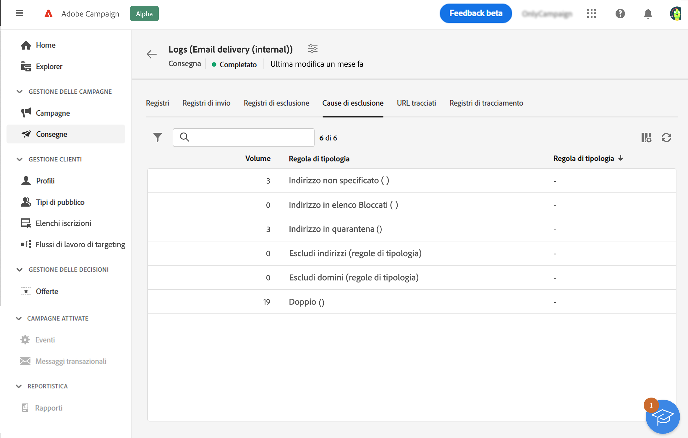
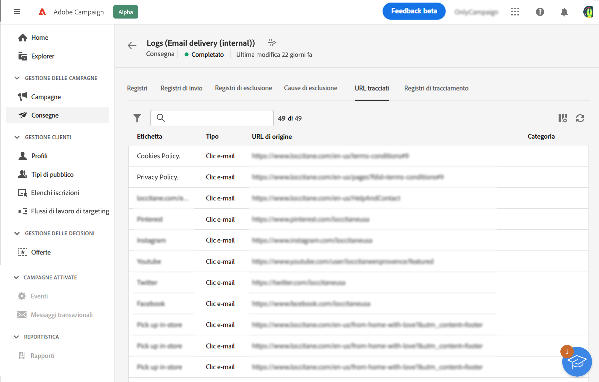
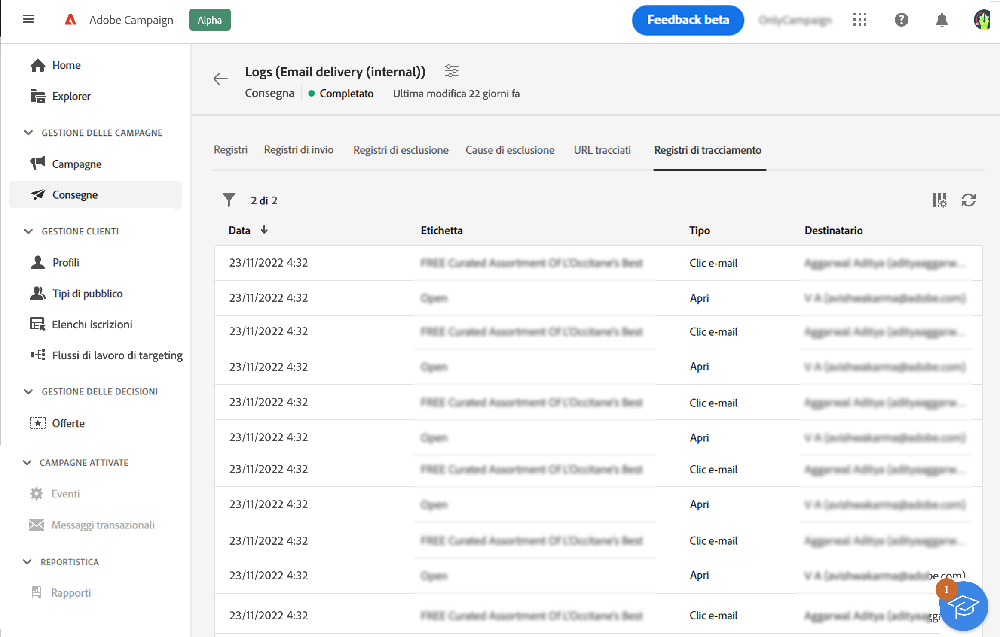

# Monitorare i registri di consegna {#delivery-logs}

>[!CONTEXTUALHELP]
>id="acw_deliveries_email_preparation_logs"
>title="Registri di consegna"
>abstract="I registri di consegna mostrano i dettagli dell’invio. Mostrano i dettagli dell’invio, quale target è stato escluso e perché, nonché le informazioni di tracciamento come aperture e clic."

Una volta preparata la consegna e aver fatto clic sul pulsante **Invia** , sfoglia i registri di consegna per verificare gli avvisi, gli errori, lo stato, le esclusioni e i dati di tracciamento. Questi registri sono accessibili direttamente dalla dashboard dei messaggi. Mostrano i dettagli dell’invio, quale target è stato escluso e perché, nonché le informazioni di tracciamento come aperture e clic.

Per visualizzare i registri, accedi alla dashboard di consegna e fai clic sul pulsante **Registri**.

Sono disponibili le seguenti schede:

* [Registri](#logs-tab)
* [Consegne](#deliveries-tab)
* [Esclusioni](#exclusion-tab)
* [Cause di esclusione](#exclusion-causes)
* [URL tracciati](#tracked-urls)
* [Tracciamento](#tracking)

## Registri {#logs-tab}

La scheda **Registri** contiene tutti i messaggi relativi alla consegna e alle bozze. Le icone specifiche consentono di identificare errori o avvertenze.

Vengono elencati tutti i passaggi, le avvertenze e gli errori di convalida. Le icone colorate mostrano il tipo di messaggio:

* L’icona grigia indica un messaggio informativo.
* L’icona gialla indica un errore di elaborazione non critico.
* L’icona rossa indica un errore critico che impedisce l’invio della consegna. Affinché la consegna possa essere inviata, è necessario correggere gli errori critici.

## Consegne {#deliveries-tab}

La scheda **Registri di invio** offre una cronologia di ogni occorrenza della consegna. L’elenco dei messaggi inviati e i relativi stati sono archiviati qui. Consente di visualizzare lo stato di consegna per ciascun destinatario.

## Esclusioni {#exclusion-tab}

La scheda **Registri di esclusione** elenca tutti i messaggi che sono stati esclusi dal target e specifica il motivo dell’errore di invio.

## Cause di esclusione {#exclusion-causes-tab}

Nella scheda **Cause di esclusione** viene visualizzato il numero di messaggi esclusi dal target per ogni possibile causa.

## URL tracciati {#tracked-urls-tab}

La scheda **URL tracciati** raggruppa gli URL contenuti nel messaggio inviato e ne specifica il tipo di URL e l’URL di origine.

## Tracciamento {#tracking-tab}

La scheda **Tracciamento** elenca la cronologia di tracciamento per la consegna. In questa scheda vengono visualizzati i dati di tracciamento per i messaggi inviati, ovvero tutti gli URL che vengono tracciati da Adobe Campaign.

>[!NOTE]
>
>Se il tracciamento non è abilitato per una consegna, questa scheda non viene visualizzata.