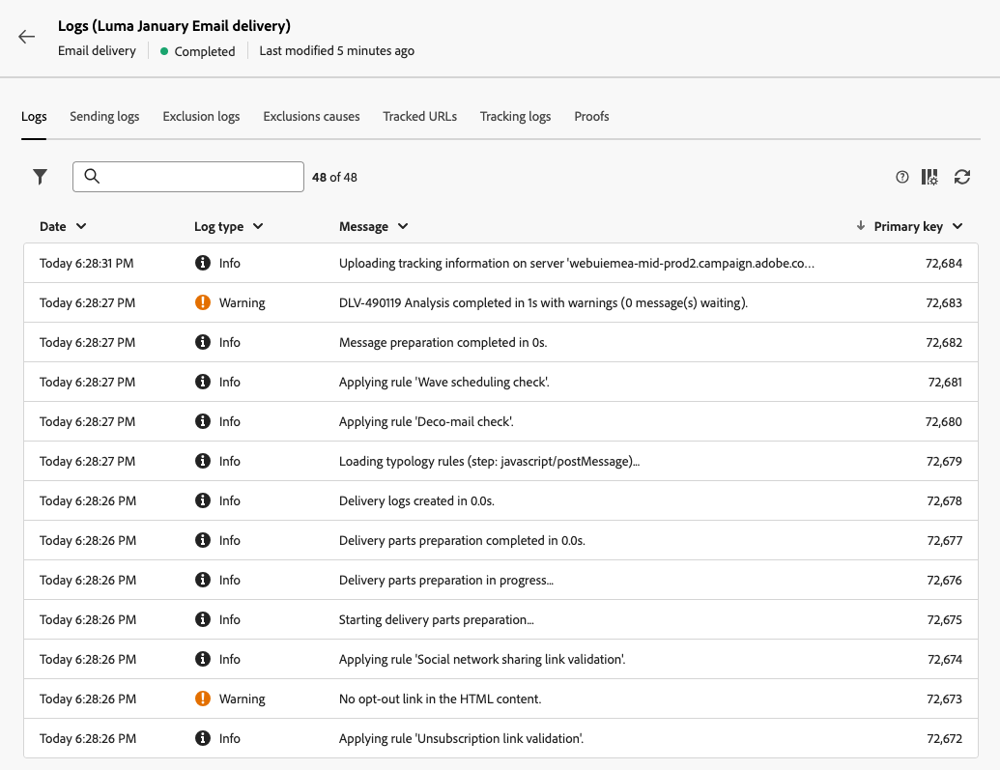

# Monitorare i registri di consegna {#delivery-logs}

>[!CONTEXTUALHELP]
>id="acw_deliveries_email_preparation_logs"
>title="Registri di consegna"
>abstract="TBC"

Dopo aver preparato e inviato un’e-mail, i registri di consegna consentono di verificare che non vi siano errori. Questi registri sono accessibili direttamente dalla dashboard dei messaggi. Mostrano i dettagli dell’invio, quale target è stato escluso e perché, nonché le informazioni di tracciamento come aperture e clic.

Per visualizzare i registri, accedi alla dashboard di consegna e fai clic sul pulsante **Registri**.

Sono disponibili diverse schede:

## Registri

La scheda **Registri** contiene tutti i messaggi relativi alla consegna e alle bozze. Le icone specifiche consentono di identificare errori o avvertenze.

Vengono elencati tutti i passaggi, le avvertenze e gli errori di convalida. Le icone colorate mostrano il tipo di messaggio:

* L’icona grigia indica un messaggio informativo.
* L’icona gialla indica un errore di elaborazione non critico.
* L’icona rossa indica un errore critico che impedisce l’invio della consegna.

## Consegne

La scheda **Registri di invio** offre una cronologia di ogni occorrenza della consegna. L’elenco dei messaggi inviati e i relativi stati sono archiviati qui. Consente di visualizzare lo stato di consegna per ciascun destinatario.

## Esclusioni

La scheda **Registri di esclusione** elenca tutti i messaggi che sono stati esclusi dal target e specifica il motivo dell’errore di invio.

## Cause di esclusione

Nella scheda **Cause di esclusione** viene visualizzato il volume (in numero di messaggi) dei messaggi esclusi dal target.

## URL tracciati

La scheda **URL tracciati** raggruppa gli URL contenuti nel messaggio inviato, e ne specifica il tipo di URL e l’URL di origine.

## Tracciamento

La scheda **Tracciamento** elenca la cronologia di tracciamento per la consegna. In questa scheda vengono visualizzati i dati di tracciamento per i messaggi inviati, ovvero tutti gli URL che vengono tracciati da Adobe Campaign.

>[!NOTE]
>
>Se il tracciamento non è abilitato per una consegna, questa scheda non viene visualizzata.

