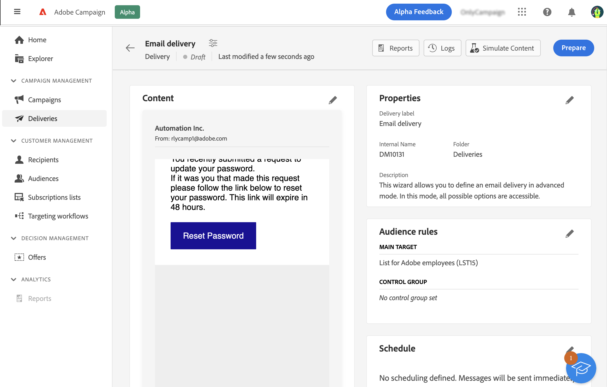
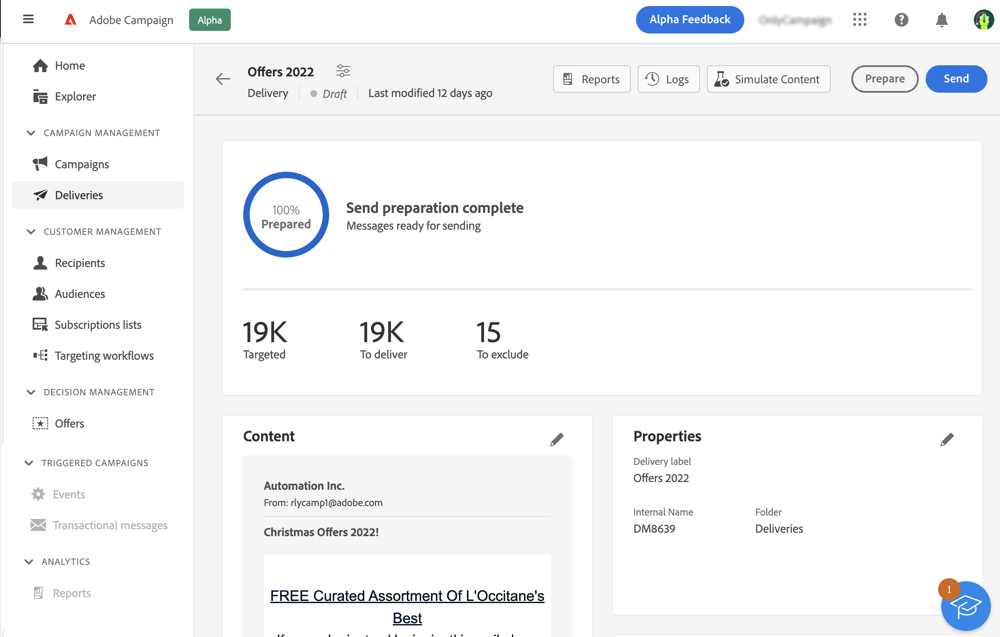

# Preparare e inviare il messaggio e-mail {#prepare-send}

>[!CONTEXTUALHELP]
>id="acw_homepage_card5"
>title="Preparare e inviare il messaggio e-mail"
>abstract="Scopri come preparare un messaggio e-mail e ulteriori informazioni sui KPI relativi all’invio."

<!--

	show how to prepare and send the email + the live kpis in the dashboard

like acc when preparation, target calculated then send
real time KPIs, not in AJO. similar to ACS.
exclusion logs, causes
-->

<!--
send also KPIs
-->

## Preparare l’invio{#prepare}

Una volta definiti il contenuto, il pubblico e la pianificazione, puoi preparare il messaggio. Durante la preparazione, viene calcolata la popolazione target e viene generato il contenuto del messaggio per ciascun profilo incluso nel target. Al termine della preparazione, i messaggi sono pronti per essere inviati subito oppure alla data e all’ora pianificate. Le regole di convalida utilizzate durante l’analisi sono descritte nella [documentazione di Campaign Classic v7](https://experienceleague.adobe.com/docs/campaign-classic/using/sending-messages/key-steps-when-creating-a-delivery/steps-validating-the-delivery.html?lang=it#validation-process-with-typologies){target="_blank"}.

Segui i passaggi seguenti:

1. Nella dashboard delle consegne, fai clic sul pulsante **Prepara** in alto a destra e conferma.

   

   Viene visualizzato l’avanzamento della preparazione. A seconda della dimensione della popolazione target, questa operazione potrebbe richiedere del tempo.

   >[!NOTE]
   >
   >Puoi interrompere la preparazione in qualsiasi momento utilizzando il pulsante **Interrompi preparazione**. Durante la fase di preparazione, non vengono inviati messaggi. È quindi possibile iniziare o interrompere questo processo senza alcun rischio.

1. Al termine della preparazione, controlla i KPI. Se il numero di messaggi da inviare non corrisponde alle tue aspettative, modifica il pubblico e riavvia la preparazione.

   

   Di seguito sono riportati i diversi KPI visualizzati:

   * **Target**: numero di destinatari nel target
   * **Da consegnare**: numero di messaggi che verranno inviati
   * **Da escludere**: numero di messaggi esclusi da una regola di tipologia

1. Fai clic sul pulsante **Registri** e controlla che non vi siano errori. L’ultimo messaggio del registro presenta eventuali messaggi di errore e il numero di errori. Per ulteriori informazioni, consulta questa [sezione](delivery-logs.md).

   

Se la preparazione rileva un errore critico che impedisce l’invio della consegna, nella dashboard delle consegne lo stato di preparazione viene visualizzato come “non riuscito”.

Se si apportano eventuali modifiche alla consegna dopo la preparazione, affinché tali modifiche vengano prese in considerazione è necessario riavviare la preparazione.

Una volta completata la preparazione senza errori, il messaggio è pronto per essere inviato. Per ulteriori informazioni, consulta questa [sezione](#send).

## Inviare il messaggio{#send}

>[!CONTEXTUALHELP]
>id="acw_deliveries_email_metrics_delivered"
>title="Consegnati"
>abstract="Numero di messaggi recapitati correttamente. Questo indicatore viene aggiornato ogni 5 minuti. La percentuale visualizzata si basa sul numero totale di messaggi inviati."

>[!CONTEXTUALHELP]
>id="acw_deliveries_email_metrics_opens"
>title="Aperture"
>abstract="Numero di messaggi aperti. Questo indicatore viene aggiornato ogni 5 minuti. La percentuale visualizzata è il rapporto tra il numero di aperture distinte e il numero di messaggi consegnati."

>[!CONTEXTUALHELP]
>id="acw_deliveries_email_metrics_clicks"
>title="Clic"
>abstract="Numero di destinatari che hanno fatto clic almeno una volta nell’e-mail. Questo indicatore viene aggiornato ogni 5 minuti. La percentuale visualizzata è il rapporto tra il numero di clic distinti e il numero di messaggi consegnati."

Una volta completata la preparazione, puoi inviare il messaggio. Questo passaggio è necessario solo per i messaggi da inviare subito. Se il messaggio è pianificato, viene inviato alla data definita.

Segui questi passaggi:

1. Nella dashboard delle consegne, fai clic sul pulsante **Invia** in alto a destra e conferma.

   

1. Viene visualizzato l’avanzamento dell’invio. Controlla i KPI visualizzati. Puoi anche controllare i registri. Per ulteriori informazioni, consulta questa [sezione](delivery-logs.md).

   

   Di seguito sono riportati i diversi KPI visualizzati:

   * **Consegnati**: numero di messaggi recapitati correttamente. La percentuale visualizzata si basa sul numero totale di messaggi inviati.
   * **Aperture**: numero di messaggi aperti. La percentuale visualizzata è il rapporto tra il numero di aperture distinte e il numero di messaggi consegnati.
   * **Clic**: numero di destinatari che hanno fatto clic almeno una volta nell’e-mail. La percentuale visualizzata è il rapporto tra il numero di clic distinti e il numero di messaggi consegnati.

   >[!NOTE]
   >
   >Tutti gli indicatori vengono aggiornati ogni 5 minuti dopo l’inizio della consegna. Gli indicatori di preparazione della consegna sono in tempo reale.

   Puoi sospendere l’invio in qualsiasi momento e quindi riprenderlo. Se interrompi la consegna durante l’invio, non puoi riprenderla.
