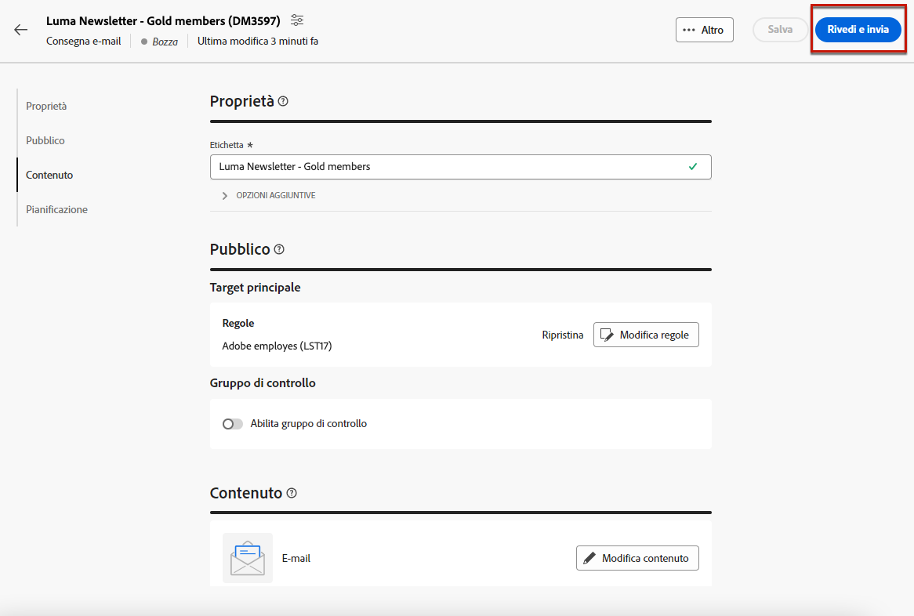
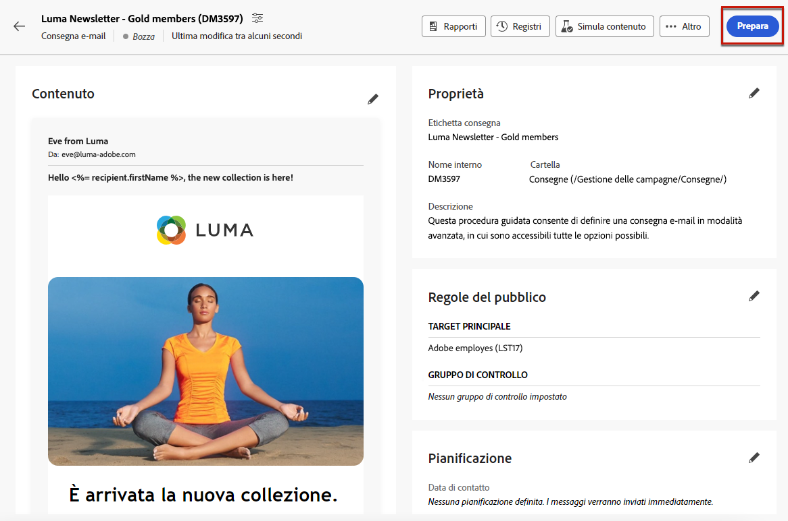
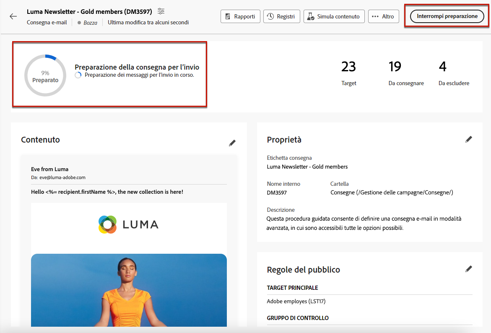
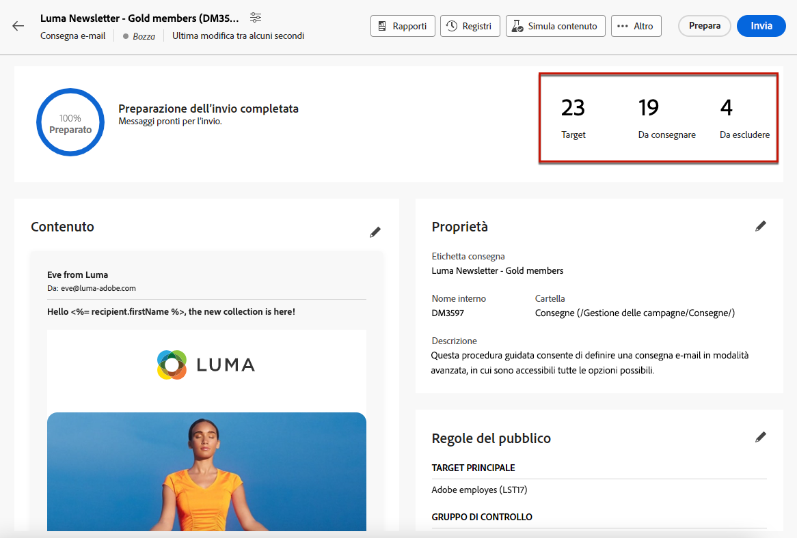
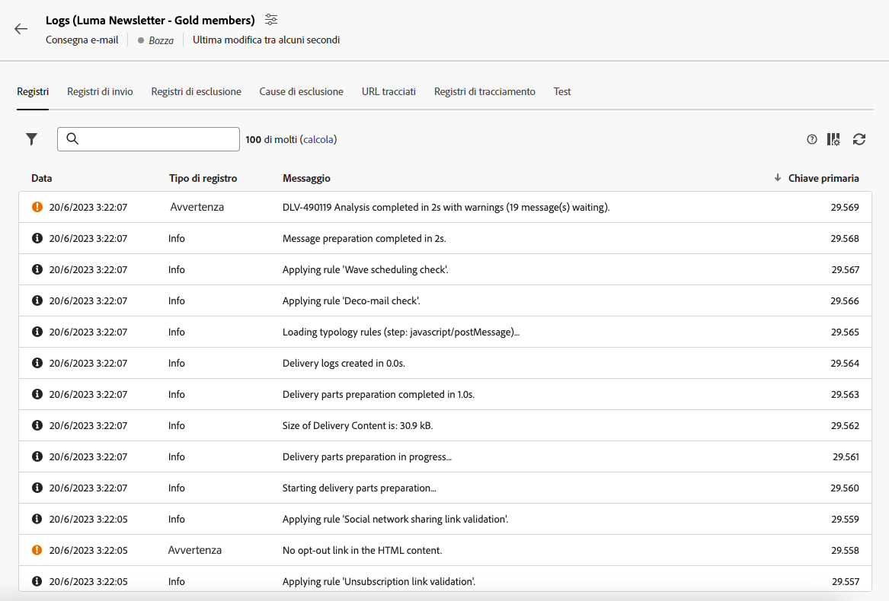
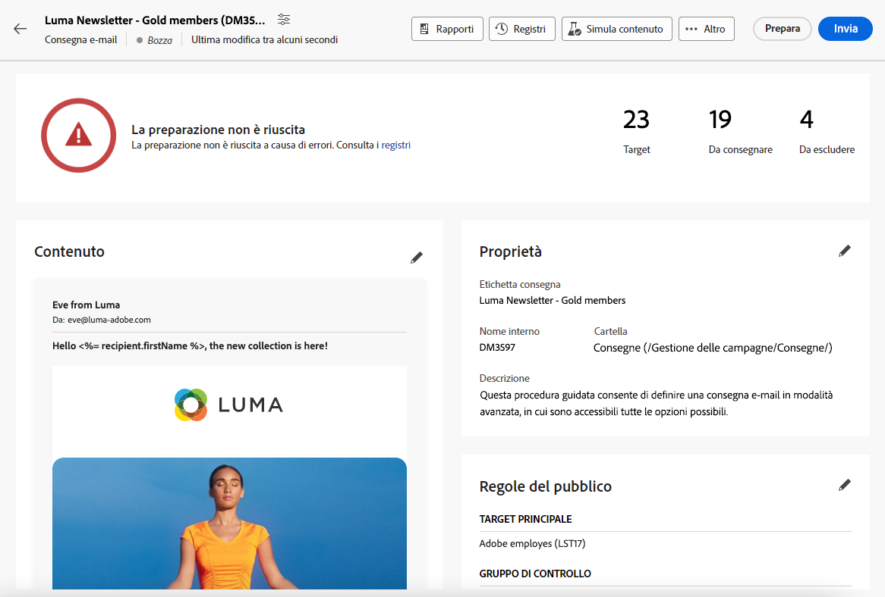
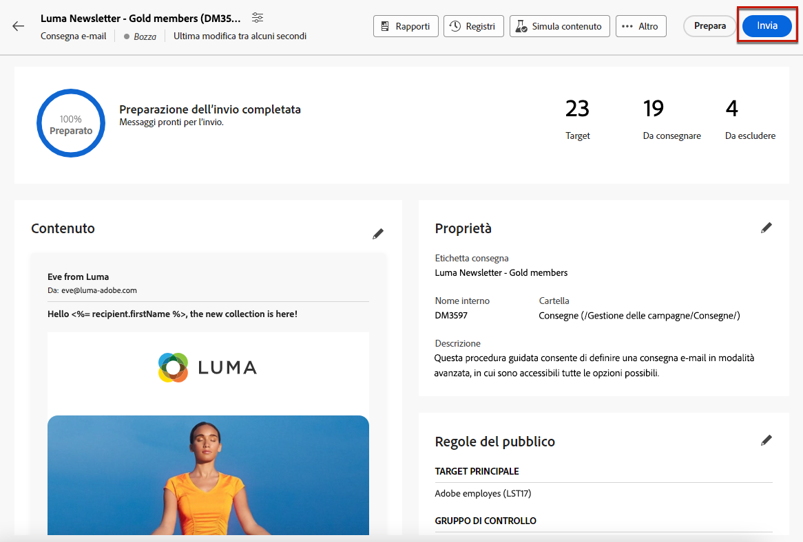
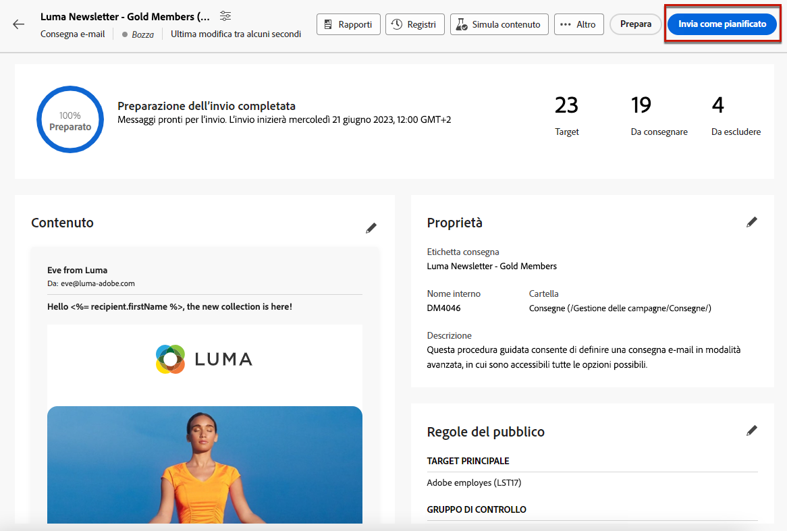
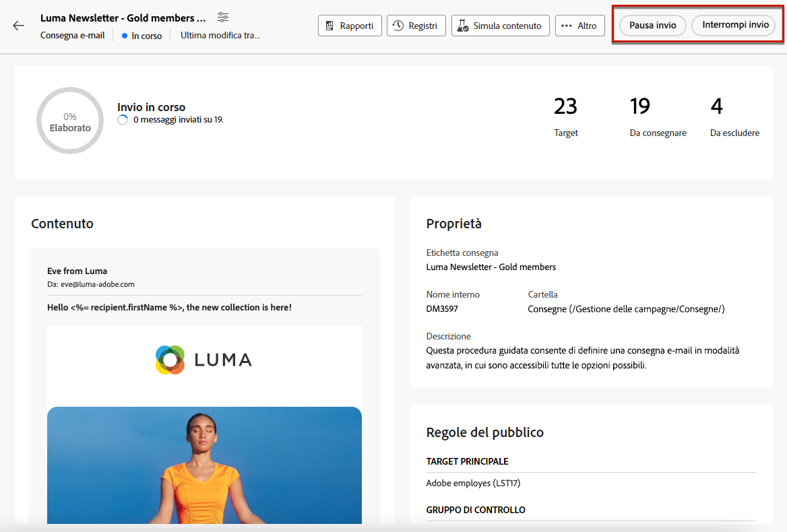
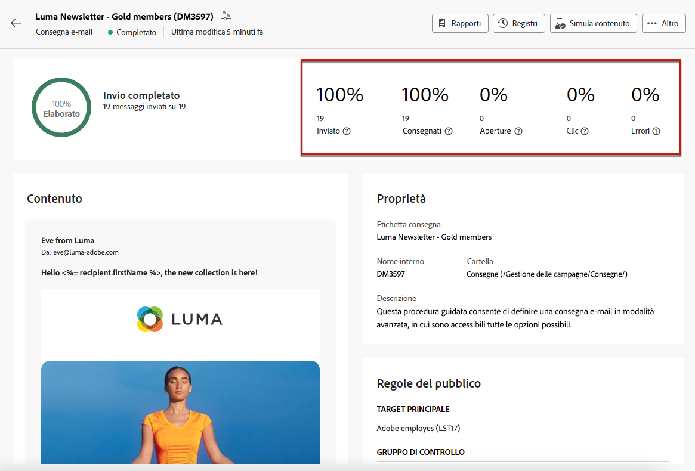

# Preparare e inviare il messaggio e-mail {#prepare-send}

## Preparare l’invio {#prepare}

Una volta definiti i [contenuto](../content/edit-content.md), [pubblico](../audience/add-audience.md) e la pianificazione, sei pronto per preparare la consegna delle e-mail.

Durante la preparazione, viene calcolata la popolazione target e viene generato il contenuto del messaggio per ciascun profilo incluso nel target. Al termine della preparazione, i messaggi sono pronti per essere inviati subito oppure alla data e all’ora pianificate.

Le regole di convalida utilizzate durante la preparazione della consegna sono descritte nella [documentazione di Campaign v8 (console)](https://experienceleague.adobe.com/docs/campaign/campaign-v8/campaigns/send/validate/delivery-analysis.html?lang=it){target="_blank"}.

I passaggi principali per preparare l’invio sono elencati di seguito.

1. Dal dashboard di consegna, fai clic su **[!UICONTROL Rivedi e invia]**.

   

1. Fai clic su **[!UICONTROL Prepara]** posizionato nell’angolo in alto a destra e conferma.

   

   >[!NOTE]
   >
   >Se hai pianificato la consegna e hai disabilitato **[!UICONTROL Abilita la conferma prima dell’invio]** , i passaggi di preparazione e invio sono raggruppati sotto il **[!UICONTROL Prepara e invia]** pulsante. [Ulteriori informazioni sulla pianificazione](../email/create-email.md#schedule)

1. Viene visualizzato l’avanzamento della preparazione. A seconda della dimensione della popolazione target, questa operazione potrebbe richiedere del tempo.

   Puoi interrompere la preparazione in qualsiasi momento utilizzando il pulsante **[!UICONTROL Interrompi preparazione.]**

   

   >[!NOTE]
   >Durante la fase di preparazione, non vengono inviati messaggi. È quindi possibile iniziare o interrompere questo processo senza alcun rischio.

1. Al termine della preparazione, controlla i KPI. Se il numero di messaggi da inviare non corrisponde alle tue aspettative, modifica il pubblico e riavvia la preparazione.

   

   Di seguito sono riportati i diversi KPI visualizzati:

   * **[!UICONTROL Target]**: numero di destinatari nel target.
   * **[!UICONTROL Da consegnare]**: numero di messaggi che verranno inviati.
   * **[!UICONTROL Da escludere]**[: numero di messaggi esclusi da una regola di tipologia](../advanced-settings/delivery-settings.md#typology).

1. Fai clic sul pulsante **[!UICONTROL Registri]** e controlla che non vi siano errori. L’ultimo messaggio del registro presenta eventuali messaggi di errore e il numero di errori. [Ulteriori informazioni](delivery-logs.md)

   

1. Se la preparazione rileva un errore critico che impedisce l’invio della consegna, nella dashboard delle consegne lo stato di preparazione viene visualizzato come “non riuscito”.

   

1. Se apporti modifiche alla consegna dopo la preparazione, devi riavviare la preparazione affinché tali modifiche vengano prese in considerazione.

Una volta completata la preparazione senza errori, il messaggio è pronto per essere inviato.

## Inviare il messaggio {#send}

>[!CONTEXTUALHELP]
>id="acw_deliveries_email_metrics_delivered"
>title="Consegnati"
>abstract="Numero di messaggi recapitati correttamente. Questo indicatore viene aggiornato ogni 5 minuti. La percentuale visualizzata si basa sul numero totale di messaggi inviati."

>[!CONTEXTUALHELP]
>id="acw_deliveries_email_metrics_opens"
>title="Aperture"
>abstract="Numero di messaggi aperti. Questo indicatore viene aggiornato ogni 5 minuti. La percentuale visualizzata è il rapporto tra il numero di aperture distinte e il numero di messaggi consegnati."

>[!CONTEXTUALHELP]
>id="acw_deliveries_email_metrics_clicks"
>title="Clic"
>abstract="Numero di destinatari che hanno fatto clic almeno una volta nell’e-mail. Questo indicatore viene aggiornato ogni 5 minuti. La percentuale visualizzata è il rapporto tra il numero di clic distinti e il numero di messaggi consegnati."

Una volta [preparazione](#prepare) è stato completato, ora puoi inviare la tua e-mail.

Se il messaggio è pianificato, verrà inviato alla data e all’ora definite. [Ulteriori informazioni](#schedule-the-send)

### Invia immediatamente {#send-immediately}

Per inviare immediatamente un’e-mail, segui la procedura indicata di seguito.

1. Dal dashboard di consegna, fai clic su **[!UICONTROL Invia]** nell&#39;angolo in alto a destra.

   

1. Conferma questa azione per inviare immediatamente il messaggio al target principale.

1. Viene visualizzato l’avanzamento dell’invio.

### Pianifica l’invio {#schedule-the-send}

Se hai pianificato l’invio dell’e-mail in una data e in un’ora successive, segui i passaggi indicati di seguito.

1. Prima di premere il tasto **[!UICONTROL Rivedi e invia]** , assicurati di aver definito una pianificazione per l’e-mail. [Ulteriori informazioni](../email/create-email.md#schedule)

1. Dal dashboard di consegna, fai clic su **[!UICONTROL Pulsante Invia come pianificato]** nell&#39;angolo in alto a destra.

   

1. Clic **[!UICONTROL Conferma invio]**. La consegna viene inviata alla data pianificata al target principale.

   >[!NOTE]
   >
   >Se hai disabilitato **[!UICONTROL Abilita la conferma prima dell’invio]** , i passaggi di preparazione e invio sono raggruppati sotto il **[!UICONTROL Prepara e invia]** pulsante. [Ulteriori informazioni sulla pianificazione](../email/create-email.md#schedule)

## Sospendi o interrompi l’invio {#pause-stop-sending}

Indipendentemente dal fatto che la consegna sia pianificata o meno, è possibile eseguire due azioni in qualsiasi momento durante il processo di invio:

* Clic **[!UICONTROL Sospendi invio]** per interrompere l’invio dei messaggi. Puoi riprendere l’invio in qualsiasi momento.

* Clic **[!UICONTROL Interrompi invio]** per interrompere immediatamente l’invio. Una volta interrotti, né la preparazione né l’invio possono essere ripresi.

## Controlla i KPI {#check-kpis}

Una volta completato l’invio, puoi controllare i KPI visualizzati:

* **[!UICONTROL Inviato]**: numero di messaggi consegnati. La percentuale visualizzata si basa sul numero totale di messaggi da consegnare.

* **[!UICONTROL Consegnati]**: numero di messaggi recapitati correttamente. La percentuale visualizzata si basa sul numero totale di messaggi inviati.

* **[!UICONTROL Aperture]**: numero di messaggi aperti. La percentuale visualizzata è il numero di aperture distinte rispetto al numero di messaggi consegnati.

* **[!UICONTROL Clic]**: numero di destinatari che hanno fatto clic almeno una volta nell’e-mail. La percentuale visualizzata è il numero di clic distinti rispetto al numero di messaggi consegnati.

* **[!UICONTROL Errori]**: il numero di e-mail con lo stato di errore. La percentuale visualizzata si basa sul numero totale di messaggi inviati.

>[!NOTE]
>
>Tutti gli indicatori vengono aggiornati ogni 5 minuti dopo l’inizio della consegna. Gli indicatori di preparazione della consegna sono in tempo reale.

Puoi anche controllare i registri. [Ulteriori informazioni](delivery-logs.md)