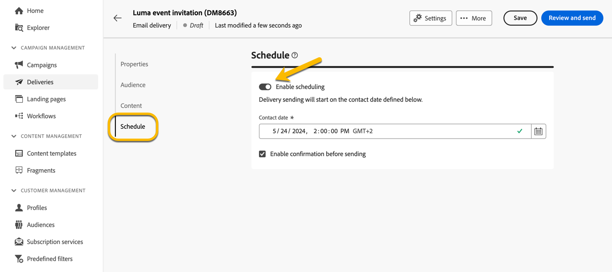
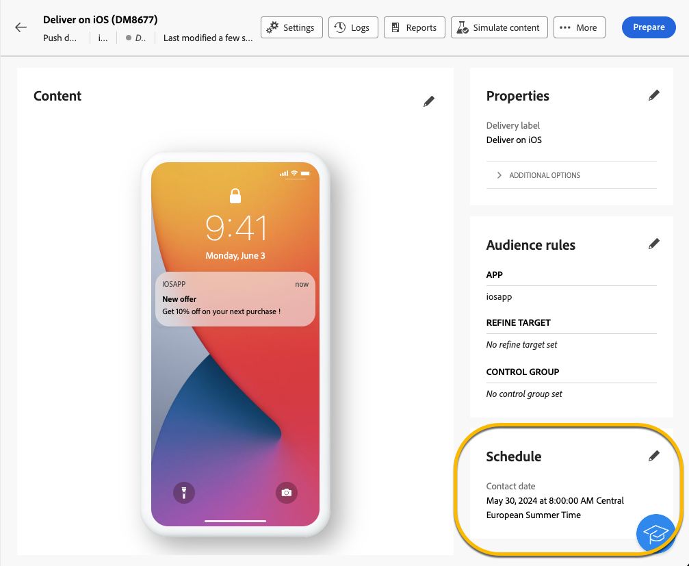

# Pianificare l’invio di una consegna {#schedule-sending}

Puoi pianificare l’invio di una consegna. I passaggi dipendono dal fatto che si tratti di una consegna autonoma (una tantum) o se si sta lavorando nel contesto di un flusso di lavoro della campagna.

## Consegna autonoma

Per le consegne autonome, pianifica la data e l’ora direttamente nella consegna. Consulta gli esempi seguenti per ogni tipo di consegna: e-mail, SMS e notifiche push.

### E-mail {#schedule-email-standalone}

Per pianificare l’invio di una consegna e-mail, effettua le seguenti operazioni:

1. Nella sezione **[!UICONTROL Pianifica]** delle proprietà di consegna, attiva l&#39;interruttore **[!UICONTROL Abilita pianificazione]**.

1. Impostare la data e l&#39;ora desiderate per l&#39;invio e fare clic sul pulsante **[!UICONTROL Rivedi e invia]**.

   {zoomable="yes"}

>[!NOTE]
>
>Per impostazione predefinita, l’opzione **[!UICONTROL Abilita la conferma prima dell’invio]** è abilitata. Questa opzione richiede di confermare l’invio prima che la consegna venga inviata alla data e all’ora pianificate. Se devi inviare la consegna automaticamente alla data e all’ora pianificate, disabilita questa opzione.
>

1. Verificare che la pianificazione sia corretta e fare clic sul pulsante **[!UICONTROL Prepara]**.

{zoomable="yes"}

1. Una volta completata la preparazione, i messaggi sono pronti per essere inviati. Vengono visualizzate le metriche chiave per la consegna, tra cui la popolazione target totale, il numero di messaggi da consegnare e il numero di destinatari esclusi. Fai clic sul pulsante **[!UICONTROL Invia come pianificato]** per confermare che la consegna verrà inviata alla data e all&#39;ora pianificate per la destinazione principale.

{zoomable="yes"}

### SMS

Per pianificare la consegna di SMS per una data e un’ora specifiche, segui gli stessi passaggi previsti per le consegne e-mail. [Vedi sopra](#schedule-email-standalone).

{zoomable="yes"}

Puoi anche verificare che la pianificazione sia applicata:

{zoomable="yes"}

### Notifica push

Per pianificare una consegna push indipendente per una data e un’ora specifiche, segui gli stessi passaggi previsti per le consegne e-mail. [Vedi sopra](#schedule-email-standalone).

{zoomable="yes"}

Puoi anche verificare che la pianificazione sia applicata:

{zoomable="yes"}

### Consegna autonoma in una campagna

Puoi creare una consegna autonoma all’interno di una campagna senza utilizzare un flusso di lavoro. Imposta la data e l’ora pianificate per questa consegna come spiegato in precedenza. La campagna può avere una propria pianificazione, incluse una data di inizio e una data di fine. Questa pianificazione non interferisce con la pianificazione della consegna.

{zoomable="yes"}

## Pianificare una consegna in un flusso di lavoro della campagna

Nel contesto di un flusso di lavoro della campagna, la best practice consiste nell&#39;utilizzare l&#39;attività **[!UICONTROL Scheduler]** per applicare una data e un&#39;ora per l&#39;avvio del flusso di lavoro, che comporta l&#39;invio della consegna. [Ulteriori informazioni sull&#39;utilità di pianificazione](../workflows/activities/scheduler.md).

{zoomable="yes"}

Configurare la data e l&#39;ora nell&#39;attività **[!UICONTROL Scheduler]**.

{zoomable="yes"}

>[!NOTE]
>
>Quando utilizzi l&#39;attività **[!UICONTROL Scheduler]** per pianificare l&#39;invio della consegna in un flusso di lavoro, non attivare l&#39;opzione **[!UICONTROL Abilita pianificazione]** nelle impostazioni dell&#39;attività **[!UICONTROL Delivery]**. La consegna verrà inviata automaticamente.
>

Se si attiva l&#39;opzione **[!UICONTROL Abilita pianificazione]** nelle impostazioni dell&#39;attività **[!UICONTROL Consegna]** e si imposta una data e un&#39;ora, la consegna verrà inviata in questa data e ora. Ciò significa che in caso di ritardo tra la data di avvio del flusso di lavoro e la data di invio, il pubblico potrebbe non essere aggiornato.