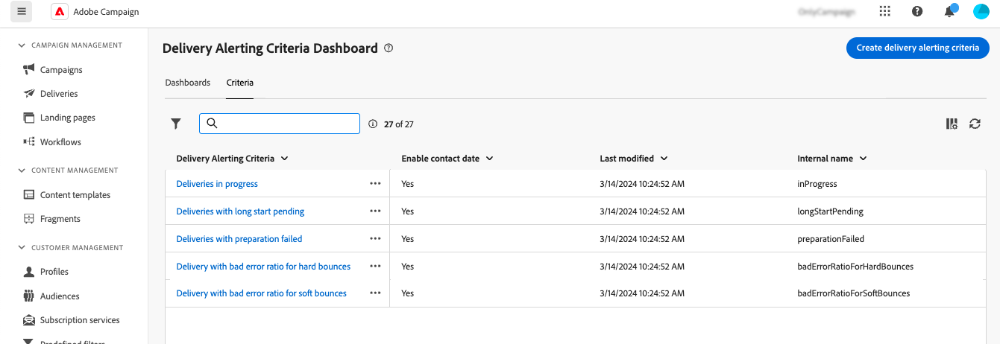
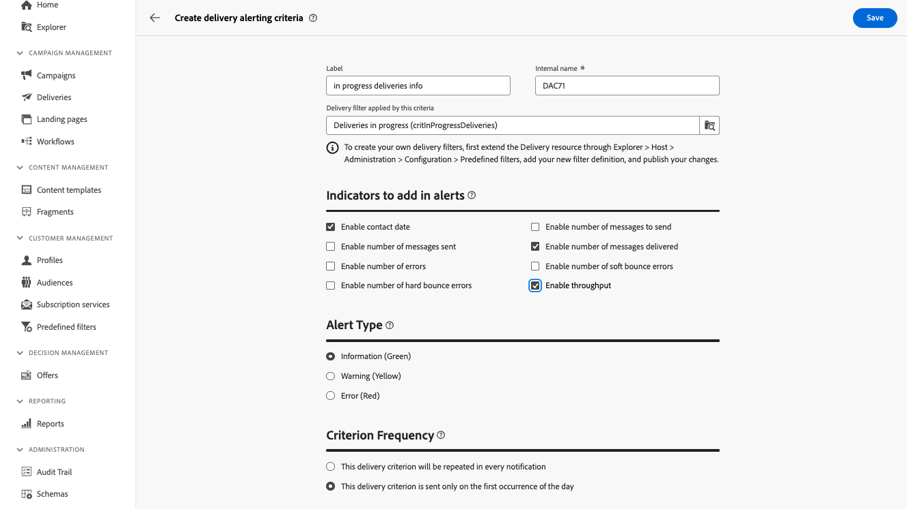

# Criteri per gli avvisi di consegna {#delivery-alerting-criteria}

>[!CONTEXTUALHELP]
>id="acw_delivery_alerting_criteria"
>title="Dashboard dei criteri per gli avvisi di consegna"
>abstract="L’interfaccia utente di Campaign Web fornisce criteri di avviso predefiniti (consegne con bassa velocità effettiva, consegne la cui preparazione non è riuscita...) che puoi aggiungere al dashboard. Puoi anche creare criteri personalizzati in base alle tue esigenze."

L’interfaccia utente di Campaign Web fornisce criteri di avviso predefiniti (consegne con bassa velocità effettiva, consegne la cui preparazione non è riuscita...) che puoi aggiungere al dashboard. Puoi anche creare criteri personalizzati in base alle tue esigenze.

I criteri di avviso sono accessibili dalla sezione **Avvisi sulla consegna** nel riquadro di navigazione a sinistra, sotto il **Criteri** scheda.

## Criteri di avviso predefiniti {#ootb-criteria}

Nell’interfaccia utente di Campaign Web sono disponibili criteri di avviso predefiniti. Tali criteri coprono una serie di scenari, elencati di seguito:

* **Consegne non riuscite**: qualsiasi consegna pianificata all’interno di un intervallo definito, con uno stato errato.
* **Consegne con preparazione non riuscita**: qualsiasi consegna modificata all’interno di un intervallo definito, per la quale la fase di preparazione (calcolo del target e generazione del contenuto) non è riuscita.
* **Consegna con percentuale di errori errata per mancati recapiti non permanenti**: qualsiasi consegna pianificata all’interno di un intervallo definito, con uno stato almeno In corso, con un rapporto di errore di mancato recapito non permanente maggiore di una percentuale definita.
* **Consegna con percentuale di errori errata per mancati recapiti permanenti**: qualsiasi consegna pianificata all’interno di un intervallo definito, con uno stato almeno In corso, con un rapporto di errore per mancati recapiti permanenti superiore a una percentuale definita.
* **Consegne con inizio lungo in sospeso**: qualsiasi consegna pianificata all’interno di un intervallo definito, con uno stato Start in sospeso più lungo di una durata definita. Lo stato Start in sospeso indica che i messaggi non sono ancora stati presi in considerazione dal sistema.
* **Consegne a bassa velocità**: qualsiasi consegna avviata per una durata superiore a una determinata, con meno di una percentuale definita di messaggi elaborati, con una velocità effettiva inferiore a un valore definito.
* **Consegne in corso**: qualsiasi consegna pianificata all’interno di un intervallo definito, con lo stato In corso.

>[!NOTE]
>
>I valori predefiniti vengono applicati a tutti i parametri per i criteri di cui sopra. Questi valori possono essere personalizzati nel **Parametri dei criteri** nelle dashboard degli avvisi di consegna in cui vengono utilizzati. [Scopri come utilizzare le dashboard](../msg/delivery-alerting-dashboards.md)

## Creare un criterio di avviso {#criteria}

>[!CONTEXTUALHELP]
>id="acw_delivery_alerting_criteria_create"
>title="Crea criteri per gli avvisi di consegna"
>abstract="Oltre ai criteri di avviso predefiniti forniti da Adobe Campaign, puoi creare criteri personalizzati in base alle tue esigenze."

>[!CONTEXTUALHELP]
>id="acw_delivery_alerting_criteria_create_indicators"
>title="Indicatori da aggiungere negli avvisi"
>abstract="Seleziona gli indicatori da visualizzare come colonne nella sezione &quot;Dettagli&quot; degli avvisi e-mail."

>[!CONTEXTUALHELP]
>id="acw_delivery_alerting_criteria_create_alert"
>title="Tipo di avviso"
>abstract="Specifica la **Tipo di avviso** per il criterio, ovvero l’etichetta e il colore da visualizzare accanto al criterio di consegna nella sezione &quot;Riepilogo&quot; degli avvisi."

>[!CONTEXTUALHELP]
>id="acw_delivery_alerting_criteria_create_frequency"
>title="Frequenza criterio"
>abstract="Controlla la frequenza giornaliera degli avvisi per ogni consegna che soddisfa il criterio."

>[!CONTEXTUALHELP]
>id="acw_delivery_alerting_filter"
>title="Creare un criterio di avviso"
>abstract="Per creare filtri di consegna personalizzati, crea un nuovo filtro preimpostato nella console Campaign v8 dal nodo **Amministrazione** > **Configurazione** > **Filtri preimpostati**."

Per creare un nuovo criterio, effettua le seguenti operazioni:

1. Accedi a **Avvisi di consegna** nel riquadro di navigazione a sinistra e selezionare **Criteri** scheda.
1. Fai clic su **Creare criteri di avviso sulla consegna** pulsante.
1. Fornisci un’etichetta per il criterio. Il nome interno viene popolato automaticamente e di sola lettura.
1. Il **Filtro di consegna applicato da questo criterio** consente di perfezionare l’ambito del criterio applicando a esso un filtro predefinito.

   Nell’esempio seguente, il **Consegne in corso (critInProgressDeliveries)** È stato selezionato un filtro, il che significa che il criterio prende in considerazione solo le consegne con lo stato &quot;In corso&quot;.

   

   >[!NOTE]
   >
   >Se nessuno dei filtri predefiniti soddisfa le tue esigenze, puoi contattare il tuo amministratore per creare un filtro personalizzato.  Informazioni dettagliate su come creare filtri predefiniti nella console Campaign sono disponibili nel [Documentazione di Adobe Campaign v8 (console)](https://experienceleague.adobe.com/en/docs/campaign/campaign-v8/audience/create-audiences/create-filters){target="_blank"}
   >
   >Questa operazione deve essere eseguita solo da utenti esperti.

1. In **Indicatori da aggiungere agli avvisi** , scegli gli indicatori da visualizzare come colonne nella sezione &quot;Dettagli&quot; degli avvisi e-mail.

1. Specifica la **Tipo di avviso** per il criterio, ovvero l’etichetta e il colore da visualizzare accanto al criterio di consegna nella sezione &quot;Riepilogo&quot; degli avvisi.

1. Il **Frequenza criteri** Questa sezione ti consente di controllare la frequenza giornaliera degli avvisi per ogni consegna che soddisfa il criterio:

   * **Questo criterio di consegna verrà ripetuto in ogni notifica**: mostra una consegna che soddisfa il criterio in ogni avviso e-mail della giornata.
   * **Questo criterio di consegna viene inviato solo alla prima occorrenza del giorno**: mostra una consegna che soddisfa il criterio solo nel primo rapporto della giornata, non ripetuta negli avvisi e-mail successivi.
