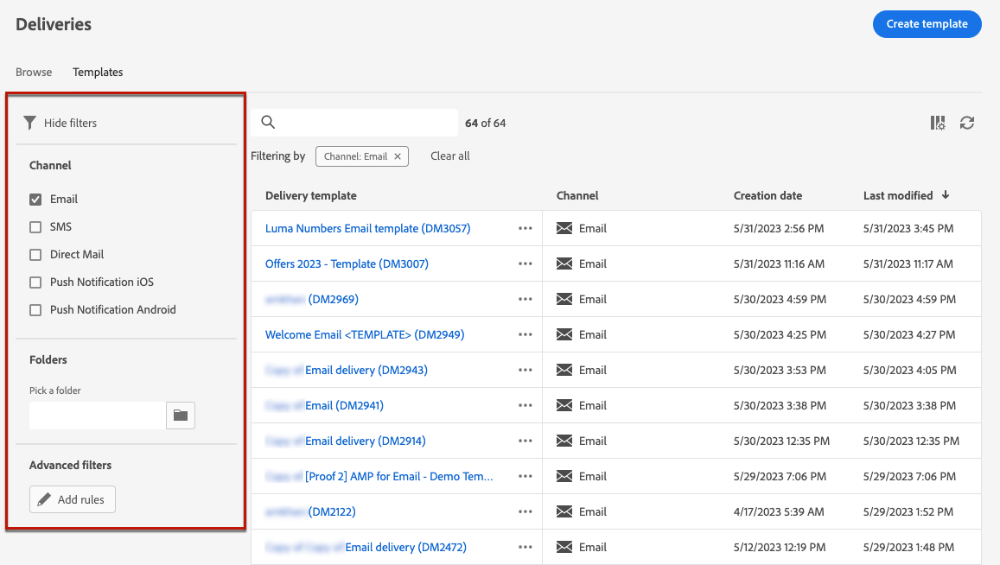
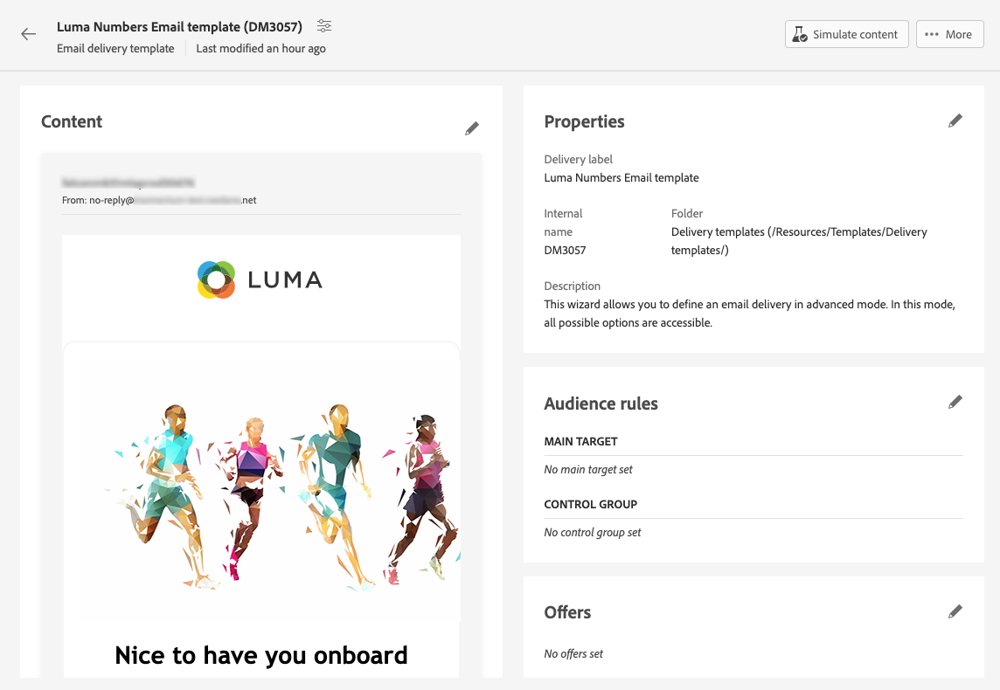

# Utilizzare i modelli di consegna {#work-with-delivery-templates}

>[!CONTEXTUALHELP]
>id="acw_delivery_template_for_campaign"
>title="Modelli di consegna"
>abstract="Utilizza i modelli di consegna per uniformare l’aspetto creativo delle comunicazioni e velocizzare l’esecuzione e il lancio delle campagne"

Per un processo di progettazione accelerato e migliorato, puoi creare modelli di consegna per riutilizzare facilmente contenuti e impostazioni personalizzati nelle campagne. Questa funzionalità permette di uniformare l’aspetto creativo delle comunicazioni e velocizzare l’esecuzione e il lancio delle campagne.

Un modello può includere:

* [Tipologie](../advanced-settings/delivery-settings.md#typology),
* L’indirizzo del mittente,
* Un [pubblico](../audience/about-recipients.md), inclusi [gruppi di controllo](../audience/control-group.md),
* Personalizzato [contenuto](../content/edit-content.md),
* [Campi personalizzati](../personalization/personalize.md) e [contenuto condizionale](../personalization/conditions.md),
* Collegamenti a [pagina mirror](../content/mirror-page.md) e annullamento dell’abbonamento [collegamenti](../content/message-tracking.md),
* Altre proprietà di consegna, ad esempio validità delle risorse, parametri per nuovi tentativi o impostazioni della quarantena

<!--
>[!NOTE]
>
>Delivery templates are different from email content templates, which allow you to reuse only the content of your messages.-->

>[!NOTE]
>
>I modelli di consegna sono diversi da [modelli di contenuto](../content/email-sample-templates.md), che ti consente di iniziare a creare i contenuti con uno dei modelli e-mail di esempio forniti come predefiniti.

## Accedere e gestire i modelli di consegna {#access-manage-templates}

>[!CONTEXTUALHELP]
>id="acw_delivery_templates"
>title="Utilizzare i modelli di consegna"
>abstract="Utilizza i modelli di consegna per creare e salvare facilmente le consegne esistenti per riutilizzarle in futuro."
>additional-url="https://experienceleague.adobe.com/docs/campaign-web/v8/msg/delivery-template.html?lang=it#copy-an-existing-template" text="Duplicare un modello esistente"
>additional-url="https://experienceleague.adobe.com/docs/campaign-web/v8/msg/delivery-template.html?lang=it#convert-an-existing-delivery" text="Convertire una consegna in un modello"

Per accedere all’elenco dei modelli di contenuto, dal menu a sinistra seleziona **[!UICONTROL Gestione delle campagne]** > **[!UICONTROL Consegne]** e passa alla scheda **Modelli**.

Vengono visualizzati tutti i modelli che sono stati [creati](#create-a-delivery-template) nell’ambiente corrente.

È possibile filtrare i modelli di contenuto per canali e cartelle. È inoltre possibile impostare filtri avanzati creando una regola con attributi di consegna. [Ulteriori informazioni sul generatore di regole](../audience/segment-builder.md)

Per modificare un modello, fai clic sull’elemento desiderato nell’elenco. Quindi puoi eseguire le seguenti operazioni:

* Puoi modificarne il contenuto, le proprietà, il pubblico ed eventuali offerte associate.
* Puoi anche testare il modello. [Ulteriori informazioni](#test-template)

Per eliminare o [duplicare](#copy-an-existing-template) un modello, seleziona l’azione corrispondente dal menu **[!UICONTROL Altre azioni]**, nell’elenco **[!UICONTROL Modelli]** o in una schermata per la modifica dei modelli.

>[!NOTE]
>
>La modifica o l’eliminazione di un modello non ha alcun effetto sulle consegne che sono già state create con tale modello.

## Creare un modello di consegna {#create-a-delivery-template}

Per creare un modello di consegna, puoi utilizzare diversi metodi:
* Duplicare un modello esistente - [Ulteriori informazioni](#copy-an-existing-template)
* Convertire una consegna esistente in un modello - [Ulteriori informazioni](#convert-an-existing-delivery)
* Creare un modello di consegna da zero - [Ulteriori informazioni](#create-a-new-template)

### Duplica un modello di consegna esistente {#copy-an-existing-template}

Campaign include un set di modelli incorporati per ogni canale: e-mail, push e SMS. Il modo più semplice per creare un modello di consegna consiste nel duplicare e personalizzare un modello incorporato.

>[!NOTE]
>
>Puoi duplicare anche un modello personalizzato.

Per duplicare un modello di consegna, segui questi passaggi:

1. Passa alla scheda **Modelli**, dal menu a sinistra delle **Consegne**. [Ulteriori informazioni](#access-manage-templates)
1. Fai clic sul pulsante **[!UICONTROL Altre azioni]** a destra del nome del modello desiderato e seleziona **[!UICONTROL Duplica]**.

   Puoi anche selezionare un modello dall’elenco e selezionare questa opzione dalla schermata per la modifica del modello.

1. Conferma la duplicazione.

   

1. La nuova dashboard del modello si apre nella schermata centrale. Modifica le impostazioni del modello in base alle esigenze.

   

1. Fai clic sul pulsante **[!UICONTROL Rivedi]** per salvare e rivedere il modello. Potrai sempre modificarne le impostazioni, eliminarlo e duplicarlo.

   

1. Se necessario, puoi testare come viene riprodotto il modello. [Ulteriori informazioni](#test-template)

Il nuovo modello viene aggiunto all’elenco [**Modelli**](#access-manage-templates). Ora puoi selezionarlo durante la creazione di una nuova consegna.

### Convertire una consegna in un modello {#convert-an-existing-delivery}

Qualsiasi consegna può essere convertita in un modello da riutilizzare in futuro per nuove consegne simili.

Per salvare una consegna come modello, segui i passaggi seguenti:

1. Vai al menu **[!UICONTROL Gestione delle campagne]** > **[!UICONTROL Consegne]**.
1. Nella scheda **[!UICONTROL Sfoglia]**, fai clic sul pulsante **[!UICONTROL Altre azioni]** a destra del nome della consegna desiderata e seleziona **[!UICONTROL Copia come modello]**.

   

1. Conferma la duplicazione.

1. La nuova dashboard del modello si apre nella schermata centrale. Modifica le impostazioni del modello in base alle esigenze.

1. Fai clic sul pulsante **[!UICONTROL Rivedi]** per salvare e rivedere il modello. Potrai sempre modificarne le impostazioni, eliminarlo e duplicarlo.

1. Se necessario, puoi testare come viene riprodotto il modello. [Ulteriori informazioni](#test-template)

Il nuovo modello viene aggiunto all’elenco [**Modelli**](#access-manage-templates). Ora puoi selezionarlo durante la creazione di una nuova consegna.

### Creare un nuovo modello di consegna {#create-a-new-template}

>[!NOTE]
>
>Per evitare errori di configurazione, Adobe consiglia di [duplicare un modello incorporato](#copy-an-existing-template) e personalizzarne le proprietà anziché creare un nuovo modello.

Per configurare un modello di consegna da zero, segui la procedura seguente:

1. Passa alla scheda **Modelli**, dal menu a sinistra delle **Consegne**. [Ulteriori informazioni](#access-manage-templates)
1. Fai clic sul pulsante **[!UICONTROL Crea modello]**.

   

1. Seleziona il canale da utilizzare per il modello.
1. Per impostazione predefinita, viene utilizzato il modello di consegna integrato per tale canale per facilitare la creazione di un modello personalizzato. Se necessario, utilizza il pulsante dedicato a destra del canale selezionato per selezionare un altro modello.

   

1. Fai di nuovo clic sul pulsante **[!UICONTROL Crea modello]**.

1. Definisci le proprietà del modello, per il [pubblico](../audience/add-audience.md) e il contenuto a seconda del canale selezionato.

   >[!NOTE]
   >
   >Ulteriori informazioni sui canali di consegna e su come progettare i rispettivi contenuti sono disponibili nelle sezioni seguenti:
   >
   > * [Canale e-mail](../email/create-email.md)
   > * [Canale di notifica push](../push/gs-push.md)
   > * [Canale SMS](../sms/create-sms.md)

1. Inoltre, per i modelli e-mail, è possibile accedere a impostazioni avanzate, come regole di tipologia e mappature di destinazione, tramite **[!UICONTROL Impostazioni]** in alto a destra. [Ulteriori informazioni](../advanced-settings/delivery-settings.md)

1. Fai clic sul pulsante **[!UICONTROL Rivedi]** per salvare e rivedere il modello. Potrai sempre modificarne le impostazioni, eliminarlo e duplicarlo.

1. Se necessario, puoi testare come viene riprodotto il modello. [Ulteriori informazioni](#test-template)

Il nuovo modello viene aggiunto all’elenco [**Modelli**](#access-manage-templates). Ora puoi selezionarlo durante la creazione di una nuova consegna.

## Testare un modello di consegna {#test-template}

Puoi testare come verrà riprodotto qualsiasi modello di consegna, che sia stato creato da zero o da contenuti esistenti. A questo scopo, segui questi passaggi.

1. Sfoglia la scheda **Modelli** a cui puoi accedere dal menu **[!UICONTROL Gestione delle campagne]** > **[!UICONTROL Consegne]** e seleziona un modello. [Ulteriori informazioni](#access-manage-templates)

1. Fai clic su **[!UICONTROL Simula contenuto]** in alto a destra.

   

1. Seleziona uno o più profili di test per controllare come vengono riprodotte le e-mail. Puoi anche selezionare profili reali dal tuo database.

1. Passa da un profilo all’altro per ottenere una rappresentazione personalizzata del messaggio in base al profilo selezionato.

   <!--[Learn more on test profiles](../preview-test/test-deliveries.md#recipients)-->

   Puoi anche regolare il livello di zoom e scegliere la visualizzazione su desktop o dispositivo mobile.

   

1. Chiudi la finestra per tornare alla schermata della modifica del modello.

>[!NOTE]
>
>Da un modello di consegna non è possibile utilizzare il rendering delle e-mail né inviare delle bozze.

* [Ulteriori informazioni sull’anteprima del contenuto delle e-mail](../preview-test/preview-content.md)

* [Ulteriori informazioni sull’anteprima del contenuto di SMS](../sms/content-sms.md)

* [Ulteriori informazioni sull’anteprima dei contenuti push](../push/gs-push.md)

