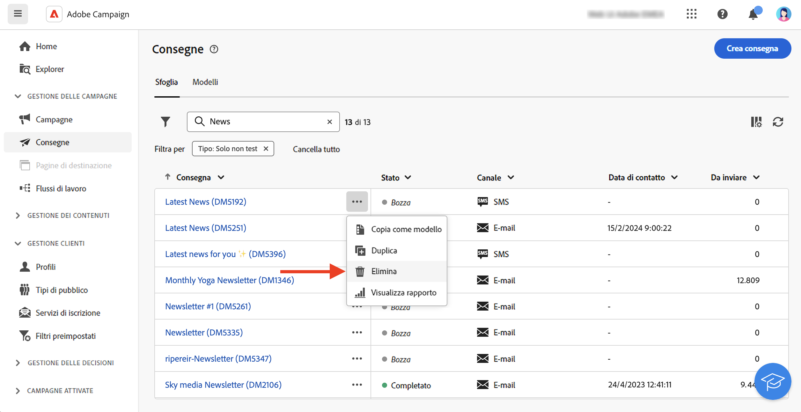

# Accedere alle consegne {#work-with-deliveries}

>[!CONTEXTUALHELP]
>id="acw_deliveries_list"
>title="Consegne"
>abstract="Una consegna è una comunicazione inviata a un pubblico su un canale specifico: e-mail, SMS o Push. In questa schermata puoi modificare, duplicare ed eliminare le consegne esistenti. Puoi visualizzare anche i rapporti delle consegne completate. Fai clic sul pulsante **Crea consegna** per aggiungere una nuova consegna."

## Accedere alle consegne {#access}

>[!CONTEXTUALHELP]
>id="acw_deliveries_additional_target"
>title="Target aggiuntivo"
>abstract="Queste regole possono essere modificate solo nella console client."

Le consegne sono accessibili dal menu **[!UICONTROL Consegne]** nella navigazione a sinistra. In questo elenco vengono visualizzate tutte le consegne create dalla console client o dall’interfaccia utente web. Da questa schermata, puoi monitorare tutte le consegne esistenti, duplicarle, eliminarle o crearne di nuove.

Per aprire una consegna, fai clic sul nome nell’elenco. La consegna si apre, consentendo di eseguire varie azioni, come modificare i parametri, controllarne l’esecuzione o monitorarne le prestazioni utilizzando rapporti dedicati.

>[!NOTE]
>
>Se apri una consegna creata nella console client, la sezione **[!UICONTROL Destinazione aggiuntiva]** potrebbe essere visualizzata per il pubblico. Ciò significa che sono state configurate più destinazioni per questa consegna. Questi parametri possono essere modificati solo nella console.
>
>{zoomable="yes"}

## Duplicare una consegna {#delivery-duplicate}

Puoi creare una copia di una consegna esistente dall’elenco o dal dashboard delle consegne.

Per duplicare una consegna dall’elenco delle consegne, effettua le seguenti operazioni:

1. Fai clic sul pulsante con i tre puntini a destra, accanto al nome della consegna da duplicare.
1. Seleziona **[!UICONTROL Duplica]**.
1. Conferma duplicazione: il nuovo dashboard delle consegne si apre nella schermata centrale.

Per duplicare una consegna dal dashboard, effettua le seguenti operazioni:

1. Apri la consegna e fai clic sul pulsante **[!UICONTROL ...Altro]** nella sezione superiore dello schermo.
1. Seleziona **[!UICONTROL Duplica]**.
1. Conferma la duplicazione: la nuova consegna sostituisce la consegna corrente nella schermata centrale.

## Eliminare una consegna {#delivery-delete}

Le consegne vengono eliminate dall’elenco delle consegne: dalla voce principale della consegna nella barra a sinistra oppure dall’elenco delle consegne di una campagna.

Per eliminare una consegna dall’elenco delle consegne, segui questi passaggi:

1. Fai clic sul pulsante con i tre puntini a destra, accanto al nome della consegna da duplicare.
1. Seleziona **[!UICONTROL Elimina]**.
1. Conferma l’eliminazione.

In questi elenchi sono presenti tutte le consegne, tuttavia le consegne create in un flusso di lavoro non possono essere eliminate da un elenco di consegne. Per eliminare una consegna creata nel contesto di un flusso di lavoro, è necessario eliminare l’attività di consegna dal flusso di lavoro stesso.

Per eliminare una consegna da un flusso di lavoro, segui questi passaggi:

1. Seleziona l’attività di consegna.
1. Fai clic sull&#39;icona **[!UICONTROL Elimina]** nel pannello di destra.
1. Conferma l’eliminazione. Se la consegna presenta dei nodi secondari, puoi scegliere di eliminarli o di mantenerli.

