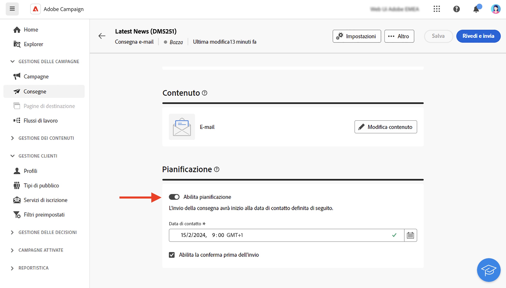

# Introduzione ai messaggi{#gs-messages}

>[!CONTEXTUALHELP]
>id="acw_deliveries_list"
>title="Consegne"
>abstract="Una consegna è una comunicazione di marketing inviata a un pubblico su un canale specifico: e-mail, SMS o notifica push. Nell’elenco delle consegne, puoi modificare le consegne esistenti e controllarne lo stato, le date di contatto e di modifica e i KPI. Fai clic sul pulsante “Crea consegna” per aggiungere una nuova consegna. Seleziona una consegna per visualizzarne il contenuto, la pianificazione, il pubblico e i dettagli."

Con Adobe Campaign, puoi inviare campagne cross-channel tra cui e-mail, SMS e notifiche push; inoltre, puoi misurarne l’efficacia utilizzando diversi rapporti dedicati.

Questi messaggi sono progettati e inviati tramite le consegne e possono essere personalizzati per ogni destinatario. Queste consegne possono essere autonome o incluse nei flussi di lavoro, nel contesto di una campagna di marketing.

Adobe Campaign v8 viene fornito con i seguenti canali di consegna: e-mail, SMS e app mobili.

<table style="table-layout:fixed">
    <tr style="border: 0;">
    <td>
    
    
<a href="../email/create-email.md"><strong>Creare e-mail</strong>
    

    

    </td>
    <td>
    
    

    <a href="../push/gs-push.md"><strong>Creare notifiche push</strong></a>
    

    

    </td>
    <td>
    
    

    <a href="../sms/create-sms.md"><strong>Creare messaggi SMS</strong></a>
    

    

    </td>
    </tr>
    </table>

## Creare una consegna {#create-delivery}

Puoi creare consegne autonome dalla **[!UICONTROL Consegne]** menu a sinistra o creare consegne nel contesto di un flusso di lavoro, incluso o meno in una campagna.

Sfoglia le schede seguenti per scoprire come creare una consegna:

>[!BEGINTABS]

>[!TAB Creare una consegna indipendente]

Per creare una consegna indipendente, effettua le seguenti operazioni:

1. Passa al menu **[!UICONTROL Consegne]** nella navigazione a sinistra, quindi fai clic sul pulsante **[!UICONTROL Crea consegna]**.

   

1. Scegli un canale per la consegna. Per ulteriori informazioni sui canali di consegna e su come definirne il contenuto, consulta queste sezioni:

   * [Canale e-mail](../email/create-email.md)
   * [Canale di notifica push](../push/gs-push.md)
   * [Canale SMS](../sms/create-sms.md)

1. Definisci il pubblico della consegna per il target principale e il gruppo di controllo. Per ulteriori informazioni sui tipi di pubblico, consulta [questa sezione](../audience/about-audiences.md).
1. Definisci il contenuto del messaggio.
1. (facoltativo) Definire la consegna [pianificazione](#gs-schedule). Se non è definita alcuna pianificazione, i messaggi vengono inviati immediatamente dopo aver fatto clic sul pulsante **[!UICONTROL Invia]**.
1. Fai clic sul pulsante **[!UICONTROL Rivedi e invia]** per verificare le impostazioni.
1. Utilizza il pulsante **[!UICONTROL Simula contenuto]** per verificare la consegna e le impostazioni di personalizzazione. Per ulteriori informazioni sulla simulazione di messaggi, consulta [questa sezione](../preview-test/preview-test.md).
1. Fai clic sul pulsante **[!UICONTROL Prepara]** per calcolare la popolazione target e generare i messaggi. La fase di preparazione può richiedere alcuni minuti. Una volta completata la preparazione, i messaggi sono pronti per l’invio. In caso di errore, passa a **Registri** per controllare avvisi e avvertenze.
1. Verifica i risultati e fai clic sul pulsante **[!UICONTROL Invia]** per iniziare a inviare messaggi.
1. Una volta inviati i messaggi, passa alla sezione **Rapporti** per accedere alle metriche chiave. Per ulteriori informazioni sui rapporti sulle consegne, consulta [questa sezione](../reporting/delivery-reports.md).

>[!TAB Creare una consegna in un flusso di lavoro]

Per creare una consegna in un flusso di lavoro, effettua le seguenti operazioni:

1. Crea un flusso di lavoro o apri un flusso di lavoro esistente. Ulteriori informazioni sui flussi di lavoro in [questa pagina](../workflows/gs-workflow-creation.md#gs-workflow-steps)
1. Aggiungi e configura un’attività di **[!UICONTROL Creazione del pubblico]** e fai clic sul pulsante `+`.

   

   L’attività di **[!UICONTROL Creazione del pubblico]** è descritta in [questa sezione](../workflows/activities/build-audience.md).

1. Seleziona un’attività di consegna: **[!UICONTROL E-mail]**, **[!UICONTROL SMS]**, **[!UICONTROL Notifica push (Android)]** o **[!UICONTROL Notifica push (iOS)]**. Per ulteriori informazioni sulle attività dei canali di consegna in un flusso di lavoro e su come definire il contenuto della consegna, consulta questa [sezione](../workflows/activities/channels.md).
1. Avvia il flusso di lavoro e controlla i registri.

Puoi anche aggiungere consegne in una campagna senza creare un flusso di lavoro. A questo scopo, passa alla scheda **[!UICONTROL Consegne]** della campagna e fai clic sul pulsante **[!UICONTROL Crea consegna]**.

I passaggi di configurazione sono simili a quelli per le consegne indipendenti.

Per ulteriori informazioni su come configurare una campagna e gestire le consegne che appartengono a una campagna, consulta [questa sezione](../campaigns/gs-campaigns.md).

>[!ENDTABS]

## Aggiungere la personalizzazione{#personalization}

I messaggi consegnati da Adobe Campaign possono essere personalizzati in vari modi. [Ulteriori informazioni sulle funzionalità di personalizzazione](../personalization/gs-personalization.md).

Utilizza Campaign per creare contenuti dinamici e inviare messaggi personalizzati. Le funzionalità di personalizzazione possono essere combinate per migliorare i messaggi e creare un’esperienza utente personalizzata.

Puoi personalizzare il contenuto del messaggio in diversi modi:

* Inserendo **campi di personalizzazione** dinamici

  I campi di personalizzazione vengono utilizzati per la personalizzazione di primo livello dei messaggi. Puoi selezionare qualsiasi campo disponibile nel database dall’editor di personalizzazione. Per una consegna, puoi selezionare qualsiasi campo correlato al destinatario, al messaggio o alla consegna. Questi attributi di personalizzazione possono essere inseriti nella riga dell’oggetto o nel corpo dei messaggi. [Ulteriori informazioni](../personalization/personalize.md)

* Inserimento di **blocchi di contenuto** predefiniti

  Campaign viene fornito con un set di blocchi di personalizzazione contenenti un rendering specifico da inserire nelle consegne. Ad esempio, puoi aggiungere un logo, un messaggio di auguri o un collegamento alla pagina mirror del messaggio. I blocchi di contenuto sono disponibili da una voce dedicata nell’editor di personalizzazione. [Ulteriori informazioni](../personalization/personalize.md#ootb-content-blocks)

* Creare **contenuto condizionale**

  Configura il contenuto condizionale per aggiungere la personalizzazione dinamica, ad esempio in base al profilo del destinatario. I blocchi di testo e/o le immagini vengono inseriti quando viene soddisfatta una particolare condizione. [Ulteriori informazioni](../personalization/conditions.md)

* Aggiungere **offerte personalizzate**

  Inserisci offerte personalizzate nel contenuto del messaggio, a seconda della posizione del destinatario, del meteo corrente o dell’ultimo ordine di acquisto.

## Anteprima e verifica delle consegne

Una volta definito il contenuto del messaggio, puoi visualizzarne l’anteprima per controllare il rendering dei messaggi e verificare le impostazioni di personalizzazione con i profili di test. [Ulteriori informazioni](../preview-test/preview-test.md)

## Pianificare l’invio della consegna {#gs-schedule}

>[!CONTEXTUALHELP]
>id="acw_deliveries_email_schedule"
>title="Pianificare l’invio"
>abstract="Definisci la data e l’ora esatta di invio dei messaggi. Scegliendo l’orario più appropriato per il messaggio di marketing, puoi massimizzare i tassi apertura."

Puoi impostare la data e l’ora esatta per l’invio dei messaggi. Scegliendo l’orario più appropriato per il messaggio di marketing, puoi massimizzare i tassi apertura.

Per pianificare l’invio della consegna, apri la consegna e passa alla **Pianificazione** sezione. Utilizza il **[!UICONTROL Abilita pianificazione]** attiva per attivarlo e imposta la data e l’ora desiderate per l’invio. Una volta inviata la consegna, l’invio effettivo inizierà dalla data di contatto definita.

Per impostazione predefinita, l’opzione **[!UICONTROL Abilita la conferma prima dell’invio]** è abilitata. Questa opzione richiede di confermare l’invio prima che la consegna venga inviata alla data e all’ora pianificate. Se devi inviare la consegna automaticamente alla data e all’ora pianificate, puoi disattivare questa opzione.

Scopri come inviare una consegna pianificata in [questa sezione](../monitor/prepare-send.md#schedule-the-send).

## Registri di monitoraggio e di tracciamento {#gs-tracking-logs}

Il monitoraggio delle consegne dopo l’invio è un passaggio fondamentale per garantire l’efficienza delle campagne di marketing e l’effettivo raggiungimento dei clienti.

Puoi monitorare una consegna, oltre a capire come vengono gestiti errori e quarantene.

Scopri le funzionalità di monitoraggio e tracciamento in [questa sezione](../reporting/gs-reports.md).

## Duplicare una consegna {#delivery-duplicate}

Puoi creare una copia di una consegna esistente dall’elenco o dal dashboard delle consegne.

Per duplicare una consegna dall’elenco delle consegne, effettua le seguenti operazioni:

1. Fai clic sul pulsante con i tre puntini a destra, accanto al nome della consegna da duplicare.
1. Seleziona **[!UICONTROL Duplica]**.
1. Conferma duplicazione: il nuovo dashboard delle consegne si apre nella schermata centrale.

Per duplicare una consegna dal dashboard, effettua le seguenti operazioni:

1. Apri la consegna e fai clic sul pulsante **[!UICONTROL ...Altro]** nella sezione superiore dello schermo.
1. Seleziona **[!UICONTROL Duplica]**.
1. Conferma la duplicazione: la nuova consegna sostituisce la consegna corrente nella schermata centrale.

## Eliminare una consegna {#delivery-delete}

Le consegne vengono eliminate dall’elenco delle consegne: dalla voce principale della consegna nella barra a sinistra oppure dall’elenco delle consegne di una campagna.

Per eliminare una consegna dall’elenco delle consegne, segui questi passaggi:

1. Fai clic sul pulsante con i tre puntini a destra, accanto al nome della consegna da duplicare.
1. Seleziona **[!UICONTROL Elimina]**.
1. Conferma l’eliminazione.

In questi elenchi sono presenti tutte le consegne, tuttavia le consegne create in un flusso di lavoro non possono essere eliminate da un elenco di consegne. Per eliminare una consegna creata nel contesto di un flusso di lavoro, è necessario eliminare l’attività di consegna dal flusso di lavoro stesso.

Per eliminare una consegna da un flusso di lavoro, segui questi passaggi:

1. Seleziona l’attività di consegna.
1. Fai clic sull&#39;icona **[!UICONTROL Elimina]** nel pannello di destra.
1. Conferma l’eliminazione. Se la consegna presenta dei nodi secondari, puoi scegliere di eliminarli o di mantenerli.

