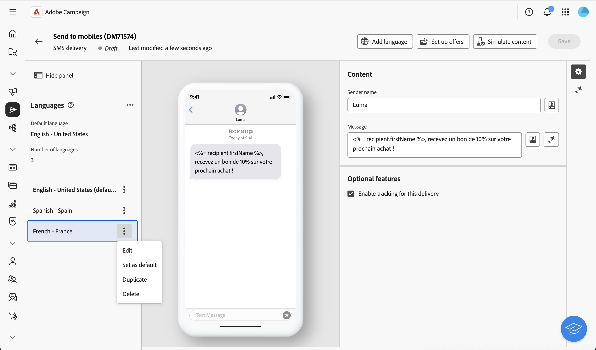

# Configurare una consegna multilingue {#multilingual-delivery}

>[!CONTEXTUALHELP]
>id="acw_deliveries_email_multilingual"
>title="Aggiungere lingue"
>abstract="In questa scheda troverai un elenco delle lingue in cui deve essere inviata la consegna. Puoi aggiungere altre lingue facendo clic sul pulsante Aggiungi lingua o duplicando un’altra lingua tramite questa scheda."

>[!CONTEXTUALHELP]
>id="acw_multilingual_file_upload"
>title="Importa varianti di lingua"
>abstract="Utilizza questa finestra di dialogo per aggiungere una variante di lingua importando un file CSV. Il file compila automaticamente tutti i campi disponibili per la lingua selezionata. È possibile trascinare e rilasciare il file o sceglierlo dal computer prima di confermare."

Nell’interfaccia utente web di Campaign, puoi impostare le consegne come multilingue, che consente di inviare messaggi in base alla lingua preferita di un profilo. Se non è definita alcuna preferenza, il messaggio viene inviato nella lingua predefinita.

In una distribuzione multilingue, la gestione della lingua si basa su varianti. Ogni variante rappresenta una lingua. Durante la creazione della consegna, puoi aggiungere più varianti di lingua in modo che corrispondano al numero di lingue richieste nel messaggio. Puoi anche modificare la lingua predefinita in qualsiasi momento dopo l’aggiunta di queste varianti.

La funzionalità multilingue è attualmente disponibile per e-mail, notifiche push, messaggi transazionali e SMS.

Per impostare le consegne multilingue, segui questi passaggi principali:

1. Aggiungi una variante di lingua, [ulteriori informazioni](#add-variant)
1. Definisci il contenuto per ogni variante, [ulteriori informazioni](#define-content)
1. Gestisci varianti di lingua, [leggi tutto](#manage-variant)

## Aggiungi una variante di lingua{#add-variant}

Per creare varianti di lingua, effettua le seguenti operazioni:

1. Dal dashboard di consegna, fai clic sull&#39;icona della matita per accedere alla schermata di modifica del contenuto della consegna, quindi fai clic su **[!UICONTROL Aggiungi lingua]**.

   >[!IMPORTANT]
   >
   >Il pulsante **[!UICONTROL Aggiungi lingua]** è disponibile solo se la dimensione di destinazione contiene lo schema **Lingua**. Per ulteriori informazioni sugli schemi e sulle dimensioni di destinazione, consulta la [documentazione dettagliata](../audience/targeting-dimensions.md).

   {zoomable="yes"}

1. Dal menu a discesa **Aggiungi lingua**, seleziona la lingua da aggiungere, quindi conferma. Per le notifiche push, puoi anche [caricare un file CSV](#csv-upload) per importare tutte le varianti di lingua contemporaneamente.

   La prima lingua aggiunta viene impostata automaticamente come predefinita e il contenuto esistente diventa la versione predefinita. Quando vengono aggiunte altre lingue, il loro contenuto viene inizialmente copiato dalla lingua predefinita.

   {zoomable="yes"}

   >[!NOTE]
   >
   >Le lingue disponibili in questo elenco dipendono dai valori definiti dall&#39;attributo **Lingua** (valori quali: system, user, dbenum e così via). Ulteriori informazioni sulla gestione dell&#39;enumerazione in questa [sezione](../administration/enumerations.md).

1. Ripetere l&#39;operazione per aggiungere altre lingue. Il pannello **[!UICONTROL Lingue]** a sinistra mostra l&#39;elenco delle lingue scelte, il numero di lingue e la lingua predefinita.

   Ad esempio, se hai scelto l’inglese, il francese e lo svedese, puoi visualizzare queste 3 lingue come illustrato di seguito:

   {zoomable="yes"}

   Per informazioni su come gestire le varianti di lingua, consulta questa [sezione](#manage-variant).

## Definisci il contenuto per ogni variante{#define-content}

Una volta impostate le lingue, definisci il contenuto della consegna per ogni lingua.

1. Dalla schermata dell&#39;edizione del contenuto della consegna, seleziona una lingua dal pannello **[!UICONTROL Lingue]**, a sinistra.

   {zoomable="yes"}

1. Definisci il contenuto del messaggio per questa lingua. Ulteriori informazioni in questa [sezione](../msg/create-deliveries.md).

1. Ripetere questa operazione per ogni lingua.

<!--
>[!BEGINTABS]

>[!TAB Email delivery]

1. From the delivery content edition screen, choose a language and click the **[!UICONTROL Edit email body]** button. You can also hover over the email preview and select **[!UICONTROL Open email designer]**.

    {zoomable="yes"}

1. Define the content of your email for this language. [Read more](../email/get-started-email-designer.md#start-authoring)

1. Repeat this operation for each language.

>[!TAB SMS delivery]

1. From the delivery content edition screen, choose a language.

1. Edit the content of the SMS message for this language. [Read more](../sms/create-sms.md)

    {zoomable="yes"}

1. Repeat this operation for each language.

>[!ENDTABS]

-->

Per visualizzare in anteprima la consegna, fai clic sul pulsante **[!UICONTROL Simula contenuto]** e scegli i profili. Assicurati che per ogni profilo venga visualizzato il contenuto corretto.

{zoomable="yes"}

## Gestione varianti di lingua{#manage-variant}

Nel pannello a sinistra vengono visualizzate tutte le informazioni sulle varianti di lingua. Per eliminare tutte le lingue, fare clic sul pulsante di espansione e quindi su **[!UICONTROL Elimina tutte le varianti]**.

{zoomable="yes"}

Nell’elenco delle varianti di lingua, puoi eseguire le azioni seguenti:

* **Modifica**: modifica la lingua mantenendo il contenuto associato.
* **Imposta come predefinito**: imposta la lingua come predefinita. Quando un profilo non ha una lingua definita, il messaggio viene inviato nella lingua predefinita.
* **Duplicato**: duplica il contenuto definito per questa lingua e scegli un&#39;altra variante.
* **Elimina**: elimina la variante e il contenuto associato.

{zoomable="yes"}

## Importa varianti di lingua da CSV (notifiche push) {#csv-upload}

Per le notifiche push, puoi popolare rapidamente tutte le varianti di lingua caricando un file CSV contenente il tuo contenuto multilingue. Questa funzione semplifica la creazione di campagne multilingue consentendoti di preparare i contenuti offline e importarli in blocco.

* **Efficienza**: aggiungere più lingue e il relativo contenuto in una singola operazione
* **Coerenza**: assicurati che i messaggi siano uniformi per tutte le varianti di lingua
* **Collaboration**: abilita i team di contenuto a preparare le traduzioni in strumenti per fogli di calcolo familiari
* **Gestione in blocco**: gestione e aggiornamento semplificati di un numero elevato di varianti di lingua

### Prerequisiti {#csv-best-practices}

Segui queste best practice per garantire l’importazione CSV corretta:

* **Utilizza la struttura esatta delle colonne**: tutte le 14 colonne devono essere presenti nel file CSV, anche se ne lasci alcune vuote. Le colonne mancanti causeranno un errore di importazione. È possibile utilizzare un ordine diverso, ma tutte le colonne devono essere presenti.
* **Corrispondenza esatta dei nomi di colonna**: i nomi di colonna fanno distinzione tra maiuscole e minuscole. Usa `title` non `Title`, `badge` non `Bbadge`, `locale` non `Locale`.
* **Usa codici locali minuscoli**: Formatta i codici locali come `en_us`, `fr_fr`, `de_de` (in minuscolo con trattino basso), non `en_US` o `en-us`.
* **Compila colonne obbligatorie**: le colonne `locale` e `language` devono contenere valori per ogni riga. I valori vuoti causeranno un errore di importazione.
* **Mantieni univoche le impostazioni internazionali**: ogni codice delle impostazioni internazionali deve essere presente una sola volta nel file CSV. Le lingue duplicate verranno rifiutate.
* **Salva come UTF-8**: salva sempre il file CSV con codifica UTF-8 per supportare correttamente i caratteri internazionali.
* **Contenuto contenente virgole**: se il titolo o il corpo del messaggio contiene virgole, racchiudere l&#39;intero campo tra virgolette: `"Hello, welcome!"`.
* **Utilizza correttamente i valori numerici**: per le colonne dei flag (isContentAvailable, isMutableContent, silentPush), utilizza `1` per true, `0` per false o lascia vuoto per impostazione predefinita.
* **Convalida formato JSON**: se utilizzi la colonna customFields, assicurati che il formato del codice JSON sia corretto: `{"key":"value"}` con virgolette e parentesi corrette.
* **Verifica con dati minimi**: inizia con un semplice file CSV in 2-3 lingue per verificare il formato prima di creare file di grandi dimensioni.

>[!NOTE]
>
>La struttura delle colonne è descritta in questa [sezione](#csv-columns).

### Importare il file CSV {#csv-steps}

Per importare varianti di lingua da un file CSV, effettua le seguenti operazioni:

1. Nell&#39;editor dei contenuti della consegna, fai clic su **[!UICONTROL Aggiungi lingua]**.

   {zoomable="yes"}

1. Seleziona il file CSV trascinandolo e rilasciandolo nell’area di caricamento, oppure fai clic su per sfogliare il computer.

   Il sistema convalida il formato e il contenuto del file. Se la convalida non riesce, i messaggi di errore indicano quali colonne o dati non sono corretti. Risolvi i problemi nel file CSV e carica di nuovo. Consulta questa [sezione](#csv-troubleshooting).

   {zoomable="yes"}

1. Rivedi il contenuto importato nel pannello delle varianti di lingua per confermare tutte le traduzioni caricate correttamente.

   {zoomable="yes"}

### Struttura delle colonne {#csv-columns}

Di seguito è riportata la struttura corretta delle colonne da utilizzare:

>[!NOTE]
>
>È possibile utilizzare un ordine diverso, ma tutte le colonne devono essere presenti. Per altre best practice, consulta questa [sezione](#csv-best-practices).

1. **title**: Titolo notifica (obbligatorio)
1. **messageBody**: corpo del messaggio di notifica (obbligatorio)
1. **suono**: nome file audio (ad esempio `default`, `custom_sound.mp3`). Lasciare vuoto per impostazione predefinita
1. **badge**: numero badge da visualizzare sull&#39;icona dell&#39;app (iOS) - usa solo numeri
1. **deeplinkURI**: URL collegamento profondo da aprire quando viene toccata la notifica. Lasciare vuoto se non utilizzato
1. **categoria**: identificatore della categoria di notifica per le azioni personalizzate (iOS). Lasciare vuoto se non utilizzato
1. **iosMediaAttachmentURL**: URL dell&#39;allegato multimediale per le notifiche iOS - lascia vuoto se non utilizzato
1. **androidMediaAttachmentURL**: URL dell&#39;allegato multimediale per le notifiche Android - lascia vuoto se non utilizzato
1. **isContentAvailable**: contrassegno di disponibilità del contenuto (iOS). Utilizzare `1` per true, `0` per false, lasciare vuoto per default (0)
1. **isMutableContent**: Flag di contenuto variabile (iOS). Utilizzare `1` per true, `0` per false, lasciare vuoto per default (0)
1. **customFields**: dati personalizzati in formato JSON (ad esempio, `{"key1":"value1","key2":"value2"}`). Lasciare vuoto se non utilizzato
1. **impostazioni locali**: codice lingua (obbligatorio) - ad esempio `en_us`, `fr_fr`, `de_de` - **obbligatorio, deve essere univoco per riga**
1. **lingua**: nome lingua (obbligatorio) - ad esempio `English-United States`, `French-France` - **obbligatorio**
1. **silentPush**: flag push silenzioso. Utilizza `1` per push silenzioso, `0` per normale, lascia vuoto per impostazione predefinita (0)

### Esempio di file CSV {#csv-examples}

Ecco un esempio di base con i campi obbligatori:

```csv
title,messageBody,sound,badge,deeplinkURI,category,iosMediaAttachmentURL,androidMediaAttachmentURL,isContentAvailable,isMutableContent,customFields,locale,language,silentPush
Welcome!,Thank you for joining us,,,,,,,,,, en_us,English-United States,0
Bienvenue !,Merci de nous avoir rejoint,,,,,,,,,,fr_fr,French-France,0
Willkommen!,Vielen Dank für Ihre Anmeldung,,,,,,,,,, de_de,German-Germany,0
¡Bienvenido!,Gracias por unirte a nosotros,,,,,,,,,, es_es,Spanish-Spain,0
```

Di seguito è riportato un esempio con campi facoltativi:

```csv
title,messageBody,sound,badge,deeplinkURI,category,iosMediaAttachmentURL,androidMediaAttachmentURL,isContentAvailable,isMutableContent,customFields,locale,language,silentPush
Welcome!,Thank you for joining us,default,1,,,https://example.com/welcome-en.jpg,https://example.com/welcome-en.jpg,,,, en_us,English-United States,0
Bienvenue !,Merci de nous avoir rejoint,default,1,,,https://example.com/welcome-fr.jpg,https://example.com/welcome-fr.jpg,,,, fr_fr,French-France,0
Willkommen!,Vielen Dank für Ihre Anmeldung,default,1,,,https://example.com/welcome-de.jpg,https://example.com/welcome-de.jpg,,,, de_de,German-Germany,0
¡Bienvenido!,Gracias por unirte a nosotros,default,1,,,https://example.com/welcome-es.jpg,https://example.com/welcome-es.jpg,,,, es_es,Spanish-Spain,0
```

Ecco un esempio con campi personalizzati

```csv
title,messageBody,sound,badge,deeplinkURI,category,iosMediaAttachmentURL,androidMediaAttachmentURL,isContentAvailable,isMutableContent,customFields,locale,language,silentPush
New Collection,Discover our latest products,default,1,,,,,,,"{"campaign":"summer2025","segment":"premium"}",en_us,English-United States,0
Nouvelle Collection,Découvrez nos derniers produits,default,1,,,,,,,"{"campaign":"summer2025","segment":"premium"}",fr_fr,French-France,0
```

>[!NOTE]
>
>Per le notifiche push potenziate con caroselli o pulsanti di azione, Campaign utilizza un metodo di configurazione diverso rispetto all’importazione CSV. Configura contenuti push potenziati direttamente nell’editor di consegna dopo l’importazione di contenuti multilingue di base.

### Personalization in file CSV {#csv-personalization}

Per utilizzare i campi di personalizzazione nel contenuto CSV, devi utilizzare `<span>` tag:

```csv
title,messageBody,sound,badge,deeplinkURI,category,iosMediaAttachmentURL,androidMediaAttachmentURL,isContentAvailable,isMutableContent,customFields,locale,language,silentPush
"Hello <span class=""nl-dce-field nl-dce-done"" data-nl-expr=""recipient.firstName"">recipient.firstName</span>","Your order has shipped!",,,,,,,,,,en_us,English-United States,0
"Bonjour <span class=""nl-dce-field nl-dce-done"" data-nl-expr=""recipient.firstName"">recipient.firstName</span>","Votre commande a été expédiée !",,,,,,,,,,fr_fr,French-France,0
```

Durante la consegna, Campaign sostituisce questi segnaposto con i dati dei destinatari effettivi.

### Risoluzione dei problemi {#csv-troubleshooting}

| Errore | Causa | Soluzione |
|-------|-------|----------|
| Colonne richieste mancanti | Il file CSV non contiene tutte le 14 colonne | Assicurati che il file CSV contenga tutte e 14 le colonne nell’ordine esatto mostrato qui sopra. Utilizza valori vuoti per le colonne non utilizzate. |
| Valori lingua/lingua non validi | le colonne delle impostazioni internazionali o della lingua sono vuote | Le colonne delle impostazioni internazionali e della lingua devono avere valori per ogni riga |
| Impostazioni internazionali duplicate | Lo stesso codice locale viene visualizzato più volte | Ogni valore locale deve essere univoco. Rimuovere le righe duplicate. |
| Problemi di codifica dei file | Il file CSV utilizza una codifica non compatibile | Salva il file CSV con codifica UTF-8 |
| Colonna non corrispondente | Le righe hanno un numero di colonne diverso rispetto all’intestazione | Assicurati che tutte le righe abbiano esattamente 14 colonne corrispondenti all’intestazione |
| Valori numerici non validi | Il badge, isContentAvailable, isMutableContent o silentPush contiene valori non numerici | Utilizza solo numeri: 0 o 1 per i flag, oppure lascia vuoto per impostazione predefinita |
| JSON in formato non valido | la colonna customFields contiene JSON non valido | Verificare che la sintassi JSON sia corretta: `{"key":"value"}` o lasciare vuoto |
| Mancata corrispondenza tra maiuscole e minuscole nei nomi di colonna | I nomi delle colonne non corrispondono esattamente | I nomi delle colonne fanno distinzione tra maiuscole e minuscole. Utilizzare i nomi esatti indicati sopra (ad esempio, `badge`, non `Badge` o `BADGE`) |

>Le best practice sono elencate in questa [sezione](#csv-best-practices). La struttura delle colonne è descritta in questa [sezione](#csv-columns).

