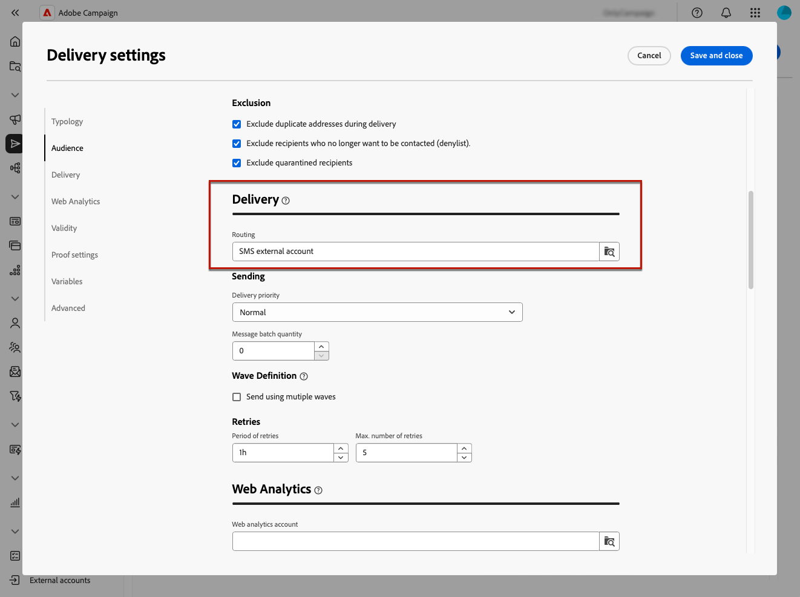

# Inviare consegne esterne {#gs-direct-mail}

Adobe Campaign consente di gestire le consegne create al di fuori di Campaign per inviare in massa e-mail personalizzate, messaggi SMS o notifiche push (iOS e Android) tramite un sistema esterno.

<!--The supported channels are Email, Mobile (SMS), and Push (iOS and Android).-->

Durante la creazione di una consegna esterna, Adobe Campaign genera automaticamente un file di estrazione contenente tutti i profili target e i dati selezionati. Questo file viene inviato al server scelto, che gestisce il processo di invio.

## Creare un account esterno dedicato {#routing-external-account}

Devi configurare un account esterno specifico da utilizzare nelle consegne esterne. Deve essere di tipo **[!UICONTROL Routing]**.

>[!NOTE]
>
>Scopri come creare un account esterno di tipo routing in [questa sezione](../administration/external-account.md#routing).

Ad esempio, seleziona il canale **[!UICONTROL Mobile (SMS)]** per l&#39;account esterno. **[!UICONTROL External]** è selezionato per impostazione predefinita come **[!UICONTROL Modalità di consegna]**.

{zoomable="yes"}

## Creare e inviare la consegna esterna {#create-external-delivery}

Una volta configurato l’account esterno specifico, crea la consegna esterna. Segui i passaggi seguenti.

1. Crea una consegna. [Scopri come](create-deliveries.md)

   Sono disponibili tre opzioni:

   * **In un flusso di lavoro**: aggiungi un&#39;attività del canale esterno (e-mail, SMS o push) al flusso di lavoro. Per istruzioni dettagliate su come configurare il flusso di lavoro, consulta [questa pagina](../workflows/gs-workflow-creation.md).
   * **In una campagna**: dopo aver creato una campagna, puoi creare una consegna esterna tramite e-mail, SMS o canale push. Per ulteriori informazioni sulla configurazione della campagna, consulta [questa pagina](../campaigns/gs-campaigns.md).
   * **Consegna autonoma**: coinvolgi i clienti direttamente e immediatamente con una singola consegna esterna. [Scopri come creare una consegna](../msg/gs-deliveries.md)

1. Nel modello di consegna [impostazioni](../advanced-settings/delivery-settings.md), seleziona l&#39;account esterno creato per il canale desiderato (in questo esempio, il canale SMS) e salva.

   {zoomable="yes"}

   >[!NOTE]
   >
   >Se stai creando una consegna, accertati di aver selezionato un [modello di consegna](delivery-template.md) utilizzando un account esterno del tipo **[!UICONTROL Indirizzamento]**. Altrimenti non potrai selezionare l&#39;account dedicato creato [sopra](#routing-external-account).

1. Nella sezione **[!UICONTROL Contenuto]** della consegna, fai clic su **[!UICONTROL Modifica contenuto]**.

   {zoomable="yes"}

1. A differenza di una consegna standard, non puoi progettare il contenuto del messaggio stesso. Definisci invece le proprietà e le colonne del file che verrà inviato al sistema esterno.

   {zoomable="yes"}

   Segui gli stessi passaggi della progettazione del contenuto del file di estrazione generato dalle [consegne di direct mailing](../direct-mail/content-direct-mail.md):

   * Definisci le proprietà del file di estrazione. [Ulteriori informazioni](../direct-mail/content-direct-mail.md#properties)
   * Selezionare le colonne contenenti le informazioni da esportare nel file. [Ulteriori informazioni](../direct-mail/content-direct-mail.md#content)

1. Anteprima del file e invio di bozze<!--not in UI right now - to check-->. [Scopri come](../direct-mail/send-direct-mail.md#preview-dm)

   {zoomable="yes"}

1. Invia la consegna per generare il file di estrazione. [Scopri come](../direct-mail/send-direct-mail.md#send-dm)

Una volta inviata la consegna, il file di estrazione viene generato ed esportato automaticamente nella posizione specificata nell&#39;[account esterno](../administration/external-account.md#create-ext-account) selezionato nelle impostazioni del modello di consegna.

Tieni traccia dei KPI dalla pagina di consegna e dei dati dal menu **[!UICONTROL Registri]**.