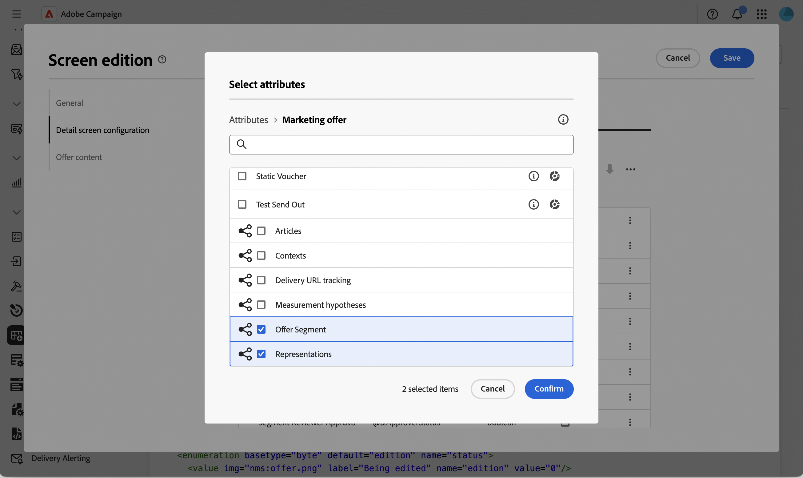
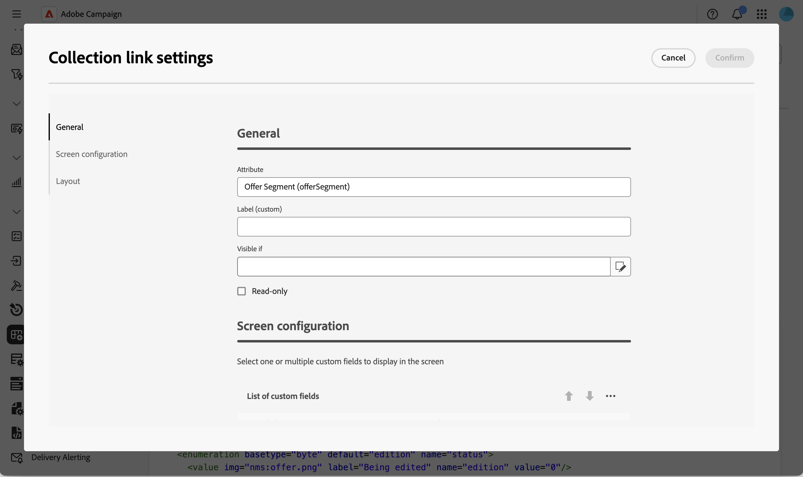

# Aggiungere un elenco modificabile allo schema delle offerte {#offer-editable-list}

Quando [estendi lo  [!DNL nms:offer] schema](../administration/schemas.md) con un collegamento di raccolta personalizzato, ad esempio un set di segmenti collegati a un&#39;offerta, puoi esporla come elenco modificabile direttamente nella sezione **[!UICONTROL Opzioni personalizzate]** dell&#39;offerta. Invece di gestire i record correlati tramite una schermata separata, la raccolta viene riprodotta come elenco nei dettagli dell’offerta e puoi creare nuovi record correlati in linea tramite una finestra di dialogo dedicata.

>[!NOTE]
>
>Questa funzionalità è attualmente disponibile solo per lo schema di offerta.

## Aggiungi un campo collegamento raccolta {#add-field}

1. Estendi lo schema [!DNL nms:offer] con la tua raccolta personalizzata, quindi passa al menu **[!UICONTROL Schemi]**, apri lo schema **[!UICONTROL Offerte di marketing]** e fai clic su **[!UICONTROL Modifica schermo]**. [Ulteriori informazioni](../administration/schemas-browse-access.md#screen-def).

   {zoomable="yes"}

1. Nella sezione **[!UICONTROL Configurazione schermata dettagli]**, fai clic sull&#39;icona dei puntini di sospensione sopra la tabella **[!UICONTROL Elenco di campi personalizzati]** e scegli **[!UICONTROL Seleziona attributi]**. [Ulteriori informazioni](../administration/schemas-custom-fields.md).

   {zoomable="yes"}

1. Sfoglia gli attributi e seleziona il collegamento alla raccolta personalizzata, identificato dalla relativa icona.

   {zoomable="yes"}

   >[!NOTE]
   >
   >I campi del collegamento di raccolta non possono essere resi obbligatori e non supportano gli attributi secondari. Per impostazione predefinita, si estendono su due colonne del modulo.

1. Conferma la selezione. Il collegamento della raccolta viene aggiunto alla tabella **[!UICONTROL Elenco di campi personalizzati]**, il cui tipo è **[!UICONTROL raccolta]**.

   {zoomable="yes"}

## Configurare l’elenco modificabile della raccolta {#configure-list}

1. Fai clic sull&#39;icona con i puntini di sospensione nella riga del campo della raccolta e scegli **[!UICONTROL Modifica]** per aprire la finestra di dialogo **[!UICONTROL Impostazioni collegamento raccolta]**.

   {zoomable="yes"}

1. Nella scheda **[!UICONTROL Generale]**, impostare facoltativamente una condizione **[!UICONTROL Visibile se]** o abilitare **[!UICONTROL Sola lettura]**.

   {zoomable="yes"}

1. Nella scheda **[!UICONTROL Configurazione schermo]**, fare clic su **[!UICONTROL Seleziona attributi]** e selezionare gli attributi da utilizzare quando si aggiunge un nuovo elemento all&#39;elenco, ad esempio un nome di segmento e un campo personalizzato.

   {zoomable="yes"}

1. Nella scheda **[!UICONTROL Layout]**, mantieni o cancella **[!UICONTROL Estendi due colonne]**.

1. Fai clic su **[!UICONTROL Conferma]**, quindi su **[!UICONTROL Salva]** la definizione dello schermo.

## Utilizzare l’elenco modificabile in un’offerta {#use-list}

1. Dal menu a sinistra, fai clic su **Offerte** e apri un&#39;offerta. [Ulteriori informazioni](create-offer.md#create)

   {zoomable="yes"}

1. Accedi alle proprietà dell’offerta. Viene eseguito il rendering della raccolta come elenco nella sezione **Opzioni personalizzate**.

   {zoomable="yes"}

1. Fai clic su **[!UICONTROL Aggiungi]** per visualizzare gli attributi configurati, compilali e fai clic su **[!UICONTROL Conferma]**. Il nuovo elemento viene aggiunto all’elenco.

   È possibile aggiungere più elementi allo stesso elenco e i dettagli dell’offerta possono contenere più di un elenco modificabile.

1. Fai clic su **[!UICONTROL Salva]**.

<!--
Each element added through the editable list creates a new related record. For instance, adding a segment to an offer generates the following payload:

```xml
<offer ...>
  <offerSegment segmentName="..." _operation="insert"/>
</offer>
```
-->