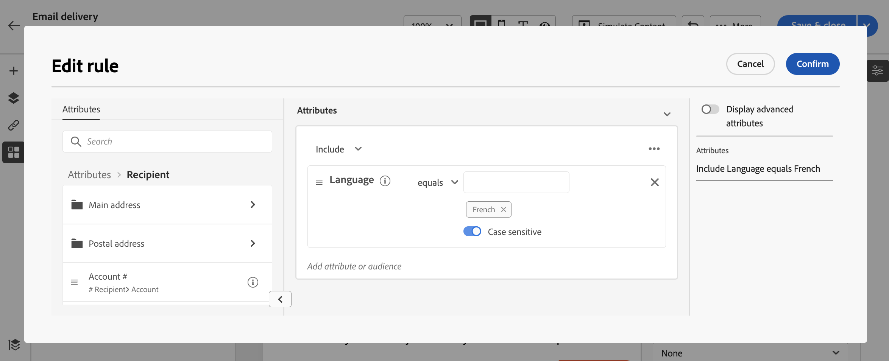

# Creare contenuti condizionali{#add-conditions}

>[!CONTEXTUALHELP]
>id="acw_homepage_card3"
>title="Creare contenuto condizionale"
>abstract="Crea contenuti condizionali per definire la personalizzazione dinamica in base al profilo del destinatario, sostituendo automaticamente blocchi di testo e immagini quando vengono soddisfatte determinate condizioni. Questa funzione può elevare le tue campagne e offrire esperienze altamente mirate e personalizzate al tuo pubblico."

Il contenuto condizionale è una funzione potente che consente di creare una personalizzazione dinamica in base al profilo del destinatario, sostituendo automaticamente blocchi di testo e immagini quando vengono soddisfatte determinate condizioni. Questa funzione può elevare le tue campagne e offrire esperienze altamente mirate e personalizzate al tuo pubblico.

Configurando i campi di contenuto condizionale, puoi creare ad esempio una personalizzazione dinamica avanzata in base al profilo del destinatario. I blocchi di testo, i collegamenti, l’oggetto e/o le immagini vengono sostituiti nel contenuto del messaggio quando viene soddisfatta una particolare condizione. Ad esempio, puoi visualizzare &quot;Sig.&quot; o &quot;Sig.ra&quot; in base al valore del campo Genere nel database di Adobe Campaign, oppure includere un collegamento diverso in base alla lingua preferita del destinatario.

## Come creare contenuti condizionali

Per creare contenuto condizionale, è necessario creare condizioni nell’editor di espressioni utilizzando una funzione helper specifica. Questo metodo è disponibile per tutti i canali di consegna in qualsiasi campo in cui è possibile accedere all’editor di espressioni, ad esempio il campo dell’oggetto o i collegamenti e-mail e i componenti di contenuto testo/pulsante. [Scopri dove aggiungere contenuti dinamici](gs-personalization.md/#access)

Oltre all’editor di espressioni, puoi sfruttare un generatore di contenuti condizionali dedicato durante la progettazione di un’e-mail che consente di creare condizioni utilizzando gli attributi del profilo.

## Creare condizioni nell’editor di espressioni {#condition-perso-editor}

Per definire un contenuto condizionale per una consegna;, segui i passaggi seguenti. In questo esempio, vogliamo creare contenuti condizionali in base alla lingua dei destinatari (francese o inglese).

1. Apri una consegna e modifica il contenuto.

1. Individua il campo in cui desideri aggiungere contenuto condizionale e fai clic sul pulsante **[!UICONTROL Apri finestra di dialogo per personalizzazione]** per aprire l’editor di espressioni. In questo esempio, vogliamo aggiungere contenuto condizionale a un messaggio SMS:

   

1. Nell’editor di personalizzazione, passa a **[!UICONTROL Funzioni di supporto]** menu a sinistra.

1. Fai clic sull’icona &quot;+&quot; accanto al simbolo **Se** per avviare la condizione. La seguente riga è aggiunta alla schermata centrale:
   `<% if (<FIELD>==<VALUE>) { %>Insert content here<% } %>`

   * Sostituisci `<FIELD>` da un campo di personalizzazione. Ad esempio, la lingua del destinatario: `recipient.language`.
   * Sostituisci `<VALUE>` dal valore da soddisfare. Ad esempio, `'French'`.
   * Sostituisci `Ìnsert content here` in base al contenuto che desideri visualizzare ai profili che soddisfano la condizione specificata sopra.

     

1. Specifica il contenuto da visualizzare se i destinatari non soddisfano la condizione. Per eseguire questa operazione:

   1. Aggiungi un **else** funzione helper: posiziona il cursore prima del tag di chiusura dell’espressione `%>` e fai clic su `+` accanto al **Altro** funzione.

      >[!NOTE]
      >
      >Ogni volta che viene aggiunta una funzione helper, aprendo (`<%`) e chiusura (`%>`) prima e dopo la funzione. Esempio dopo l’aggiunta di una funzione helper &quot;Else&quot; all’interno di un’espressione:
      >
      >`<% if (<FIELD>==<VALUE>) { %>Insert content here<% } <% else { %> Insert content here<% } %>%>`
      >
      >Assicurati di rimuovere questi tag per evitare errori di sintassi. In questo esempio, è stata corretta l’espressione dopo la rimozione di **Altro** i tag di funzione sono:
      >
      >`<% if (<FIELD>==<VALUE>) { %>Insert content here<% } else { %> Insert content here<% } %>`

   1. Sostituisci `Ìnsert content here` in base al contenuto che desideri visualizzare ai profili che non soddisfano la condizione.

      

   È inoltre possibile utilizzare **else if** funzione helper per creare condizioni con più varianti di contenuto. Ad esempio, l’espressione seguente visualizza tre varianti di un messaggio a seconda della lingua dei destinatari:

   

1. Una volta che la condizione è pronta, puoi salvare il contenuto e controllarne il rendering simulando il contenuto.

## Creare contenuto condizionale nelle e-mail  {#condition-condition-builder}

Il contenuto condizionale nelle e-mail può essere creato in due modi:
* Nell’editor di espressioni creando una condizione utilizzando le funzioni di assistenza,
* In un generatore di contenuti condizionali dedicato accessibile durante la progettazione di un’e-mail.

Sono disponibili informazioni dettagliate su come creare condizioni utilizzando l’editor di espressioni [qui](#condition-perso-editor).

La sezione seguente illustra i passaggi necessari per creare le condizioni utilizzando il generatore di contenuti condizionali di e-mail designer. In questo esempio, creeremo un messaggio e-mail con più varianti a seconda della lingua dei destinatari. Per farlo, esegui questi passaggi:

1. Crea o apri una consegna e-mail, modificane il contenuto e fai clic su **[!UICONTROL Modifica corpo dell’e-mail]** per aprire l’area di lavoro di progettazione e-mail.

1. Seleziona un componente di contenuto e fai clic su **[!UICONTROL Abilita contenuto condizionale]**.

   

1. Il **[!UICONTROL Contenuto condizionale]** sul lato sinistro dello schermo. In questo riquadro, puoi creare più varianti del componente di contenuto selezionato utilizzando le condizioni.

1. Configura la prima variante. Per fare questo, passa il cursore del mouse **[!UICONTROL Variante - 1]** nel **[!UICONTROL Contenuto condizionale]** e fare clic sul pulsante **[!UICONTROL Aggiungi condizione]** icona.

1. Viene visualizzato un generatore di regole. Utilizza gli attributi del profilo per creare la condizione per la prima variante del messaggio e fai clic su **[!UICONTROL Conferma]**. In questo esempio, stiamo creando una regola destinata ai destinatari la cui lingua è &quot;francese&quot;.

   

1. La regola ora è associata alla variante. Per una migliore leggibilità, si consiglia di rinominare la variante facendo clic sul menu dell’ellisse.

   Ora configura come deve essere visualizzato il componente se la regola viene soddisfatta durante l’invio del messaggio. In questo esempio, vogliamo visualizzare il testo in francese se è la lingua preferita del destinatario.

   

1. Aggiungi tutte le varianti necessarie per il componente contenuto. Puoi passare in qualsiasi momento da una variante all’altra per verificare come verrà visualizzato il componente contenuto a seconda delle regole condizionali.

   >[!NOTE]
   >Se nessuna delle regole definite nelle varianti è soddisfatta durante l’invio del messaggio, il componente contenuto visualizzerà il contenuto definito nel **[!UICONTROL Variante predefinita]** dal **[!UICONTROL Contenuto condizionale]** riquadro.
