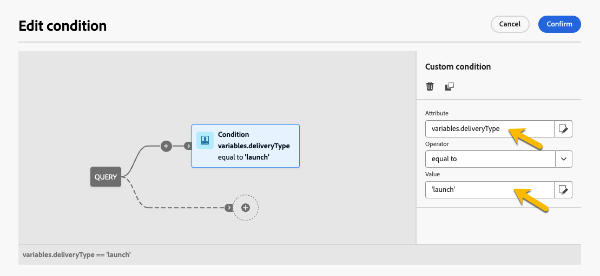

# Generare contenuti condizionali {#add-conditions}

>[!CONTEXTUALHELP]
>id="acw_conditional_content"
>title="Aggiungere contenuto condizionale"
>abstract="Configura i campi per contenuti condizionali per creare una personalizzazione dinamica avanzata in base ai dati del profilo del destinatario. I blocchi di testo, i collegamenti, l’oggetto e/o le immagini vengono sostituiti nel contenuto del messaggio quando viene soddisfatta una particolare condizione."

## Introduzione ai contenuti condizionali {#gs}

Il contenuto condizionale è una funzione potente che consente la personalizzazione dinamica basata sui dati del profilo del destinatario. Sostituisce automaticamente i blocchi di testo e le immagini quando vengono soddisfatte determinate condizioni. Questa funzione migliora le campagne e offre al pubblico esperienze altamente mirate e personalizzate.

Configurando i campi di contenuto condizionale, puoi creare una personalizzazione dinamica avanzata in base al profilo del destinatario. Ad esempio, i blocchi di testo, i collegamenti, le righe dell’oggetto e le immagini vengono sostituiti nel contenuto del messaggio quando viene soddisfatta una particolare condizione. Ad esempio, puoi visualizzare &quot;Sig&quot; o &quot;Sig.ra&quot; in base al valore del campo Genere nel database di Adobe Campaign o includere un collegamento diverso in base alla lingua preferita del destinatario.

Per creare contenuto condizionale, configurare le condizioni nell&#39;**editor espressioni** utilizzando funzioni di supporto specifiche. Questo metodo è disponibile per tutti i canali di consegna in qualsiasi campo in cui è possibile accedere all’editor di espressioni, ad esempio la riga dell’oggetto, i collegamenti e-mail e i componenti di contenuto testo/pulsante. [Scopri come accedere all&#39;editor espressioni](gs-personalization.md#access).

Utilizza inoltre il **generatore di contenuti condizionali** dedicato durante la progettazione di un&#39;e-mail per creare più varianti per un elemento del corpo dell&#39;e-mail. [Scopri come creare contenuto condizionale nelle e-mail](#condition-condition-builder).

## Creare condizioni nell’editor di espressioni {#condition-perso-editor}

>[!CONTEXTUALHELP]
>id="acw_personalization_editor_conditions"
>title="Condizioni"
>abstract="Questo menu consente di sfruttare le funzioni di assistenza per definire il contenuto condizionale."

Per definire il contenuto condizionale di una consegna utilizzando l’editor di espressioni, segui la procedura riportata di seguito. In questo esempio, il contenuto condizionale viene creato in base alla lingua dei destinatari (francese o inglese).

1. Apri una consegna e passa alla sezione di modifica del contenuto.

1. Individua il campo in cui desideri aggiungere i contenuti condizionali. Ad esempio, aggiungi contenuto condizionale a un messaggio SMS.

1. Per aprire l’editor di espressioni fai clic sull’icona **[!UICONTROL Apri finestra di dialogo di personalizzazione]**, accanto al campo.

   {zoomable="yes"}

1. Nell&#39;editor di personalizzazione, passa al menu **[!UICONTROL Condizioni]** a sinistra.

1. Per iniziare a creare la condizione, fai clic sull’icona “+” accanto alla funzione **If** (se). La seguente riga è stata aggiunta alla schermata centrale: `<% if (<FIELD>==<VALUE>) { %>Insert content here<% } %>`

   * Sostituisci `<FIELD>` con un campo di personalizzazione, ad esempio la lingua del destinatario: `recipient.language`.
   * Sostituire `<VALUE>` con il valore da soddisfare, ad esempio `'French'`.
   * Sostituisci `Insert content here` con il contenuto da visualizzare nei profili che soddisfano la condizione specificata.

     {zoomable="yes"}{width="800" align="center"}

1. Specifica il contenuto da visualizzare se i destinatari non soddisfano la condizione. Utilizza una funzione helper **else**:

   1. Posiziona il cursore prima del tag di chiusura dell’espressione `%>` e fai clic su `+` accanto alla funzione **Else**.

   1. Sostituire `Insert content here` con il contenuto da visualizzare per i profili che non soddisfano la condizione della funzione if.

   {zoomable="yes"}{width="800" align="center"}

   Utilizza la funzione helper **else if** per creare condizioni con più varianti di contenuto. Ad esempio, l’espressione seguente mostra tre varianti di un messaggio a seconda della lingua dei destinatari:

   {zoomable="yes"}{width="800" align="center"}

   >[!NOTE]
   >
   >Ogni volta che viene aggiunta una funzione Helper, i tag di apertura (`<%`) e chiusura (`%>`) vengono aggiunti automaticamente prima e dopo la funzione.
   >
   >Esempio dopo l’aggiunta di una funzione helper &quot;Else&quot; all’interno di un’espressione:
   >
   >`<% if (<FIELD>==<VALUE>) { %>Insert content here<% } <% else { %> Insert content here<% } %>%>`
   >
   >Assicurati di rimuovere questi tag per evitare errori di sintassi. In questo esempio, l’espressione corretta dopo la rimozione dei tag della funzione **else** è:
   >
   >`<% if (<FIELD>==<VALUE>) { %>Insert content here<% } else { %> Insert content here<% } %>`

1. Salva il contenuto e controllane il rendering simulando il contenuto.

## Creare contenuti condizionali nelle e-mail {#condition-condition-builder}

Il contenuto condizionale nelle e-mail può essere creato in due modi:
* Nell’editor di espressioni creando una condizione con funzioni di assistenza.
* In un generatore di contenuti condizionali dedicato accessibile durante la progettazione di un’e-mail.

La sezione seguente fornisce istruzioni dettagliate sulla creazione di condizioni utilizzando la funzionalità di contenuto condizionale di E-mail Designer. Informazioni dettagliate sulla creazione di condizioni tramite l&#39;editor espressioni sono disponibili [qui](#condition-perso-editor).

In questo esempio, viene creato un messaggio e-mail con più varianti in base alla lingua dei destinatari. Segui questi passaggi:

1. Crea o apri una consegna e-mail, modificane il contenuto e fai clic su **[!UICONTROL Modifica corpo dell’e-mail]** per aprire l’area di lavoro di progettazione e-mail.

1. Seleziona un componente di contenuto e fai clic sull’icona **[!UICONTROL Abilita contenuto condizionale]**.

   {zoomable="yes"}{width="800" align="center"}

1. Sul lato sinistro della schermata, compare il riquadro **[!UICONTROL Contenuto condizionale]** . In questo riquadro, crea più varianti del componente di contenuto selezionato utilizzando le condizioni.

1. Configura la prima variante. Passa il puntatore del mouse su **[!UICONTROL Variante - 1]** nel riquadro **[!UICONTROL Contenuto condizionale]** e fai clic sul pulsante **[!UICONTROL Aggiungi condizione]**.

   {zoomable="yes"}{width="800" align="center"}

1. Viene aperto Query Modeler, che consente di creare una condizione filtrando i dati di profilo del destinatario. [Scopri come utilizzare Query Modeler](../query/query-modeler-overview.md).

   Quando la condizione per la prima variante del messaggio è pronta, fai clic su **[!UICONTROL Conferma]**. In questo esempio, viene creata una regola destinata ai destinatari la cui lingua è &quot;francese&quot;.

   {zoomable="yes"}{width="800" align="center"}

1. La regola ora è associata alla variante. Per una migliore leggibilità, rinomina la variante facendo clic sul menu con i puntini di sospensione.

1. Configura il modo in cui il componente verrà visualizzato se la regola viene soddisfatta al momento dell’invio del messaggio. In questo esempio, visualizza il testo in francese se è la lingua preferita del destinatario.

   {zoomable="yes"}{width="800" align="center"}

1. Aggiungi tutte le varianti necessarie per il componente contenuto. Passa da una variante all’altra in qualsiasi momento per verificare come verrà visualizzato il componente contenuto in base alle relative regole condizionali.

   >[!NOTE]
   >Se nessuna delle regole definite nelle varianti è soddisfatta durante l’invio del messaggio, il componente contenuto visualizzerà il contenuto definito nella **[!UICONTROL Variante predefinita]**, nel riquadro **[!UICONTROL Contenuto condizionale]**.

## Utilizzare le variabili per il contenuto condizionale {#variables-conditional}

Le variabili possono essere utilizzate per il contenuto condizionale nella consegna.

Ulteriori informazioni sull&#39;[aggiunta di variabili a una consegna](../advanced-settings/delivery-settings.md#variables-delivery).

Scegli l’elemento in cui vuoi inserire il contenuto condizionale.

{zoomable="yes"}

Per utilizzare la variabile, configurare la condizione utilizzando il pulsante **[!UICONTROL Modifica espressione]**, come illustrato di seguito. In questo esempio, questa immagine viene visualizzata quando il valore della variabile è `launch`.

{zoomable="yes"}

Creare un&#39;altra variante con il valore `reminder`, ad esempio, in cui viene visualizzata un&#39;immagine diversa.