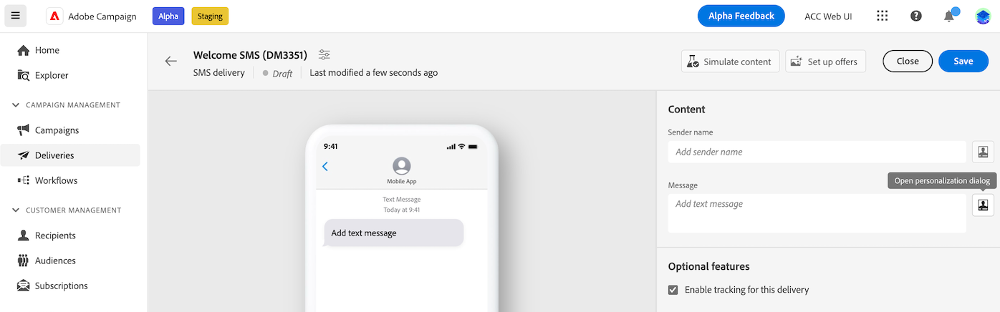

# Generare contenuti condizionali{#add-conditions}

>[!CONTEXTUALHELP]
>id="acw_conditional_content"
>title="Aggiungere contenuto condizionale"
>abstract="Configura i campi per contenuti condizionali per creare una personalizzazione dinamica avanzata in base ai dati del profilo del destinatario. I blocchi di testo, i collegamenti, l’oggetto e/o le immagini vengono sostituiti nel contenuto del messaggio quando viene soddisfatta una particolare condizione."

## Introduzione ai contenuti condizionali {#gs}

I contenuti condizionali rappresentano una funzionalità potente, che consente di definire la personalizzazione dinamica in base al profilo del destinatario, mediante la sostituzione automatica blocchi di testo e immagini se vengono soddisfatte determinate condizioni. Con questa funzione puoi creare campagne più sofisticate e offrire al tuo pubblico esperienze altamente mirate e personalizzate.

Configurando i campi per contenuti condizionali, puoi creare ad esempio una personalizzazione dinamica avanzata in base al profilo del destinatario. I blocchi di testo, i collegamenti, l’oggetto e/o le immagini vengono sostituiti nel contenuto del messaggio quando viene soddisfatta una particolare condizione. Ad esempio, puoi visualizzare “Sig.” o “Sig.ra” in base al valore del campo Genere nel database di Adobe Campaign oppure includere un collegamento diverso in base alla lingua preferita del destinatario.

Per creare contenuti condizionali, è necessario creare condizioni nell’**editor di espressioni** tramite funzioni Helper specifiche. Questo metodo è disponibile per tutti i canali di consegna in qualsiasi campo in cui è possibile accedere all’editor di espressioni, ad esempio la riga dell’oggetto o i collegamenti e-mail e i componenti di contenuto di tipo testo o pulsante. [Scopri come accedere all’editor di espressioni](gs-personalization.md/#access)

<!--In addition to the expression editor, you can leverage a dedicated **conditional content builder** when designing an email that allows you to build conditions using profile attributes only. [Learn how to create conditional content in emails](#condition-condition-builder)-->

## Creare condizioni nell’editor di espressioni {#condition-perso-editor}

Per definire il contenuto condizionale di una consegna utilizzando l’editor di espressioni, segui questi passaggi. In questo esempio, vogliamo creare contenuti condizionali in base alla lingua dei destinatari (francese o inglese).

1. Apri una consegna e passa alla sezione di modifica del contenuto.

1. Individua il campo in cui desideri aggiungere i contenuti condizionali. Ad esempio, puoi aggiungere contenuti condizionali a un messaggio SMS.

1. Per aprire l’editor di espressioni fai clic sull’icona **[!UICONTROL Apri finestra di dialogo di personalizzazione]**, accanto al campo.

   

1. Nell’editor di personalizzazione, passa al menu **[!UICONTROL Funzioni Helper]** a sinistra.

1. Per iniziare a creare la condizione, fai clic sull’icona “+” accanto alla funzione **If** (se). La seguente riga viene aggiunta alla schermata centrale: `<% if (<FIELD>==<VALUE>) { %>Insert content here<% } %>`

   * Sostituisci `<FIELD>` con un campo di personalizzazione, ad esempio la lingua del destinatario: `recipient.language`.
   * Sostituisci `<VALUE>` con il valore da soddisfare. Ad esempio, `'French'`.
   * Sostituisci `Ìnsert content here` con il contenuto che desideri mostrare ai profili che soddisfano la condizione specificata.

     {width="800" align="center"}

1. Specifica il contenuto da visualizzare se i destinatari non soddisfano la condizione. Per eseguire questa operazione, utilizza una funzione Helper **else** (altrimenti):

   1. Posiziona il cursore prima del tag di chiusura dell’espressione `%>` e fai clic su `+` accanto alla funzione **Else**.

   1. Sostituisci `Ìnsert content here` con il contenuto che desideri mostrare ai profili che non soddisfano la condizione della funzione if.

   {width="800" align="center"}

   È inoltre possibile utilizzare la funzione Helper **else if** per creare condizioni con più varianti di contenuto. Ad esempio, l’espressione seguente mostra tre varianti di un messaggio a seconda della lingua dei destinatari:

   {width="800" align="center"}

   >[!NOTE]
   >
   >Ogni volta che viene aggiunta una funzione Helper, i tag di apertura (`<%`) e chiusura (`%>`) vengono aggiunti automaticamente prima e dopo la funzione.
   >
   >Ad esempio dopo l’aggiunta di una funzione Helper “Else” all’interno di un’espressione: >
   >
   >`<% if (<FIELD>==<VALUE>) { %>Insert content here<% } <% else { %> Insert content here<% } %>%>`
   >
   >Assicurati di rimuovere questi tag per evitare errori di sintassi. In questo esempio, l’espressione corretta dopo la rimozione dei tag della funzione **else** è:
   >
   >`<% if (<FIELD>==<VALUE>) { %>Insert content here<% } else { %> Insert content here<% } %>`

1. Una volta che la condizione è pronta, puoi salvare il contenuto e controllarne il risultato simulando il contenuto.

<!--SECTION REMOVED FOR LA > CONDITIONAL CONTENT NOT AVAILABLE ANYMORE FROM THE DEDICATED MENU IN THE EMAIL DESIGNER. ONLY THE EXPRESSION EDITOR IS AVAILABLE FOR NOW

## Create conditional content in emails {#condition-condition-builder}

Conditional content in emails can be created in two ways:
* In the expression editor by building a condition with helper functions,
* In a dedicated conditional content builder that is accessible when designing an email.

Detailed information on how to create conditions using the expression editor is available [here](#condition-perso-editor). The following section provides step-by-step instructions on how to create conditions using the email designer's conditional content capability. In this example, we want to create an email message with multiple variants based on the recipients' language. Follow these steps:

1. Create or open an email delivery, edit its content, and click the **[!UICONTROL Edit email body]** button to open the email designing workspace.

1. Select a content component and click the **[!UICONTROL Enable conditional content]** icon.

    {width="800" align="center"}

1. The **[!UICONTROL Conditional Content]** pane opens on the left-hand side of the screen. In this pane, you can create multiple variants of the selected content component using conditions.

1. Configure your first variant. Hover over **[!UICONTROL Variant - 1]** in the **[!UICONTROL Conditional Content]** pane and click the **[!UICONTROL Add condition]** icon.

1. A query modeler appears. Use profile attributes to create the condition for the first variant of the message and click **[!UICONTROL Confirm]**. In this example, we are creating a rule targeting recipients whose language is 'French'.

    {width="800" align="center"}

1. The rule is now associated to the variant. For better readability, we recommend renaming the variant by clicking the ellipsis menu.

1. Configure how the component should display if the rule is met when sending the message. In this example, we want to display the text in French if it is the recipient's preferred language.

    {width="800" align="center"}

1. Add as many variants as needed for the content component. You can switch between the variants at any time to check how the content component will display based on their conditional rules.

    >[!NOTE]
    >If none of the rules defined in the variants are met when sending the message, the content component will display the content defined in the **[!UICONTROL Default variant]** from the **[!UICONTROL Conditional Content]** pane.
-->