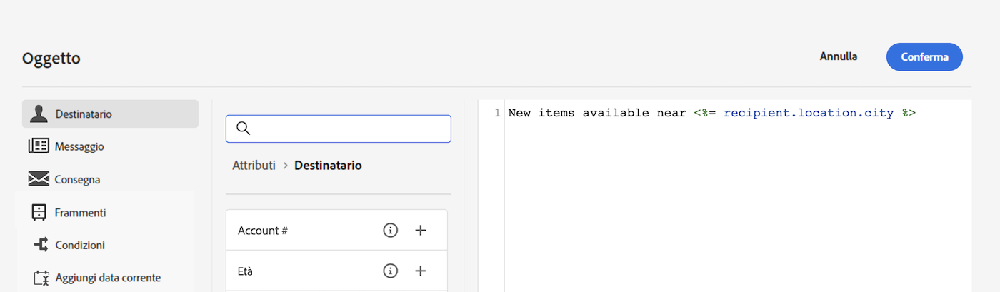

# Introduzione al contenuto dinamico {#gs-dynamic-content}

>[!CONTEXTUALHELP]
>id="acw_targetdata_personalization_dashboard"
>title="Personalizzazione"
>abstract="L’editor di espressioni consente di selezionare, disporre, personalizzare e convalidare tutti i dati per creare un’esperienza personalizzata per i contenuti. Puoi personalizzare i messaggi per ogni destinatario sfruttando i dati del profilo e creare contenuti condizionali per adattare il messaggio a ogni destinatario e mostrare solo il contenuto pertinente. Inoltre, sono disponibili blocchi di personalizzazione per aggiungere contenuti personalizzati predefiniti alle consegne."

In qualità marketer, è fondamentale rivolgersi ai clienti realmente interessati alle offerte e coinvolgerli fornendo contenuti efficaci e pertinenti. Data la varietà di destinatari che si incontrano, la creazione di più contenuti di marketing da presentare a persone diverse può richiedere tempo e comportare uno spreco. Qui entra in gioco il contenuto dinamico.

Le funzionalità del contenuto dinamico di Adobe Campaign Web consentono di personalizzare il contenuto in base alle informazioni raccolte sui destinatari. Utilizzando i contenuti dinamici, potrai assicurarti che le tue attività di marketing siano più rilevanti, evitando marketing di prodotti o servizi indesiderati o non necessari. Questo approccio rende i contenuti più accattivanti e aumenta la probabilità che vengano letti. Inoltre, ti consente di personalizzare il contenuto, facendo sentire i destinatari come se stessero ricevendo informazioni da una persona invece che da un computer.

## Come rendere dinamico il contenuto? {#make-content-dyn}

Per rendere dinamico il contenuto del messaggio, inserisci costrutti JavaScript nell’editor di espressioni di Campaign web. Al momento dell’invio dei messaggi, Adobe Campaign interpreta tali espressioni per fornire il contenuto corretto a ciascuno dei destinatari:

* **Personalizza i messaggi** per ogni destinatario specifico sfruttando i dati del profilo come il nome, gli interessi, dove vive, cosa ha acquistato e molto altro. Puoi selezionare qualsiasi campo disponibile nel database dall’editor di personalizzazione relativo al destinatario, al messaggio o alla consegna. Questi attributi di personalizzazione possono essere inseriti nella riga dell’oggetto o nel corpo dei messaggi. Per inserire nel contenuto la città del destinatario, utilizza la seguente sintassi: &lt;%= recipient.location.city %>.

  {zoomable=&quot;yes&quot;}{width="800" align="center"}

* **Crea contenuti condizionali** per adattare le consegne a ciascun destinatario e mostrare solo il contenuto rilevante per determinati clienti in base alle informazioni che hai raccolto su di loro. Questo consente di visualizzare blocchi di testo e/o immagini specifici in base alle condizioni. Ad esempio, adatta un banner e-mail in base all’iscrizione dei destinatari a un servizio specifico.

  {zoomable=&quot;yes&quot;}{width="800" align="center"}

* **Utilizza i blocchi di personalizzazione** per risparmiare tempo e sfruttare contenuti personalizzati riutilizzabili nei messaggi. Campaign viene fornito con un set di blocchi di personalizzazione contenenti un rendering specifico da inserire nelle consegne. Ad esempio, puoi aggiungere un logo, un messaggio di auguri o un collegamento alla pagina mirror del messaggio e-mail. I blocchi di contenuto sono disponibili da una voce dedicata nell’editor di personalizzazione.

  {zoomable=&quot;yes&quot;}{width="800" align="center"}

## Accedere all’editor di espressioni {#access}

Adobe Campaign Web fornisce un editor di espressioni in cui è possibile selezionare, disporre, personalizzare e convalidare tutti i dati per creare un’esperienza personalizzata per i contenuti. L’editor di espressioni è disponibile per tutti i canali, in tutti i campi con l’icona **[!UICONTROL Apri finestra di personalizzazione]** come il campo dell’oggetto o i collegamenti e-mail e i componenti di contenuto testo/pulsante.

Di seguito sono riportati alcuni esempi su come accedere all’editor di espressioni a seconda del contenuto che desideri rendere dinamico:

* *Accesso all’editor di espressioni dal campo Nome mittente*

  {zoomable=&quot;yes&quot;}{width="800" align="center"}

* *Accesso all’editor di espressioni da un componente di testo e-mail*

  {zoomable=&quot;yes&quot;}{width="800" align="center"}

* *Accesso all’editor di espressioni da un collegamento in un e-mail*

  {zoomable=&quot;yes&quot;}{width="800" align="center"}

>[!NOTE]
>
>Oltre all’editor di espressioni, durante la progettazione di una e-mail, puoi anche sfruttare un generatore di contenuti condizionali dedicato. [Scopri come creare contenuti condizionali nelle e-mail](conditions.md)

## Approfondiamo {#dive-deeper}

Ora che sai come rendere dinamici i contenuti, è necessario approfondire le sezioni della documentazione per iniziare a utilizzare questa funzione.

<table style="table-layout:fixed"><tr style="border: 0;">
<td>

<a href="personalize.md"><strong>Aggiungere la personalizzazione</strong></a>

</td>
<td>

<a href="conditions.md"><strong>Aggiungere contenuto condizionale</strong>

</td>
<td>

<a href="content-blocks.md"><strong>Aggiungere blocchi di contenuto incorporati</strong></a>

</td>
</tr></table>
