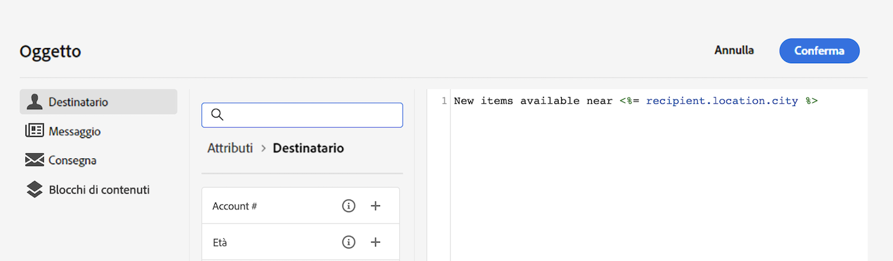
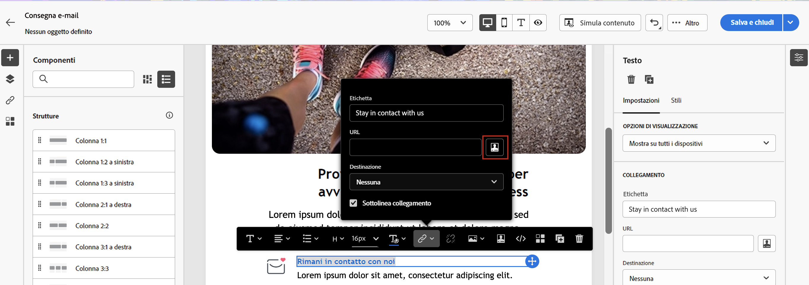

# Personalizzare i contenuti{#add-personalization}

Puoi personalizzare il contenuto del messaggio in diversi modi:

* Inserendo **campi di personalizzazione** dinamici

   I campi di personalizzazione vengono utilizzati per la personalizzazione di primo livello dei messaggi. Puoi selezionare qualsiasi campo disponibile nel database dall’editor di personalizzazione. Per una consegna, puoi selezionare qualsiasi campo correlato al destinatario, al messaggio o alla consegna. Questi attributi di personalizzazione possono essere inseriti nella riga dell’oggetto o nel corpo dei messaggi.

   

   Per inserire nel contenuto la città del destinatario, utilizza la seguente sintassi: &lt;%= recipient.location.city %>.

* Inserimento di **blocchi di contenuto** predefiniti

   Campaign viene fornito con un set di blocchi di personalizzazione contenenti un rendering specifico da inserire nelle consegne. Ad esempio, puoi aggiungere un logo, un messaggio di auguri o un collegamento alla pagina mirror del messaggio. I blocchi di contenuto sono disponibili da una voce dedicata nell’editor per la personalizzazione.

   
<!--
* Create **conditional content**

    Configure conditional content to add dynamic personalization based on the recipient’s profile for example. Text blocks and/or images are inserted when a particular condition is true.
-->

## Personalizzare l’oggetto dell’e-mail {#personalize-subject-line}

Per aggiungere la personalizzazione nel campo **[!UICONTROL Oggetto]** del messaggio, segui i passaggi seguenti:

1. Fai clic sull’icona **Apri finestra di personalizzazione** a destra del campo **Oggetto**.
1. Inserisci il contenuto dell’oggetto dell’e-mail e seleziona gli attributi di personalizzazione da aggiungere.
1. Fai clic su **Conferma**. Gli attributi di personalizzazione vengono aggiunti all’oggetto dell’e-mail.

## Personalizzare il contenuto delle e-mail {#personalize-emails}

Per personalizzare il contenuto dell’e-mail, apri il messaggio in E-mail Designer ed esegui le seguenti operazioni:

1. Fai clic all’interno di un blocco di testo.
1. Nella barra degli strumenti contestuale, seleziona **Aggiungi personalizzazione**.

   

1. Inserisci il nome del destinatario nell’editor di personalizzazione e conferma.

   

   L’attributo di personalizzazione viene aggiunto al contenuto dell’e-mail.

   Puoi simulare il contenuto per controllarne il rendering. [Ulteriori informazioni](../preview-test/preview-content.md)

   

Per aggiungere un blocco di contenuto all’e-mail, segui questi stessi passaggi e seleziona un blocco di contenuto dall’ultima icona:

Una volta inserito, il blocco di contenuto viene aggiunto al contenuto dell’e-mail, come illustrato di seguito. Viene automaticamente adattato al profilo del destinatario quando viene generata la personalizzazione, nella fase di preparazione della consegna.

I blocchi di contenuto incorporati sono:

* **[!UICONTROL Enabled by Adobe Campaign]** : inserisce il logo “Enabled by Adobe Campaign”.
* **[!UICONTROL Funzione di formattazione per nomi propri]**: genera la funzione JavaScript **[!UICONTROL toSmartCase]**, che applica il maiuscolo alla prima lettera di ogni parola.
* **[!UICONTROL Saluti]**: inserisce i saluti con il nome completo del destinatario, seguito da una virgola. Esempio: “Ciao John Doe,”
* **[!UICONTROL Inserisci logo]**: inserisce un logo definito nelle impostazioni dell’istanza.
* **[!UICONTROL Collegamento a una pagina speculare]**: inserisce un collegamento alla [pagina speculare](../content/mirror-page.md). Il formato predefinito è: &quot;Se non riesci a visualizzare correttamente questo messaggio, fai clic qui&quot;.
* **[!UICONTROL URL pagina mirror]**: inserisce l’URL della pagina mirror, consentendo ai designer della consegna di controllare il collegamento.
* **[!UICONTROL URL per accettazione offerta in modalità unitaria]**: inserisce un URL che consente di impostare un’offerta su **[!UICONTROL Accettato]**. (Questo blocco è disponibile se il modulo di interazione è abilitato)
* **[!UICONTROL Conferma registrazione]**: inserisce un collegamento che consente di confermare la registrazione o l’iscrizione.
* **[!UICONTROL Collegamento di registrazione]**: inserisce un collegamento per la registrazione o l’iscrizione. Questo collegamento è definito nelle impostazioni dell’istanza. Il contenuto predefinito è: “Per registrarti, fai clic qui.”
* **[!UICONTROL Collegamento di registrazione (con referrer)]**: inserisce un collegamento di registrazione o iscrizione che consente di identificare il visitatore e la consegna. Questo collegamento è definito nelle impostazioni dell’istanza.
* **[!UICONTROL URL pagina di registrazione]**: inserisce un URL per registrarsi o iscriversi
* **[!UICONTROL Stile delle e-mail di contenuto]** e **[!UICONTROL Stile di notifica]**: genera codice che formatta un’e-mail con stili di HTML predefiniti.
* **[!UICONTROL Collegamento Annulla iscrizione]**: inserisce un collegamento che consente di annullare l’iscrizione a tutte le consegne (elenco Bloccati). Il contenuto associato predefinito è: “Hai ricevuto questo messaggio perché sei stato in contatto con ***nome organizzazione*** o una sua filiale. Per non ricevere più messaggi da ***nome organizzazione***, fai clic qui.”

## Personalizzare i collegamenti nelle e-mail {#personalize-links}

Per personalizzare un **collegamento**:

1. Seleziona un blocco di testo o un’immagine.
1. Nella barra degli strumenti contestuale, seleziona **Inserisci collegamento**.

   

1. Immetti l’etichetta del collegamento e utilizza il pulsante **Inserisci collegamento** per personalizzare il collegamento.

   

1. Utilizza l’editor di personalizzazione per definire e personalizzare il collegamento, quindi conferma.

   

## Personalizzare le offerte {#personalize-offers}

Puoi anche accedere all’editor di personalizzazione quando aggiungi contenuti testuali alle rappresentazioni delle offerte. Per ulteriori informazioni, consulta [questa sezione](../content/offers.md).
