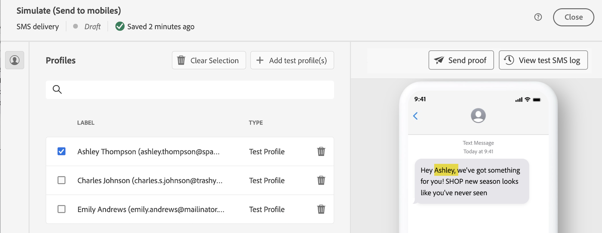
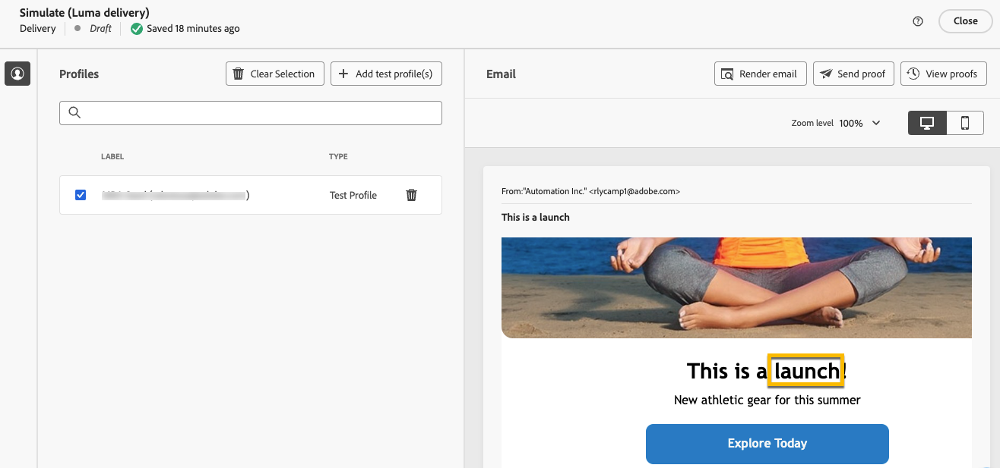

# Personalizzare i contenuti {#add-personalization}

>[!CONTEXTUALHELP]
>id="acw_personalization_editor_add_current_date"
>title="Aggiungi data corrente"
>abstract="Questo menu fornisce funzioni relative alla formattazione della data che puoi sfruttare per personalizzare il contenuto."

Il Personalization di contenuti di consegna è una funzione chiave che consente di adattare i messaggi ai singoli destinatari, rendendo la comunicazione più rilevante e coinvolgente.

In Adobe Campaign, utilizzando [dati profilo](#data-personalization), come il nome del profilo, la posizione o le interazioni passate e [variabili specifiche della consegna](#variables-personalization), puoi personalizzare dinamicamente elementi come testo, immagini e offerte nella comunicazione.

La personalizzazione della consegna migliora l’esperienza utente e i tassi di coinvolgimento, portando a una conversione più elevata e alla soddisfazione dei clienti.

## Utilizzo dei dati del profilo per la personalizzazione {#data-personalization}

Puoi personalizzare qualsiasi consegna con i dati del profilo utilizzando l&#39;editor espressioni, accessibile nei campi con l&#39;icona **[!UICONTROL Apri finestra di dialogo per personalizzazione]**, ad esempio l&#39;oggetto, i collegamenti e-mail e i componenti di contenuto testo/pulsante. [Scopri come accedere all&#39;editor espressioni](gs-personalization.md#access).

### Sintassi di personalizzazione {#syntax}

I tag di personalizzazione seguono una sintassi specifica: `<%= table.field %>`. Ad esempio, per inserire il cognome del destinatario dalla tabella dei destinatari, utilizza la sintassi `<%= recipient.lastName %>`.

Durante il processo di preparazione della consegna, Adobe Campaign interpreta questi tag e li sostituisce con i valori dei campi corrispondenti per ciascun destinatario. Puoi visualizzare la sostituzione effettiva simulando il contenuto.

Durante il caricamento dei contatti da un file esterno per una consegna e-mail autonoma, tutti i campi nel file di input sono disponibili per la personalizzazione. La sintassi è la seguente: `<%= dataSource.field %>`.

### Aggiungere tag di personalizzazione {#add}

Per aggiungere tag di personalizzazione a una consegna, segui i passaggi seguenti:

1. Apri l&#39;editor espressioni utilizzando l&#39;icona **[!UICONTROL Apri finestra di dialogo per personalizzazione]**, accessibile dai campi di modifica di tipo testo, ad esempio l&#39;oggetto o il corpo dell&#39;SMS. [Scopri come accedere all&#39;editor espressioni](gs-personalization.md#access).

   {zoomable="yes"}{width="800" align="center"}

1. Si apre l’editor di espressioni. I campi di personalizzazione disponibili nel database di Adobe Campaign sono organizzati in diversi menu sul lato sinistro dello schermo:

   {zoomable="yes"}{width="800" align="center"}

   | Menu | Descrizione |
   |------|-------------|
   | {zoomable="yes"} | Il menu **[!UICONTROL Applicazione per abbonati]** elenca i campi relativi agli abbonati a un’applicazione, ad esempio il terminale utilizzato o il sistema operativo. *Questo menu è disponibile solo per le notifiche push.* |
   | {zoomable="yes"} | Il menu **[!UICONTROL Destinatario]** elenca i campi definiti nella tabella dei destinatari, ad esempio i nomi, le età o gli indirizzi dei destinatari. Durante il [caricamento dei contatti da un file esterno](../audience/file-audience.md) per una consegna e-mail autonoma, questo menu elenca tutti i campi disponibili nel file di input. |
   | {zoomable="yes"} | Nel menu **[!UICONTROL Messaggio]** sono elencati i campi relativi ai registri di consegna, inclusi tutti i messaggi inviati a destinatari o dispositivi su tutti i canali, ad esempio la data dell&#39;ultimo evento con un destinatario specificato. |
   | {zoomable="yes"} | Nel menu **[!UICONTROL Consegna]** sono elencati i campi relativi ai parametri necessari per l&#39;esecuzione delle consegne, ad esempio il canale o l&#39;etichetta di consegna. |

   >[!NOTE]
   >
   >Per impostazione predefinita, in ogni menu sono elencati tutti i campi della tabella selezionata (Destinatari/Messaggio/Consegna). Se desideri includere campi da tabelle collegate alla tabella selezionata, abilita l’opzione **[!UICONTROL Visualizza attributi avanzati]** che si trova sotto l’elenco.

1. Per aggiungere un campo di personalizzazione, posizionare il cursore nella posizione desiderata all&#39;interno del contenuto e fare clic sul pulsante `+` per inserirlo.

1. Una volta che il contenuto è pronto, salvalo e verifica il rendering della personalizzazione simulando il contenuto. L’esempio seguente mostra la personalizzazione di un messaggio SMS con i nomi dei destinatari.

   {zoomable="yes"}{width="800" align="center"}

   {zoomable="yes"}{width="800" align="center"}

## Utilizzo delle variabili per la personalizzazione {#variables-personalization}

Puoi inoltre utilizzare le variabili per personalizzare la consegna. Ulteriori informazioni sull&#39;[aggiunta di variabili a una consegna](../advanced-settings/delivery-settings.md#variables-delivery).

Ad esempio, la variabile `deliveryType` è definita come mostrato di seguito.

{zoomable="yes"}

Questa variabile viene utilizzata nel contenuto della consegna utilizzando l&#39;icona **[!UICONTROL Aggiungi Personalization]** e l&#39;espressione `<%= variables.deliveryType %>` per questo esempio.

{zoomable="yes"}

Controlla l&#39;utilizzo della variabile con il pulsante **[!UICONTROL Simula contenuto]**.

{zoomable="yes"}