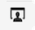

# Personalizzare i contenuti {#add-personalization}

La personalizzazione può essere aggiunta a qualsiasi consegna utilizzando l’editor di espressioni, accessibile in ogni campo con **[!UICONTROL Apri finestra di dialogo per personalizzazione]** come il campo dell’oggetto, i collegamenti e-mail e i componenti di contenuto testo/pulsante. [Scopri dove aggiungere contenuti dinamici](gs-personalization.md/#access)

## Sintassi di personalizzazione {#syntax}

Un tag di personalizzazione utilizza sempre la seguente sintassi: `<%=table.field%>`. Ad esempio, per inserire il nome del destinatario, memorizzato nella tabella dei destinatari, il tag di personalizzazione utilizza la sintassi &lt;%= recipient.lastName %>.

Quando viene preparata una consegna, questi tag vengono automaticamente interpretati da Adobe Campaign e sostituiti dal valore del campo per un determinato destinatario. La sostituzione fisica può quindi essere visualizzata durante la simulazione del contenuto.

## Aggiungere tag di personalizzazione {#add}

Per aggiungere tag di personalizzazione a una consegna, apri l’editor di espressioni utilizzando **[!UICONTROL Apri finestra di dialogo per personalizzazione]** che è accessibile dai campi di modifica di tipo testo, ad esempio l’oggetto o il corpo dell’SMS. [Scopri dove aggiungere contenuti dinamici](gs-personalization.md/#access)

Viene visualizzato l’editor espressioni. I campi di personalizzazione sono organizzati in diversi menu, situati a sinistra dello schermo. Questi menu consentono di accedere a tutti i campi disponibili nel database di Adobe Campaign.

| Menu | Descrizione |
|-----|------------|
|  | Il **[!UICONTROL Applicazione per abbonati]** Il menu elenca tutti i campi relativi agli abbonati a un&#39;applicazione, ad esempio il terminale o il sistema operativo utilizzato. *Questo menu è disponibile solo per le notifiche push* |
|  | Il **[!UICONTROL Destinatario]** Il menu elenca tutti i campi definiti nella tabella dei destinatari, ad esempio il nome, l&#39;età o l&#39;indirizzo del destinatario. |
|  | Il **[!UICONTROL Messaggio]** Il menu elenca tutti i campi relativi ai registri di consegna, ovvero tutti i messaggi inviati a destinatari o dispositivi su tutti i canali, ad esempio la data dell’ultimo evento con un determinato destinatario |
|  | Il **[!UICONTROL Consegna]** Il menu elenca tutti i campi relativi ai parametri necessari per eseguire le consegne, ad esempio il canale di consegna, l’etichetta e così via. |

>[!NOTE]
>
>Per impostazione predefinita, ogni menu mostra tutti i campi all’interno della tabella selezionata (Destinatari, / Messaggio / Consegna). Se si desidera includere campi da tabelle collegate alla tabella selezionata, abilitare **[!UICONTROL Visualizzare attributi avanzati]** sotto l’elenco.

Per aggiungere un campo di personalizzazione, posiziona il cursore nella posizione desiderata all’interno del contenuto e fai clic sul pulsante + per inserirlo.

Una volta che il contenuto è pronto, puoi salvarlo e testare il rendering della personalizzazione simulando il contenuto. Nell’esempio seguente, personalizziamo un messaggio SMS con i nomi dei profili target.

*Aggiungi il tag di personalizzazione nel contenuto del messaggio*

*Simulare il rendering della personalizzazione per un determinato profilo di test*

