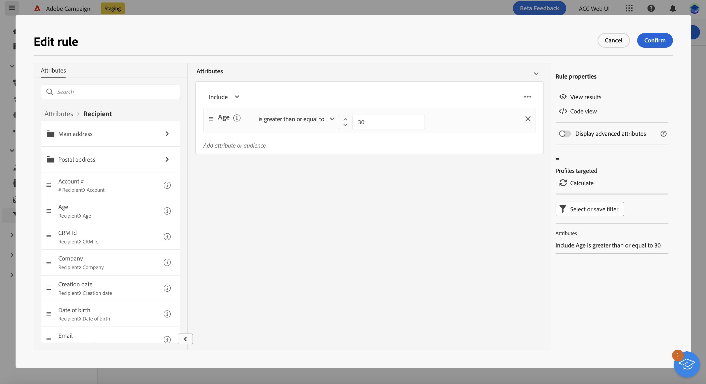

# Utilizzare filtri predefiniti {#predefined-filters}

>[!CONTEXTUALHELP]
>id="acw_homepage_card3"
>title="Gestione dei filtri predefiniti"
>abstract="Campaign web offre ora un’interfaccia intuitiva per gestire e personalizzare facilmente i filtri predefiniti in base alle tue esigenze specifiche. Crea una volta e salva per un utilizzo futuro."

>[!CONTEXTUALHELP]
>id="acw_predefined-filters-dashboard"
>title="Filtri preimpostati"
>abstract="Campaign web offre ora un’interfaccia intuitiva per gestire e personalizzare facilmente i filtri predefiniti in base alle tue esigenze specifiche. Crea una volta e salva per un utilizzo futuro."

I filtri predefiniti sono filtri personalizzati che vengono creati e salvati per essere disponibili in futuro. Possono essere utilizzati come scelte rapide durante qualsiasi operazione di filtro con il generatore di regole, ad esempio quando si filtra un elenco di dati o si crea il pubblico di una consegna.

Puoi utilizzare i filtri incorporati esistenti per accedere a un sottoinsieme specifico dei tuoi dati, oppure creare filtri predefiniti personalizzati e salvarli.

## Creare un filtro predefinito {#create-predefined-filter}

>[!CONTEXTUALHELP]
>id="acw_predefined-filters-creation"
>title="Creare un filtro predefinito"
>abstract="Immetti un’etichetta per il filtro predefinito e seleziona la tabella a cui si applica. Apri le opzioni aggiuntive per aggiungere una descrizione e imposta questo filtro come preferito. Quindi utilizza il pulsante &quot;Crea regola&quot; per definire le condizioni di filtro."

>[!CONTEXTUALHELP]
>id="acw_predefined-filters-rules"
>title="Creare le regole di filtro predefinite"
>abstract="Per definire le condizioni di filtro del filtro personalizzato, fai clic sul pulsante &quot;Crea regola&quot;."

Per salvare un filtro personalizzato nel generatore di regole, effettua le seguenti operazioni:

1. Apri il generatore di regole e definisci le condizioni di filtro. Nell’esempio seguente, puoi filtrare i destinatari che vivono a Madrid.
1. Fai clic su **Seleziona o salva il filtro** e selezionare **Salva come filtro**.

   

1. Seleziona **Crea un nuovo filtro** e immettere un nome e una descrizione per il filtro.

   

1. (facoltativo) Abilita il **Salva come preferito** se desideri visualizzare questo filtro predefinito nei preferiti.

   Quando un filtro viene salvato come preferito, è disponibile per tutti gli utenti nel **Filtri preferiti** dell’elenco di creazione del filtro, come illustrato di seguito:

   

1. Clic **Conferma** per salvare le modifiche.

Il filtro personalizzato è ora disponibile nel **Filtri predefiniti** e accessibile a tutti gli utenti di Campaign.

Puoi anche creare un filtro da **Filtri predefiniti** nel menu a sinistra. Per farlo, segui la procedura indicata di seguito:

1. Sfoglia il **Filtri predefiniti** nel menu a sinistra.
1. Fai clic su **Crea filtro** pulsante.
1. Inserisci il nome del filtro e, dalla **Tipo di documento** , seleziona lo schema a cui si applica. Lo schema predefinito è `Recipients(nms)`.
1. Definisci la regola per il filtro. Ad esempio, i profili con più di 30 anni.

   

1. Salva le modifiche. Il filtro viene aggiunto all’elenco di filtri predefinito.

## Utilizza un filtro predefinito {#use-predefined-filter}

I filtri predefiniti sono disponibili quando si definiscono le proprietà della regola. Per accedere ai filtri predefiniti, scegli **Seleziona filtro personalizzato** nel menu a discesa del generatore di regole.

Puoi quindi accedere all’elenco completo dei filtri predefiniti disponibili per il contesto corrente.

È inoltre possibile utilizzare le scelte rapide da filtro disponibili nel **Filtri preferiti** del menu a discesa.

Ad esempio, per creare un pubblico da un filtro predefinito, segui questi passaggi:

1. Sfoglia il **Tipi di pubblico** nel menu a sinistra.
1. Fai clic su **Crea pubblico** pulsante.
1. Immetti il nome del pubblico e fai clic su **Crea pubblico** pulsante.
1. Seleziona la **Query** e, nel riquadro di destra, fai clic su **Creare un pubblico** pulsante.

   

1. Dalla sezione **Seleziona o salva il pulsante del filtro**, scegli il **Seleziona filtro personalizzato** opzione.

   

1. Individua il filtro predefinito da utilizzare per creare il pubblico, selezionalo e conferma.

   

1. Controlla le proprietà della regola per questo filtro e conferma.

   

   Il filtro viene ora utilizzato come query in **Query** attività.

   

1. Salva le modifiche e fai clic su **Inizio** per creare il pubblico e renderlo disponibile nell’elenco del pubblico.

## Gestire i filtri predefiniti {#manage-predefined-filter}

I filtri predefiniti sono tutti raggruppati nella voce dedicata del menu di navigazione a sinistra.

Da questo elenco, puoi creare un nuovo filtro come descritto in precedenza e:

* modificare un filtro esistente e modificarne regole e proprietà
* duplicare un filtro predefinito
* eliminare un filtro predefinito

Puoi aggiungere un filtro predefinito come preferito per un accesso rapido durante la creazione delle regole. Questa funzionalità è descritta in [questa sezione](#create-predefined-filter).

## Filtri predefiniti incorporati {#ootb-predefined-filter}

Campaign viene fornito con un set di filtri predefiniti, generati dalla console client. Questi filtri possono essere utilizzati per definire i tipi di pubblico e le regole. Non devono essere modificati.
