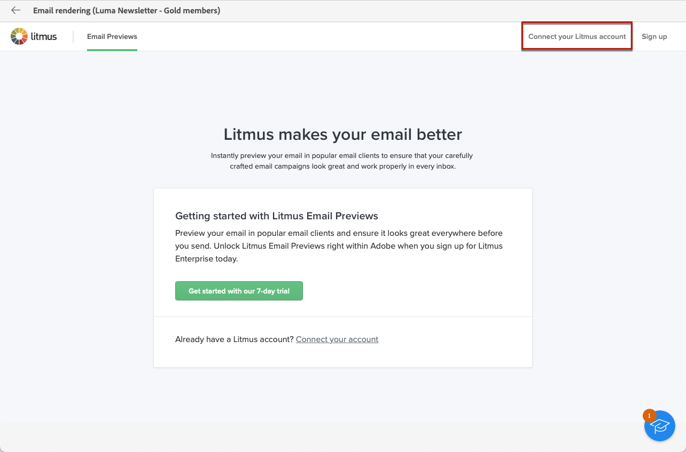

# Testare il rendering delle e-mail {#email-rendering}

Prima di inviare l’e-mail, accertati che il messaggio venga visualizzato dai destinatari in modo ottimale su diversi client web e dispositivi.

A questo scopo, puoi sfruttare l’account **Litmus** in [!DNL Adobe Campaign] per visualizzare in anteprima il rendering di e-mail in contesti diversi e verificare la compatibilità nei desktop e nelle applicazioni principali (posta web, servizio messaggi, dispositivi mobili, ecc.).

>[!CAUTION]
>
>L’utilizzo del rendering di e-mail in Campaign invia un messaggio e-mail di test a un sistema di terze parti. Collegando il tuo account Litmus con [!DNL Campaign], prendi atto che Adobe non è responsabile per i dati che potresti inviare a tali terze parti. I criteri e-mail di conservazione dei dati Litmus si applicano a queste e-mail, inclusi i dati di personalizzazione che possono essere inclusi in questi messaggi di test. Per accedere o eliminare tali dati, sarà necessario contattare direttamente Litmus.

Per accedere alle funzionalità di rendering di e-mail, è necessario:

* Avere un account Litmus
* Selezionare profili e/o profili di test - Scopri come nella [questa sezione](preview-content.md)

Quindi, segui i passaggi indicati di seguito.

1. Nella schermata [Modifica contenuto](../email/edit-content.md) o in [E-mail Designer](../email/get-started-email-designer.md), fai clic sul pulsante **[!UICONTROL Simula contenuto]**.

1. Seleziona il pulsante **[!UICONTROL Rendering dell’e-mail]**.

   {zoomable=&quot;yes&quot;}

1. Fai clic su **Connetti il tuo account Litmus** nella sezione superiore destra.

   {zoomable=&quot;yes&quot;}

1. Immetti le credenziali e accedi.

   {zoomable=&quot;yes&quot;}

1. Fai clic su **Esegui test** per generare anteprime e-mail.

1. Verifica il contenuto delle e-mail nei client desktop, mobili e basati su web più diffusi.

   {zoomable=&quot;yes&quot;}

<!--
TO CHECK IF user is directed to Litmus or if the email rendering is shown directly in the Campaign UI.

CONTENT ABOVE COPIED FROM AJO

If not redirecting to Litmus:

To test the email rendering, follow these steps:

1. Access the email content creation screen, then click **[!UICONTROL Simulate content]**.

1. Click the **[!UICONTROL Render email]** button.

    The left pane provides various desktop, mobile and web-based email clients. Select the desired email client to display a preview of your email in the right pane. 

    {zoomable="yes"}

    >[!NOTE]
    >
    >The email clients list provides a sample of the major mail clients. Additional email clients are available from the filter button next to the top search bar.

 -->
