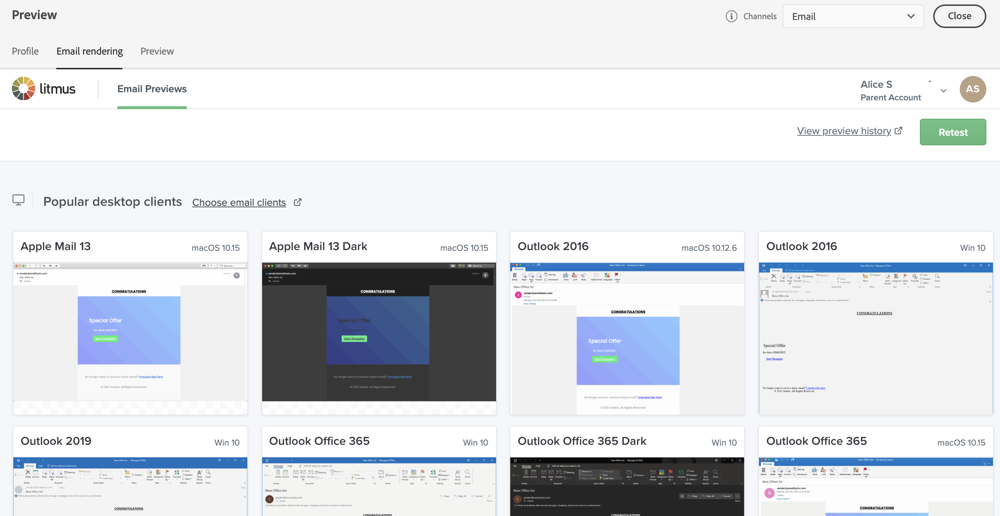

# Testare il rendering delle e-mail {#email-rendering}

Prima di inviare l’e-mail, assicurati che il messaggio venga visualizzato in modo ottimale per i destinatari in vari client e dispositivi web.

Per ottenere questo risultato, utilizza il tuo account **Litmus** in [!DNL Adobe Campaign] per visualizzare l&#39;anteprima del rendering di e-mail all&#39;istante in contesti diversi. Questo consente di verificare la compatibilità con le principali applicazioni desktop, i servizi di posta sul web, i dispositivi mobili e altro ancora.

>[!CAUTION]
>
>L’utilizzo del rendering di e-mail in Campaign invia una bozza a un sistema di terze parti. Collegando il tuo account Litmus con [!DNL Campaign], prendi atto che Adobe non è responsabile per i dati che potresti inviare a tali terze parti. I criteri di conservazione dei dati delle e-mail di Litmus si applicano a queste e-mail, inclusi i dati di personalizzazione che possono essere inclusi in queste bozze. Per accedere o cancellare tali dati, contatta direttamente Litmus.

Per accedere alle funzionalità di rendering di e-mail, completa i seguenti prerequisiti:

* Avere un account Litmus.
* Seleziona profili e/o profili di test. Scopri come in [questa sezione](preview-content.md).

Quindi, segui i passaggi indicati di seguito.

1. Nella schermata [Modifica contenuto](../email/edit-content.md) o in [E-mail Designer](../email/get-started-email-designer.md), fai clic sul pulsante **[!UICONTROL Simula contenuto]**.

1. Seleziona il pulsante **[!UICONTROL Rendering dell’e-mail]**.

   {zoomable="yes"}

1. Fai clic su **Connetti il tuo account Litmus** nella sezione superiore destra.

   {zoomable="yes"}

1. Immetti le credenziali e accedi.

   {zoomable="yes"}

1. Fai clic su **Esegui test** per generare anteprime e-mail.

1. Controlla i contenuti delle e-mail nei client desktop, mobili e basati su Web più diffusi.

   {zoomable="yes"}

<!--
TO CHECK IF user is directed to Litmus or if the email rendering is shown directly in the Campaign UI.

CONTENT ABOVE COPIED FROM AJO

If not redirecting to Litmus:

To test the email rendering, follow these steps:

1. Access the email content creation screen, then click **[!UICONTROL Simulate content]**.

1. Click the **[!UICONTROL Render email]** button.

    The left pane provides various desktop, mobile, and web-based email clients. Select the desired email client to display a preview of your email in the right pane. 

    {zoomable="yes"}

    >[!NOTE]
    >
    >The email clients list provides a sample of the major mail clients. Additional email clients are available from the filter button next to the top search bar.

 -->