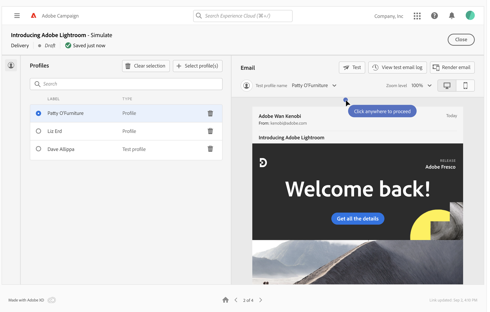

# Anteprima contenuto e-mail {#preview}

>[!CONTEXTUALHELP]
>id="acw_homepage_card4"
>title="Anteprima intelligente dei contenuti"
>abstract="Adobe Campaign consente di utilizzare i profili per visualizzare in anteprima il contenuto dell’e-mail prima dell’invio, al fine di controllare la personalizzazione e il modo in cui i destinatari li visualizzeranno."

Adobe Campaign ti consente di visualizzare in anteprima il contenuto dell’e-mail prima di inviarlo per verificarne la personalizzazione e il modo in cui verrà visualizzato ai destinatari.

Puoi visualizzare in anteprima un messaggio e-mail utilizzando:

* **Profili di test**: Visualizza in anteprima l’e-mail utilizzando gli indirizzi di seed, che sono destinatari aggiuntivi e fittizi nel database,
* **Profili**: Visualizza l’anteprima del messaggio e-mail utilizzando un profilo esistente.

Per visualizzare l’anteprima del contenuto dell’e-mail, effettua le seguenti operazioni:

1. Accedi alla schermata di creazione del contenuto dell’e-mail e fai clic sul pulsante **[!UICONTROL Simulazione del contenuto]** pulsante .

   

1. Seleziona uno o più profili facendo clic sul pulsante **[!UICONTROL Seleziona profili]** quindi utilizza il pulsante **[!UICONTROL Profili di test]** e **[!UICONTROL Profili]** schede tra cui scegliere.

   Puoi combinare profili di test e profili per visualizzare l’anteprima del messaggio e-mail.

   

1. Dopo aver selezionato i profili, nel riquadro a destra viene visualizzata un’anteprima dell’e-mail. Gli elementi personalizzati verranno sostituiti dai dati del profilo selezionato nel riquadro a sinistra.

   Se hai aggiunto più profili, puoi passare da un profilo all’altro nell’elenco per visualizzare in anteprima l’e-mail corrispondente.

   >[!NOTE]
   >
   >Per visualizzare in anteprima il rendering dei contenuti su diversi dispositivi (desktop, dispositivi mobili, tablet), fai clic sull’icona dedicata nell’angolo in alto a destra.

   

